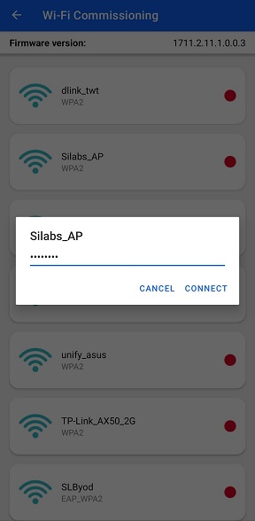
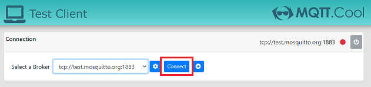
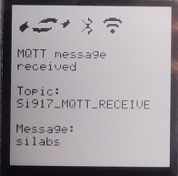
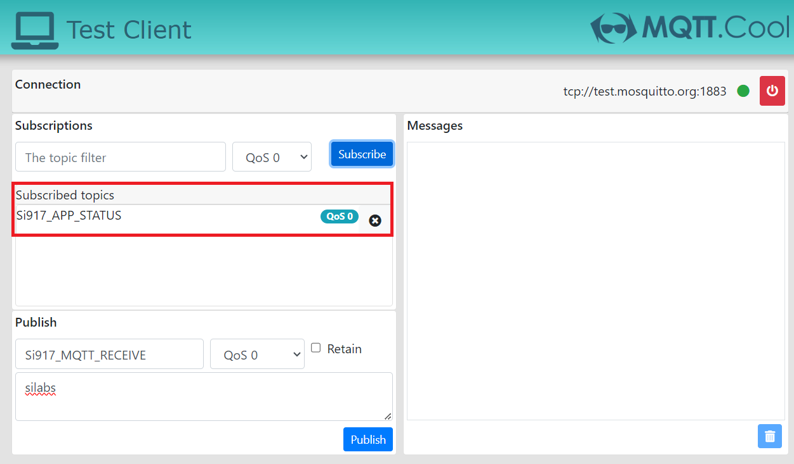

# Out of the box demo - SiWG917

This application demonstrates the WLAN, BLE, MCU peripheral features and NWP (network processor) powersave capabilities of SiWG917 with a ready to go, minimal software installation experience.

## Table of Contents

- [Purpose/Scope](#purposescope)
- [Prerequisites/Setup Requirements](#prerequisitessetup-requirements)
  - [Hardware Requirements](#hardware-requirements)
  - [Software Requirements](#software-requirements)
  - [Setup Diagram](#setup-diagram)
- [Upgrade application binary](#upgrade-application-binary)
- [Application Build Environment](#application-build-environment)
- [Test the Application](#test-the-application)
  - [Run the Application](#run-the-application)
- [Measuring the current consumption using Simplicity Studio Energy Profiler](#measuring-the-current-consumption-using-simplicity-studio-energy-profiler)

## Purpose/Scope

The demo works with both the Wireless pro kit (WPK) and the SiWG917 dev kit. If the pro kit is used, the demo displays its status on the TFT-LCD display of the WPK baseboard. 
The SiWG917 dev kit does not have an onboard display. All device activities for the pro and dev kits can be observed on the serial terminal prints. 

SiWG917 establishes WLAN connectivity via BLE provisioning. SiWG917 then proceeds to ping [www.silabs.com](https://www.silabs.com) for 5 times, after which MQTT connectivity with a remote mosquitto broker [test.mosquitto.org](http://test.mosquitto.org) is established.
Then Network processor of SiWG917 enters connected sleep state.
If a message is published onto the topic from a MQTT client application [https://testclient-cloud.mqtt.cool/](https://testclient-cloud.mqtt.cool/) to which the module is subscribed (Si917_MQTT_RECEIVE), the NWP wakes up and displays the received data and goes back to sleep. If BTN0 on the WPK baseboard or dev kit board is pressed, SiWG917 publishes a message onto a MQTT topic named Si917_APP_STATUS. The status of application is updated on the TFT-LCD display on the WPK baseboard, the same can be observed on the serial terminal prints as well.

## Prerequisites/Setup Requirements

- Before running the application, the user will need the following things to setup.

### Hardware Requirements

- Windows PC
- A Wireless Access point with internet connectivity
- **SoC Mode**:
  - Standalone
    - BRD4002A Wireless pro kit mainboard [SI-MB4002A]
    - Radio Boards
      - BRD4338A [SiWx917-RB4338A]
      - BRD4342A [SiWx917-RB4342A]
      - BRD4343A [SiWx917-RB4343A]
  - Kits
    - SiWG917 Dev Kit [BRD2605A]
    - SiWx917 Pro Kit [Si917-PK6031A](https://www.silabs.com/development-tools/wireless/wi-fi/siwx917-pro-kit?tab=overview)
- Android Phone or iPhone with Simplicity Connect App (formerly EFR Connect App), which is available in Play Store and App Store (or) Windows PC with windows Silicon labs connect application.

### Software Requirements

- [Simplicity Studio](https://www.silabs.com/developers/simplicity-studio)
- Silicon Labs [Simplicity Connect App (formerly EFR Connect App)](https://www.silabs.com/developers/simplicity-connect-mobile-app?tab=downloads), the app can be downloaded from Google Play store/Apple App store.

### Setup Diagram


## Upgrade application binary

- Download the out-of-box demo binary from [the WiseConnect SDK GitHub repository](https://github.com/SiliconLabs/wiseconnect/blob/master/out_of_box_demo/out-of-box-demo-soc.rps)

  Follow the instructions on the [Developing for SiWx91x Host page](https://docs.silabs.com/wiseconnect/latest/wiseconnect-developers-guide-developing-for-silabs-hosts/#install-simplicity-studio) to:

- [Install Simplicity Studio](https://docs.silabs.com/wiseconnect/latest/wiseconnect-developers-guide-developing-for-silabs-hosts/#install-simplicity-studio)
- [Connect the SiWx917 board to your computer](https://docs.silabs.com/wiseconnect/latest/wiseconnect-developers-guide-developing-for-silabs-hosts/#connect-si-wx91x-to-computer)
- Flash the out-of-box demo binary (out-of-box-demo-soc.rps) as described in the [Flash an Application Binary](https://docs.silabs.com/wiseconnect/latest/wiseconnect-developers-guide-developing-for-silabs-hosts/#flash-an-application-binary) section.

After upgrading the application binary, proceed with the demo by referring to the next steps under [run the application](#run-the-application) section.

## Application build environment

No additional application level changes are required to execute the OOB demo example.

## Test the Application

### Application display

If the pro kit used, The status of the application is updated in TFT-LCD display of the WPK baseboard. 
The SiWG917 dev kit does not have an onboard display. All device activities for the pro and dev kits can be observed on the serial terminal prints.
To view the application prints on the console, refer [here](https://docs.silabs.com/wiseconnect/latest/wiseconnect-developers-guide-developing-for-silabs-hosts/#console-input-and-output).

### Run the application

- The SiWG917 dev kit comes pre-programmed with the SiWG917 demo v2.0. If the pro kit used, please check if the messages being displayed on the LCD display on WPK or the serial terminal prints do not indicate the application binary version (as shown in the following image):
  
    

    > Note:
    > The Dev Kit (BRD2605A) and Explorer Kit (BRD2708A) do not support display functionality.

    It implies that an older version of OOB demo binary (older than v2.0) is running on the SiWG917 board. 
    
    It is recommended to upgrade to the latest OOB demo binary (With the application binaries older than v2.0, there's a possibility of observing issues with MQTT data transfer, as the test MQTT server limits multiple devices with same CLIENT ID from connecting at the same time. This has been fixed in the application binary v2.0).

    To upgrade to latest application binary, refer [upgrade application binary](#upgrade-application-binary) section.

    Also, upgrade the connectivity firmware (NWP firmware) to the latest version to avoid compatibility issues with application binary. Download the latest connectivity firmware from [Wiseconnect github repository](https://github.com/SiliconLabs/wiseconnect/tree/master/connectivity_firmware) and refer [Upgrade SiWx91x Connectivity Firmware](https://docs.silabs.com/wiseconnect/latest/wiseconnect-developers-guide-developing-for-silabs-hosts/#upgrade-si-wx91x-connectivity-firmware)  to upgrade the connectivity firmware.

    If the messages being displayed on the LCD display on WPK or the serial terminal prints indicate versioning information (Si917 OOB Demo v2.0 - as show in the following image)

    

    It implies that OOB demo binary v2.0 (latest application binary) is running on the SiWG917 board. Proceed to the next steps of the demo.

- Once the application is flashed or the SiWG917 board is powered up, the Wireless interface is initialized.
- After the Wireless initialization, the module starts BLE advertising and advertises itself as "BLE_CONFIGURATOR"
- The status of the application can be observed on the TFT-LCD display on the WPK baseboard or the serial terminal prints.
- Following is the image of LCD display indicating the application status.

  If application binary is older than v2.0:

  

  If application binary version is v2.0 (latest):

  

  

- Open the Simplicity Connect App (formerly EFR Connect App) on your mobile phone.

  

- Go to 'Demo' tab.

  

- Choose the Wi-Fi commissioning option.

  

- Click on the device name "BLE_CONFIGURATOR".

  

  **NOTE:** For the Wi-Fi commissioning demo, EFR connect mobile app displays the devices which advertise as "BLE_CONFIGURATOR" only. This is to filter out the other Bluetooth devices in the vicinity and if the device name is modified, it won't be detected in the EFR connect mobile app for Wi-Fi commissioning demo.

- A list of the available Access points is displayed in the mobile app.

  

- Choose the desired access point and enter the password.

  

- The module is now commissioned into the Wi-Fi network.

  

- The module starts to ping www.silabs.com.
- After pinging, the module now establishes connectivity with test.mosquitto.org.
- Here is the image of LCD with the status prints.

  If Application binary is older than v2.0

  

  If Application binary version is v2.0 (latest)

  

  

  

- NWP (network processor of SiWG917) enters connected sleep.  

- To connect to a working MQTT broker and update the mqtt_hostname in the `wifi_app.c` file, follow these steps:

### Update MQTT Hostname in wifi_app.c

- By default, the mqtt_hostname in the `wifi_app.c` file is set to "test.mosquitto.org".
  
  ```c
  char *mqtt_hostname = "test.mosquitto.org";     
  ```

- If you are using a different MQTT broker, replace "test.mosquitto.org" with the appropriate hostname.

- To check if the MQTT broker is working, you can use the online MQTT client available at the below link.

  >**NOTE :**
  >
  > If the default MQTT broker link is not working, you can try using other MQTT brokers listed on the webpage. For example, if "test.mosquitto.org" is not functioning, you can use "broker.mqtt.cool" as an alternative. Follow the steps mentioned above to update the MQTT hostname.

- Go to the browser and open the [online mqtt client](https://testclient-cloud.mqtt.cool/).

  

- Click on the dropdown option and select 'tcp://test.mosquitto.org:1883'.

  

- Click on "connect" to connect to the mosquitto broker.

  

- Enter "Si917_MQTT_RECEIVE" in the Publish section.

  

- Enter the data to be sent to the SiWG917 (can be any random text) in the publish section and click on the publish button, the online client then publishes data on the "Si917_MQTT_RECEIVE" topic.

  If the application binary version is older than v2.0, the MQTT data received by SiWG917 will be displayed in the application prints on the serial console.

  If the application binary version is v2.0, the MQTT data received by SiWG917 will be displayed on the TFT-LCD display of the WPK board and the application prints on the serial console.

  

  

- If the application binary version is v2.0, please proceed with the following steps, if not please refer [Measuring the current consumption using Simplicity Studio Energy Profiler](#measuring-the-current-consumption-using-simplicity-studio-energy-profiler) section for using the energy profiler tool to measure the current consumption of the SiWG917.

- Enter "Si917_APP_STATUS" in the Subscriptions sections as shown in the following image and click on Subscribe.

  

  After clicking the subscribe button, Si917_APP_STATUS can be observed under the subscribed topics section.

  

- Press BTN0 on the WPK baseboard or dev kit. When BTN0 is pressed, SiWG917 publishes a MQTT message saying "Button is pressed" onto the topic "Si917_APP_STATUS". The same can be observed in the LCD display of the baseboard and the MQTT client page.

  

  

  

- The current consumption of SiWG917 can observed using the energy profiler tool integrated within the Simplicity Studio. Refer the [Measuring the current consumption using Simplicity Studio Energy Profiler](#measuring-the-current-consumption-using-simplicity-studio-energy-profiler) section for using the energy profiler to measure the current consumption of the module.

- To view the prints on the console, follow the instructions [here](https://docs.silabs.com/wiseconnect/latest/wiseconnect-developers-guide-developing-for-silabs-hosts/#console-input-and-output).

    If application binary version is older than v2.0, the application prints would be as follows:

    

    If application binary version is v2.0, the application prints would be as follows:

    

### Measuring the current consumption using Simplicity Studio Energy Profiler

To open the energy profiler:

- Open the "Tools" section from the toolbar.

  

- Choose the "Energy Profiler" from the tools dialog box.

  

- Click on the "Quick Access" option and choose "Start Energy Capture" option.

  

- Click on the device name and click on OK.

  

- The energy profiler session begins and the current consumption plot can be observed.

- The energy consumption plot would be as follows:

  

- Please note that

  - Current consumption would be in the range of 8mA-9mA since M4 is in active state.
  - The above energy consumption plots are for reference and the power consumption number would vary based on the on air traffic, environment and the access point used.

