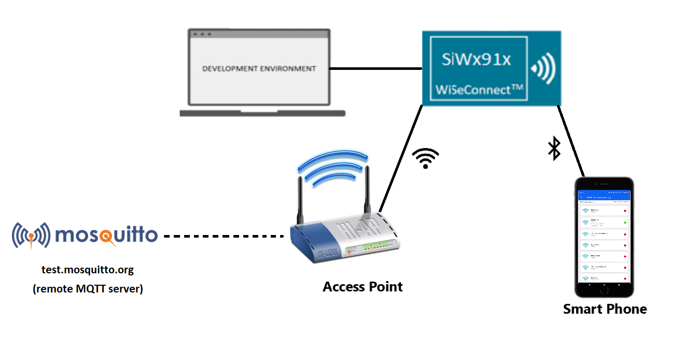
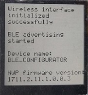
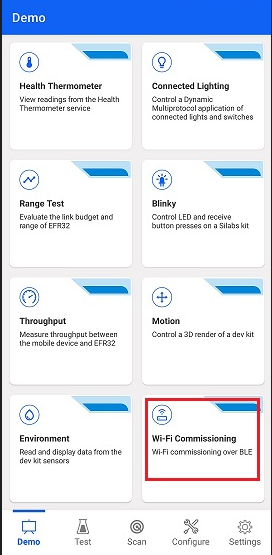
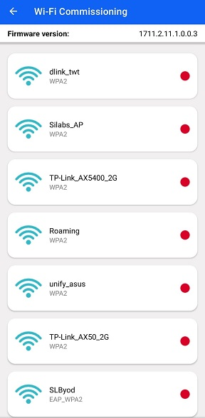
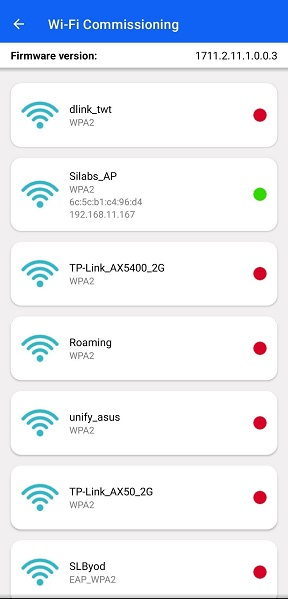
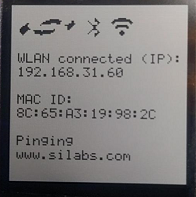
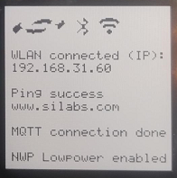

# Out of the box demo - SiWG917

This application demonstrates the WLAN, BLE, MCU peripheral features and NWP (network processor) powersave capabilities of SiWG917 with a ready to go, minimal software installation experience.

## Table of Contents

- [Purpose/Scope](#purposescope)
- [Prerequisites/Setup Requirements](#prerequisitessetup-requirements)
  - [Hardware Requirements](#hardware-requirements)
  - [Software Requirements](#software-requirements)
  - [Setup Diagram](#setup-diagram)
- [Application Build Environment](#application-build-environment)
- [Test the Application](#test-the-application)
  - [Run the Application](#run-the-application)
  - [Measuring the current consumption using Simplicity Studio Energy Profiler](#measuring-the-current-consumption-using-simplicity-studio-energy-profiler)

## Purpose/Scope

SiWG917 establishes WLAN connectivity via BLE provisioning. SiWG917 then proceeds to ping [www.silabs.com](https://www.silabs.com) for 5 times, after which MQTT connecitivity with a remote mosquitto broker [test.mosquitto.org](http://test.mosquitto.org) is established.
Then Network processor of SiWG917 enters connected sleep state.
If a message is published onto the topic from a MQTT client application [https://testclient-cloud.mqtt.cool/](https://testclient-cloud.mqtt.cool/) to which the module is subscribed (Si917_MQTT_RECEIVE), the NWP wakes up and displays the received data and goes back to sleep. The status of application is updated on the TFT-LCD display on the WPK baseboard, the same can be observed on the serial terminal prints as well.

## Prerequisites/Setup Requirements

- Before running the application, the user will need the following things to setup.

### Hardware Requirements

- Windows PC
- A Wireless Access point with internet connectivity
- **SoC Mode**:
  - Standalone
    - BRD4002A Wireless pro kit mainboard [SI-MB4002A]
    - Radio Boards
      - BRD4338A [SiWx917-RB4338A]
      - BRD4339B [SiWx917-RB4339B]
  - Kits
    - SiWx917 Pro Kit [Si917-PK6031A](https://www.silabs.com/development-tools/wireless/wi-fi/siwx917-pro-kit?tab=overview)
- Android Phone or iPhone with EFR Connect App, which is available in Play Store and App Store (or) Windows PC with windows Silicon labs connect application.

### Software Requirements

- [Simplicity Studio](https://www.silabs.com/developers/simplicity-studio)
- Silicon Labs [EFR Connect App](https://www.silabs.com/developers/efr-connect-mobile-app?tab=downloads), the app can be downloaded from Google Play store/Apple App store.

### Setup Diagram

## Application build environment

It is highly recommended to set the CLIENT_ID parameter in the wifi_app.c file to a unique string. As the test MQTT server limits multiple devices with same CLIENT ID from connecting at the same time.
In this version of the out of box demo example, the CLIENT_ID parameter is automatically set to a unique value.

## Test the Application

Refer to the instructions [here](https://docs.silabs.com/wiseconnect/latest/wiseconnect-developers-guide-developing-for-silabs-hosts/) to:

- Install Studio and WiSeConnect 3 extension
- Connect your device to the computer
- Upgrade your connectivity firmware
- Create a Studio project
- Build the application.
- Flash, run and debug the application

### Run the application

- Once the application is flashed, the Wireless interface is initialized.
- After the Wireless initialization, the module starts BLE advertising and advertises itself as "BLE_CONFIGURATOR"
- The status of the application can be observed on the TFT-LCD display on the WPK baseboard.
- Following is the image of LCD display indicating the application status.

  

- Open the EFR connect app on your mobile phone.

  

- Go to 'Demo' tab.

  

- Choose the Wi-Fi commissioning option.

  

- Click on the device name "BLE_CONFIGURATOR".

  

  **NOTE:** For the Wi-Fi commissioning demo, EFR connect mobile app displays the devices which advertise as "BLE_CONFIGURATOR" only. This is to filter out the other Bluetooth devices in the vicinity and if the device name is modified, it won't be detected in the EFR connect mobile app for Wi-Fi commissioning demo.

- A list of the available Access points is displayed in the mobile app.

  

- Choose the desired access point and enter the password.

  

- The module is now commissioned into the Wi-Fi network.

  

- The module starts to ping www.silabs.com.
- After pinging, the module now establishes connectivity with test.mosquitto.org.
- Here is the image of LCD with the status prints.

  

  
  

- NWP (network processor of SiWG917) enters connected sleep.  

- Go to the browser and open the [online mqtt client](https://testclient-cloud.mqtt.cool/).

  

- Click on the dropdown option and select 'tcp://test.mosquitto.org:1883'

  

- Click on "connect" to connect to the mosquitto broker

  

- Enter "Si917_MQTT_RECEIVE" in the Publish section.

  

- Enter the data to be sent to the SiWG917 (can be any random text) in the publish section and click on the publish button, the online client then publishes data on the "Si917_MQTT_RECEIVE" topic which can be observed on the LCD display on the baseboard or in the application prints on the serial console.

  

- The current consumption of SiWG917 can observed using the energy profiler tool integrated within the Simplicity Studio. Refer the [Measuring the current consumption using Simplicity Studio Energy Profiler](#measuring-the-current-consumption-using-simplicity-studio-energy-profiler) section for using the energy profiler ti measure the current consumption of the module.

The energy consumption plot would be as follows:

Please note that

- Current consumption would be in the range of 8mA-9mA since M4 is in active state.
- The above energy consumption plots are for reference and the power consumption number would vary based on the on air traffic, environment and the access point used.

Refer the following ouput image:

- To view the prints on the console, follow the instructions [here](https://docs.silabs.com/wiseconnect/latest/wiseconnect-developers-guide-developing-for-silabs-hosts/#console-input-and-output).

The application prints would be as follows:

### Measuring the current consumption using Simplicity Studio Energy Profiler

To open the energy profiler:

- Open the "Tools" section from the toolbar.

  

- Choose the "Energy Profiler" from the tools dialog box.

  

- Click on the "Quick Access" option and choose "Start Energy Capture" option.

  

- Click on the device name and click on OK.

  

- The energy profiler session begins and the current consumption plot can be observed.
