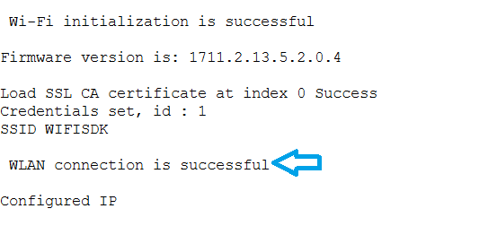
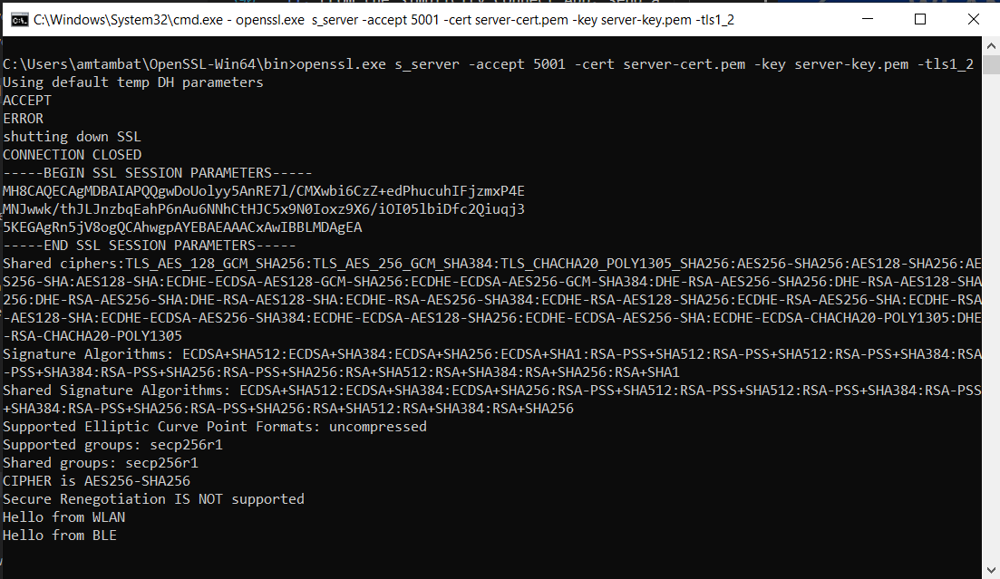

# Wi-Fi BLE Power Save

## Table of Contents

- [Wi-Fi BLE Power Save](#wi-fi-ble-power-save)
  - [Table of Contents](#table-of-contents)
  - [Purpose / Scope](#purpose--scope)
  - [Prerequisites / Setup Requirements](#prerequisites--setup-requirements)
    - [Hardware Requirements](#hardware-requirements)
    - [Software Requirements](#software-requirements)
    - [Setup Diagram](#setup-diagram)
  - [Getting Started](#getting-started)
  - [Application Build Environment](#application-build-environment)
    - [Project Creation](#project-creation)
      - [SoC Mode](#soc-mode)
      - [NCP Mode](#ncp-mode)
    - [Tera Term Setup (for NCP and SoC Modes)](#tera-term-setup---for-ncp-and-soc-modes)
  - [Application Configuration Parameters](#application-configuration-parameters)
    - [Configuring the WLAN task](#configuring-the-wlan-task)
    - [Configuring the BLE task](#configuring-the-ble-task)
    - [Configuring the BLE Application](#configuring-the-ble-application)
  - [Build and Test the Application](#build-and-test-the-application)
      - [SoC Mode](#soc-mode-2)
    - [Tickless Mode](#tickless-mode)
      - [NCP Mode](#ncp-mode-1)
    - [Loading the Application Image](#loading-the-application-image)
    - [Steps to verify the WLAN Station BLE Power Save Example](#steps-to-verify-the-wlan-station-ble-power-save-example)
      - [Steps to be followed to verify WLAN Station BLE Provisioning with Android **Simplicity Connect App**](#steps-to-be-followed-to-verify-wlan-station-ble-provisioning-with-android-simplicity-connect-app)

## Purpose / Scope

The coex application demonstrates the procedure for configuring a device in WiSeConnect coex mode with WLAN standby and BLE connected power save.

In this coex application, Silicon Labs BLE device connects with remote BLE device (for example, Smart phone with Simplicity Connect App) and issues a connected power save command to the module. 
In parallel, the Silicon Labs WiFi interface connects with an Access Point in station mode and issues a connected power save command.

## Prerequisites / Setup Requirements

Before running the application, the user will need the following things to setup.

### Hardware Requirements

- Windows PC.
- SiWx91x Wi-Fi Evaluation Kit. The SiWx91x supports multiple operating modes. See [Operating Modes]() for details.
- **SoC Mode**:
  - Standalone
    - BRD4002A Wireless pro kit mainboard [SI-MB4002A]
    - Radio Boards 
      - BRD4338A [SiWx917-RB4338A]
      - BRD4339B [SiWx917-RB4339B]
      - BRD4340A [SiWx917-RB4340A]
      - BRD4343A [SiWx917-RB4343A]
  - Kits
  	- SiWx917 Pro Kit [Si917-PK6031A](https://www.silabs.com/development-tools/wireless/wi-fi/siwx917-pro-kit?tab=overview)
  	- SiWx917 Pro Kit [Si917-PK6032A]
    - SiWx917 AC1 Module Explorer Kit (BRD2708A)
  	
- **NCP Mode**:
  - Standalone
    - BRD4002A Wireless pro kit mainboard [SI-MB4002A]
    - EFR32xG24 Wireless 2.4 GHz +10 dBm Radio Board [xG24-RB4186C](https://www.silabs.com/development-tools/wireless/xg24-rb4186c-efr32xg24-wireless-gecko-radio-board?tab=overview)
    - NCP Expansion Kit with NCP Radio boards
      - (BRD4346A + BRD8045A) [SiWx917-EB4346A]
      - (BRD4357A + BRD8045A) [SiWx917-EB4357A]
  - Kits
  	- EFR32xG24 Pro Kit +10 dBm [xG24-PK6009A](https://www.silabs.com/development-tools/wireless/efr32xg24-pro-kit-10-dbm?tab=overview)

- Wireless Access point
- Android Phone or iPhone with **Simplicity Connect App(formerly EFR Connect App)**, which is available in Play Store and App Store.
- Windows PC2 with SSL server application (openssl)

### Software Requirements

- Embedded Development Environment

  - For Silicon Labs EFx32, use the latest version of [Simplicity Studio](https://www.silabs.com/developers/simplicity-studio)
  - Download and install the Silicon Labs [Simplicity Connect App(formerly EFR Connect App)](https://www.silabs.com/developers/simplicity-connect-mobile-app ) in the Android/iOS smart phones for testing BLE applications. Users can also use their choice of BLE apps available in Android/iOS smart phones.
  - Other BLE mobile apps for testing:
    - [nRF Connect](https://play.google.com/store/apps/details?id=no.nordicsemi.android.mcp) (Android and iOS)
    - [Light Blue](https://apps.apple.com/us/app/lightblue/id557428110) (iOS)
  - Download Open SSL for windows from below link,  
     [http://ufpr.dl.sourceforge.net/project/gnuwin32/openssl/0.9.8h-1/openssl-0.9.8h-1-bin.zip](http://ufpr.dl.sourceforge.net/project/gnuwin32/openssl/0.9.8h-1/openssl-0.9.8h-1-bin.zip)

### Setup Diagram

- **SoC Mode :**

   

- **NCP Mode :**

   

Follow the [Getting Started with WiSeConnect SDK](https://docs.silabs.com/wiseconnect/latest/wiseconnect-getting-started/) guide to set up the hardware connections and Simplicity Studio IDE.

## Getting Started

Refer to the instructions [here](https://docs.silabs.com/wiseconnect/latest/wiseconnect-getting-started/) to:

- [Install Simplicity Studio](https://docs.silabs.com/wiseconnect/latest/wiseconnect-developers-guide-developing-for-silabs-hosts/#install-simplicity-studio)
- [Install WiSeConnect extension](https://docs.silabs.com/wiseconnect/latest/wiseconnect-developers-guide-developing-for-silabs-hosts/#install-the-wi-se-connect-extension)
- [Connect your device to the computer](https://docs.silabs.com/wiseconnect/latest/wiseconnect-developers-guide-developing-for-silabs-hosts/#connect-si-wx91x-to-computer)
- [Upgrade your connectivity firmware](https://docs.silabs.com/wiseconnect/latest/wiseconnect-developers-guide-developing-for-silabs-hosts/#update-si-wx91x-connectivity-firmware)
- [Create a Studio project](https://docs.silabs.com/wiseconnect/latest/wiseconnect-developers-guide-developing-for-silabs-hosts/#create-a-project)

For details on the project folder structure, see the [WiSeConnect Examples](https://docs.silabs.com/wiseconnect/latest/wiseconnect-examples/#example-folder-structure) page.

## Application Build Environment

### Project Creation

#### SoC Mode

1. Ensure the SiWx91x setup is connected to your PC.

   - In the Simplicity Studio IDE, the SiWx91x SoC board will be detected under **Debug Adapters** pane as shown below.

     

   - Ensure the latest Simplicity SDK (formerly Gecko SDK) along with the WiSeConnect extension is added to Simplicity Studio.

   - Go to the 'EXAMPLE PROJECT & DEMOS' tab and select *Wi-Fi Coex - Wi-Fi Client BLE Power Save(SoC)* application.

   - Click 'Create'. The "New Project Wizard" window appears. Click 'Finish'.

     

#### NCP Mode

1. Ensure the EFx32 and SiWx91x setup is connected to your PC.

   - In the Simplicity Studio IDE, the EFR32 board will be detected under **Debug Adapters** pane as shown below.

     

   - Ensure the latest Simplicity SDK (formerly Gecko SDK) along with the WiSeConnect extension is added to Simplicity Studio.

   - Go to the 'EXAMPLE PROJECT & DEMOS' tab and select *Wi-Fi Coex - Wi-Fi Client BLE Power Save(NCP)* application.

   - Click 'Create'. The "New Project Wizard" window appears. Click 'Finish'.

    

## Tera Term Setup (for NCP and SoC Modes)

1. Open the Tera Term tool.

   - For SoC mode, choose the serial port to which USB to UART converter is connected and click on **OK**.

      

   - For NCP mode, choose the J-Link port and click on **OK**.

      

2. Navigate to the Setup → Serial port and update the baud rate to **115200** and click on **OK**.

   

   

## Application Configuration Parameters

The application can be configured to suit your requirements and development environment. Read through the following sections and make any changes needed.

### Configuring the WLAN task

1. Open `wifi_app.c` file and update/modify the following macros:

   - SSID refers to the name of the Access point.

     ```c
     #define SSID          "ACCESSPOINT SSID"
     ```

   - PSK refers to the secret key if the Access point configured in WPA-PSK/WPA2-PSK security modes.

     ```c
     #define PSK           "<psk>"
     ```

   - To run as SSL client :

     ```c
     #define SSL_CLIENT     1
     ```

     If SSL_CLIENT set to 1, the application will load the necessary SSL certificates from default global resources/ folder.
     By default, application loading "cacert.pem" certificate if it is enabled.

     If SSL_CLIENT set to 0, will use the normal TCP sockets for communication.

   - SERVER_PORT port refers remote SSL server port number

     ```c
     #define SERVER_PORT         5001
     ```

   - SERVER_IP_ADDRESS refers remote peer IP address to connect with SSL server socket.

     ```c
     #define SERVER_IP_ADDRESS      "192.168.43.99"
     ```

### Configuring the BLE task

ble_config.h files are already set with the above desired configuration for this example.

### Configuring the BLE Application

1. Open `ble_app.c` file and update/modify following macros: 

   - Default power save mode configuration is set to low power mode 2 (ASSOCIATED_POWER_SAVE) with maximum power save (RSI_MAX_PSP) with message based hand shake.

     ```c
     #define   PSP_TYPE                RSI_MAX_PSP
     ```

   - RSI_BLE_NEW_SERVICE_UUID refers to the attribute value of the newly created service.

     ```c
     #define RSI_BLE_NEW_SERVICE_UUID                     0xAABB
     ```

   - RSI_BLE_ATTRIBUTE_1_UUID refers to the attribute type of the first attribute under this service (RSI_BLE_NEW_SERVICE_UUID).

     ```c
     #define RSI_BLE_ATTRIBUTE_1_UUID                      0x1AA1
     ```

   - RSI_BLE_ATTRIBUTE_2_UUID refers to the attribute type of the second attribute under this service (RSI_BLE_NEW_SERVICE_UUID).

     ```c
     #define RSI_BLE_ATTRIBUTE_2_UUID                      0x1BB1
     ```

   - RSI_BLE_MAX_DATA_LEN refers to the maximum length of the attribute data.

     ```c
     #define RSI_BLE_MAX_ DATA_LEN                         20
     ```

   - RSI_BLE_APP_DEVICE_NAME refers name of the Silicon Labs device to appear during scanning by remote devices.

     ```c
     #define RSI_BLE_APP_DEVICE_NAME                       "WLAN_BLE_SIMPLE_CHAT"
     ```

   - Following are the non-configurable macros in the application.
   
      - RSI_BLE_CHAR_SERV_UUID refers to the attribute type of the characteristics to be added in a service.

        ```c
        #define RSI_BLE_CHAR_SERV_UUID                         0x2803
        ```

      - RSI_BLE_CLIENT_CHAR_UUID refers to the attribute type of the client characteristics descriptor to be added in a service.

        ```c
        #define RSI_BLE_CLIENT_CHAR _UUID                     0x2902
        ```

      - RSI_BLE_ATT_PROPERTY_READ is used to set the READ property to an attribute value.

        ```c
        #define RSI_BLE_ATT_PROPERTY_READ                     0x02
        ```

      - RSI_BLE_ATT_PROPERTY_WRITE is used to set the WRITE property to an attribute value.

        ```c
        #define RSI_BLE_ATT_PROPERTY_WRITE                    0x08
        ```
     - RSI_BLE_ATT_PROPERTY_NOTIFY is used to set the NOTIFY property to an attribute value.

       ```c
       #define RSI_BLE_ATT_PROPERTY_NOTIFY                   0x10
       ```

2. Open the ble_config.h file and update/modify following macros:

   ```c
   #define RSI_BLE_PWR_INX                               30
   ```

   ```c
   #define RSI_BLE_PWR_SAVE_OPTIONS                      0
   ```

   ```c
   #define BLE_ADVERTISE_ONLY                            0
   ```

> **Note**: For recommended settings, please refer the [recommendations guide](https://docs.silabs.com/wiseconnect/latest/wiseconnect-developers-guide-prog-recommended-settings/).

## Build and Test the Application

Follow the below steps for the successful execution of the application.

#### SoC Mode
### Tickless Mode

In Tickless Mode, the device enters sleep based on the idle time set by the scheduler. The device can be awakened by these methods: SysRTC, a wireless signal, Button press-based (GPIO), and Alarm-based wakeup.

- **SysRTC (System Real-Time Clock)**: By default, the device uses SysRTC as the wakeup source. The device will enter sleep mode and then wake up when the SysRTC matches the idle time set by the scheduler.

- **Wireless Wakeup**: The device can also be awakened by a wireless signal. If this signal is triggered before the idle time set by the scheduler, the device will wake up in response to it.

- **Button Based Wakeup**:The device can also be awakened by a button signal.

- **Alarm Based Wakeup**:The device can also be awakened by setting the timeout to the appropriate duration in the osSemaphoreAcquire function.

- Once the project is created, click on the build icon (hammer) to build the project (or) right click on project and click on Build Project.

   

- After the build completes successfully, you will see a message in the console indicating the build was successful.

#### NCP Mode

   

- After the build completes successfully, you will see a message in the console indicating the build was successful.

### Loading the Application Image

1. Click on Tools and Simplicity Commander as shown below.

   

2. Load the firmware image

   - Select the board.
   - Browse the application image (.hex) and click on Flash button.

     
   
### Steps to verify the WLAN Station BLE Power Save Example

#### Steps to be followed to verify WLAN Station BLE Provisioning with Android **Simplicity Connect App**

1. Configure the Access point in OPEN/WPA-PSK/WPA2-PSK mode to connect the SiWx91x in STA mode.

2. In Windows PC2 (Remote PC) which is connected to AP, run the Openssl server by entering the following command:

   ```sh
      > Openssl.exe s_server -accept<SERVER_PORT> –cert <server_certificate_file_path> -key <server_key_file_path> -tls<tls_version>

      Example:
      > openssl.exe s_server –accept 5001 –cert server-cert.pem -key server-key.pem –tls1_2
   ```
  > **Note:** The client must set the SNI extension when connecting to an AWS server using TLS 1.3 version.

   

3. Once the program runs, BLE starts advertising, and WLAN connects to the AP, establishing an SSL connection with the server running on Windows PC1.

   

4. After WLAN obtains an IP address, the power save command is sent to the module.

   

5. Open a Simplicity Connect App in the Smartphone and perform the scan.

6. The Siwx917 device advertises as the "WLAN_BLE_SIMPLE_CHAT" and can be configured using the "RSI_BLE_APP_DEVICE_NAME" macro and Initiate connection from the Simplicity Connect App.

   

7. After a successful connection, the Simplicity Connect App displays the supported services of the Silicon Labs SiWx91x module.

8. Select the attribute service RSI_BLE_NEW_SERVICE_UUID (for example, 0xAABB) and enable notifications for the attribute UUID RSI_BLE_ATTRIBUTE_2_UUID (for example, 0x1BB1) to receive Wi-Fi STA data.

   

9. Send a message from the SSL server on Windows PC1 (for example, 'Hello from WLAN'). The SiWx91x module forwards this to the BLE device.

   

10. The user can observe the message notification on the attribute UUID RSI_BLE_ATTRIBUTE_2_UUID (for example, 0x1BB1) in the Simplicity Connect App.

    

    

11. From the Simplicity Connect App, send a message (for example, 'Hello from BLE') using attribute UUID RSI_BLE_ATTRIBUTE_1_UUID (for example, 0x1AA1). The user can observe the message in the Openssl server.

    

    

12. Note the down power measurement by connecting the Module to the Energy Profiler.

    

13. The following are the serial prints:

    
