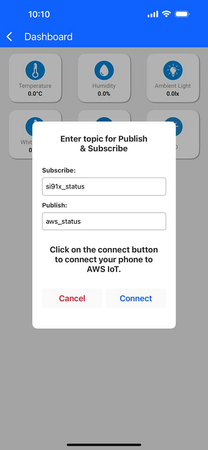
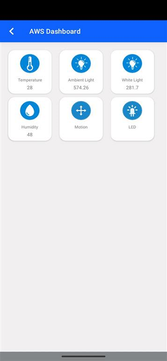
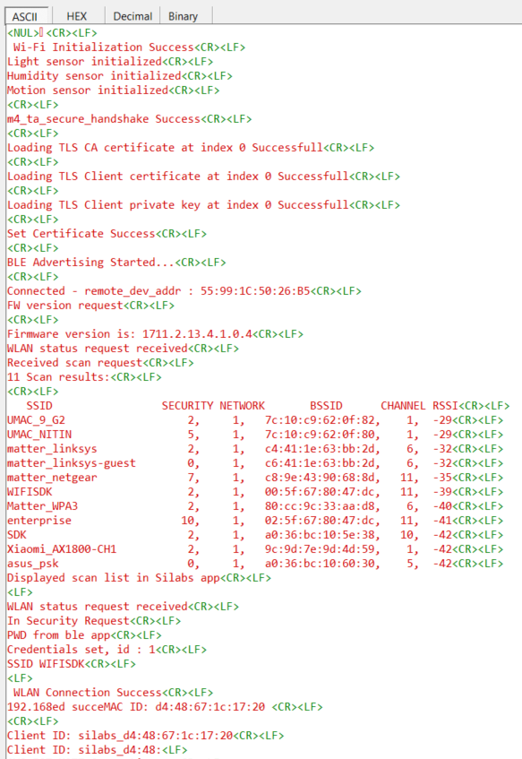
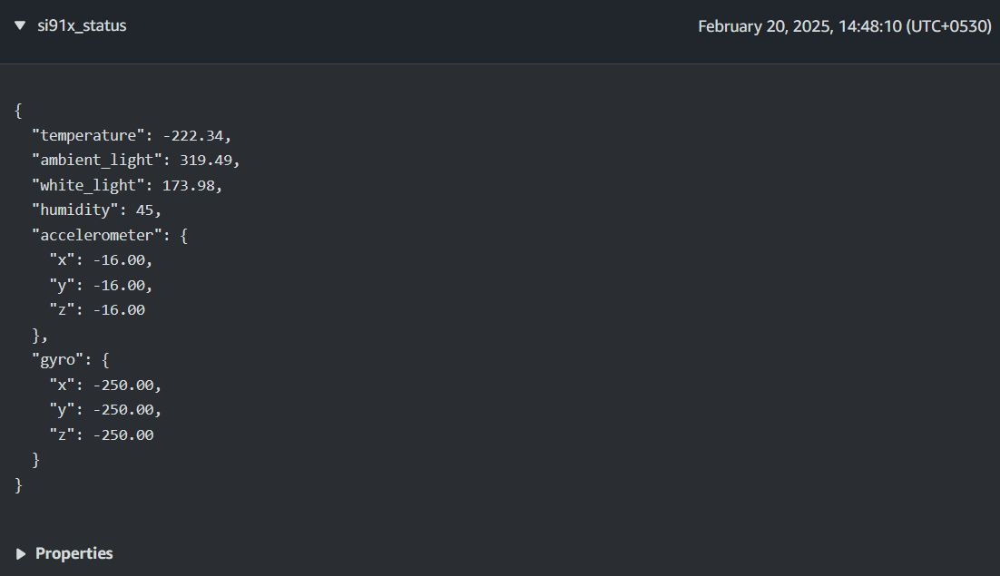

# Sensor Data Publishing and LED Control with AWS IoT MQTT for SiWG917 Dev Kit

## Table of Contents

- [Purpose / Scope](#purpose--scope)
- [Prerequisites / Setup Requirements](#prerequisites--setup-requirements)
  - [Hardware Requirements](#hardware-requirements)
    - [Software Requirements](#software-requirements)
    - [Setup Diagram](#setup-diagram)
- [Getting Started](#getting-started)
    - [Create an application](#create-an-application)
    - [Configure the below parameters in `aws_iot_config.h` file present at `<project>/config`](#Configure-the-following-parameters-in-aws_iot_configh-file-present-at-projectconfig)
  - [Test the Application](#test-the-application)
    - [Application Output](#application-output)
    - [MQTT Connection](#mqtt-connection)
- [Additional Information](#additional-information)
    - [Setting up Security Certificates](#setting-up-security-certificates)
    - [Create an AWS Thing](#create-an-aws-thing)
  
## Purpose / Scope

In this application, the Bluetooth Low Energy (BLE) and Simplicity Connect Application (formerly EFR Connect App) are used for provisioning the SiWx917 to a Wi-Fi Network. SiWx917 acts as a Wi-Fi station and connects to the AWS cloud via MQTT.

The user can enable the required LED from the mobile app. The mobile app will publish the required LED state to MQTT_TOPIC1. SiWx917 subscribes to MQTT_TOPIC1 and enables the requested LED.

The application also publishes the real-time sensor data (LUX, Temperature, Humidity, Gyro, and Accelerometer) to the cloud on MQTT_TOPIC2. This can be viewed from the mobile app dashboard.

## Prerequisites/Setup Requirements

 Before running the application, the user will need the following things to setup.

### Hardware Requirements

- Windows PC
- Wireless Access Point
- **SoC Mode**:
  - Kits
    - BRD2605A (SiWG917 Dev Kit Board)
- Android Phone or iPhone with Simplicity Connect App (formerly EFR Connect App), which is available in Play Store and App Store (or) Windows PC with windows Silicon labs connect application.

### Software Requirements

- [Simplicity Studio](https://www.silabs.com/developers/simplicity-studio)
- Silicon Labs [Simplicity Connect App (formerly EFR Connect App)](https://www.silabs.com/developers/simplicity-connect-mobile-app?tab=downloads), the app can be downloaded from Google Play store/Apple App store.
  > IMPORTANT: This example requires Simplicity Connect version 2.9.3 or later.

### Setup Diagram


## Getting Started

### Create an application

- You can follow the instructions on the [Developing with Radio Boards in SoC Mode page](https://docs.silabs.com/wiseconnect/latest/wiseconnect-developers-guide-developing-for-silabs-hosts/#developing-with-wi-se-connect-sdk-v3-x-with-si-wx91x-radio-boards) to:
  - [Create a project](https://docs.silabs.com/wiseconnect/latest/wiseconnect-developers-guide-developing-for-silabs-hosts/#create-a-project)
  - [Build the application](https://docs.silabs.com/wiseconnect/latest/wiseconnect-developers-guide-developing-for-silabs-hosts/#build-an-application)
  - [Flash the application](https://docs.silabs.com/wiseconnect/latest/wiseconnect-developers-guide-developing-for-silabs-hosts/#flash-an-application)


### Configure the following parameters in `aws_iot_config.h` file present at `<project>/config`

Before configuring the parameters in `aws_iot_config.h`, register the SiWx917 device in the AWS IoT registry by following the steps mentioned in the [Create an AWS Thing](#create-an-aws-thing) section.

Configure AWS_IOT_MQTT_HOST macro with the device data endpoint to connect to AWS. To get the device data endpoint in the AWS IoT Console, navigate to Settings, copy the Endpoint, and define the AWS_IOT_MQTT_HOST macro with this value.


 ```c
   //AWS Host name 
   #define AWS_IOT_MQTT_HOST          "a2m21kovu9tcsh-ats.iot.us-east-2.amazonaws.com"  

   //default port for MQTT
   #define AWS_IOT_MQTT_PORT          "8883"
   
   #define AWS_IOT_MQTT_CLIENT_ID     "silicon_labs_thing"
   
   // Thing Name of the Shadow this device is associated with 
   #define AWS_IOT_MY_THING_NAME      "silicon_labs_thing"    
```

To authenticate and securely connect with AWS, the SiWx917 device requires a unique x.509 security certificate and private key, as well as a CA certificate. At this point, you must have a device certificate, private key, and CA certificate, which are downloaded during the creation/registration of AWS Thing.

By default, the device certificate and private key that are downloaded from the AWS are in [.pem format](https://en.wikipedia.org/wiki/Privacy-Enhanced_Mail). To load the device certificate and private key to the SiWx917, the device certificate and private key should be converted into a C-array. For converting the certificates and private key into a C-array, refer to [Setting up Security Certificates](#setting-up-security-certificates).

By default, the WiSeConnect 3 SDK contains the Starfield Root CA Certificate in C-array format.

> **Note** :
 The included Cloud connectivity certificates are for reference only. If using default certificates in the release, the cloud connection will not work. You must replace the default certificates with valid certificates while connecting to the appropriate Cloud/OpenSSL Server.

## Test the Application

The following instructions are provied in [here](https://docs.silabs.com/wiseconnect/latest/wiseconnect-developers-guide-developing-for-silabs-hosts/) to:

- Build the application.
- Flash, run, and debug the application.

Complete the following steps for successful execution of the application:

1. Connect any serial console for prints.

2. When the SiWx917 EVK enters BLE advertising mode, launch the **Simplicity Connect App (formerly EFR Connect App)**.

3. Click on **Demo** and select **AWS IoT**.

   

4. It will scan for the module, and it appears as `BLE_CONFIGURATOR` on the UI. Select as shown below.

   

5. Now, SiWx917 module will start as a station and scan for the access points (AP) nearby.

6. Once the list of AP scan results is displayed on the screen, you can select the SSID of the AP to which you want to connect.

   

7. Click on the SSID of the AP, then enter a password if the AP is in security mode. Click **Connect** to associate with the access point.

   

8. Once the Silicon Labs module is connected to the access point, you will be prompted to enter the publish and subscribe topics.

   

9. The application starts publishing sensor data to AWS via MQTT, and this information will be displayed on the mobile app dashboard.

   

   

10. The mobile app publishes the required LED state to AWS. The application, which is already subscribed to this topic, will turn on the respective LED on the SiWx917.

    

### Application Output

  

  

**Note:**

- To learn more about aws mqtt apis error codes, refer to the `aws_iot_error.h` file present in the `<SDK>\third_party\aws_sdk\include\`.
- If the user is calling select and experiencing long wait times, and if no data is received, it is the user's responsibility to manage sending the keepalive packets to maintain the connection.

### MQTT Connection

After successfully connecting to Wi-Fi, the application establishes a connection to AWS IoT Core. It subscribes to a topic (`MQTT_TOPIC2`) and publishes a message on another topic (`MQTT_TOPIC1`). The application then waits to receive data published on the subscribed topic from the cloud.

1. Go to the mobile app and enable the required LED.

2. Realtime sensor data will be displayed on the mobile app dashboard. You can also see the published data by subscribing to the topic (MQTT_TOPIC1) in AWS console.

   

## Additional Information

### Setting up Security Certificates

The WiSeConnect 3 SDK provides a conversion script (written in Python 3) to make the conversion straightforward. The script is provided in the SDK `<SDK>/resources/scripts` directory and is called [certificate_to_array.py](https://github.com/SiliconLabs/wiseconnect/tree/master/resources/scripts/).

1. Copy the downloaded device certificate, private key from AWS, and the certificate_to_array.py to `<SDK>/resources/certificates`.

2. To convert the device certificate and private key to C arrays, open a system command prompt in the same path and give the following commands.

   ```sh
   $> python3 certificate_to_array.py <input filename> <output arrayname>

   For example:
   $> python3 certificate_to_array.py d8f3a44d3f.pem.crt aws_client_certificate.pem
   $> python3 certificate_to_array.py d8f3a44d3f.pem.key aws_client_private_key.pem
   ```

   After running the above commands, two new files are created as below:

   ```sh
   aws_client_certificate.pem.crt.h
   aws_client_private_key.pem.key.h
   ```

3. After converting the device certificate and private key to C - array, it is essential to include the device certificate: `aws_client_certificate.pem.crt.h` and private key: `aws_client_private_key.pem.key.h` in the `<SDK>/resources/certificates` folder.

4. Ensure to load the device certificate and private key to SiWx917 using the [sl_net_set_credential()](https://docs.silabs.com/wiseconnect/latest/wiseconnect-api-reference-guide-nwk-mgmt/net-credential-functions#sl-net-set-credential) API.

   ```c
   status = sl_net_set_credential(SL_NET_TLS_SERVER_CREDENTIAL_ID(0), SL_NET_CERTIFICATE, aws_client_certificate, (sizeof(aws_client_certificate) - 1));
  
   status = sl_net_set_credential(SL_NET_TLS_SERVER_CREDENTIAL_ID(0), SL_NET_PRIVATE_KEY, aws_client_private_key, (sizeof(aws_client_private_key) - 1));
   ```

5. Ensure to update the certificate names in the **IoT_Client_Init_Params** structure before calling the **aws_iot_mqtt_init()** API.

The Starfield Root CA certificate used by your Wi-Fi device to verify the AWS server is already included in the WiSeConnect 3 SDK at `<SDK>/resources/certificates`; no additional setup is required.

  > **NOTE :**
  > Support for the SNI extension has been added to the AWS SDK, ensuring it is set by the client when connecting to an AWS server using TLS 1.3. This is handled internally by the AWS SDK and does not affect compatibility with other TLS versions.

  > **NOTE :**
  > Amazon uses [Starfield Technologies](https://www.starfieldtech.com/) to secure the AWS website, the WiSeConnect SDK includes the [Starfield CA Certificate](https://github.com/SiliconLabs/wiseconnect/tree/master/resources/certificates/aws_starfield_ca.pem.h).
  >
  > AWS has announced that there will be changes in their root CA chain. More details can be found in the reference link: [here](https://aws.amazon.com/blogs/security/acm-will-no-longer-cross-sign-certificates-with-starfield-class-2-starting-august-2025/)
  >
  > We are providing both root CAs (Starfield class-2 and Starfield G2) in aws_starfield_ca.pem.h, which is located in the WiSeConnect directory `<SDK>/resources/certificates/aws_starfield_ca.pem.h`
  >
  > For AWS connectivity, StarField Root CA certificate has the highest authority being at the top of the signing hierarchy.
  >
  > The StarField Root CA certificate is an expected/required certificate which usually comes pre-installed in the operating systems and plays a key part in certificate chain verification when a device is performing TLS authentication with the IoT endpoint.
  >
  > On a SiWx91x device, we do not maintain the root CA trust repository due to memory constraints, so it is mandatory to load Starfield Root CA certificate for successful mutual authentication to the AWS server.
  >
  > The certificate chain sent by AWS server is as below:
  > **Starfield Class 2**:
  > id-at-commonName=Amazon,RSA 2048 M01,id-at-organizationName=Amazon,id-at-countryName=US
  > id-at-commonName=Amazon Root CA 1,id-at-organizationName=Amazon,id-at-countryName=US
  > id-at-commonName=Starfield Services Root Certificate Authority - G2,id-at-organizationName=Starfield Technologies, Inc.,id-at-localityName=Scottsdale,id-at- stateOrProvinceName=Arizona,id-at-countryName=US
  >id-at-organizationalUnitName=Starfield Class 2 Certification Authority,id-at-organizationName=Starfield Technologies, Inc.,id-at-countryName=US
  >
  > **Starfield G2**:
  > id-at-commonName=Amazon RSA 2048 M01,id-at-organizationName=Amazon,id-at-countryName=US
  > id-at-commonName=Amazon Root CA 1,id-at-organizationName=Amazon,id-at-countryName=US
  > id-at-commonName=Starfield Services Root Certificate Authority - G2,id-at-organizationName=Starfield Technologies, Inc.,id-at-localityName=Scottsdale,id-at-stateOrProvinceName=Arizona,id-at-countryName=US
  >
  > To authenticate the AWS server on SiWx91x, first validate the Root CA (validate the Root CA received with the Root CA loaded on the device). Once the Root CA validation is successful, other certificates sent from the AWS server are validated.
  > Alternate certification chains support is added. With this, as opposed to requiring full chain validation, only the peer certificate must validate to a trusted certificate. This allows loading intermediate root CA's as trusted.
  > The default CA certificate is the Starfield Combined CA certificate. To use the Intermediate Amazon Root CA 1 certificate, define the `SL_SI91X_AWS_IOT_ROOT_CA1` macro in the application.

### Create an AWS Thing

Create a thing in the AWS IoT registry to represent your IoT device.

1. In the [AWS IoT console](https://console.aws.amazon.com/iot/home), in the navigation pane, under **Manage**, choose **All devices**, and then choose **Things**.

   

2. If **No things** message is displayed, click on **Create things**.

   

3. On the **Create things** page, choose **Create single thing** and click next.

   

4. On the **Specify thing properties** page, enter a name for your IoT thing (for example, **Test_IoT**), and choose **Unnamed shadow (classic)** in the Device Shadow section, then choose **Next**. You cannot change the name of a thing after you create it. To change a thing's name, you must create a new thing, give it a new name, and then delete the old thing.

   

5. During **Configure device certificate** step, choose **Auto-generate a new certificate (recommended)** option and click **Next**.

   

6. Attach the policy to the thing created.

   - If you have an existing policy, attach it and click **Create thing**.

     

   - If policy is not yet created, follow the steps below.
  
     1. Choose **Create policy** and fill the fields as per your requirements.

         

     2. Give the **Name** to your Policy. Fill in the **Action** and **Resource ARN** fields as shown in the image below. Click on **Allow** under **Effect** and click **Create**.

        

     3. Choose the created policy and click on **Create thing**.

7. Choose the **Download** links to download the device certificate and private key. Note that Root CA certificate is already present in the SDK (aws_starfield_ca.pem.h), and can be directly used.
  
    >**Warning:** This is the only instance you can download your device certificate and private key. Make sure to save them securely.

    

8. Click **Done**.

   The created thing should now be visible on the AWS console (**Manage > All devices > Things**).