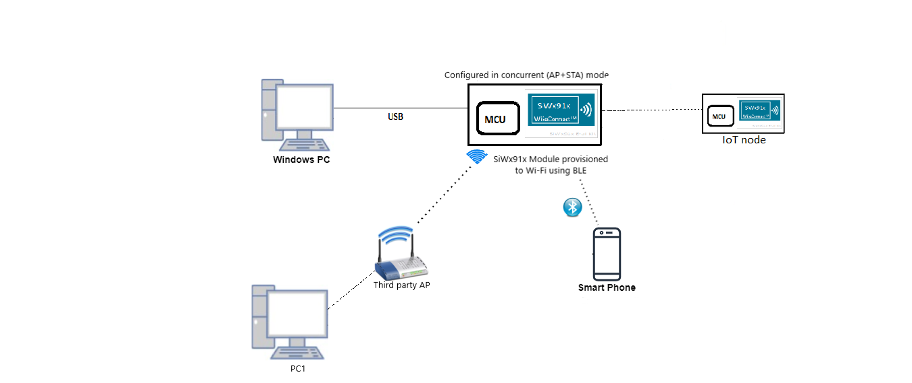
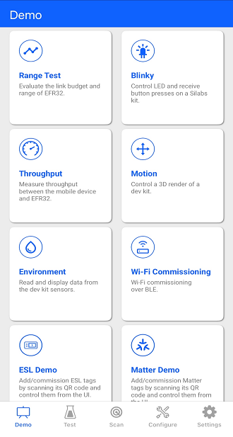
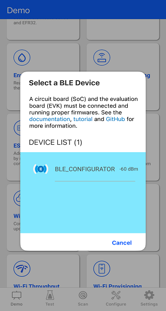
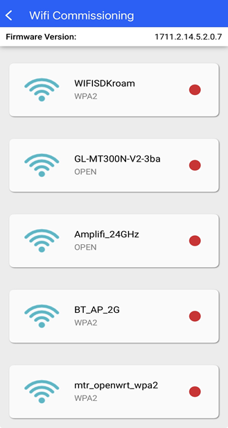
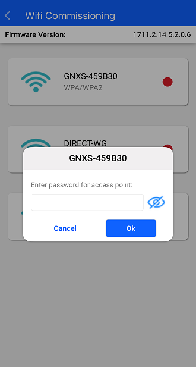
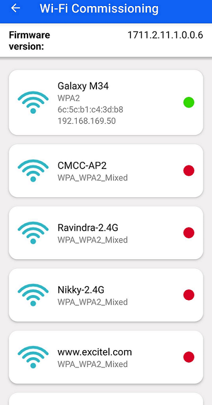
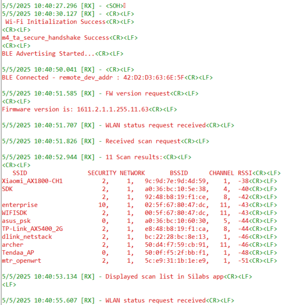
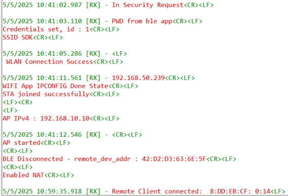
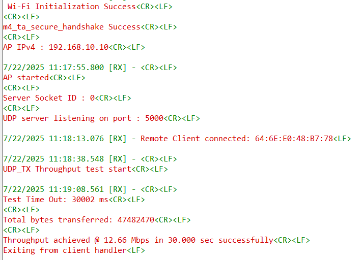
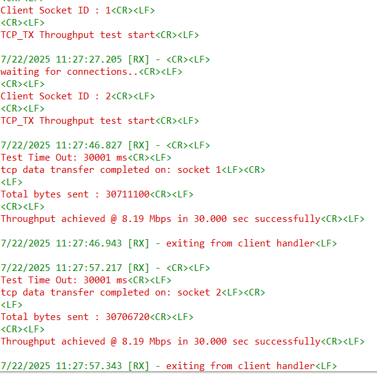

# Wi-Fi Coex - Wi-Fi Concurrent NAT with BLE Provisioning

## Table of Contents

- [Purpose / Scope](#purpose--scope)
- [Prerequisites / Setup Requirements](#prerequisites--setup-requirements)
  - [Hardware Requirements](#hardware-requirements)
  - [Software Requirements](#software-requirements)
  - [Setup Diagram](#setup-diagram)
- [Getting Started](#getting-started)
- [Application Build Environment](#application-build-environment)
- [Test the Application](#test-the-application)

## Purpose / Scope

This application brings up the SiWx91x as a station using BLE provisioning.

SiWx91x is then brought up with AP+STA interfaces in concurrent mode with NAT.

Third-party Wi-Fi clients connected to the SiWx91x can access the internet through a third-party AP using NAT.

## Prerequisites / Setup Requirements

### Hardware Requirements

- Windows PC
- SiWx91x Wi-Fi Evaluation Kit
- **SoC Mode**:
  - Standalone
    - BRD4002A Wireless pro kit mainboard [Si-MB4002A](https://www.silabs.com/development-tools/wireless/wireless-pro-kit-mainboard?tab=overview)
    - Radio Boards 
  	  - BRD4338A [SiWx917-RB4338A](https://www.silabs.com/development-tools/wireless/wi-fi/siwx917-rb4338a-wifi-6-bluetooth-le-soc-radio-board?tab=overview)
  	  - BRD4343A [SiW917Y-RB4343A](https://www.silabs.com/development-tools/wireless/wi-fi/siw917y-rb4343a-wi-fi-6-bluetooth-le-8mb-flash-radio-board-for-module?tab=overview)
  - Kits
  	- SiWx917 Pro Kit [SiWx917-PK6031A](https://www.silabs.com/development-tools/wireless/wi-fi/siwx917-pro-kit?tab=overview)
  	
- **NCP Mode**:
  - Standalone
    - BRD4002A Wireless pro kit mainboard [Si-MB4002A](https://www.silabs.com/development-tools/wireless/wireless-pro-kit-mainboard?tab=overview)
    - EFR32xG24 Wireless 2.4 GHz +10 dBm Radio Board [xG24-RB4186C](https://www.silabs.com/development-tools/wireless/xg24-rb4186c-efr32xg24-wireless-gecko-radio-board?tab=overview)
    - NCP Expansion Kit with NCP Radio boards
      - [BRD4346A](https://www.silabs.com/development-tools/wireless/wi-fi/siwx917-rb4346a-wifi-6-bluetooth-le-soc-4mb-flash-radio-board?tab=overview) + [BRD8045A](https://www.silabs.com/development-tools/wireless/wi-fi/expansion-adapter-board-for-co-processor-radio-boards?tab=overview)
      - [BRD4357A](https://www.silabs.com/development-tools/wireless/wi-fi/siw917y-rb4357a-wi-fi-6-bluetooth-le-4mb-flash-radio-board-for-rcp-and-ncp-modules?tab=overview) + [BRD8045A](https://www.silabs.com/development-tools/wireless/wi-fi/expansion-adapter-board-for-co-processor-radio-boards?tab=overview)
  - Kits
  	- EFR32xG24 Pro Kit +10 dBm [xG24-PK6009A](https://www.silabs.com/development-tools/wireless/efr32xg24-pro-kit-10-dbm?tab=overview)
   - Interface and Host MCU Supported
     - SPI - EFR32 

- Wireless Access point
- Android Phone or iPhone with **Simplicity Connect App(formerly EFR Connect App)** App, which is available in Play Store and App Store.
- Windows PC with windows Silicon labs connect application.

### Software Requirements

- Simplicity Studio IDE - [Simplicity Studio IDE](https://www.silabs.com/developer-tools/simplicity-studio) (to be used with Silicon Labs MCU)
- Download and install the Silicon Labs [Simplicity Connect App (formerly EFR Connect App)](https://www.silabs.com/developers/simplicity-connect-mobile-app ) from Play store/App store.


### Setup Diagram

  


## Getting Started

Refer to the instructions [here](https://docs.silabs.com/wiseconnect/latest/wiseconnect-getting-started/) to:

- [Install Simplicity Studio](https://docs.silabs.com/wiseconnect/latest/wiseconnect-developers-guide-developing-for-silabs-hosts/#install-simplicity-studio)
- [Install WiSeConnect extension](https://docs.silabs.com/wiseconnect/latest/wiseconnect-developers-guide-developing-for-silabs-hosts/#install-the-wi-se-connect-extension)
- [Connect your device to the computer](https://docs.silabs.com/wiseconnect/latest/wiseconnect-developers-guide-developing-for-silabs-hosts/#connect-si-wx91x-to-computer)
- [Upgrade your connectivity firmware](https://docs.silabs.com/wiseconnect/latest/wiseconnect-developers-guide-developing-for-silabs-hosts/#update-si-wx91x-connectivity-firmware)
- [Create a Studio project](https://docs.silabs.com/wiseconnect/latest/wiseconnect-developers-guide-developing-for-silabs-hosts/#create-a-project)

For details on the project folder structure, see the [WiSeConnect Examples](https://docs.silabs.com/wiseconnect/latest/wiseconnect-examples/#example-folder-structure) page.

## Application Build Environment

The application can be configured to suit your requirements and development environment. Read through the following sections and make any changes needed.

> **Note:** The `ble_config.h` file is already configured with the desired settings for this example.

  `RSI_BLE_APP_DEVICE_NAME` refers to the name of the SiWx91x EVK to appear during scanning by remote devices.

  ```c
  #define RSI_BLE_APP_DEVICE_NAME        "BLE_CONFIGURATOR"
  ```

  **Configure the Wi-Fi parameters**

- In the Project Explorer pane, open the `wifi_config.h` file and update/modify following macros:

  - Enter the AP Connectivity essentials configurations as the value to SSID and PSK.
      ```c
      #define WIFI_AP_PROFILE_SSID     "MY_DUAL_AP_SSID"
      #define WIFI_AP_CREDENTIAL       "MY_AP_PASSPHRASE"
      ```
- To operate in AP-only mode, enable the `AP_ONLY_MODE` macro.

> **Note:** The NAT feature is supported only when the device operates in concurrent AP+STA mode.

> **Note:** Users can configure default region-specific regulatory information using `sl_wifi_region_db_config.h`

## Test the Application

Refer to the instructions [here](https://docs.silabs.com/wiseconnect/latest/wiseconnect-getting-started/) to:

- Build the application.
- Flash, run and debug the application.


###  Steps to verify the Wi-Fi Concurrent NAT with BLE Provisioning Example

 Steps to be followed to verify WLAN Station BLE Provisioning with Android **Simplicity Connect App(formerly EFR Connect App)** App
 > **Note:** Version 2.9.0 or above

1. Configure the Access point in OPEN/WPA-PSK/WPA2-PSK/WPA3 mode to connect the SiWx91x in STA mode.

2. Connect any serial console for prints.

3. When SiWx91x EVK enters BLE advertising mode, launch the **Simplicity Connect App(formerly EFR Connect App)** App.

4. Click on Demo and select Wifi-Commissioning tile.

    

5. The SiWx91x advertises as the "BLE_CONFIGURATOR". Click on "BLE_CONFIGURATOR".

    

6. Once the BLE got the connected, list of available Access Points in the vicinity, get displayed on the screen.

7. Select the AP from the scanned list as shown below.

    

8. If the selected AP is configured in the security, the password entry pop-up window will be appeared.

9. Enter the password and click on "CONNECT".

    

10. Once the SiWx91x EVK gets connected to AP, IP address of SiWx91x EVK get displayed on the screen.

    

11. SiWx91x then bring up the AP and operate in concurrent mode after which NAT is enabled. 

    

    

###  Throughput testing

**UDP Tx Throughput**

1. Set the following macro in `wifi_config.h`:
   ```c
      #define THROUGHPUT_TYPE       UDP_TX
   ```
2. Compile and flash the application.

3. Once connected to the SiWx91x AP, navigate to **`/<SDK>/resources/scripts/`**. Run the **udp_client.py** script on port number 5000 using the following command:

   `python.exe .\udp_client.py 192.168.10.10 5000`

   


**TCP Tx Throughput**

1. Set the following macro in `wifi_config.h`:
   ```c
      #define THROUGHPUT_TYPE       TCP_TX
   ```
2. Compile and flash the application.

3. Once connected to the SiWx91x AP, navigate to **`/<SDK>/resources/scripts/`**. Run the **tcp_client.py** script on port number 5000 using the following command:

   `python.exe .\tcp_client.py 192.168.10.10 5000`

   

   

   **NOTE:** If the python command is not working, replace the python with py.


> **Note** : The number of NAT entries is limited to 100.