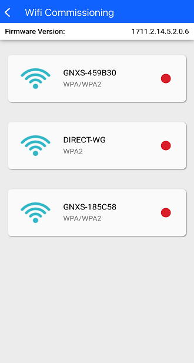
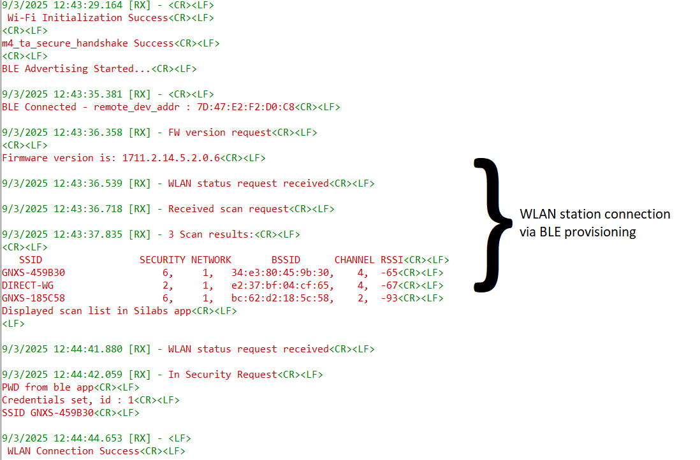
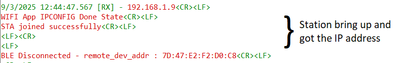
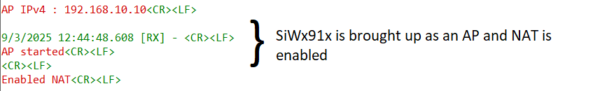
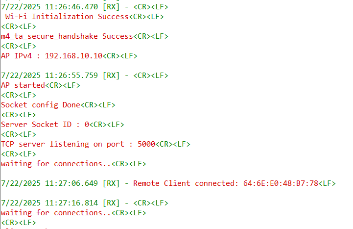

# Wi-Fi Coex - Wi-Fi Concurrent NAT with BLE Provisioning

## Table of Contents

- [Purpose / Scope](#purpose--scope)
- [Prerequisites / Setup Requirements](#prerequisites--setup-requirements)
  - [Hardware Requirements](#hardware-requirements)
  - [Software Requirements](#software-requirements)
  - [Setup Diagram](#setup-diagram)
- [Getting Started](#getting-started)
- [Application Build Environment](#application-build-environment)
- [Test the Application](#test-the-application)

## Purpose / Scope

This application brings up the SiWx91x device as a station using BLE provisioning. Once connected, the SiWx91x device also enables the Access Point (AP) interface and operates in concurrent mode. After that, the Network Address Translation (NAT) feature is activated, allowing third-party Wi-Fi clients connected to the SiWx91x device AP to access the internet through a third-party AP via NAT.

## Prerequisites / Setup Requirements

### Hardware Requirements

- Windows PC
- SiWx91x device
- **SoC Mode**:
  - Standalone
    - BRD4002A Wireless pro kit mainboard [Si-MB4002A](https://www.silabs.com/development-tools/wireless/wireless-pro-kit-mainboard?tab=overview)
    - Radio Boards 
  	  - BRD4338A [SiWx917-RB4338A](https://www.silabs.com/development-tools/wireless/wi-fi/siwx917-rb4338a-wifi-6-bluetooth-le-soc-radio-board?tab=overview)
      - BRD4342A [SiWx91x-RB4342A](https://www.silabs.com/development-tools/wireless/wi-fi/siwx91x-rb4342a-wifi-6-bluetooth-le-soc-radio-board?tab=overview)
  	  - BRD4343A [SiW917Y-RB4343A](https://www.silabs.com/development-tools/wireless/wi-fi/siw917y-rb4343a-wi-fi-6-bluetooth-le-8mb-flash-radio-board-for-module?tab=overview)
  - Kits
  	- SiWx917 Pro Kit [SiWx917-PK6031A](https://www.silabs.com/development-tools/wireless/wi-fi/siwx917-pro-kit?tab=overview)
  	
- **NCP Mode**:
  - Standalone
    - BRD4002A Wireless pro kit mainboard [Si-MB4002A](https://www.silabs.com/development-tools/wireless/wireless-pro-kit-mainboard?tab=overview)
    - EFR32xG24 Wireless 2.4 GHz +10 dBm Radio Board [xG24-RB4186C](https://www.silabs.com/development-tools/wireless/xg24-rb4186c-efr32xg24-wireless-gecko-radio-board?tab=overview)
    - NCP Expansion Kit with NCP Radio boards
      - [BRD4346A](https://www.silabs.com/development-tools/wireless/wi-fi/siwx917-rb4346a-wifi-6-bluetooth-le-soc-4mb-flash-radio-board?tab=overview) + [BRD8045A](https://www.silabs.com/development-tools/wireless/wi-fi/expansion-adapter-board-for-co-processor-radio-boards?tab=overview)
      - [BRD4357A](https://www.silabs.com/development-tools/wireless/wi-fi/siw917y-rb4357a-wi-fi-6-bluetooth-le-4mb-flash-radio-board-for-rcp-and-ncp-modules?tab=overview) + [BRD8045A](https://www.silabs.com/development-tools/wireless/wi-fi/expansion-adapter-board-for-co-processor-radio-boards?tab=overview)
  - Kits
  	- EFR32xG24 Pro Kit +10 dBm [xG24-PK6009A](https://www.silabs.com/development-tools/wireless/efr32xg24-pro-kit-10-dbm?tab=overview)
   - Interface and Host MCU Supported
     - SPI - EFR32 

- Wireless Access point
- Android Phone or iPhone with **Simplicity Connect App (formerly EFR Connect App)**, which is available in Google Play Store and Apple App Store.
- Windows PC with windows Silicon Labs Connect application.

### Software Requirements

- Simplicity Studio IDE - [Simplicity Studio IDE](https://www.silabs.com/developer-tools/simplicity-studio) (to be used with Silicon Labs MCU)
- Download and install the Silicon Labs [Simplicity Connect App (formerly EFR Connect App)](https://www.silabs.com/developers/simplicity-connect-mobile-app ) from the Google Play store or Apple App store.

### Setup Diagram

  


## Getting Started

Refer to the instructions [here](https://docs.silabs.com/wiseconnect/latest/wiseconnect-getting-started/) to:

- [Install Simplicity Studio](https://docs.silabs.com/wiseconnect/latest/wiseconnect-developers-guide-developing-for-silabs-hosts/using-the-simplicity-studio-ide/#install-simplicity-studio)
- [Install WiSeConnect 3 extension](https://docs.silabs.com/wiseconnect/latest/wiseconnect-developers-guide-developing-for-silabs-hosts/using-the-simplicity-studio-ide/#install-the-wiseconnect-3-extension) 
- [Connect your device to the computer](https://docs.silabs.com/wiseconnect/latest/wiseconnect-developers-guide-developing-for-silabs-hosts/using-the-simplicity-studio-ide#connect-siwx91x-to-computer)
- [Upgrade your connectivity firmware](https://docs.silabs.com/wiseconnect/latest/wiseconnect-developers-guide-developing-for-silabs-hosts/using-the-simplicity-studio-ide#update-siwx91x-connectivity-firmware)
- [Create a Studio project](https://docs.silabs.com/wiseconnect/latest/wiseconnect-developers-guide-developing-for-silabs-hosts/using-the-simplicity-studio-ide#create-a-project)

For details on the project folder structure, see the [WiSeConnect Examples](https://docs.silabs.com/wiseconnect/latest/wiseconnect-examples/#example-folder-structure) page.

## Application Build Environment

The application can be configured to suit your requirements and development environment. Read through the following sections and make any changes needed.

> **Note:** The `ble_config.h` file is already configured with the desired settings for this example.

  `RSI_BLE_APP_DEVICE_NAME` refers to the name of the SiWx91x device to appear during scanning by remote devices.

  ```c
  #define RSI_BLE_APP_DEVICE_NAME        "BLE_CONFIGURATOR"
  ```

  ### Configure the Wi-Fi Parameters

1. In the Project Explorer pane, open the `wifi_config.h` file and update/modify following macros:

2. Enter the third-party AP Connectivity essentials configurations as the value to SSID and PSK.


      ```c
      #define WIFI_AP_PROFILE_SSID     "MY_DUAL_AP_SSID"
      #define WIFI_AP_CREDENTIAL       "MY_AP_PASSPHRASE"

      ```
3. To operate in AP-only mode, enable the `AP_ONLY_MODE` macro.

> **Note:** The NAT feature is supported only when the device operates in concurrent AP+STA mode.

> **Note:** Users can configure default region-specific regulatory information using `sl_wifi_region_db_config.h`

## Test the Application

Refer to the instructions [here](https://docs.silabs.com/wiseconnect/latest/wiseconnect-getting-started/) to:

- Build the application.
- Flash, run and debug the application.


###  Steps to verify the Wi-Fi Concurrent NAT with BLE Provisioning Example

 Complete the following steps to verify WLAN Station BLE Provisioning with Android/iOS **Simplicity Connect App (formerly EFR Connect App)**:
 > **Note:** Version 2.9.0 or above

1. Configure the third-party AP in OPEN, WPA-PSK, WPA2-PSK, or WPA3 mode for the SiWx91x device to connect.

2. Connect any serial console for prints.

3. The Siwx91x device enters into the BLE advertising mode. Launch the **Simplicity Connect App (formerly EFR Connect App)**.

4. Click on the **Demo** tab and select **Wi-Fi Commissioning** tile.

    

5. The SiWx91x device advertises as the 
`BLE_CONFIGURATOR`. Click on `BLE_CONFIGURATOR` to initiate the connection from the mobile app.

    

6. After the BLE connection is successfully established, the SiWx917 device initiates a WLAN scan to detect available access points in the vicinity and forwards the scan results to the Si Connect app via BLE.

7. Select the third-party AP from the scanned list as shown below.

    

8. If the selected third-party AP is configured in the security, the password entry pop-up window appears.

9. Enter the password and click on **CONNECT**.

    

10. After the SiWx91x device connects to the third-party AP, the IP address of SiWx91x device is displayed on the screen.

    

    

11. The SiWx91x device then brings up the AP interface and starts operating in concurrent mode, after which NAT is enabled.

    

12. Client devices can then connect to the SiWx91x device AP and get internet access via a third-party AP.

###  Throughput Testing

#### UDP Tx Throughput

1. Set the following macro in `wifi_config.h`:

   ```c
      #define THROUGHPUT_TYPE       UDP_TX
   ```

2. Compile and flash the application.

3. Once connected to the SiWx91x device AP, navigate to **`/<SDK>/resources/scripts/`**. Run the **udp_client.py** script on port number 5000 using the following command:

   `python.exe .\udp_client.py 192.168.10.10 5000`

   


#### TCP Tx Throughput

1. Set the following macro in `wifi_config.h`:

   ```c
      #define THROUGHPUT_TYPE       TCP_TX
   ```

2. Compile and flash the application.

3. Once connected to the SiWx91x device AP, navigate to **`/<SDK>/resources/scripts/`**. Run the **tcp_client.py** script on port number 5000 using the following command:

   `python.exe .\tcp_client.py 192.168.10.10 5000`

   

   

   > **Note:** If the python command is not working, replace `python` with `py`.

> **Note** : The number of NAT entries is limited to 100.

> **Note** : NAT feature is internal test feature only, not recommended for Production.