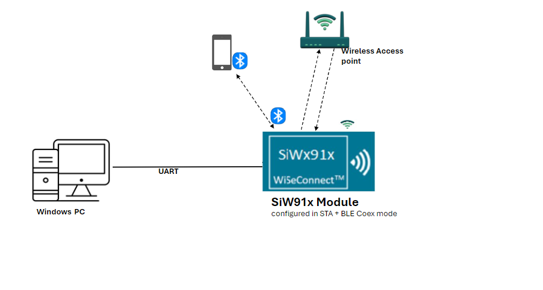
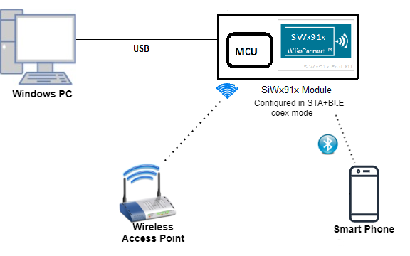
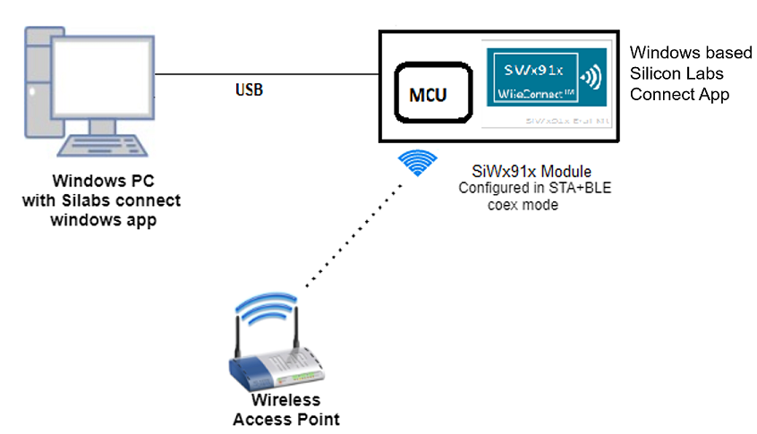
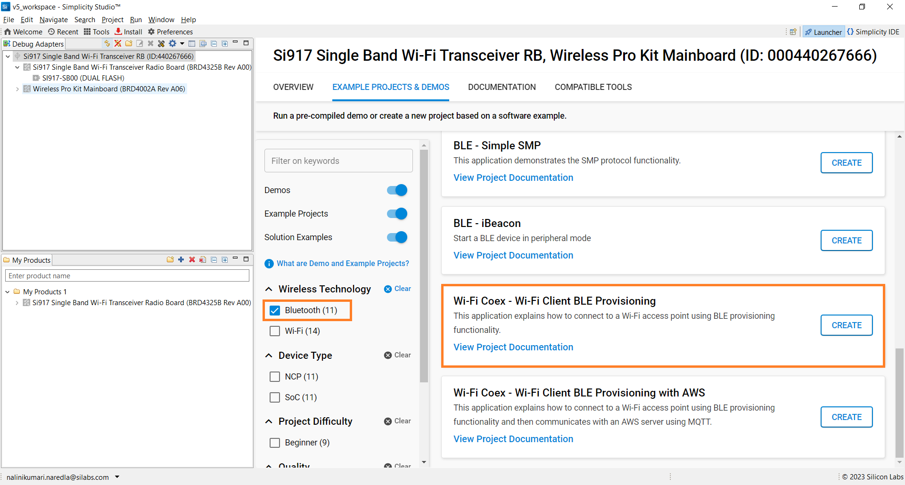
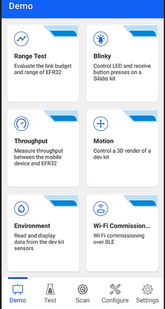
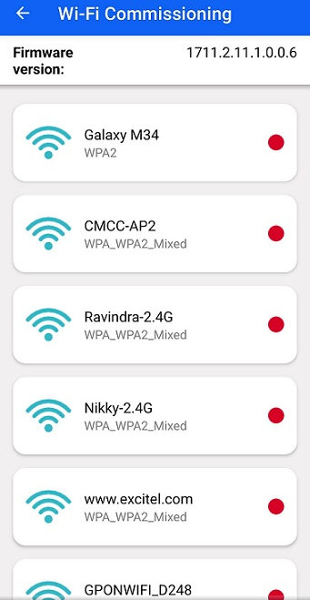
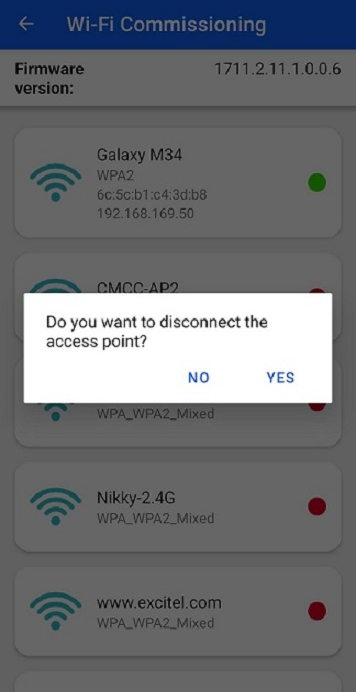
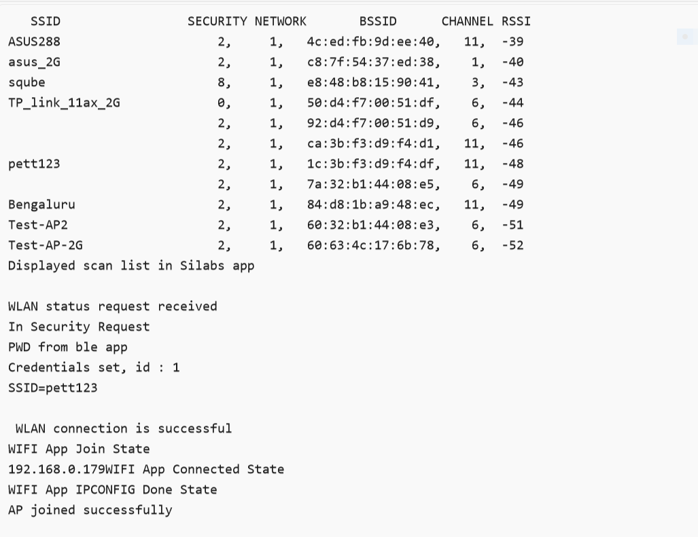
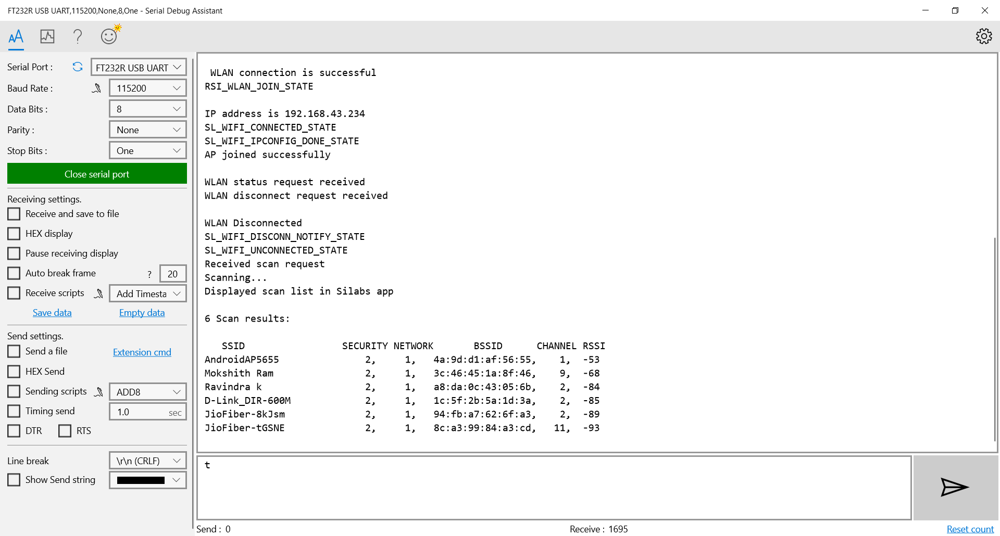

# WLAN Station BLE Provisioning

## 1. Purpose / Scope

This example demonstrates how to configure/connects SiWx91x to get the WiFi connection functionality using BLE provisioning.

SiWx91x starts advertising in BLE mode and Access Point details are fetched using BLE Provisioning.

SiWx91x is configured as a WiFi station and connects to an Access Point.

## 2. Prerequisites / Setup Requirements

Before running the application, the user will need the following things to setup.

### 2.1 Hardware Requirements

- Windows PC.
- SiWx91x Wi-Fi Evaluation Kit. The SiWx91x supports multiple operating modes. See [Operating Modes]() for details.
  - **SoC Mode**:
    - Silicon Labs [BRD4325A, BRD4325B, BRD4325C, BRD4325G, BRD4338A](https://www.silabs.com/)
  - **NCP Mode**:
    - Silicon Labs [BRD4180B](https://www.silabs.com/); **AND**
    - Host MCU Eval Kit. This example has been tested with:
      - Silicon Labs [WSTK + EFR32MG21](https://www.silabs.com/development-tools/wireless/efr32xg21-bluetooth-starter-kit)

- Wireless Access point
- Android Phone or iPhone with **EFR Connect** App, which is available in Play Store and App Store.
- Windows PC with windows Silicon labs connect application.

### 2.2 Software Requirements

- Embedded Development Environment

  - For Silicon Labs EFx32, use the latest version of [Simplicity Studio](https://www.silabs.com/developers/simplicity-studio)
  - Download and install the Silicon Labs [EFR Connect App](https://www.silabs.com/developers/efr-connect-mobile-app) in the android smart phones for testing BLE applications. Users can also use their choice of BLE apps available in Android/iOS smart phones.

### **SoC Mode**

- WLAN Station BLE Provisioning with Android EFR Connect App

- WLAN Station BLE Provisioning with windows based Silicon Labs Connect App
  
  
### **NCP Mode**

- WLAN Station BLE Provisioning with Android EFR Connect App
  
- WLAN Station BLE Provisioning with windows based Silicon Labs Connect App
  

Follow the [Getting Started with Wiseconnect3 SDK](https://docs.silabs.com/wiseconnect/latest/wiseconnect-getting-started/) guide to set up the hardware connections and Simplicity Studio IDE.

## 3 Project Environment

- Ensure the SiWx91x loaded with the latest firmware following the [Upgrade Si91x firmware](https://docs.silabs.com/wiseconnect/latest/wiseconnect-getting-started/getting-started-with-soc-mode#upgrade-si-wx91x-connectivity-firmware)

- Ensure the latest Gecko SDK along with the extension WiSeConnect3 is added to Simplicity Studio.

### 3.1 Creating the project

#### 3.1.1 SoC mode

- Ensure the SiWx91x set up is connected to your PC.

- In the Simplicity Studio IDE, the SiWx91x SoC board will be detected under **Debug Adapters** pane as shown below.

  ****

#### 3.1.2 NCP mode

- Ensure the EFx32 and SiWx91x set up is connected to your PC.

- In the Simplicity Studio IDE, the EFR32 board will be detected under **Debug Adapters** pane as shown below.

  ****

### 3.2 Importing the project

- Studio should detect your board. Your board will be shown here. Click on the board detected and go to **EXAMPLE PROJECTS & DEMOS** section 

#### SOC Mode

- Select **Wi-Fi Coex - Wi-Fi Client BLE Provisioning** test application

  ****

- Click 'Create'. The "New Project Wizard" window appears. Click 'Finish'

  ****

### 3.3 Set up for application prints

#### 3.3.1 Teraterm set up - for BRD4325A, BRD4325B, BRD4325C, BRD4325G

You can use either of the below USB to UART converters for application prints.

1. Set up using USB to UART converter board.

   - Connect Tx (Pin-6) to P27 on WSTK
   - Connect GND (Pin 8 or 10) to GND on WSTK

   ****

2. Set up using USB to UART converter cable.

   - Connect RX (Pin 5) of TTL convertor to P27 on WSTK
   - Connect GND (Pin1) of TTL convertor to GND on WSTK

   ****

3. Open the Teraterm tool.

   - For SoC mode, choose the serial port to which USB to UART converter is connected and click on **OK**.

     ****

**Note:** For Other 917 SoC boards please refer section #3.3.2

#### 3.3.2 **Teraterm set up - for NCP and SoC modes**

1. Open the Teraterm tool.

- choose the J-Link port and click on **OK**.
    
    ****

2. Navigate to the Setup → Serial port and update the baud rate to **115200** and click on **OK**.

    ****

    ****

## 4. Application Configuration Parameters

The application can be configured to suit your requirements and development environment. Read through the following sections and make any changes needed.

> wlan_config.h, ble_config.h files are already set with the above desired configuration for this example.

**4.4** Open `ble_app.c` file and update/modify following macros

`RSI_BLE_CHAR_SERV_UUID` refers to the attribute type of the characteristics to be added in a service.

    #define  RSI_BLE_CHAR_SERV_UUID                         0x2803

`RSI_BLE_CLIENT_CHAR_UUID` refers to the attribute type of the client characteristics descriptor to be added in a service.

    #define RSI_BLE_CLIENT_CHAR_UUID                        0x2902

`RSI_BLE_NEW_SERVICE_UUID` refers to the attribute value of the newly created service.

    #define  RSI_BLE_NEW_SERVICE_UUID                       0xAABB

`RSI_BLE_ATTRIBUTE_1_UUID` refers to the attribute type of the first attribute under this service (RSI_BLE_NEW_SERVICE_UUID).

    #define  RSI_BLE_ATTRIBUTE_1_UUID                        0x1AA1

`RSI_BLE_ATTRIBUTE_2_UUID` refers to the attribute type of the second attribute under this service (RSI_BLE_NEW_SERVICE_UUID).

    #define RSI_BLE_ATTRIBUTE_2_UUID                         0x1BB1

`RSI_BLE_ATTRIBUTE_3_UUID` refers to the attribute type of the third attribute under this service (RSI_BLE_NEW_SERVICE_UUID).

    #define RSI_BLE_ATTRIBUTE_3_UUID                         0x1CC1

'RSI_BLE_MAX_DATA_LEN' refers to the Maximum length of the attribute data.

    #define RSI_BLE_MAX_DATA_LEN                             66

`RSI_BLE_APP_DEVICE_NAME` refers to the name of the SiWx91x EVK to appear during scanning by remote devices.

    #define  RSI_BLE_APP_DEVICE_NAME                         "BLE_CONFIGURATOR"

The following are the **non-configurable** macros in the application.

`RSI_BLE_ATT_PROPERTY_READ` is used to set the READ property to an attribute value.

    #define  RSI_BLE_ATT_PROPERTY_READ                       0x02

`RSI_BLE_ATT_PROPERTY_WRITE` is used to set the WRITE property to an attribute value.

    #define RSI_BLE_ATT_PROPERTY_WRITE                       0x08

`RSI_BLE_ATT_PROPERTY_NOTIFY` is used to set the NOTIFY property to an attribute value.

    #define  RSI_BLE_ATT_PROPERTY_NOTIFY                     0x10

## 5. Build and Test the Application

- Follow the below steps for the successful execution of the application.

- Follow the below steps for the successful execution of the application.

### 5.1 Build the Application

- Follow the below steps for the successful execution of the application.

#### SoC Mode

- Once the project is created, click on the build icon (hammer) to build the project (or) right click on project and click on Build Project.

   

- Successful build output will show as below.

#### NCP Mode

  

- Successful build output will show as below.

### 5.2 Loading the Application Image

1. Click on Tools and Simplicity Commander as shown below.

    

2. Load the firmware image

    - Select the board.
    - Browse the application image (.hex) and click on Flash button.

    

### 5.2 Steps to verify the WLAN Station BLE Provisioning Example

#### 5.2.1 Steps to be followed to verify WLAN Station BLE Provisioning with Android **EFR Connect** App

1. Configure the Access point in OPEN/WPA-PSK/WPA2-PSK mode to connect the SiWx91x in STA mode.

2. Connect any serial console for prints.

3. When SiWx91x EVK enters BLE advertising mode, launch the **EFR Connect** App.

4. Click on Demo and select Wifi-Commissioning tile.

    

5. The Si917 advertises as the "BLE_CONFIGURATOR". Click on "BLE_CONFIGURATOR".

6. Once the BLE got the connected, list of available Access Points in the vicinity, get displayed on the screen.

    

7. Select the AP from the scanned list as shown below.

    

8. If the selected AP is configured in the security, the password entry pop-up window will be appeared.

9. Enter the password and click on "CONNECT".

    

10. Connect to an Access Point, once the SiWx91x EVK gets connected to AP, IP address of SiWx91x EVK get displayed on the screen.

11. To disconnect from Access Point, click on connected AP and click on YES

    

12. Refer the below figure for console prints

## 5.4 Observing the output prints on serial terminal  

