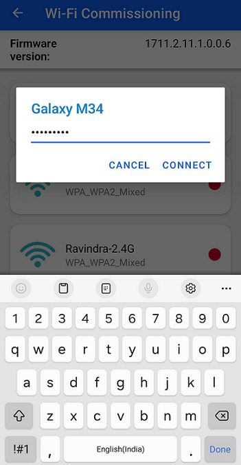
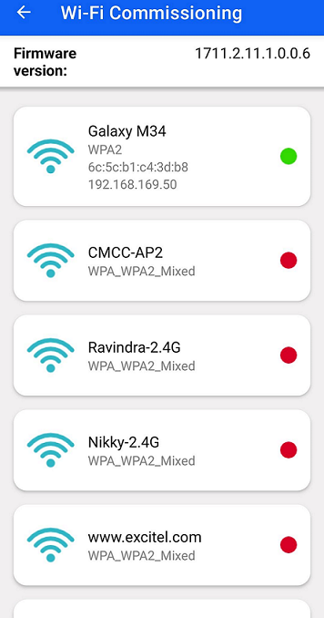
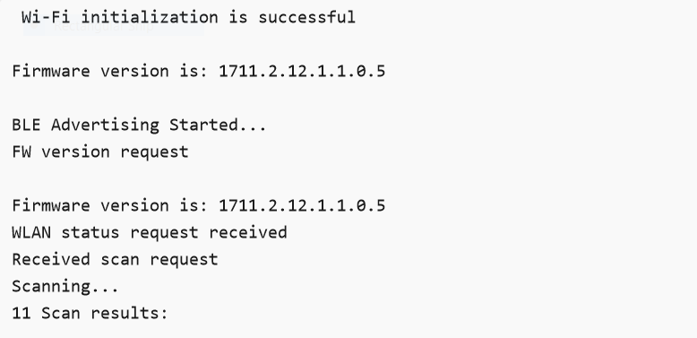

# Wi-Fi Coex - Wi-Fi Client BLE Provisioning

## Table of Contents

- [Purpose / Scope](#purpose--scope)
- [Prerequisites / Setup Requirements](#prerequisites--setup-requirements)
  - [Hardware Requirements](#hardware-requirements)
  - [Software Requirements](#software-requirements)
  - [Setup Diagram](#setup-diagram)
- [Getting Started](#getting-started)
- [Application Build Environment](#application-build-environment)
- [Test the Application](#test-the-application)

## Purpose / Scope

This example demonstrates how to configure/connects SiWx91x to get the WiFi connection functionality using BLE provisioning.

SiWx91x starts advertising in BLE mode and Access Point details are fetched using BLE Provisioning.

SiWx91x is configured as a WiFi station and connects to an Access Point.

## Prerequisites / Setup Requirements

### Hardware Requirements

- Windows PC.
- SiWx91x Wi-Fi Evaluation Kit. The SiWx91x supports multiple operating modes. See [Operating Modes]() for details.
- **SoC Mode**:
  - Standalone
    - BRD4002A Wireless pro kit mainboard [SI-MB4002A]
    - Radio Boards 
  	  - BRD4338A [SiWx917-RB4338A]
      - BRD4339B [SiWx917-RB4339B]
  	  - BRD4340A [SiWx917-RB4340A]
  	  - BRD4343A [SiWx917-RB4343A]
  - Kits
  	- SiWx917 Pro Kit [Si917-PK6031A](https://www.silabs.com/development-tools/wireless/wi-fi/siwx917-pro-kit?tab=overview)
  	- SiWx917 Pro Kit [Si917-PK6032A]
  	
- **NCP Mode**:
  - Standalone
    - BRD4002A Wireless pro kit mainboard [SI-MB4002A]
    - EFR32xG24 Wireless 2.4 GHz +10 dBm Radio Board [xG24-RB4186C](https://www.silabs.com/development-tools/wireless/xg24-rb4186c-efr32xg24-wireless-gecko-radio-board?tab=overview)
    - NCP Expansion Kit with NCP Radio boards
      - (BRD4346A + BRD8045A) [SiWx917-EB4346A]
      - (BRD4357A + BRD8045A) [SiWx917-EB4357A]
  - Kits
  	- EFR32xG24 Pro Kit +10 dBm [xG24-PK6009A](https://www.silabs.com/development-tools/wireless/efr32xg24-pro-kit-10-dbm?tab=overview)
   - Interface and Host MCU Supported
     - SPI - EFR32 

- Wireless Access point
- Android Phone or iPhone with **Simplicity Connect App(formerly EFR Connect App)** App, which is available in Play Store and App Store.
- Windows PC with windows Silicon labs connect application.

### Software Requirements

- Simplicity Studio
- Download and install the Silicon Labs [Simplicity Connect App(formerly EFR Connect App) or other BLE Central/Peripheral app.](https://www.silabs.com/developers/simplicity-connect-mobile-app ) in the android smart phones for testing BLE applications. Users can also use their choice of BLE apps available in Android/iOS smart phones.


### Setup Diagram

- WLAN Station BLE Provisioning with windows based Silicon Labs Connect App

  


## Getting Started

Refer to the instructions [here](https://docs.silabs.com/wiseconnect/latest/wiseconnect-getting-started/) to:

- Install Studio and WiSeConnect 3 extension
- Connect your device to the computer
- Upgrade your connectivity firmware
- Create a Studio project

For details on the project folder structure, see the [WiSeConnect Examples](https://docs.silabs.com/wiseconnect/latest/wiseconnect-examples/#example-folder-structure) page.

## Application Build Environment

The application can be configured to suit your requirements and development environment. Read through the following sections and make any changes needed.

> **Note:** `wlan_config.h`, `ble_config.h` files are already set with the above desired configuration for this example.

- Open `ble_app.c` file and update/modify following macros

    - `RSI_BLE_CHAR_SERV_UUID` refers to the attribute type of the characteristics to be added in a service.
    
        ``` c
        #define  RSI_BLE_CHAR_SERV_UUID                         0x2803
        ```

    - `RSI_BLE_CLIENT_CHAR_UUID` refers to the attribute type of the client characteristics descriptor to be added in a service.
    
        ```c
        #define RSI_BLE_CLIENT_CHAR_UUID                        0x2902
        ```

    - `RSI_BLE_NEW_SERVICE_UUID` refers to the attribute value of the newly created service.
    
        ```c
        #define  RSI_BLE_NEW_SERVICE_UUID                       0xAABB
        ```

    - `RSI_BLE_ATTRIBUTE_1_UUID` refers to the attribute type of the first attribute under this service (RSI_BLE_NEW_SERVICE_UUID).
    
        ```c
        #define  RSI_BLE_ATTRIBUTE_1_UUID                        0x1AA1
        ```

    - `RSI_BLE_ATTRIBUTE_2_UUID` refers to the attribute type of the second attribute under this service (RSI_BLE_NEW_SERVICE_UUID).
    
        ```c
        #define RSI_BLE_ATTRIBUTE_2_UUID                         0x1BB1
        ```

    - `RSI_BLE_ATTRIBUTE_3_UUID` refers to the attribute type of the third attribute under this service (RSI_BLE_NEW_SERVICE_UUID).

        ```c
        #define RSI_BLE_ATTRIBUTE_3_UUID                         0x1CC1
        ```

    - `RSI_BLE_MAX_DATA_LEN` refers to the Maximum length of the attribute data.

        ```c
        #define RSI_BLE_MAX_DATA_LEN                             66
        ```


        **The following are the **non-configurable** macros in the application.**

    - `RSI_BLE_APP_DEVICE_NAME` refers to the name of the SiWx91x EVK to appear during scanning by remote devices.

        ```c
        #define  RSI_BLE_APP_DEVICE_NAME                         "BLE_CONFIGURATOR"
        ```

    - `RSI_BLE_ATT_PROPERTY_READ` is used to set the READ property to an attribute value.

        ```c
        #define  RSI_BLE_ATT_PROPERTY_READ                       0x02
        ```

    - `RSI_BLE_ATT_PROPERTY_WRITE` is used to set the WRITE property to an attribute value.

        ```c
        #define RSI_BLE_ATT_PROPERTY_WRITE                       0x08
        ```

    - `RSI_BLE_ATT_PROPERTY_NOTIFY` is used to set the NOTIFY property to an attribute value.

        ```c
        #define  RSI_BLE_ATT_PROPERTY_NOTIFY                     0x10
        ```

## Test the Application

Refer to the instructions [here](https://docs.silabs.com/wiseconnect/latest/wiseconnect-getting-started/) to:

- Build the application.
- Flash, run and debug the application


###  Steps to verify the WLAN Station BLE Provisioning Example

 Steps to be followed to verify WLAN Station BLE Provisioning with Android **Simplicity Connect App(formerly EFR Connect App)** App
 > **Note:** Version 2.9.0.

1. Configure the Access point in OPEN/WPA-PSK/WPA2-PSK/WPA3 mode to connect the SiWx91x in STA mode.

2. Connect any serial console for prints.

3. When SiWx91x EVK enters BLE advertising mode, launch the **Simplicity Connect App(formerly EFR Connect App)** App.

4. Click on Demo and select Wifi-Commissioning tile.

    

5. The Si917 advertises as the "BLE_CONFIGURATOR". Click on "BLE_CONFIGURATOR".

    

6. Once the BLE got the connected, list of available Access Points in the vicinity, get displayed on the screen.

    

7. Select the AP from the scanned list as shown below.

    

8. If the selected AP is configured in the security, the password entry pop-up window will be appeared.

9. Enter the password and click on "CONNECT".

    

10. Connect to an Access Point, once the SiWx91x EVK gets connected to AP, IP address of SiWx91x EVK get displayed on the screen.

11. To disconnect from Access Point, click on connected AP and click on YES

    

12. Refer the below figure for console prints




