# BLE Wi-Fi Provisioning with AWS IoT MQTT

## High-Level Overview

SiWx91x BLE provisioning with AWS example: Provision Wi-Fi over BLE, connect to AWS IoT Core via MQTT, and support optional I2C sensor data in SoC mode.

## Table of Contents

- [BLE Wi-Fi Provisioning with AWS IoT MQTT](#ble-wi-fi-provisioning-with-aws-iot-mqtt)
  - [Table of Contents](#table-of-contents)
  - [High-Level Overview](#high-level-overview)
  - [Purpose / Scope](#purpose--scope)
  - [Soc Mode](#soc-mode)
    - [Tickless Mode](#tickless-mode)
  - [Prerequisites / Setup Requirements](#prerequisites--setup-requirements)
    - [Hardware Requirements](#hardware-requirements)
      - [Base Board Pin Configuration for I2C B0 Board(BRD4338A SOC Boards)](#base-board-pin-configuration-for-i2c-b0-boardbrd4338a-soc-boards)
      - BRD4342A [SiWx917-RB4342A](https://www.silabs.com/development-tools/wireless/wi-fi/siwx91x-rb4342a-wifi-6-bluetooth-le-soc-radio-board?tab=overview)
      - [I2C](#i2c)
    - [Software Requirements](#software-requirements)
    - [Setup Diagram](#setup-diagram)
  - [Getting Started](#getting-started)
    - [Application Configuration Parameters](#application-configuration-parameters)
    - [Configuring the BLE Application](#configuring-the-ble-application)
    - [Configure the following parameters in `aws_iot_config.h` file present at `<project>/config`](#configure-the-following-parameters-in-aws_iot_configh-file-present-at-projectconfig)
  - [Test the Application](#test-the-application)
    - [Application Output](#application-output)
      - [When I2C\_SENSOR\_PERI\_ENABLE macro enabled](#when-i2c_sensor_peri_enable-macro-enabled)
    - [MQTT Connection](#mqtt-connection)
  - [Additional Information](#additional-information)
    - [Current Measurement using Simplicity Studio Energy Profiler](#current-measurement-using-simplicity-studio-energy-profiler)
    - [Setting up Security Certificates](#setting-up-security-certificates)
    - [Create an AWS Thing](#create-an-aws-thing)
  - [Optional: Dynamic BLE enable/disable and 16k SSL demo](#optional-dynamic-ble-enable-disable-and-16k-ssl-demo)
    - [Overview](#overview)
    - [Return codes for runtime BLE enable and disable (SDK)](#return-codes-for-runtime-ble-enable-and-disable-sdk)
    - [Build-time configuration](#build-time-configuration)
    - [Lab TLS server (OpenSSL example)](#lab-tls-server-openssl-example)
    - [Data structures, queues, and Wi-Fi/BLE IPC](#data-structures-queues-and-wi-fi-ble-ipc)
    - [APIs and functions (implementation reference)](#apis-and-functions-implementation-reference)
    - [Runtime sequence when enabled](#runtime-sequence-when-enabled)
    - [Failure behavior and disconnected path](#failure-behavior-and-disconnected-path)
    - [Example serial output (macro = 1)](#example-serial-output-macro--1)
  
  - [Troubleshooting](#troubleshooting)
  - [Resources](#resources)
  - [Report Bugs and Get Support](#report-bugs-and-get-support)

## Purpose / Scope

In this application, the Bluetooth Low Energy (BLE) and Simplicity Connect Application (formerly EFR Connect App) are used for provisioning the SiWx917 to a Wi-Fi Network. SiWx917 acts as a Wi-Fi station and connects to the AWS cloud via MQTT. After the connection is established, it subscribes to MQTT_TOPIC1. The application then publishes a message to the cloud on MQTT_TOPIC2, and thereafter the SiWx917 is put into Associated Power Save mode.

An **optional** build-time path can run **runtime BLE disable**, a **16k-record TLS lab demo**, **BLE re-enable**, and **Wi‑Fi reconnect** before MQTT. That path is controlled by **`SL_BLE_DYNAMIC_ENABLE_DISABLE_DEMO`** in **`wifi_config.h`** and is documented in [Optional: Dynamic BLE enable/disable and 16k SSL demo](#optional-dynamic-ble-enable-disable-and-16k-ssl-demo) at the end of this readme.

## Soc Mode

The Si917 is connected to LM75 Temperature Sensor through I2C interface that collects real time temperature data publishes to the cloud until the device is disconnected from the access point. After publishing, the NWP processor is set to the associated power save mode. The application works differently in NCP and SoC modes.  

If macro **SL_SI91X_TICKLESS_MODE** enabled, then the M4 processor is set in sleep mode. The M4 processor can be woken in several ways as mentioned below:

### Tickless Mode

In Tickless Mode, the device enters sleep based on the idle time set by the scheduler. The device can be awakened by these methods: SysRTC, a wireless signal, Button press-based (GPIO), and Alarm-based wakeup.

- **SysRTC (System Real-Time Clock)**: By default, the device uses SysRTC as the wakeup source. The device will enter sleep mode and then wake up when the SysRTC matches the idle time set by the scheduler.

- **Wireless Wakeup**: The device can also be awakened by a wireless signal. If this signal is triggered before the idle time set by the scheduler, the device will wake up in response to it.

- **Button-based Wakeup**:
  - Button press-based (GPIO) - In this method, the M4 processor wakes up upon pressing a button (BTN0).
  - To enable wakeup based on button press, configure the PM Wakeup Source and enable the GPIO Wakeup in the software components.

- **Alarm-based Wakeup**:
  - ALARM timer-based - In this method, an ALARM timer is run that wakes the M4 processor up periodically every **PUBLISH_PERIODICITY** time period.

After M4 processor wakes up via any of the above processes, the application publishes the **MQTT_publish_QOS0_PAYLOAD** message on the **MQTT_TOPIC2** topic.

If the **SL_SI91X_TICKLESS_MODE** macro is disabled, for alarm-based wakeup, configure the Power Manager (PM) wakeup source and enable the calendar wakeup within the software components. By default, the alarm is set to trigger after 30 seconds, but you can modify this setting as needed when enabling the calendar wakeup in the PM wakeup source.

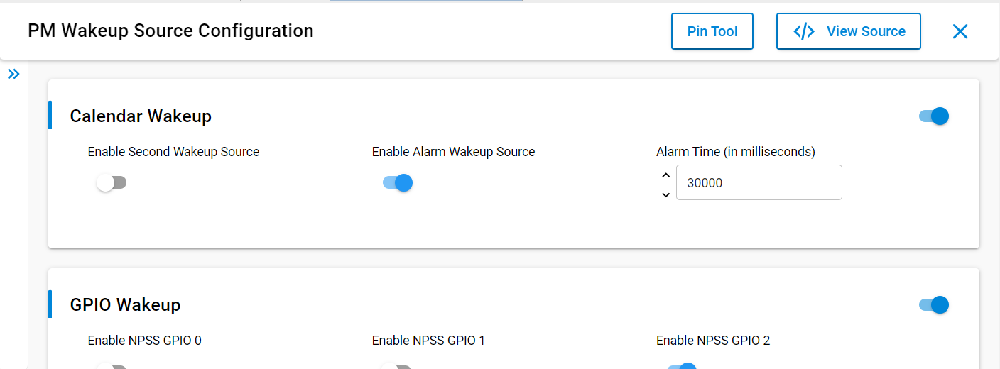

**NCP Mode**:

A timer is run with a periodicity of **PUBLISH_PERIODICITY** milliseconds. The application publishes **MQTT_publish_QOS0_PAYLOAD** message on **MQTT_TOPIC2** topic in the following cases:

- Once in every **PUBLISH_PERIODICITY** time period.
- When an incoming publish is received by the application.

**NOTE:** The bold texts are the macros defined in the application. You can find more details about them in the [Application Configuration Parameters](#application-configuration-parameters)

## Prerequisites / Setup Requirements

### Hardware Requirements

- A Windows PC
- USB-C cable
- A Wireless Access Point (which has an active internet access)
- Android Phone or iPhone with **Simplicity Connect App (formerly EFR Connect App)** App, which is available in Play Store and App Store.
- **Temperature Sensor Requirement**: Note that an external LM75 temperature sensor must be connected for the application to function correctly, as the WSDK/WPK board does not have a built-in sensor.
- **SoC Mode**:
  - Standalone
    - BRD4002A Wireless pro kit mainboard [SI-MB4002A](https://www.silabs.com/development-tools/wireless/wireless-pro-kit-mainboard?tab=overview)
    - Radio Boards
      - BRD4338A [SiWx917-RB4338A](https://www.silabs.com/development-tools/wireless/wi-fi/siwx917-rb4338a-wifi-6-bluetooth-le-soc-radio-board?tab=overview)
      - BRD4342A [SiWx917-RB4342A](https://www.silabs.com/development-tools/wireless/wi-fi/siwx91x-rb4342a-wifi-6-bluetooth-le-soc-radio-board?tab=overview)
      - BRD4339B [SiWx917-RB4339B](https://docs.silabs.com/wiseconnect/latest/wiseconnect-getting-started/getting-started-with-at)
      - BRD4340A [SiWx917-RB4340A](https://docs.silabs.com/wiseconnect/latest/wiseconnect-getting-started/getting-started-with-at)
      - BRD4343A [SiWx917-RB4343A](https://www.silabs.com/development-tools/wireless/wi-fi/siw917y-rb4343a-wi-fi-6-bluetooth-le-8mb-flash-radio-board-for-module?tab=overview)
      - BRD4343C [SiWx917-RB4343C](https://www.silabs.com/development-tools/wireless/wi-fi/siw917y-rb4343c-wi-fi-6-bluetooth-le-8mb-flash-radio-board-for-module?tab=overview)
    - Kits
      - SiWG917 Dev Kit [BRD2605A](https://www.silabs.com/development-tools/wireless/wi-fi/siwx917-dk2605a-wifi-6-bluetooth-le-soc-dev-kit?tab=overview)
      - SiWx917 Pro Kit [Si917-PK6031A](https://www.silabs.com/development-tools/wireless/wi-fi/siwx917-pro-kit?tab=overview)
      - SiWx917 Pro Kit [Si917-PK6032A]
      - SiWx917 AC1 Module Explorer Kit [BRD2708A](https://www.silabs.com/development-tools/wireless/wi-fi/siw917y-ek2708a-explorer-kit?tab=overview)

- **NCP Mode**:
  - Standalone
    - BRD4002A Wireless pro kit mainboard [SI-MB4002A](https://www.silabs.com/development-tools/wireless/wireless-pro-kit-mainboard?tab=overview)
    - EFR32xG24 Wireless 2.4 GHz +10 dBm Radio Board [xG24-RB4186C](https://www.silabs.com/development-tools/wireless/xg24-rb4186c-efr32xg24-wireless-gecko-radio-board?tab=overview)
    - NCP Expansion Kit with NCP Radio boards
      - [BRD4346A](https://www.silabs.com/development-tools/wireless/wi-fi/siwx917-rb4346a-wifi-6-bluetooth-le-soc-4mb-flash-radio-board?tab=overview) + [BRD8045A](https://www.silabs.com/development-tools/wireless/wi-fi/expansion-adapter-board-for-co-processor-radio-boards?tab=overview)
      - [BRD4357A](https://www.silabs.com/development-tools/wireless/wi-fi/siw917y-rb4357a-wi-fi-6-bluetooth-le-4mb-flash-radio-board-for-rcp-and-ncp-modules?tab=overview) + [BRD8045A](https://www.silabs.com/development-tools/wireless/wi-fi/expansion-adapter-board-for-co-processor-radio-boards?tab=overview)
      - [BRD4357C](https://www.silabs.com/development-tools/wireless/wi-fi/siw917y-rb4357c-wi-fi-6-bluetooth-le-4mb-flash-radio-board-for-rcp-and-ncp-modules?tab=overview) + [BRD8045A](https://www.silabs.com/development-tools/wireless/wi-fi/expansion-adapter-board-for-co-processor-radio-boards?tab=overview)
  - Interface and Host MCU Supported
    - SPI - EFR32 & STM32
    - UART - EFR32

#### Base Board Pin Configuration for I2C B0 Board(BRD4338A SOC Boards)

#### I2C

| PIN | ULP GPIO PIN               | Description                 |
| --- | -------------------------- | --------------------------- |
| SCL | ULP_GPIO_7 [EXP_HEADER-15] | Connect to Follower SCL pin |
| SDA | ULP_GPIO_6 [EXP_HEADER-16] | Connect to Follower SDA pin |

### Software Requirements

- Simplicity Studio
- Serial terminal for viewing the print [Tera term](https://tera-term.en.softonic.com/)
- Download and install the Silicon Labs [Simplicity Connect App(formerly EFR Connect App)](https://www.silabs.com/developers/simplicity-connect-mobile-app ) from Play store/App store.

### Setup Diagram

  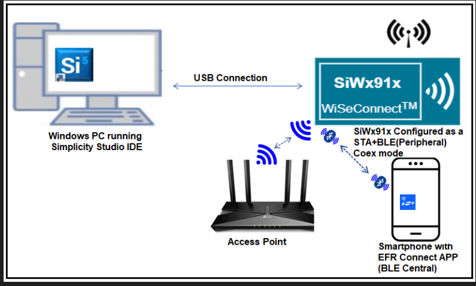

The diagram below illustrates the detailed flow of the application:

  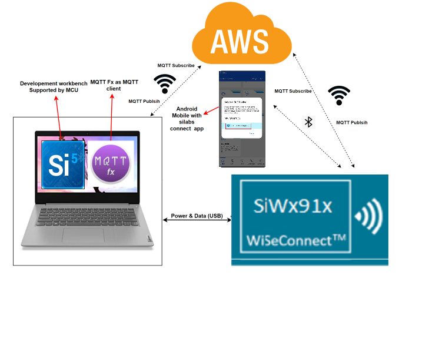

## Getting Started

The below instructions are provided in [Developing with Boards in SoC Mode]( https://docs.silabs.com/wiseconnect/latest/wiseconnect-developers-guide-developing-for-silabs-hosts/) to:

- Install Simplicity Studio and WiSeConnect extension
- Connect your device to the computer
- Upgrade your connectivity firmware
- Create a Studio project

For details on the project folder structure, see the [WiSeConnect Examples](https://docs.silabs.com/wiseconnect/latest/wiseconnect-examples/#example-folder-structure) page.

### Application Configuration Parameters

The application can be configured to suit your requirements and development environment. Read through the following sections and make any changes needed.

For SoC Mode only:

- I2C2 is utilized for communication with the temperature sensor.
- You can change the I2C instance in the Universal Configurator using the **I2C** component (i2c_instance). Enable only one instance (i2c0/i2c1/i2c2); the application auto-selects the enabled instance at build time.
- Following is the default configuration for I2C2 instance defined in the RTE_Device_917.h file (path: /$project/config/RTE_Device_917.h).

    ```c

    #define RTE_I2C2_SCL_PORT_ID 0

    #define RTE_I2C2_SDA_PORT_ID 0
    ```

 Open `wifi_app.c` file and update/modify the following macros:

   Modify the MQTT topics and give different names for both topics the SiWx917 is subscribed to: MQTT_TOPIC1 and publishing to MQTT_TOPIC2.
   MQTT web application is subscribed to `MQTT_TOPIC2` and publishing on `MQTT_TOPIC1`.

```c
#define MQTT_TOPIC1               "aws_status"   //! Subscribe topic to receive the message from cloud
#define MQTT_TOPIC2               "si91x_status" //! Publish topic to send the status from application to cloud
```

   **Note:** You can change the topic names, which are `aws_status` and `si91x_status`.

```c
#define ENABLE_NWP_POWER_SAVE         1                 //! Set this macro to 1 for enabling NWP power save.

#define PUBLISH_PERIODICITY       (30000)          // Configure this macro to publish data every 30 seconds (this works only in NCP with and without POWERSAVE and in SOC without POWERSAVE).
```

### Configuring the BLE Application

Open `ble_app.c` file and update/modify following macros:

- `RSI_BLE_CHAR_SERV_UUID` refers to the attribute type of the characteristics to be added in a service.

  ```c
  #define  RSI_BLE_CHAR_SERV_UUID                         0x2803
  ```

- `RSI_BLE_CLIENT_CHAR_UUID` refers to the attribute type of the client characteristics descriptor to be added in a service.

  ```c
  #define RSI_BLE_CLIENT_CHAR_UUID                        0x2902
  ```

- `RSI_BLE_NEW_SERVICE_UUID` refers to the attribute value of the newly created service.

  ```c
  #define  RSI_BLE_NEW_SERVICE_UUID                       0xAABB
  ```

- `RSI_BLE_ATTRIBUTE_1_UUID` refers to the attribute type of the first attribute under this service (RSI_BLE_NEW_SERVICE_UUID).

  ```c
  #define  RSI_BLE_ATTRIBUTE_1_UUID                        0x1AA1
  ```
  
- `RSI_BLE_ATTRIBUTE_2_UUID` refers to the attribute type of the second attribute under this service (RSI_BLE_NEW_SERVICE_UUID).

  ```c
  #define RSI_BLE_ATTRIBUTE_2_UUID                         0x1BB1
  ```

- `RSI_BLE_ATTRIBUTE_3_UUID` refers to the attribute type of the third attribute under this service (RSI_BLE_NEW_SERVICE_UUID).

   ```c
   #define RSI_BLE_ATTRIBUTE_3_UUID                         0x1CC1
   ```

- `RSI_BLE_MAX_DATA_LEN` refers to the Maximum length of the attribute data.

   ```c
   #define RSI_BLE_MAX_DATA_LEN                               20
   ```

The following are the **non-configurable** macros in the application.

- `RSI_BLE_APP_DEVICE_NAME` refers to the name of the Silicon Labs device to appear during scanning by remote devices. Use the same name as mentioned.

   ```c
   #define  RSI_BLE_APP_DEVICE_NAME               "BLE_CONFIGURATOR"
   ```

- `RSI_BLE_ATT_PROPERTY_READ` is used to set the READ property to an attribute value.

   ```c
   #define  RSI_BLE_ATT_PROPERTY_READ                    0x02
   ```

- `RSI_BLE_ATT_PROPERTY_WRITE` is used to set the WRITE property to an attribute value.

   ```c
   #define RSI_BLE_ATT_PROPERTY_WRITE                       0x08
   ```

- `RSI_BLE_ATT_PROPERTY_NOTIFY` is used to set the NOTIFY property to an attribute value.

  ```c
  #define  RSI_BLE_ATT_PROPERTY_NOTIFY                      0x10
  ```

**Note:**

- By default, values are configured as shown above.

### Configure the following parameters in `aws_iot_config.h` file present at `<project>/config`

Before configuring the parameters in `aws_iot_config.h`, register the SiWx917 device in the AWS IoT registry by performing the steps mentioned in the [Create an AWS Thing](#create-an-aws-thing) section.

Configure AWS_IOT_MQTT_HOST macro with the device data endpoint to connect to AWS. To get the device data endpoint in the AWS IoT Console, navigate to Settings, copy the Endpoint, and define the AWS_IOT_MQTT_HOST macro with this value.

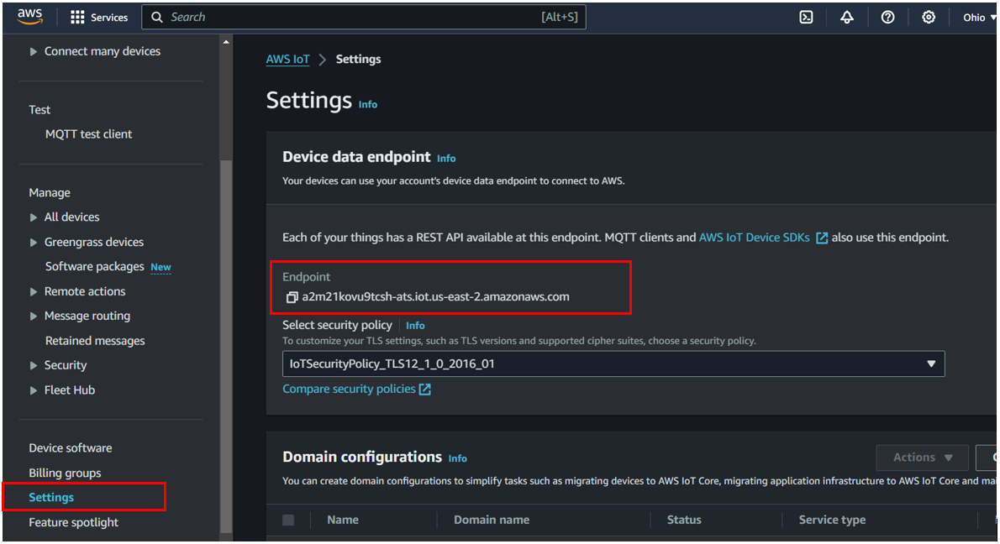

 ```c
   //AWS Host name 
   #define AWS_IOT_MQTT_HOST          "a2m21kovu9tcsh-ats.iot.us-east-2.amazonaws.com"  

   //default port for MQTT
   #define AWS_IOT_MQTT_PORT          "8883"
   
   #define AWS_IOT_MQTT_CLIENT_ID     "silicon_labs_thing"
   
   // Thing Name of the Shadow this device is associated with 
   #define AWS_IOT_MY_THING_NAME      "silicon_labs_thing"    
```

To authenticate and securely connect with AWS, the SiWx917 device requires a unique x.509 security certificate and private key, as well as a CA certificate. At this point, you must have a device certificate, private key, and CA certificate, which are downloaded during the creation/registration of AWS Thing.

By default, the device certificate and private key that are downloaded from the AWS are in [.pem format](https://en.wikipedia.org/wiki/Privacy-Enhanced_Mail). To load the device certificate and private key to the SiWx917, the device certificate and private key should be converted into a C-array. For converting the certificates and private key into a C-array, refer to [Setting up Security Certificates](#setting-up-security-certificates).

By default, the WiSeConnect SDK contains the Starfield Root CA Certificate in C-array format.

> **Note** :
 The included Cloud connectivity certificates are for reference only. If using default certificates in the release, the cloud connection will not work. You must replace the default certificates with valid certificates while connecting to the appropriate Cloud/OpenSSL Server.

> **Note**: For recommended settings, please refer the [recommendations guide](https://docs.silabs.com/wiseconnect/latest/wiseconnect-developers-guide-prog-recommended-settings/).

## Test the Application

The followng instructions are provided in [here](https://docs.silabs.com/wiseconnect/latest/wiseconnect-developers-guide-developing-for-silabs-hosts/) to:

- Build the application.
- Flash, run, and debug the application.

Perform the following steps for successful execution of the application:

1. Configure the access point in OPEN/WPA-PSK/WPA2-PSK/WPA3 mode to connect the SiWx917 in STA mode.

2. Connect any serial console for prints.

3. When the SiWx917 EVK enters BLE advertising mode, launch the **Simplicity Connect App (formerly EFR Connect App)**.

4. Click **Demo** and select **Wi-Fi Commissioning over BLE**.

   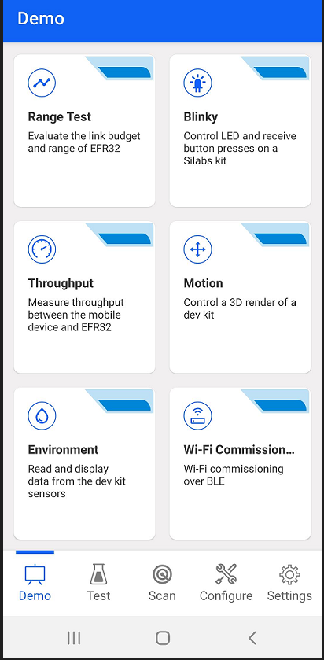

5. It will scan for the module, and it appears as `BLE_CONFIGURATOR` on the UI. Select as shown in the image.

   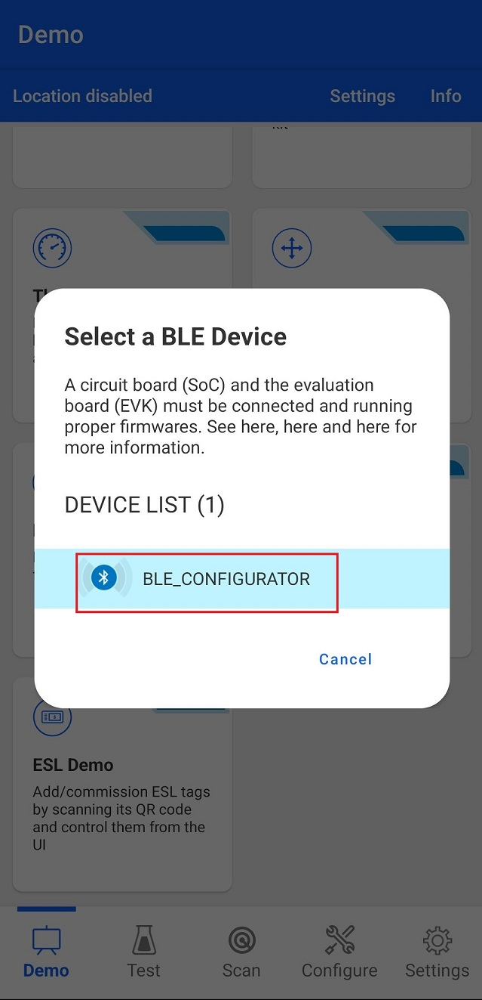

  The SiWx917 module starts as a station and scan for the nearby access points (AP).

7. After the list of AP scan results is displayed on the screen, you can select the SSID of the AP to which you want to connect.

   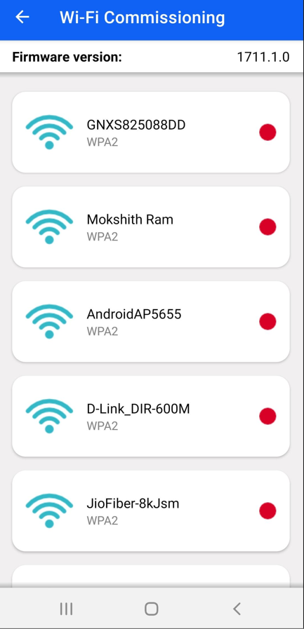

8. Click the SSID of the AP, enter a password if the AP is in security mode. Click on connect to associate with the access point.

   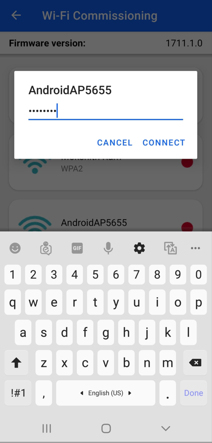

9. After the Silicon Labs module is connected to the access point, you can see it on the GUI, as shown in the image.

   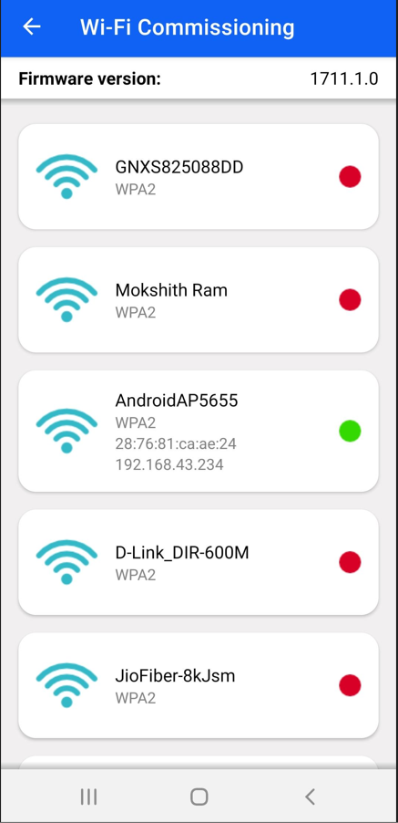

10. This completes the BLE provisioning using Android application. The next step is the [MQTT Connection](#mqtt-connection). If **`SL_BLE_DYNAMIC_ENABLE_DISABLE_DEMO`** is **1** in **`wifi_config.h`**, do additional serial activity (BLE disable, 16k TLS demo, reconnect) before MQTT. See [Runtime sequence when enabled](#runtime-sequence-when-enabled) and [Example serial output (macro = 1)](#example-serial-output-macro--1).

11. To disconnect from the access point, select the connected AP and click **YES**.

    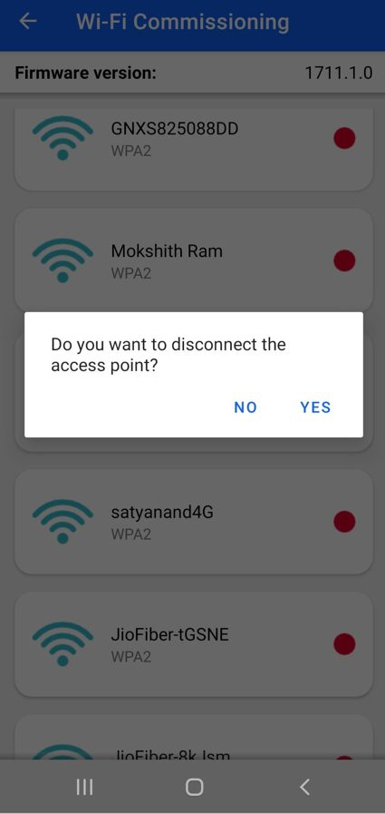

### Application Output

  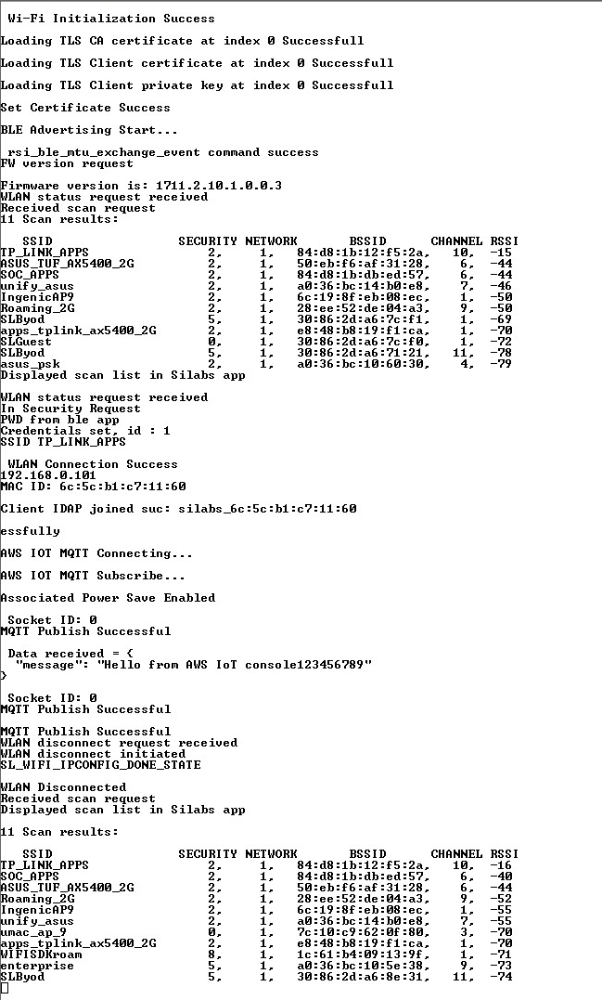

  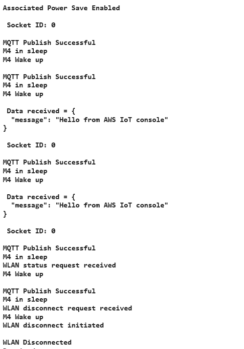

#### When I2C_SENSOR_PERI_ENABLE macro enabled

  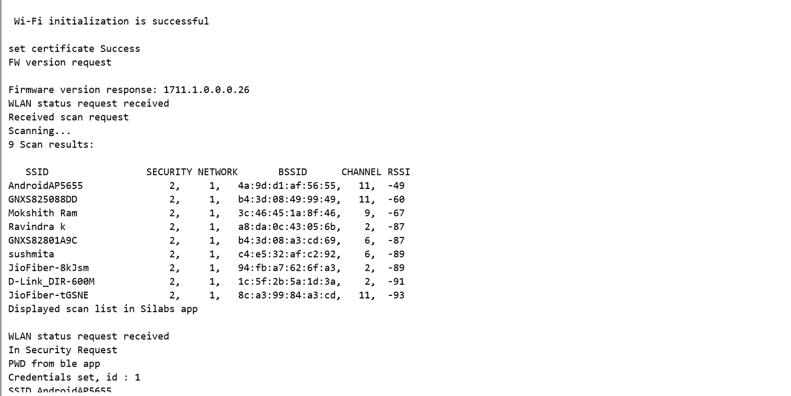

  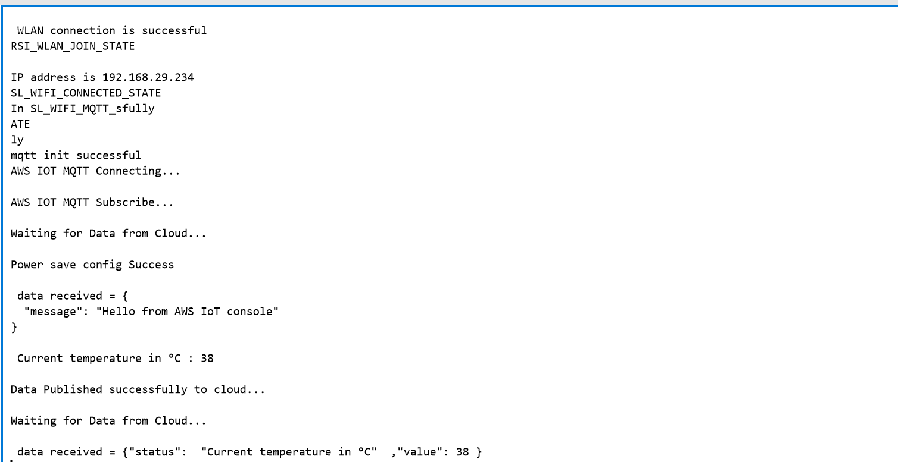

  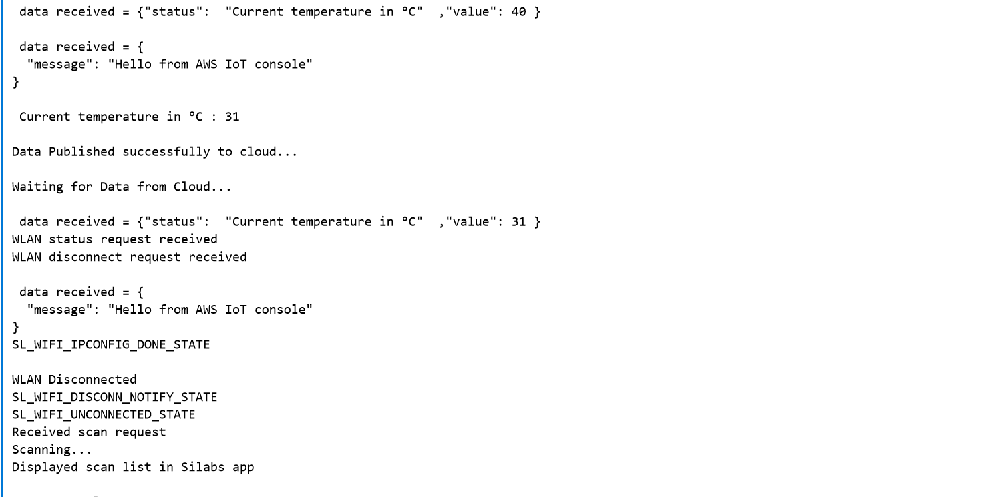

**Note:**

- To learn more about aws mqtt APIs error codes, refer to the `aws_iot_error.h` file present in the `<SDK>\third_party\aws_sdk\include\`.
- If the user is calling and experiencing long wait times, and if no data is received, it recommended to keep sending the keepalive packets to maintain the connection.
  
### MQTT Connection

- After successfully connecting to Wi-Fi (and completing the optional dynamic BLE / 16k SSL segment when **`SL_BLE_DYNAMIC_ENABLE_DISABLE_DEMO`** is **1**), the application establishes a connection to AWS IoT Core. It subscribes to **`MQTT_TOPIC1`** (`aws_status`) and publishes on **`MQTT_TOPIC2`** (`si91x_status`). The application then waits to receive data published on the subscribed topic from the cloud.

- You can use any MQTT client to connect to the AWS IoT cloud for subscribing and publishing messages.

  1. Go to the  [AWS IoT console](https://console.aws.amazon.com/iot/home). In the navigation pane, under Manage, choose All devices, and then choose Things.

  2. Click on the thing you have created. Go to activity as shown in the image. Click **MQTT test client** as shown in the image.

     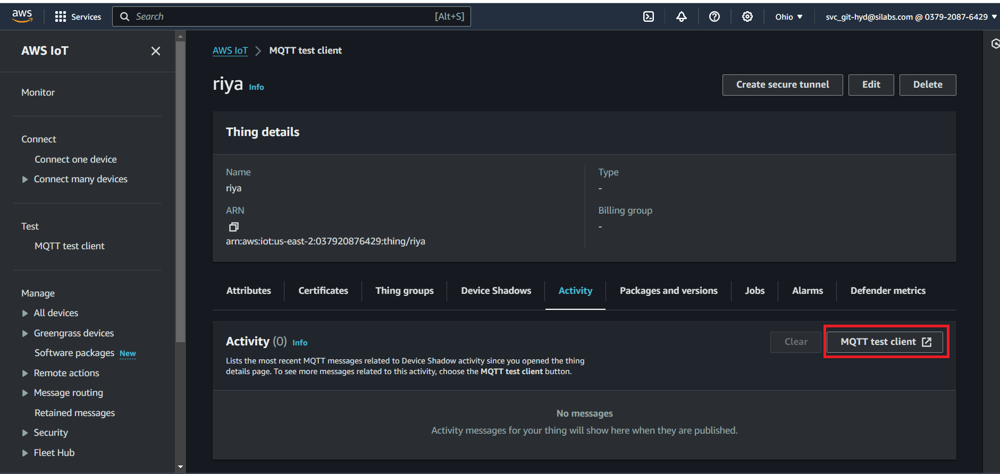

  3. Then subscribe to a topic that is configured in the application, provide the name of the topic, and click **Subscribe** as shown in the image. You can see the published data from the device.

     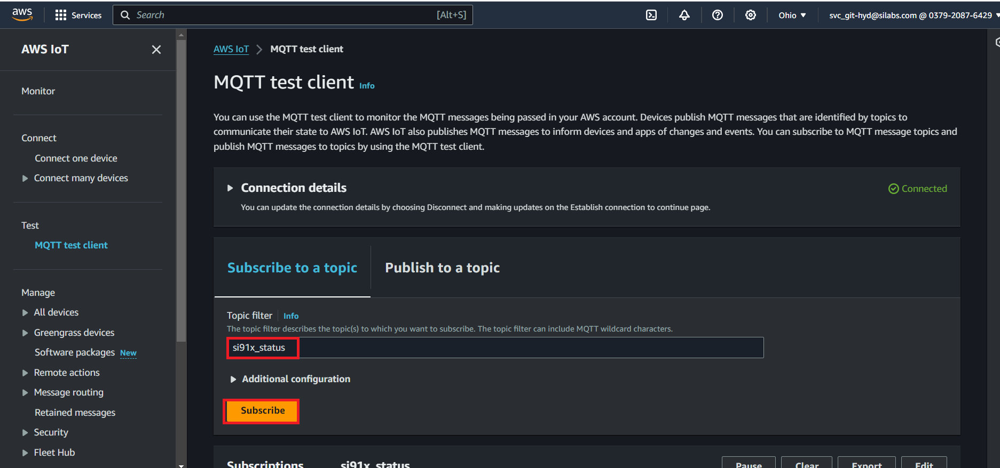

     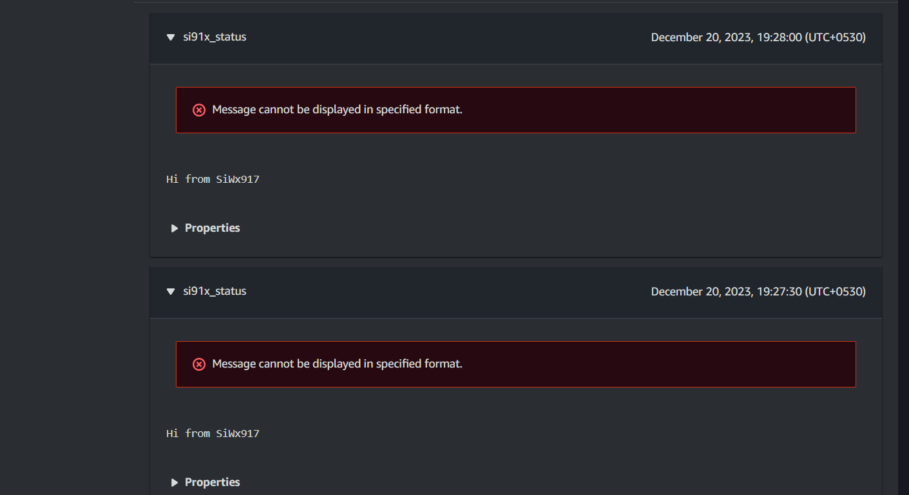

  4. To publish data from AWS, enter the name of the topic configured in the application and write the data at Message payload as shown in the image, and then click **Publish**.

     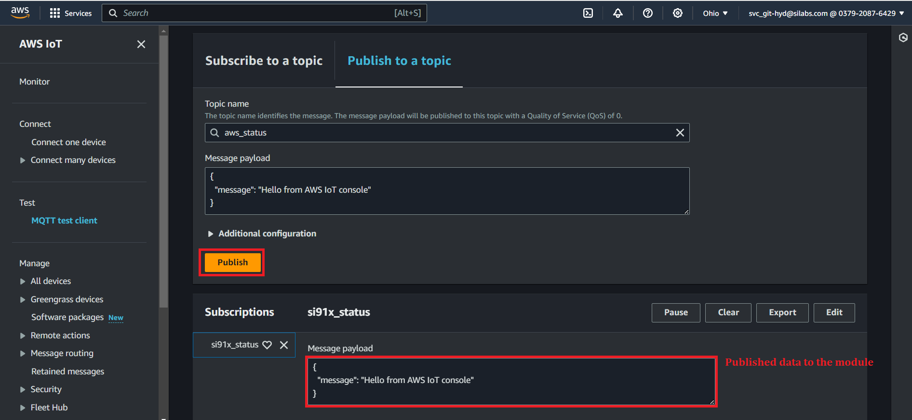

## Additional Information

### Current Measurement using Simplicity Studio Energy Profiler

To use Simplicity Studio Energy Profiler for current measurements, complete the following steps.
  
After flashing the application code to the module, the energy profiler can be used for current consumption measurements.

1. From tools, choose Energy Profiler and click **OK**.

   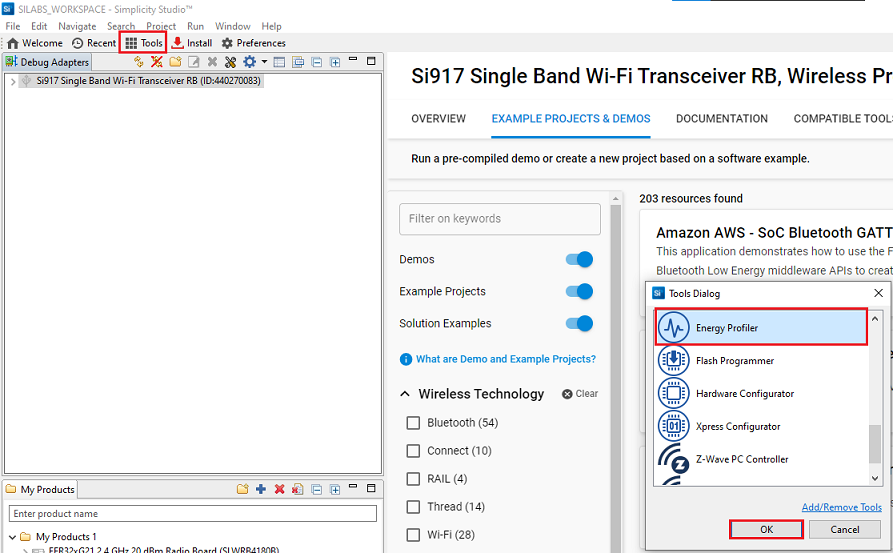

2. From Quick Access, choose **Start Energy Capture** option.

   

   **Note**

    - The measured current may vary if the scenario is performed in an open environment. Variation in different access points is also observed.
    - To achieve the lowest power numbers in connected sleep, in SoC mode, configure mem_config to
  `MEMORY_MCU_ADVANCED_WIRELESS_BASIC` in software components and M4 to without RAM retention, i.e., `sl_si91x_configure_ram_retention` should not be done.

- Average current consumption measured in energy profiler.

  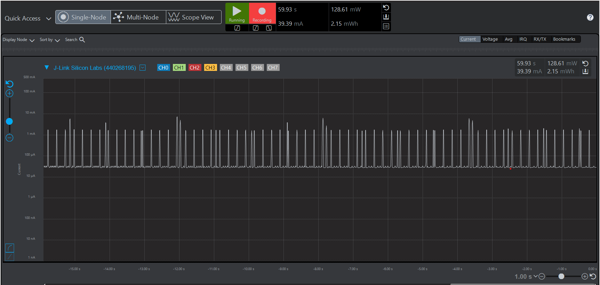

**Note**

For NCP mode, following defines have to enabled manually in preprocessor setting of example project.

- For 917A0 expansion board, enable SLI_SI917 = 1
- For 917B0 1.2 expansion board, enable SLI_SI917 = 1, SLI_SI917B0 = 1
- For 917B0 2.0 expansion board, enable SLI_SI917 = 1, SLI_SI917B0 = 1, SLI_SI91X_MCU_CONFIG_RADIO_BOARD_VER2 = 1 (This is enabled by default for all examples)  

### Setting up Security Certificates

- The WiSeConnect SDK provides a conversion script (written in Python 3) to make the conversion straightforward. The script is provided in the SDK `<SDK>/resources/scripts` directory and is called [certificate_to_array.py](https://github.com/SiliconLabs/wiseconnect/tree/v4.1.1-content-for-docs/resources/certificates/).

- Copy the downloaded device certificate, private key from AWS, and also the certificate_to_array.py to the `<SDK>/resources/certificates`.

- To convert the device certificate and private key to C arrays, open a system command prompt in the same path and give the following commands.

  ```sh
  $> python3 certificate_to_array.py <input filename> <output arrayname>

  For example:
  $> python3 certificate_to_array.py d8f3a44d3f.pem.crt aws_client_certificate.pem
  $> python3 certificate_to_array.py d8f3a44d3f.pem.key aws_client_private_key.pem
  ```

- After running the above commands, two new files are created as follows:

   ```sh
   aws_client_certificate.pem.crt.h
   aws_client_private_key.pem.key.h
   ```

- After converting the device certificate and private key to C - array, it is essential to include the device certificate: `aws_client_certificate.pem.crt.h` and private key: `aws_client_private_key.pem.key.h` in the `<SDK>/resources/certificates` folder.

- Ensure to load the device certificate and private key to SiWx917 using [sl_net_set_credential()](https://docs.silabs.com/wiseconnect/latest/wiseconnect-api-reference-guide-nwk-mgmt/net-credential-functions#sl-net-set-credential) API.

   ```c
   status = sl_net_set_credential(SL_NET_TLS_SERVER_CREDENTIAL_ID(0), SL_NET_CERTIFICATE, aws_client_certificate, (sizeof(aws_client_certificate) - 1));
  
   status = sl_net_set_credential(SL_NET_TLS_SERVER_CREDENTIAL_ID(0), SL_NET_PRIVATE_KEY, aws_client_private_key, (sizeof(aws_client_private_key) - 1));
   ```

- Ensure to update the certificate names in the **IoT_Client_Init_Params** structure before calling the **aws_iot_mqtt_init()** API.

- The Starfield Root CA certificate used by your Wi-Fi device to verify the AWS server is already included in the WiSeConnect SDK at `<SDK>/resources/certificates`; no additional setup is required.

  > **Note**
  > Support for the SNI extension has been added to the AWS SDK, ensuring it is set by the client when connecting to an AWS server using TLS 1.3. This is handled internally by the AWS SDK and does not affect compatibility with other TLS versions.

  > **Note**
  > Amazon uses [Starfield Technologies](https://www.starfieldtech.com/) to secure the AWS website, the WiSeConnect SDK includes the [Starfield CA Certificate](https://github.com/SiliconLabs/wiseconnect/tree/v4.1.1-content-for-docs/resources/certificates/aws_starfield_ca.pem.h).
  >
  > AWS has announced that there will be changes in their root CA chain. More details can be found in the reference link: [here](https://aws.amazon.com/blogs/security/acm-will-no-longer-cross-sign-certificates-with-starfield-class-2-starting-august-2024/)
  >
  > We are providing both root CAs (Starfield class-2 and Starfield G2) in aws_starfield_ca.pem.h, which is located in the WiSeConnect directory `<SDK>/resources/certificates/aws_starfield_ca.pem.h`
  >
  > For AWS connectivity, StarField Root CA certificate has the highest authority being at the top of the signing hierarchy.
  >
  > The StarField Root CA certificate is an expected/required certificate which usually comes pre-installed in the operating systems and plays a key part in certificate chain verification when a device is performing TLS authentication with the IoT endpoint.
  >
  > On a SiWx91x device, we do not maintain the root CA trust repository due to memory constraints, so it is mandatory to load Starfield Root CA certificate for successful mutual authentication to the AWS server.
  >
  > The certificate chain sent by AWS server:
  > **Starfield Class 2**:
  > id-at-commonName=Amazon,RSA 2048 M01,id-at-organizationName=Amazon,id-at-countryName=US
  > id-at-commonName=Amazon Root CA 1,id-at-organizationName=Amazon,id-at-countryName=US
  > id-at-commonName=Starfield Services Root Certificate Authority - G2,id-at-organizationName=Starfield Technologies, Inc.,id-at-localityName=Scottsdale,id-at- stateOrProvinceName=Arizona,id-at-countryName=US
  >id-at-organizationalUnitName=Starfield Class 2 Certification Authority,id-at-organizationName=Starfield Technologies, Inc.,id-at-countryName=US
  >
  > **Starfield G2**:
  > id-at-commonName=Amazon RSA 2048 M01,id-at-organizationName=Amazon,id-at-countryName=US
  > id-at-commonName=Amazon Root CA 1,id-at-organizationName=Amazon,id-at-countryName=US
  > id-at-commonName=Starfield Services Root Certificate Authority - G2,id-at-organizationName=Starfield Technologies, Inc.,id-at-localityName=Scottsdale,id-at-stateOrProvinceName=Arizona,id-at-countryName=US
  >
  > To authenticate the AWS server on SiWx91x, first validate the Root CA (validate the Root CA received with the Root CA loaded on the device). Once the Root CA validation is successful, other certificates sent from the AWS server are validated.
  > Alternate certification chains support is added. With this, as opposed to requiring full chain validation, only the peer certificate must validate to a trusted certificate. This allows loading intermediate root CA's as trusted.
  > The default CA certificate is the Starfield Combined CA certificate. To use the Intermediate Amazon Root CA 1 certificate, define the `SL_SI91X_AWS_IOT_ROOT_CA1` macro in the application.

### Create an AWS Thing

Create a thing in the AWS IoT registry to represent your IoT device.

1. In the [AWS IoT console](https://console.aws.amazon.com/iot/home), in the navigation pane, under **Manage**, choose **All devices**, and then choose **Things**.

   

2. If **No things** message is displayed, click **Create things**.

   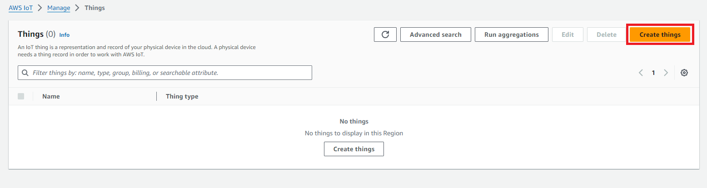

3. On the **Create things** page, select **Create single thing** and click **Next**.

   

4. On the **Specify thing properties** page, enter a name for your IoT thing (for example, **Test_IoT**), and choose **Unnamed shadow (classic)** in the Device Shadow section, then choose **Next**. You cannot change the name of a thing after you create it. To change a thing's name, you must create a new thing, give it a new name, and then delete the old thing.

   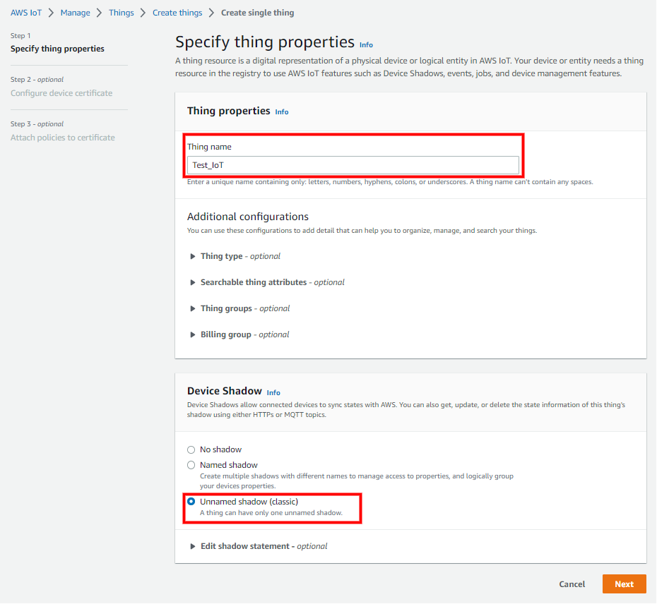

5. During **Configure device certificate** step, select **Auto-generate a new certificate (recommended)**, and then click **Next**.

   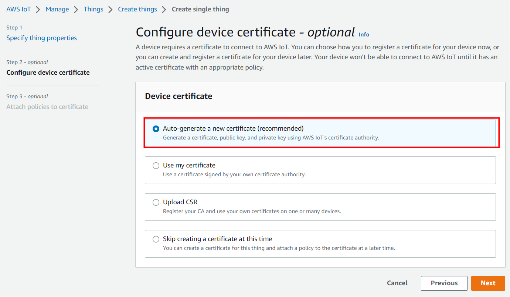

6. Attach the policy to the thing created.

   - If you have an existing policy, attach it and click on create thing.

     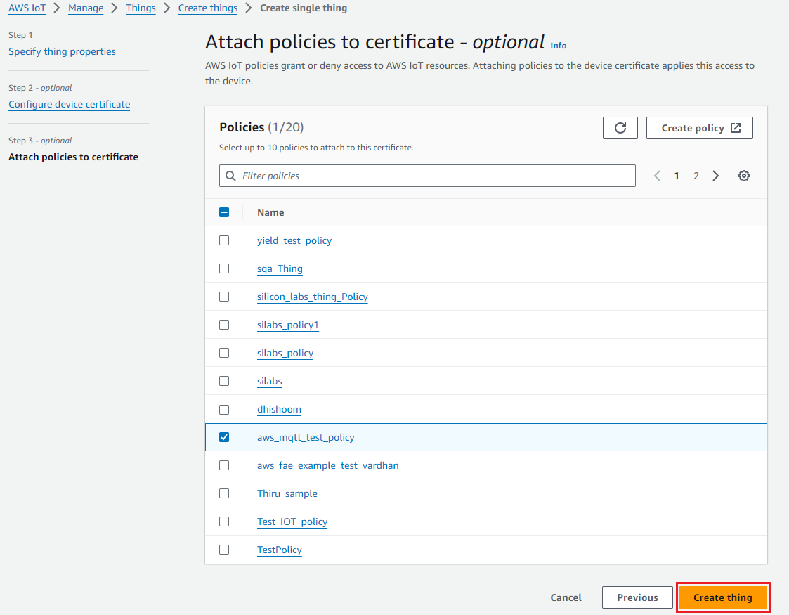

   - If policy is not yet created, follow the steps below.
  
     1. Select **Create policy** and fill the fields as per your requirements.

         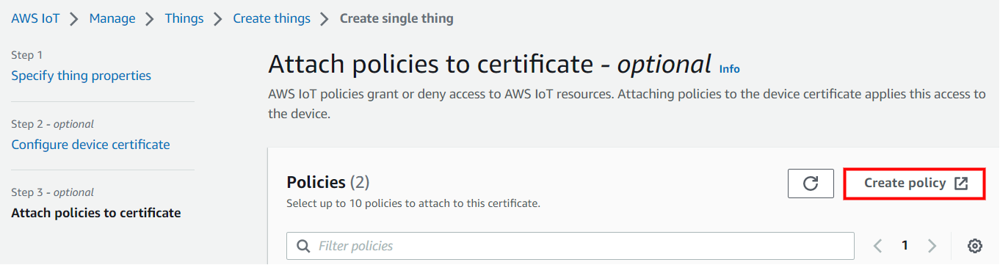

     2. Enter a **Name** for your Policy. Fill in the **Action** and **Resource ARN** fields as shown in the image below. Click **Allow** under **Effect**, and thn click **Create**.

        

     3. Select the created policy and click on **Create thing**.

7. Choose the **Download** links to download the device certificate and private key. Note that Root CA certificate is already present in the SDK (aws_starfield_ca.pem.h), and can be directly used.
  
    >**Warning:** This is the only instance you can download your device certificate and private key. Make sure to save them securely.

    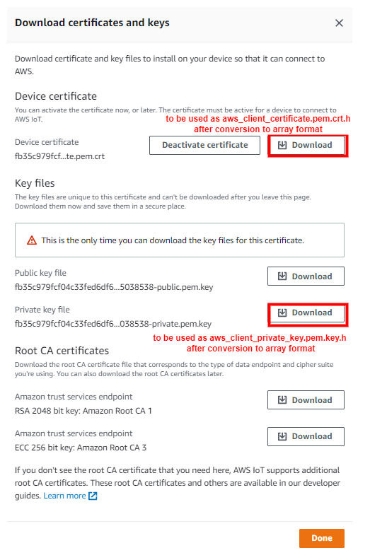

8. Click **Done**.

   The created thing should now be visible on the AWS console (**Manage > All devices > Things**).

## Optional: Dynamic BLE Enable/Disable and 16k SSL Demo

This section documents the **optional** code path compiled when **`SL_BLE_DYNAMIC_ENABLE_DISABLE_DEMO`** is **1** in **`wifi_config.h`**. The **default** in this example tree is **0**: standard BLE provisioning, then MQTT, with no runtime BLE stack disable/enable.

When you set the macro to **1**, edit **`SSL_16K_DEMO_SERVER_IP`**, **`SSL_16K_DEMO_SERVER_PORT_1`**, and **`SSL_16K_DEMO_SERVER_PORT_2`** in **`wifi_config.h`** so they match the host and ports where you run the **two** OpenSSL **`s_server`** listeners ([Lab TLS server](#lab-tls-server-openssl-example)). The values shipped in-tree are **placeholders** (example IP **`192.168.0.100`**, ports **4443** / **4444**); they will not work until aligned with your lab PC or appliance.

### Overview

**Simplicity Connect mobile app:** Initial Wi‑Fi provisioning over BLE uses the **Simplicity Connect App** (formerly EFR Connect App) and the **Wi‑Fi Commissioning over BLE** demo, as described in [Test the Application](#test-the-application). That flow is unchanged when **`SL_BLE_DYNAMIC_ENABLE_DISABLE_DEMO`** is **0** or **1**. The optional dynamic segment runs **automatically in firmware after DHCP**; it is **not** triggered by MQTT data and does **not** require the mobile app during BLE disable, the 16k SSL lab demo, BLE enable, or Wi‑Fi reconnect.

**16k SSL record demo:** A **lab-only** step that validates TLS using a **16 KB SSL record** size. When the macro is **1**, **`app.c`** ORs **`SL_SI91X_EXT_TCP_IP_SSL_16K_RECORD`** into the boot **`ext_tcp_ip_feature_bit_map`** so the network stack can use 16k-record TLS. After BLE is disabled, **`wifi_app_ssl_16k_demo()`** opens **two** TLS 1.2 TCP clients to **`SSL_16K_DEMO_SERVER_IP`** on **`SSL_16K_DEMO_SERVER_PORT_1`** and **`SSL_16K_DEMO_SERVER_PORT_2`** (OpenSSL **`s_server`** listeners on a lab PC). This is separate from AWS MQTT TLS.

| `SL_BLE_DYNAMIC_ENABLE_DISABLE_DEMO` | Behavior summary |
|--------------------------------------|------------------|
| **0** (default) | After DHCP, the Wi‑Fi task proceeds to **MQTT** immediately. **`rsi_wlan_mqtt_certs_init()`** calls **`load_certificates_in_flash()`** at boot. No FreeRTOS message queues for BLE disable/enable, no **`WIFI_APP_BLE_ENABLE_REQUEST`**, and **`SL_SI91X_EXT_TCP_IP_SSL_16K_RECORD`** is not added to boot **`ext_tcp_ip_feature_bit_map`**. |
| **1** | After first DHCP success, the firmware runs the [runtime sequence](#runtime-sequence-when-enabled) below (BLE quiesce → disable → 16k SSL demo → station disconnect → BLE enable → Wi‑Fi reconnect → AWS cert load), then starts **MQTT**. Failures skip MQTT and use the [disconnected path](#failure-behavior-and-disconnected-path). |

### Return Codes for Runtime BLE Enable and Disable (SDK)

The WiseConnect stack tracks BLE runtime enable state (initialized from the Wi‑Fi/BLE coex opermode during driver init and updated after successful **`rsi_ble_enable()`** / **`rsi_ble_disable()`**). Those APIs perform an internal state check before sending a firmware command, so application code does **not** need to call **`rsi_ble_state_is_enabled()`** explicitly for a redundant call to be skipped.

- **`rsi_ble_enable()`** — On success, BLE will be enabled. Otherwise, the API might return **`RSI_ERROR_COMMAND_GIVEN_IN_WRONG_STATE`** (BLE **already enabled**, no command sent) or **`SL_STATUS_NOT_INITIALIZED`** if the device or driver is not initialized.
- **`rsi_ble_disable()`** — On success, BLE will be disabled. Otherwise, the API might return **`RSI_ERROR_COMMAND_GIVEN_IN_WRONG_STATE`** (BLE **already disabled**, no command sent) or **`SL_STATUS_NOT_INITIALIZED`**.

**Queues:** **`ble_enable_done_queue`** and **`ble_disable_done_queue`** carry the **`int32_t`** return value from **`app_ble_enable()`** / **`app_ble_disable()`** (wrappers around the APIs above). A **`RSI_ERROR_COMMAND_GIVEN_IN_WRONG_STATE`** result therefore reaches the Wi‑Fi task as **non-success** even when the firmware was already in the desired state (idempotent no-op). This example treats any non-success from those queues as a **failed** step for MQTT or disconnect recovery; product code may map **`RSI_ERROR_COMMAND_GIVEN_IN_WRONG_STATE`** to success when the goal is only “ensure enabled” or “ensure disabled.”

**Other BLE commands** may return **`RSI_ERROR_COMMAND_GIVEN_IN_WRONG_STATE`** if issued while the stack believes BLE is **disabled**.

### Build-time Configuration

| Component | File | Purpose / setting |
|-----------|------|-------------------|
| **`SL_BLE_DYNAMIC_ENABLE_DISABLE_DEMO`** | **`wifi_config.h`** | **1** = compile in dynamic BLE + 16k SSL path; **0** = standard provision → MQTT only. |
| **`SSL_16K_DEMO_SERVER_IP`** | **`wifi_config.h`** | IPv4 string for the lab TLS host (both **`connect()`** calls); default placeholder — set to the machine running OpenSSL (see [Lab TLS server](#lab-tls-server-openssl-example)). |
| **`SSL_16K_DEMO_SERVER_PORT_1`** | **`wifi_config.h`** | First TCP/TLS port; must match first **`openssl s_server -accept`** listener. |
| **`SSL_16K_DEMO_SERVER_PORT_2`** | **`wifi_config.h`** | Second TCP/TLS port; must match second **`openssl s_server -accept`** listener. |
| **`SL_SI91X_EXT_TCP_IP_SSL_16K_RECORD`** | **`app.c`** | OR'd into **`ext_tcp_ip_feature_bit_map`** only when **`SL_BLE_DYNAMIC_ENABLE_DISABLE_DEMO`** is **1**; enables 16k-record TLS for **`wifi_app_ssl_16k_demo()`**. |
| **`ble_disable_done_queue`** | **`app.c`** | **`osMessageQueueNew(1, sizeof(int32_t), NULL)`** in **`rsi_wlan_ble_app_init()`** when macro **1**. |
| **`ble_enable_done_queue`** | **`app.c`** | Same creation pattern as **`ble_disable_done_queue`**. |
| **`extern ble_disable_done_queue`** | **`wifi_config.h`** | Shared **`osMessageQueueId_t`** for **`wifi_app.c`** / **`ble_app.c`** when macro **1**. |
| **`extern ble_enable_done_queue`** | **`wifi_config.h`** | Same. |
| **`extern void rsi_wlan_init_wifi(void)`** | **`wifi_config.h`** / **`app.c`** | Optional **`sl_wifi_init`** wrapper when macro **1**; reconnect path does not call it today. |
| **`rsi_wlan_mqtt_certs_init()`** (no early AWS load) | **`wifi_app.c`** | When macro **1**, omits **`load_certificates_in_flash()`** at boot; still calls **`rsi_wlan_app_callbacks_init()`**. |
| **Demo CA `cacert` load** | **`wifi_app.c`** | **`sl_net_set_credential(SL_NET_TLS_SERVER_CREDENTIAL_ID(0), SL_NET_SIGNING_CERTIFICATE, cacert, ...)`** before **`wifi_app_ssl_16k_demo()`** when macro **1**. |
| **`load_certificates_in_flash()`** (post-reconnect) | **`wifi_app.c`** | After **`wifi_app_init_and_reconnect()`** succeeds in **`WIFI_APP_IPCONFIG_DONE_STATE`**; loads AWS Starfield CA, client cert, private key at index **0**. |

### Lab TLS Server (OpenSSL example)

The 16k SSL demo opens **two** TLS 1.2 TCP **clients** on the same host (**`SSL_16K_DEMO_SERVER_IP`**) to **two different ports** (**`SSL_16K_DEMO_SERVER_PORT_1`** and **`SSL_16K_DEMO_SERVER_PORT_2`** in **`wifi_config.h`**). You must have **two separate TLS listeners** on the PC or appliance that runs OpenSSL—one process (one listening socket) per port.

Reference **server** PEM files (same convention as other WiseConnect TLS examples, e.g., **tls_client**, **three_ssl_concurrent_client_sockets**): use **`/<SDK>/resources/certificates/server-cert.pem`** and **`/<SDK>/resources/certificates/server-key.pem`**. Copy them to the directory from which you run **`openssl`**, pass full paths on **`-cert`** / **`-key`**, or copy them next to **`openssl.exe`** on Windows as those readmes describe.

Use the same command shape for each listener; only **`-accept <port>`** (and optionally cert/key paths) changes between the two:

```text
openssl s_server -accept <port> -cert <server-cert.pem> -key <server-key.pem> -tls1_2
```

Example for the default snippet ports **4443** and **4444** (run in **two** terminals, both reachable at **`SSL_16K_DEMO_SERVER_IP`**):

```sh
openssl s_server -accept 4443 -cert server-cert.pem -key server-key.pem -tls1_2
openssl s_server -accept 4444 -cert server-cert.pem -key server-key.pem -tls1_2
```

The sample you start from is the same structure with **`-accept 4444`**; duplicate that line for the second port (**`-accept 4443`**, or whatever you set for **`SSL_16K_DEMO_SERVER_PORT_1`** / **`SSL_16K_DEMO_SERVER_PORT_2`**). Use a server certificate chain that matches the demo signing CA (**`cacert`**) loaded on the device for the 16k demo, or adjust **`cacert`** / server material so verification succeeds.

### Data Structures, Queues, and Wi-Fi/BLE IPC

**`rsi_app_cmd_t` values (Wi‑Fi → BLE mailbox)**

| Constant | Value | File | Role |
|----------|-------|------|------|
| **`WIFI_APP_DATA`** | **0** | **`wifi_config.h`** | Payload data to BLE (unchanged). |
| **`WIFI_APP_SCAN_RESP`** | **1** | **`wifi_config.h`** | Scan results to BLE (unchanged). |
| **`WIFI_APP_CONNECTION_STATUS`** | **2** | **`wifi_config.h`** | After DHCP; BLE join path → quiesce → **`rsi_ble_disable`** when macro **1**. |
| **`WIFI_APP_DISCONNECTION_STATUS`** | **3** | **`wifi_config.h`** | WLAN disconnect status to BLE (unchanged). |
| **`WIFI_APP_DISCONNECTION_NOTIFY`** | **4** | **`wifi_config.h`** | Notify BLE / reprovision path (unchanged). |
| **`WIFI_APP_TIMEOUT_NOTIFY`** | **5** | **`wifi_config.h`** | Timeout notify (unchanged). |
| **`WIFI_APP_BLE_ENABLE_REQUEST`** | **6** | **`wifi_config.h`** | Compiled only when macro **1**; Wi‑Fi requests **`rsi_ble_enable()`**. |

| Component | File | Role |
|-----------|------|------|
| **`wifi_app_send_to_ble()`** | **`wifi_app.c`** | Sends **`rsi_app_cmd_t`** + optional payload to the BLE task mailbox. |

**RTOS queues**

| Component | Type | Defined | Declared | Depth | Element | Producer | Consumer |
|-----------|------|---------|----------|-------|---------|----------|----------|
| **`ble_disable_done_queue`** | **`osMessageQueueId_t`** | **`app.c`** (**`rsi_wlan_ble_app_init`**) | **`extern`** in **`wifi_config.h`** | **1** | **`int32_t`** status (e.g. **`RSI_SUCCESS`**, **`RSI_ERROR_COMMAND_GIVEN_IN_WRONG_STATE`**, **`SL_STATUS_NOT_INITIALIZED`**) | BLE **`osMessageQueuePut`** | Wi‑Fi **`osMessageQueueGet(..., osWaitForever)`** |
| **`ble_enable_done_queue`** | **`osMessageQueueId_t`** | **`app.c`** | **`extern`** in **`wifi_config.h`** | **1** | **`int32_t`** status (same family as disable queue) | BLE **`osMessageQueuePut`** | Wi‑Fi **`osMessageQueueGet(..., osWaitForever)`** |

**BLE internal event (when macro is 1)**

| Component | Value | File | Role |
|-----------|-------|------|------|
| **`RSI_BLE_ENABLE_REQUEST`** | **`0x1B`** | **`ble_app.c`** | BLE task event when **`WIFI_APP_BLE_ENABLE_REQUEST`** is received. |

**BLE disable chain (implicit; one row per step)**

| Step | Component / API | Owner | Effect |
|------|-----------------|-------|--------|
| 1 | **`WIFI_APP_IPCONFIG_DONE_STATE`** | Wi‑Fi | Dynamic path entered after DHCP. |
| 2 | **`osMessageQueueGet(ble_disable_done_queue, ...)`** | Wi‑Fi | Blocks until BLE posts disable result. |
| 3 | **`WIFI_APP_CONNECTION_STATUS`** | Wi‑Fi → BLE | Sent with join; BLE runs join → quiesce when macro **1**. |
| 4 | **`RSI_BLE_WLAN_JOIN_STATUS`** | BLE | GATT “AP joined”; then disconnect when macro **1**. |
| 5 | **`rsi_ble_disconnect()`** | BLE | Drop BLE link; on sync error, post to **`ble_disable_done_queue`** and skip pending disable. |
| 6 | **`RSI_BLE_DISCONN_EVENT`** | BLE | Disconnect complete. |
| 7 | **`ble_disable_after_disconnect_pending`** | BLE | If set, run **`rsi_ble_disable`** after disconnect event. |
| 8 | **`app_ble_disable()`** | BLE | Wrapper for **`rsi_ble_disable()`**. |
| 9 | **`rsi_ble_disable()`** | BLE | Turn off BLE stack after link quiesced. May return **`RSI_ERROR_COMMAND_GIVEN_IN_WRONG_STATE`** if BLE is **already disabled** (no command sent). May return **`SL_STATUS_NOT_INITIALIZED`** if not initialized. |
| 10 | **`osMessageQueuePut(ble_disable_done_queue, ...)`** | BLE | Posts **`RSI_SUCCESS`**, **`RSI_ERROR_COMMAND_GIVEN_IN_WRONG_STATE`**, **`SL_STATUS_NOT_INITIALIZED`**, or other error to Wi‑Fi. |

**BLE enable chain (explicit; one row per step)**

| Step | Component / API | Owner | Effect |
|------|-----------------|-------|--------|
| 1 | **`wifi_app_send_to_ble(WIFI_APP_BLE_ENABLE_REQUEST, ...)`** | Wi‑Fi | Queues enable request to BLE task. |
| 2 | **`RSI_BLE_ENABLE_REQUEST`** | BLE | Internal event **`0x1B`** in **`rsi_ble_configurator_task`**. |
| 3 | **`app_ble_enable()`** | BLE | Wrapper for **`rsi_ble_enable()`**. |
| 4 | **`rsi_ble_enable()`** | BLE | Enable the BLE stack. May return **`RSI_ERROR_COMMAND_GIVEN_IN_WRONG_STATE`** if BLE is **already enabled** (no command sent). May return **`SL_STATUS_NOT_INITIALIZED`** if not initialized. |
| 5 | **`osMessageQueuePut(ble_enable_done_queue, ...)`** | BLE | Posts **`RSI_SUCCESS`**, **`RSI_ERROR_COMMAND_GIVEN_IN_WRONG_STATE`**, **`SL_STATUS_NOT_INITIALIZED`**, or other error to Wi‑Fi. |

**Reconnect after demo (one row per API / symbol)**

| Step | Component / API | File | Effect |
|------|-----------------|------|--------|
| 1 | **`rsi_wlan_app_callbacks_init()`** | **`wifi_app.c`** | Re-register join callback before reconnect. |
| 2 | **`sl_net_set_credential`** (PSK) | **`wifi_app.c`** | **`SL_NET_DEFAULT_WIFI_CLIENT_CREDENTIAL_ID`**, **`SL_NET_WIFI_PSK`**. |
| 3 | **`sl_wifi_connect`** | **`wifi_app.c`** | Re-join provisioned AP (**`SL_WIFI_CLIENT_2_4GHZ_INTERFACE`**). |
| 4 | **`sl_si91x_configure_ip_address`** | **`wifi_app.c`** | DHCP for client VAP. |
| 5 | **`sl_wifi_init`** | — | **Not** called; stack stays initialized from boot. |
| 6 | **`rsi_wlan_init_wifi()`** | **`app.c`** | **Not** invoked by **`wifi_app_init_and_reconnect()`** in this tree. |

### APIs and Functions (implementation reference)

| Location | Symbol | Role |
|----------|--------|------|
| `ble_app.c` | `app_ble_disable`, `app_ble_enable` | Thin wrappers around **`rsi_ble_disable()`** / **`rsi_ble_enable()`**; used only when the macro is **1**. See [Return codes for runtime BLE enable and disable (SDK)](#return-codes-for-runtime-ble-enable-and-disable-sdk). |
| `ble_app.c` | `rsi_ble_disconnect`, `rsi_ble_start_advertising` | Disconnect before disable; restart advertising on normal disconnect when not in disable-pending path. |
| `wifi_app.c` | `wifi_app_ssl_16k_demo` | **`socket`**, **`setsockopt(..., TCP_ULP, TLS_1_2, ...)`**, sequential **`connect()`** to **`SSL_16K_DEMO_SERVER_IP`** on **`PORT_1`** then **`PORT_2`**, **`send`** on each, **`close`**. Returns **0** or **-1**. |
| `wifi_app.c` | `sl_wifi_disconnect` | Drops station association before BLE re-enable so TLS demo does not run while associated. |
| `wifi_app.c` | `load_certificates_in_flash` | **`sl_net_set_credential`** for AWS CA, client certificate, and private key (indices **0**). |
| `wifi_app.c` | `rsi_wlan_mqtt_certs_init` | Loads AWS TLS material at init only when macro **0**; always registers join callback via **`rsi_wlan_app_callbacks_init()`**. |
| `wifi_app.c` | `wifi_app_send_to_ble` | FreeRTOS/BLE task mailbox for **`rsi_app_cmd_t`** and payload. |
| `wifi_app.c` | `wifi_app_init_and_reconnect` | Join + DHCP after dynamic segment (**`sl_wifi_connect`** + **`sl_si91x_configure_ip_address`**; no **`sl_wifi_init`**). |

### Runtime Sequence When Enabled

Perform the following steps when **`SL_BLE_DYNAMIC_ENABLE_DISABLE_DEMO`** is **1**:

1. Provision Wi‑Fi over BLE using the **Simplicity Connect App** (same as the main readme).
2. DHCP succeeds. The Wi‑Fi task enters **`WIFI_APP_IPCONFIG_DONE_STATE`** and notifies the BLE task using **`WIFI_APP_CONNECTION_STATUS`**.
3. The BLE task handles **`RSI_BLE_WLAN_JOIN_STATUS`**: updates the GATT “AP joined” status, then quiesces BLE (**`rsi_ble_disconnect()`** → **`rsi_ble_disable()`** after disconnect). The Wi‑Fi task blocks on **`ble_disable_done_queue`**.   **`rsi_ble_disconnect()`** failure is handled in **`ble_app.c`**: the error status is posted to **`ble_disable_done_queue`** immediately (the Wi‑Fi task does not wait for a disconnect event that will never arrive).
4. On successful BLE disable, the Wi‑Fi task loads the lab **`cacert`** and runs **`wifi_app_ssl_16k_demo()`** — two TLS 1.2 clients to **`SSL_16K_DEMO_SERVER_IP`** on **two different ports** (**`SSL_16K_DEMO_SERVER_PORT_1`** and **`SSL_16K_DEMO_SERVER_PORT_2`**). Both sockets connect to the **same lab host**; run **two** OpenSSL **`s_server`** processes (one per port). The demo sends **`Hello from Socket 1`** / **`Hello from Socket 2`**, then closes both sockets.
5. **After** **`wifi_app_ssl_16k_demo()`** completes (both TLS sessions finished and closed), the Wi‑Fi task calls **`sl_wifi_disconnect()`** to drop the station association.
6. The Wi‑Fi task requests BLE re-enable: **`wifi_app_send_to_ble(WIFI_APP_BLE_ENABLE_REQUEST, ...)`**. The BLE task calls **`rsi_ble_enable()`** and posts to **`ble_enable_done_queue`**. This step **does not** call **`rsi_ble_start_advertising()`** and does not require a new phone connection — it only turns the BLE stack back on before Wi‑Fi reconnect.
7. **`wifi_app_init_and_reconnect()`** rejoins the **same AP** commissioned in step 1. It uses the SSID, security type, and password stored during BLE provisioning (**`coex_ssid`**, **`sec_type`**, **`pwd`** in **`wifi_app.c`**). No new scan or different AP is selected.
8. **`load_certificates_in_flash()`** for AWS MQTT TLS material.
9. Start the MQTT state machine (**`wifi_app_mqtt_task()`**).

### Failure Behavior and Disconnected Path

**Any step in the [runtime sequence](#runtime-sequence-when-enabled) fails** (BLE disable, demo CA load, **`wifi_app_ssl_16k_demo()`**, **`sl_wifi_disconnect`**, BLE enable, **`wifi_app_init_and_reconnect()`**, or post-reconnect **`load_certificates_in_flash()`**):

- The Wi‑Fi task sets **`disconnected`** and enters **`WIFI_APP_DISCONNECTED_STATE`**.
- **MQTT does not start.**

Non-**`RSI_SUCCESS`** on **`ble_disable_done_queue`** / **`ble_enable_done_queue`** counts as failure, including **`RSI_ERROR_COMMAND_GIVEN_IN_WRONG_STATE`** when BLE was already in the target state (see [Return codes](#return-codes-for-runtime-ble-enable-and-disable-sdk)).

**`WIFI_APP_DISCONNECTED_STATE`** (macro **1**):

- Wi‑Fi sends **`WIFI_APP_BLE_ENABLE_REQUEST`** and waits on **`ble_enable_done_queue`** so BLE is on before **`WIFI_APP_DISCONNECTION_STATUS`** updates the GATT.
- Advertising is **not** restarted automatically. Use the Simplicity Connect reprovision flow if the user must commission Wi‑Fi again.
- If BLE enable fails here, **`retry`** is cleared to avoid looping **`sl_wifi_connect`** while BLE is unusable.

**Boot configuration:** When the macro is **1**, **`app.c`** sets **`SL_SI91X_EXT_TCP_IP_SSL_16K_RECORD`** in **`ext_tcp_ip_feature_bit_map`**. BLE disable requires quiescing the link first (**`rsi_ble_disconnect()`**). Wi‑Fi/BLE coordination uses **`WIFI_APP_CONNECTION_STATUS`**, **`WIFI_APP_BLE_ENABLE_REQUEST`**, and the **`ble_disable_done_queue`** / **`ble_enable_done_queue`** queues. The application does **not** call **`rsi_ble_start_advertising()`** in the dynamic demo path.

### Example serial output (macro = 1)

Typical UART sequence after BLE provisioning and DHCP:

1. **`16k demo: Certificate loading successful`**
2. **`16k SSL demo: 2 TLS connections up (sequential connects, same server)`** — two clients to the **same** lab IP on ports **4443** and **4444** (not two different server hosts).
3. **`16k demo: wifi reconnect successful`** — after **`sl_wifi_disconnect`**, BLE re-enable, and **`wifi_app_init_and_reconnect()`** to the **same provisioned AP**.
4. **`Certificate loading successful`** — AWS MQTT certs loaded before MQTT.

On the OpenSSL PCs, expect **`Hello from Socket 1`** on port **4443** and **`Hello from Socket 2`** on port **4444**.

See below for example screenshots.


OpenSSL **`s_server`** on **`SSL_16K_DEMO_SERVER_PORT_1`** and **`SSL_16K_DEMO_SERVER_PORT_2`** (example: **4443** and **4444**) when the device completes the 16k demo (**`Hello from Socket 1`** / **`Hello from Socket 2`**):


## Troubleshooting

If you encounter issues while running this example, check the following:

- Configure AWS IoT endpoint and credentials in `aws_iot_config.h` before you build the application.
- Complete BLE provisioning with correct AP credentials before you expect an MQTT connection.
- Review [Setting up Security Certificates](#setting-up-security-certificates) for AWS certificate setup.
- If you use I2C sensor data, verify [I2C](#i2c) pin configuration for your board.


## Resources

- [WiSeConnect Getting Started Guide](https://docs.silabs.com/wiseconnect/latest/wiseconnect-getting-started/)
- [WiSeConnect Examples](https://docs.silabs.com/wiseconnect/latest/wiseconnect-examples/#example-folder-structure)
- [WiSeConnect Recommended Settings Guide](https://docs.silabs.com/wiseconnect/latest/wiseconnect-developers-guide-prog-recommended-settings/)
- [AWS IoT Core Documentation](https://docs.aws.amazon.com/iot/)
## Report Bugs and Get Support

Report issues and get help from the Silicon Labs community:

- [Silicon Labs Community](https://www.silabs.com/community)
