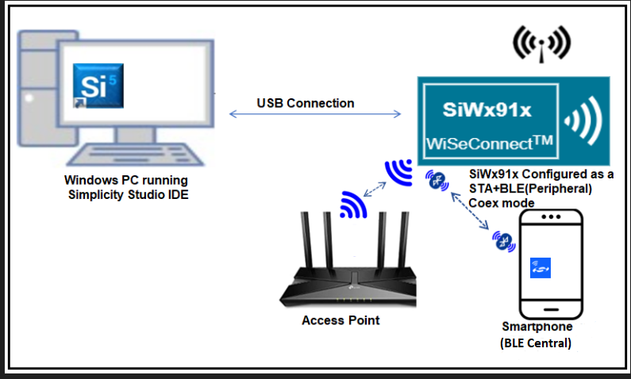
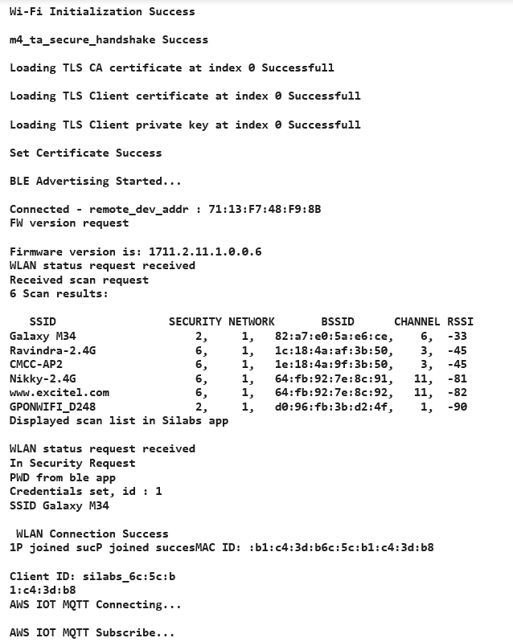
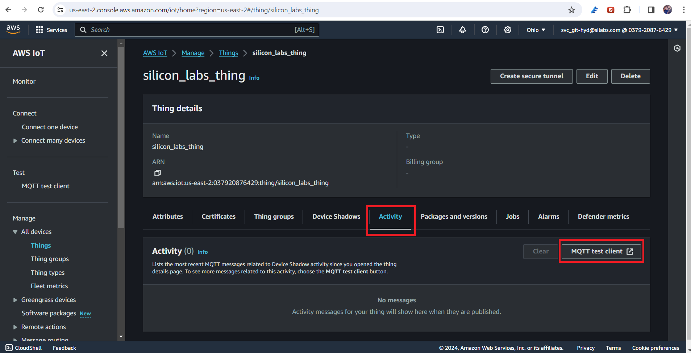
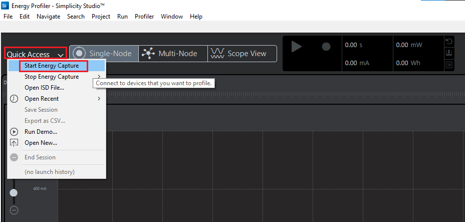
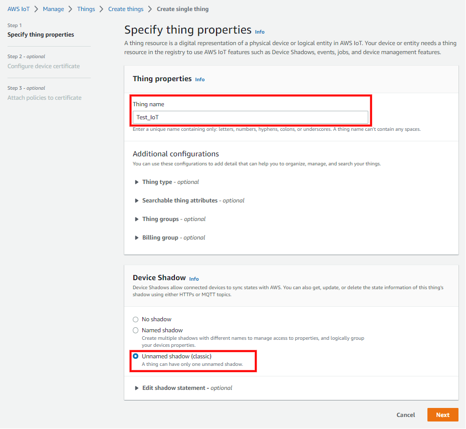
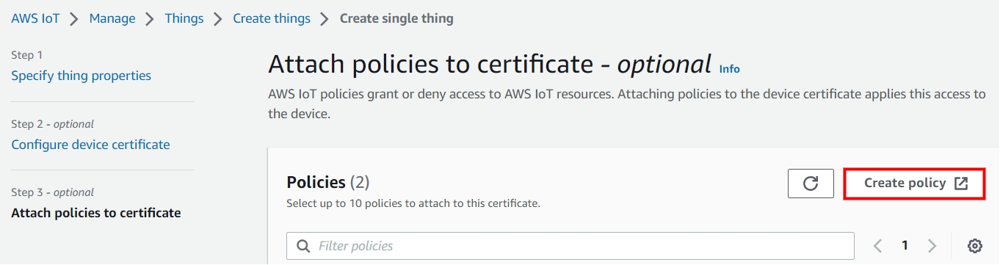

# BLE Wi-Fi Provisioning with AWS IoT MQTT

## Table of Contents

- [BLE Wi-Fi Provisioning with AWS IoT MQTT](#ble-wi-fi-provisioning-with-aws-iot-mqtt)
  - [Table of Contents](#table-of-contents)
  - [Purpose / Scope](#purpose--scope)
  - [Soc Mode](#soc-mode)
    - [Tickless Mode](#tickless-mode)
  - [Prerequisites / Setup Requirements](#prerequisites--setup-requirements)
    - [Hardware Requirements](#hardware-requirements)
      - [Base Board Pin Configuration for I2C B0 Board(BRD4338A SOC Boards)](#base-board-pin-configuration-for-i2c-b0-boardbrd4338a-soc-boards)
      - [I2C](#i2c)
    - [Software Requirements](#software-requirements)
    - [Setup Diagram](#setup-diagram)
  - [Getting Started](#getting-started)
    - [Application Configuration Parameters](#application-configuration-parameters)
    - [Configuring the BLE Application](#configuring-the-ble-application)
    - [Configure the following parameters in `aws_iot_config.h` file present at `<project>/config`](#configure-the-following-parameters-in-aws_iot_configh-file-present-at-projectconfig)
  - [Test the Application](#test-the-application)
    - [Application Output](#application-output)
      - [When I2C\_SENSOR\_PERI\_ENABLE macro enabled](#when-i2c_sensor_peri_enable-macro-enabled)
    - [MQTT Connection](#mqtt-connection)
  - [Additional Information](#additional-information)
    - [Current Measurement using Simplicity Studio Energy Profiler](#current-measurement-using-simplicity-studio-energy-profiler)
    - [Setting up Security Certificates](#setting-up-security-certificates)
    - [Create an AWS Thing](#create-an-aws-thing)
  
## Purpose / Scope

In this application, the Bluetooth Low Energy (BLE) and Simplicity Connect Application (formerly EFR Connect App) are used for provisioning the SiWx917 to a Wi-Fi Network. SiWx917 acts as a Wi-Fi station and connects to the AWS cloud via MQTT. After the connection is established, it subscribes to MQTT_TOPIC1. The application then publishes a message to the cloud on MQTT_TOPIC2, and thereafter the SiWx917 is put into Associated Power Save mode.

## Soc Mode

Si917 connected to LM75 Temperature Sensor via I2C interface collects real time temperature data publishes to the cloud until the device is disconnected from the access point. After publish, the NWP processor is set into associated power save. The application works differently in NCP and SoC modes as defined below.  

If macro **SL_SI91X_TICKLESS_MODE** enabled, then the M4 processor is set in sleep mode. The M4 processor can be woken in several ways as mentioned below:

### Tickless Mode

In Tickless Mode, the device enters sleep based on the idle time set by the scheduler. The device can be awakened by these methods: SysRTC, a wireless signal, Button press-based (GPIO), and Alarm-based wakeup.

- **SysRTC (System Real-Time Clock)**: By default, the device uses SysRTC as the wakeup source. The device will enter sleep mode and then wake up when the SysRTC matches the idle time set by the scheduler.

- **Wireless Wakeup**: The device can also be awakened by a wireless signal. If this signal is triggered before the idle time set by the scheduler, the device will wake up in response to it.

- **Button-based Wakeup**:
  - Button press-based (GPIO) - In this method, the M4 processor wakes up upon pressing a button (BTN0).
  - To enable wakeup based on button press, configure the PM Wakeup Source and enable the GPIO Wakeup in the software components.

- **Alarm-based Wakeup**:
  - ALARM timer-based - In this method, an ALARM timer is run that wakes the M4 processor up periodically every **PUBLISH_PERIODICITY** time period.

After M4 processor wakes up via any of the above processes, the application publishes the **MQTT_publish_QOS0_PAYLOAD** message on the **MQTT_TOPIC2** topic.

If the **SL_SI91X_TICKLESS_MODE** macro is disabled, for alarm-based wakeup, configure the Power Manager (PM) wakeup source and enable the calendar wakeup within the software components. By default, the alarm is set to trigger after 30 seconds, but you can modify this setting as needed when enabling the calendar wakeup in the PM wakeup source.


**NCP Mode**:

A timer is run with a periodicity of **PUBLISH_PERIODICITY** milliseconds. The application publishes **MQTT_publish_QOS0_PAYLOAD** message on **MQTT_TOPIC2** topic in the following cases:

- Once in every **PUBLISH_PERIODICITY** time period.
- When an incoming publish is received by the application.

**NOTE:** The bold texts are the macros defined in the application. You can find more details about them in the [Application Configuration Parameters](#application-configuration-parameters)

## Prerequisites / Setup Requirements

### Hardware Requirements

- A Windows PC
- USB-C cable
- A Wireless Access Point (which has an active internet access)
- Android Phone or iPhone with **Simplicity Connect App (formerly EFR Connect App)** App, which is available in Play Store and App Store.
- **Temperature Sensor Requirement**: Please note that an external LM75 temperature sensor must be connected for the application to function correctly, as the WSDK/WPK board does not have a built-in sensor.
- **SoC Mode**:
  - Standalone
    - BRD4002A Wireless pro kit mainboard [SI-MB4002A]
    - Radio Boards
      - BRD4338A [SiWx917-RB4338A]
      - BRD4339B [SiWx917-RB4339B]
      - BRD4340A [SiWx917-RB4340A]
      - BRD4343A [SiWx917-RB4343A]
    - Kits
      - SiWx917 Pro Kit [Si917-PK6031A](https://www.silabs.com/development-tools/wireless/wi-fi/siwx917-pro-kit?tab=overview)
      - SiWx917 Pro Kit [Si917-PK6032A]
      - SiWx917 AC1 Module Explorer Kit (BRD2708A)

- **NCP Mode**:
  - Standalone
    - BRD4002A Wireless pro kit mainboard [SI-MB4002A]
    - EFR32xG24 Wireless 2.4 GHz +10 dBm Radio Board [xG24-RB4186C](https://www.silabs.com/development-tools/wireless/xg24-rb4186c-efr32xg24-wireless-gecko-radio-board?tab=overview)
    - NCP Expansion Kit with NCP Radio boards
      - (BRD4346A + BRD8045A) [SiWx917-EB4346A]
      - (BRD4357A + BRD8045A) [SiWx917-EB4357A]
  - Interface and Host MCU Supported
    - SPI - EFR32 & STM32
    - UART - EFR32

#### Base Board Pin Configuration for I2C B0 Board(BRD4338A SOC Boards)

#### I2C

| PIN | ULP GPIO PIN               | Description                 |
| --- | -------------------------- | --------------------------- |
| SCL | ULP_GPIO_7 [EXP_HEADER-15] | Connect to Follower SCL pin |
| SDA | ULP_GPIO_6 [EXP_HEADER-16] | Connect to Follower SDA pin |

### Software Requirements

- Simplicity Studio
- Serial terminal for viewing the print [Tera term](https://tera-term.en.softonic.com/)
- Download and install the Silicon Labs [Simplicity Connect App(formerly EFR Connect App)](https://www.silabs.com/developers/simplicity-connect-mobile-app ) from Play store/App store.

### Setup Diagram

  

The diagram below illustrates the detailed flow of the application:

  

## Getting Started

The below instructions are provided in [here]( https://docs.silabs.com/wiseconnect/latest/wiseconnect-developers-guide-developing-for-silabs-hosts/) to:

- Install Simplicity Studio and WiSeConnect 3 extension
- Connect your device to the computer
- Upgrade your connectivity firmware
- Create a Studio project

For details on the project folder structure, see the [WiSeConnect Examples](https://docs.silabs.com/wiseconnect/latest/wiseconnect-examples/#example-folder-structure) page.

### Application Configuration Parameters

The application can be configured to suit your requirements and development environment. Read through the following sections and make any changes needed.

For SoC Mode only:

- Below is the default configuration for I2C2 instance define in RTE_Device_917.h file (path: /$project/config/RTE_Device_917.h)
- I2C2 is utilized for communication with the temperature sensor.

    ```c

    #define RTE_I2C2_SCL_PORT_ID 0

    #define RTE_I2C2_SDA_PORT_ID 0
    ```

 Open `wifi_app.c` file and update/modify the following macros:

   Modify the MQTT topics and give different names for both topics the SiWx917 is subscribed to: MQTT_TOPIC1 and publishing to MQTT_TOPIC2.
   MQTT web application is subscribed to `MQTT_TOPIC2` and publishing on `MQTT_TOPIC1`.

```c
#define MQTT_TOPIC1               "aws_status"   //! Subscribe topic to receive the message from cloud
#define MQTT_TOPIC2               "si91x_status" //! Publish topic to send the status from application to cloud
```

   **Note:** You can change the topic names, which are `aws_status` and `si91x_status`.

```c
#define ENABLE_NWP_POWER_SAVE         1                 //! Set this macro to 1 for enabling NWP power save.

#define PUBLISH_PERIODICITY       (30000)          // Configure this macro to publish data every 30 seconds (this works only in NCP with and without POWERSAVE and in SOC without POWERSAVE).
```

### Configuring the BLE Application

Open `ble_app.c` file and update/modify following macros:

- `RSI_BLE_CHAR_SERV_UUID` refers to the attribute type of the characteristics to be added in a service.

  ```c
  #define  RSI_BLE_CHAR_SERV_UUID                         0x2803
  ```

- `RSI_BLE_CLIENT_CHAR_UUID` refers to the attribute type of the client characteristics descriptor to be added in a service.

  ```c
  #define RSI_BLE_CLIENT_CHAR_UUID                        0x2902
  ```

- `RSI_BLE_NEW_SERVICE_UUID` refers to the attribute value of the newly created service.

  ```c
  #define  RSI_BLE_NEW_SERVICE_UUID                       0xAABB
  ```

- `RSI_BLE_ATTRIBUTE_1_UUID` refers to the attribute type of the first attribute under this service (RSI_BLE_NEW_SERVICE_UUID).

  ```c
  #define  RSI_BLE_ATTRIBUTE_1_UUID                        0x1AA1
  ```
  
- `RSI_BLE_ATTRIBUTE_2_UUID` refers to the attribute type of the second attribute under this service (RSI_BLE_NEW_SERVICE_UUID).

  ```c
  #define RSI_BLE_ATTRIBUTE_2_UUID                         0x1BB1
  ```

- `RSI_BLE_ATTRIBUTE_3_UUID` refers to the attribute type of the third attribute under this service (RSI_BLE_NEW_SERVICE_UUID).

   ```c
   #define RSI_BLE_ATTRIBUTE_3_UUID                         0x1CC1
   ```

- `RSI_BLE_MAX_DATA_LEN` refers to the Maximum length of the attribute data.

   ```c
   #define RSI_BLE_MAX_DATA_LEN                               20
   ```

The following are the **non-configurable** macros in the application.

- `RSI_BLE_APP_DEVICE_NAME` refers to the name of the Silicon Labs device to appear during scanning by remote devices. Use the same name as mentioned.

   ```c
   #define  RSI_BLE_APP_DEVICE_NAME               "BLE_CONFIGURATOR"
   ```

- `RSI_BLE_ATT_PROPERTY_READ` is used to set the READ property to an attribute value.

   ```c
   #define  RSI_BLE_ATT_PROPERTY_READ                    0x02
   ```

- `RSI_BLE_ATT_PROPERTY_WRITE` is used to set the WRITE property to an attribute value.

   ```c
   #define RSI_BLE_ATT_PROPERTY_WRITE                       0x08
   ```

- `RSI_BLE_ATT_PROPERTY_NOTIFY` is used to set the NOTIFY property to an attribute value.

  ```c
  #define  RSI_BLE_ATT_PROPERTY_NOTIFY                      0x10
  ```

**Note:**

- By default, values are configured as shown above.

### Configure the following parameters in `aws_iot_config.h` file present at `<project>/config`

Before configuring the parameters in `aws_iot_config.h`, register the SiWx917 device in the AWS IoT registry by following the steps mentioned in the [Create an AWS Thing](#create-an-aws-thing) section.

Configure AWS_IOT_MQTT_HOST macro with the device data endpoint to connect to AWS. To get the device data endpoint in the AWS IoT Console, navigate to Settings, copy the Endpoint, and define the AWS_IOT_MQTT_HOST macro with this value.


 ```c
   //AWS Host name 
   #define AWS_IOT_MQTT_HOST          "a2m21kovu9tcsh-ats.iot.us-east-2.amazonaws.com"  

   //default port for MQTT
   #define AWS_IOT_MQTT_PORT          "8883"
   
   #define AWS_IOT_MQTT_CLIENT_ID     "silicon_labs_thing"
   
   // Thing Name of the Shadow this device is associated with 
   #define AWS_IOT_MY_THING_NAME      "silicon_labs_thing"    
```

To authenticate and securely connect with AWS, the SiWx917 device requires a unique x.509 security certificate and private key, as well as a CA certificate. At this point, you must have a device certificate, private key, and CA certificate, which are downloaded during the creation/registration of AWS Thing.

By default, the device certificate and private key that are downloaded from the AWS are in [.pem format](https://en.wikipedia.org/wiki/Privacy-Enhanced_Mail). To load the device certificate and private key to the SiWx917, the device certificate and private key should be converted into a C-array. For converting the certificates and private key into a C-array, refer to [Setting up Security Certificates](#setting-up-security-certificates).

By default, the WiSeConnect 3 SDK contains the Starfield Root CA Certificate in C-array format.

> **Note** :
 The included Cloud connectivity certificates are for reference only. If using default certificates in the release, the cloud connection will not work. You must replace the default certificates with valid certificates while connecting to the appropriate Cloud/OpenSSL Server.

> **Note**: For recommended settings, see the [recommendations guide](https://docs.silabs.com/wiseconnect/latest/wiseconnect-developers-guide-prog-recommended-settings/).

## Test the Application

The below instructions are provied in [here](https://docs.silabs.com/wiseconnect/latest/wiseconnect-developers-guide-developing-for-silabs-hosts/) to:

- Build the application.
- Flash, run, and debug the application.

Follow the steps below for successful execution of the application:

1. Configure the access point in OPEN/WPA-PSK/WPA2-PSK/WPA3 mode to connect the SiWx917 in STA mode.

2. Connect any serial console for prints.

3. When the SiWx917 EVK enters BLE advertising mode, launch the **Simplicity Connect App (formerly EFR Connect App)**.

4. Click on Demo and select Wi-Fi Commissioning over BLE.

   

5. It will scan for the module, and it appears as `BLE_CONFIGURATOR` on the UI. Select as shown below.

   

6. Now, SiWx917 module will start as a station and scan for the access points (AP) nearby.

7. Once the list of AP scan results is displayed on the screen, you can select the SSID of the AP to which you want to connect.

   

8. Click on the SSID of the AP, enter a password if the AP is in security mode. Click on connect to associate with the access point.

   

9. Once the Silicon Labs module is connected to the access point, you can see it on the GUI, as shown below.

   

10. This completes the BLE provisioning using Android application. The next step is the [MQTT Connection](#mqtt-connection).

11. To disconnect from the access point, click on connected AP and click on YES.

    

### Application Output

  

  

#### When I2C_SENSOR_PERI_ENABLE macro enabled

  

  

  

**Note:**

- To learn more about aws mqtt apis error codes, refer to the `aws_iot_error.h` file present in the `<SDK>\third_party\aws_sdk\include\`.
- If the user is calling select and experiencing long wait times, and if no data is received, it is the user's responsibility to manage sending the keepalive packets to maintain the connection.
  
### MQTT Connection

- After successfully connecting to Wi-Fi, the application establishes a connection to AWS IoT Core. It subscribes to a topic (`MQTT_TOPIC2`) and publishes a message on another topic (`MQTT_TOPIC1`). The application then waits to receive data published on the subscribed topic from the cloud.

- You can use any MQTT client to connect to the AWS IoT cloud for subscribing and publishing messages.

  1. Go to the  [AWS IoT console](https://console.aws.amazon.com/iot/home). In the navigation pane, under Manage, choose All devices, and then choose Things.

  2. Click on the thing you have created. Go to activity as shown below. Click on MQTT test client as shown below.

     

  3. Then subscribe to a topic that is configured in the application, give the name of the topic, and click on subscribe as shown below. You can see the published data from the device.

     

     

  4. To publish data from AWS, enter the name of the topic configured in the application and write down the data at Message payload as shown below. Then click on publish.

     

## Additional Information

### Current Measurement using Simplicity Studio Energy Profiler

To use Simplicity Studio Energy Profiler for current measurements, complete the following steps.
  
After flashing the application code to the module, the energy profiler can be used for current consumption measurements.

1. From tools, choose Energy Profiler and click **OK**.

   

2. From Quick Access, choose **Start Energy Capture** option.

   

   **NOTE** :

    - The measured current may vary if the scenario is performed in an open environment. AP to AP variation is also observed.
    - To achieve the lowest power numbers in connected sleep, in SoC mode, configure mem_config to
  `MEMORY_MCU_ADVANCED_WIRELESS_BASIC` in software components and M4 to without RAM retention, i.e., `sl_si91x_configure_ram_retention` should not be done.

- Average current consumption measured in energy profiler.

  

**NOTE:**

For NCP mode, following defines have to enabled manually in preprocessor setting of example project

- For 917A0 expansion board, enable SLI_SI917 = 1
- For 917B0 1.2 expansion board, enable SLI_SI917 = 1, SLI_SI917B0 = 1
- For 917B0 2.0 expansion board, enable SLI_SI917 = 1, SLI_SI917B0 = 1, SLI_SI91X_MCU_CONFIG_RADIO_BOARD_VER2 = 1 (This is enabled by default for all examples)  

### Setting up Security Certificates

- The WiSeConnect 3 SDK provides a conversion script (written in Python 3) to make the conversion straightforward. The script is provided in the SDK `<SDK>/resources/scripts` directory and is called [certificate_to_array.py](https://github.com/SiliconLabs/wiseconnect/tree/master/resources/certificates/).

- Copy the downloaded device certificate, private key from AWS, and also the certificate_to_array.py to the `<SDK>/resources/certificates`.

- To convert the device certificate and private key to C arrays, open a system command prompt in the same path and give the following commands.

  ```sh
  $> python3 certificate_to_array.py <input filename> <output arrayname>

  For example:
  $> python3 certificate_to_array.py d8f3a44d3f.pem.crt aws_client_certificate.pem
  $> python3 certificate_to_array.py d8f3a44d3f.pem.key aws_client_private_key.pem
  ```

- After running the above commands, two new files are created as below:

   ```sh
   aws_client_certificate.pem.crt.h
   aws_client_private_key.pem.key.h
   ```

- After converting the device certificate and private key to C - array, it is essential to include the device certificate: `aws_client_certificate.pem.crt.h` and private key: `aws_client_private_key.pem.key.h` in the `<SDK>/resources/certificates` folder.

- Ensure to load the device certificate and private key to SiWx917 using [sl_net_set_credential()](https://docs.silabs.com/wiseconnect/latest/wiseconnect-api-reference-guide-nwk-mgmt/net-credential-functions#sl-net-set-credential) API.

   ```c
   status = sl_net_set_credential(SL_NET_TLS_SERVER_CREDENTIAL_ID(0), SL_NET_CERTIFICATE, aws_client_certificate, (sizeof(aws_client_certificate) - 1));
  
   status = sl_net_set_credential(SL_NET_TLS_SERVER_CREDENTIAL_ID(0), SL_NET_PRIVATE_KEY, aws_client_private_key, (sizeof(aws_client_private_key) - 1));
   ```

- Ensure to update the certificate names in the **IoT_Client_Init_Params** structure before calling the **aws_iot_mqtt_init()** API.

- The Starfield Root CA certificate used by your Wi-Fi device to verify the AWS server is already included in the WiSeConnect 3 SDK at `<SDK>/resources/certificates`; no additional setup is required.

  > **NOTE :**
  > Support for the SNI extension has been added to the AWS SDK, ensuring it is set by the client when connecting to an AWS server using TLS 1.3. This is handled internally by the AWS SDK and does not affect compatibility with other TLS versions.

  > **NOTE :**
  > Amazon uses [Starfield Technologies](https://www.starfieldtech.com/) to secure the AWS website, the WiSeConnect SDK includes the [Starfield CA Certificate](https://github.com/SiliconLabs/wiseconnect/tree/master/resources/certificates/aws_starfield_ca.pem.h).
  >
  > AWS has announced that there will be changes in their root CA chain. More details can be found in the reference link: [here](https://aws.amazon.com/blogs/security/acm-will-no-longer-cross-sign-certificates-with-starfield-class-2-starting-august-2024/)
  >
  > We are providing both root CAs (Starfield class-2 and Starfield G2) in aws_starfield_ca.pem.h, which is located in the WiSeConnect directory `<SDK>/resources/certificates/aws_starfield_ca.pem.h`
  >
  > For AWS connectivity, StarField Root CA certificate has the highest authority being at the top of the signing hierarchy.
  >
  > The StarField Root CA certificate is an expected/required certificate which usually comes pre-installed in the operating systems and plays a key part in certificate chain verification when a device is performing TLS authentication with the IoT endpoint.
  >
  > On a SiWx91x device, we do not maintain the root CA trust repository due to memory constraints, so it is mandatory to load Starfield Root CA certificate for successful mutual authentication to the AWS server.
  >
  > The certificate chain sent by AWS server is as below:
  > **Starfield Class 2**:
  > id-at-commonName=Amazon,RSA 2048 M01,id-at-organizationName=Amazon,id-at-countryName=US
  > id-at-commonName=Amazon Root CA 1,id-at-organizationName=Amazon,id-at-countryName=US
  > id-at-commonName=Starfield Services Root Certificate Authority - G2,id-at-organizationName=Starfield Technologies, Inc.,id-at-localityName=Scottsdale,id-at- stateOrProvinceName=Arizona,id-at-countryName=US
  >id-at-organizationalUnitName=Starfield Class 2 Certification Authority,id-at-organizationName=Starfield Technologies, Inc.,id-at-countryName=US
  >
  > **Starfield G2**:
  > id-at-commonName=Amazon RSA 2048 M01,id-at-organizationName=Amazon,id-at-countryName=US
  > id-at-commonName=Amazon Root CA 1,id-at-organizationName=Amazon,id-at-countryName=US
  > id-at-commonName=Starfield Services Root Certificate Authority - G2,id-at-organizationName=Starfield Technologies, Inc.,id-at-localityName=Scottsdale,id-at-stateOrProvinceName=Arizona,id-at-countryName=US
  >
  > To authenticate the AWS server on SiWx91x, first validate the Root CA (validate the Root CA received with the Root CA loaded on the device). Once the Root CA validation is successful, other certificates sent from the AWS server are validated.
  > Alternate certification chains support is added. With this, as opposed to requiring full chain validation, only the peer certificate must validate to a trusted certificate. This allows loading intermediate root CA's as trusted.
  > The default CA certificate is the Starfield Combined CA certificate. To use the Intermediate Amazon Root CA 1 certificate, define the `SL_SI91X_AWS_IOT_ROOT_CA1` macro in the application.

### Create an AWS Thing

Create a thing in the AWS IoT registry to represent your IoT device.

1. In the [AWS IoT console](https://console.aws.amazon.com/iot/home), in the navigation pane, under **Manage**, choose **All devices**, and then choose **Things**.

   

2. If **No things** message is displayed, click on **Create things**.

   

3. On the **Create things** page, choose **Create single thing** and click next.

   

4. On the **Specify thing properties** page, enter a name for your IoT thing (for example, **Test_IoT**), and choose **Unnamed shadow (classic)** in the Device Shadow section, then choose **Next**. You cannot change the name of a thing after you create it. To change a thing's name, you must create a new thing, give it a new name, and then delete the old thing.

   

5. During **Configure device certificate** step, choose **Auto-generate a new certificate (recommended)** option and click next.

   

6. Attach the policy to the thing created.

   - If you have an existing policy, attach it and click on create thing.

     

   - If policy is not yet created, follow the steps below.
  
     1. Choose **Create policy** and fill the fields as per your requirements.

         

     2. Give the **Name** to your Policy. Fill in the **Action** and **Resource ARN** fields as shown in the image below. Click on **Allow** under **Effect** and click **Create**.

        

     3. Choose the created policy and click on **Create thing**.

7. Choose the **Download** links to download the device certificate and private key. Note that Root CA certificate is already present in the SDK (aws_starfield_ca.pem.h), and can be directly used.
  
    >**Warning:** This is the only instance you can download your device certificate and private key. Make sure to save them securely.

    

8. Click **Done**.

   The created thing should now be visible on the AWS console (**Manage > All devices > Things**).
  
