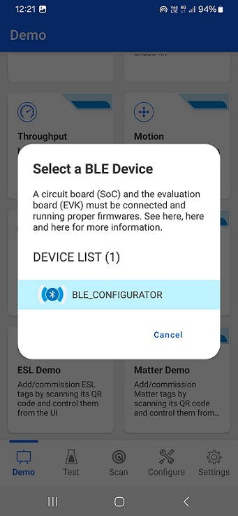
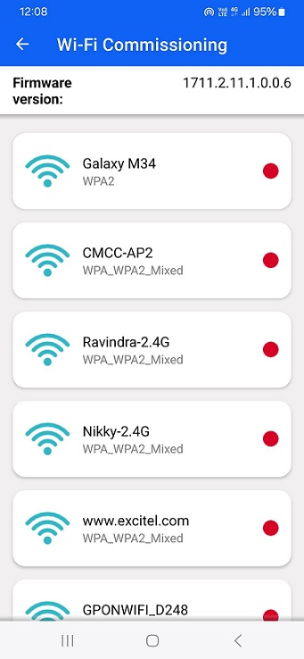
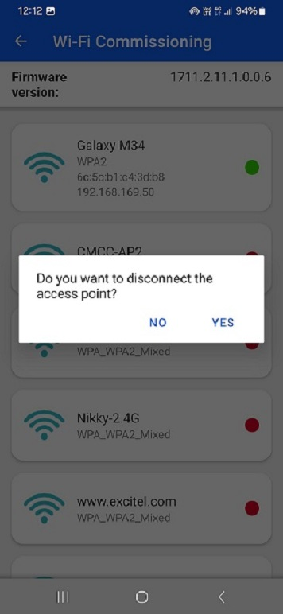
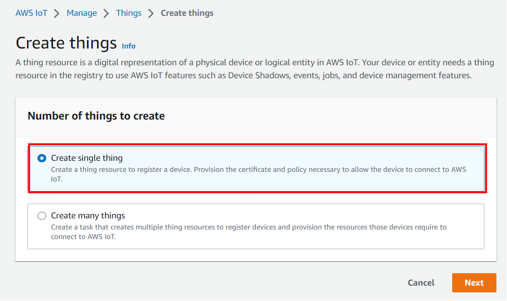

# Wi-Fi Coex - Wi-Fi Client BLE Provisioning with AWS

## Table of Contents

- [Purpose / Scope](#purpose--scope)
- [Prerequisites / Setup Requirements](#prerequisites--setup-requirements)
  - [Hardware Requirements](#hardware-requirements)
    - [Base Board Pin Configuration for I2C- B0 Board(BRD4338A SOC Boards)](#base-board-pin-configuration-for-i2c-b0-boardbrd4338a-soc-boards)
  - [Software Requirements](#software-requirements)
  - [Setup Diagram](#setup-diagram)
- [Getting Started](#getting-started)
  - [Application Configuration Parameters](#application-configuration-parameters)
  - [To Load Certificates](#to-load-certificates)
- [Test the Application](#test-the-application)
  - [Observing the output prints on serial terminal](#observing-the-output-prints-on-serial-terminal)
  - [MQTT Connection](#mqtt-connection)
- [Additional Information](#additional-information)
  - [Current Measurement](#current-measurement)
  - [Create an AWS Thing](#create-an-aws-thing)
  - [Steps to create a policy from AWS console](#steps-to-create-a-policy-from-aws-console)

## Purpose / Scope

In this application, SiWx917 starts advertising in BLE mode and Access Point details are fetched using BLE Provisioning. After successful Wi-Fi connection, application connects to AWS Core and subscribes to a topic. Publishes a message on subscribed topic and application waits to receive the data published on subscribed topic from the cloud.

**Soc Mode**:

Si917 connected to LM75 Temperature Sensor via I2C interface, collects real time temperature data publishes to the cloud until the device is disconnected from the access point. After publish, the NWP processor is set in to associated power save.  Next, the application works differently in NCP and SoC modes as defined below.  

If macro **ENABLE_POWER_SAVE** enabled, Then M4 processor is set in sleep mode. The M4 processor can be woken in several ways as mentioned below:

- ALARM timer-based - In this method, an ALARM timer is run that wakes the M4 processor up periodically every **ALARM_PERIODIC_TIME** time period.
  - We can enable the ALARM timer-wakeup by adding the preprocessor macro "SL_SI91X_MCU_ALARM_BASED_WAKEUP" for the example.
  - In the Project explorer pane, expand as follows wiseconnect3_sdk_xxx > components > device > silabs > si91x > mcu > drivers > peripheral_drivers > src folder and open sl_si91x_m4_ps.c file. Configure **ALARM_PERIODIC_TIME**, in seconds, in sl_si91x_m4_ps.c
- Button press-based (GPIO) - In this method, the M4 processor wakes up upon pressing a button (BTN0).
  - We can enable the Button press-based wakeup by adding the preprocessor macro "SL_SI91X_MCU_BUTTON_BASED_WAKEUP" for the example.
- Wireless-based - When an RX packet is to be received by the TA, the M4 processor is woken up.
  - We can enable the Wireless-wakeup by adding the preprocessor macro "SL_SI91X_MCU_WIRELESS_BASED_WAKEUP" for the example.

After M4 processor wakes up via any of the above processes, the application publishes **MQTT_PUBLISH_PAYLOAD** message on **PUBLISH_ON_TOPIC** topic.

If macro **ENABLE_POWER_SAVE** disabled, Then M4 processor is not in sleep mode. A timer is run with a periodicity of **PUBLISH_PERIODICITY** milliseconds.The application publishes **MQTT_PUBLISH_PAYLOAD** message on **PUBLISH_ON_TOPIC** topic in the following cases:

1. Once in every **PUBLISH_PERIODICITY** time period.
2. When an incoming publish is received by the application.

**NCP Mode**:

A timer is run with a periodicity of **PUBLISH_PERIODICITY** milliseconds. The application publishes **MQTT_PUBLISH_PAYLOAD** message on **PUBLISH_ON_TOPIC** topic in the following cases:

- Once in every **PUBLISH_PERIODICITY** time period.
- When an incoming publish is received by the application.


**NOTE:** The bold texts are the macros defined in the application. You can find more details about them in the [Application Configuration Parameters](#application-configuration-parameters)

## Prerequisites / Setup Requirements

### Hardware Requirements

- Windows PC with Host interface (UART).
- **SoC Mode**:
  - Standalone
    - BRD4002A Wireless pro kit mainboard [SI-MB4002A]
    - Radio Boards 
     - BRD4338A [SiWx917-RB4338A]
     - BRD4340A [SiWx917-RB4340A]
  - Kits
   - SiWx917 Pro Kit [Si917-PK6031A](https://www.silabs.com/development-tools/wireless/wi-fi/siwx917-pro-kit?tab=overview)
   - SiWx917 Pro Kit [Si917-PK6032A]
   
- **NCP Mode**:
  - Standalone
    - BRD4002A Wireless pro kit mainboard [SI-MB4002A]
    - EFR32xG24 Wireless 2.4 GHz +10 dBm Radio Board [xG24-RB4186C](https://www.silabs.com/development-tools/wireless/xg24-rb4186c-efr32xg24-wireless-gecko-radio-board?tab=overview)
    - NCP EFR Expansion Kit with NCP Radio board (BRD4346A + BRD8045A) [SiWx917-EB4346A]
- USB-C cable

- Wireless Access point (which has an active internet access)
- Android Phone or iPhone with **EFR Connect** App, which is available in Play Store and App Store.
- LM75 Temperature Sensor (inbuilt sensor available on WSDK/WPK board)

### Base Board Pin Configuration for I2C B0 Board(BRD4338A SOC Boards)

#### I2C2

| PIN | ULP GPIO PIN               | Description                 |
| --- | -------------------------- | --------------------------- |
| SCL | ULP_GPIO_7 [EXP_HEADER-15] | Connect to Follower SCL pin |
| SDA | ULP_GPIO_6 [EXP_HEADER-16] | Connect to Follower SDA pin |

### Software Requirements

- Simplicity Studio IDE
  - Download the [Simplicity Studio IDE](https://www.silabs.com/developers/simplicity-studio).
  - Follow the [Simplicity Studio user guide](https://docs.silabs.com/simplicity-studio-5-users-guide/1.1.0/ss-5-users-guide-getting-started/install-ss-5-and-software#install-ssv5) to install Simplicity Studio IDE.
- Serial terminal for viewing the print [Tera term](https://tera-term.en.softonic.com/).
- Download and install the Silicon Labs [EFR Connect App](https://www.silabs.com/developers/efr-connect-mobile-app),
which is available in Play store/App store or `Silabs_connect.apk`, which is available in the path `\wiseconnect\utilities\ble_provisioning_apps\android_based_provisioning_app.`

### Setup Diagram

  

  

## Getting Started

Refer to the instructions [here](https://docs.silabs.com/wiseconnect/latest/wiseconnect-getting-started/) to:

- Install Simplicity Studio and WiSeConnect 3 extension
- Connect your device to the computer
- Upgrade your connectivity firmware
- Create a Studio project

### Application Configuration Parameters

The application can be configured to suit your requirements and development environment. Read through the following sections and make any changes needed.

```c
For SoC Mode only:

 Open <wiseconnect3/components/siwx917_soc/drivers/cmsis_driver/config/RTE_Device_917.h> and set the following parameters

#define RTE_I2C2_SCL_PORT_ID 2

#define RTE_I2C2_SDA_PORT_ID 2
```

 Open `wlan_app.c` file and update/modify following macros

   Modify the MQTT topics and give different names for both topics SiWx917 is subscribed to MQTT_TOPIC1 and publishing to MQTT_TOPIC2. 
   MQTT web application is subscribed to `MQTT_TOPIC2` and publishing on `MQTT_TOPIC1`.

```c
#define MQTT_TOPIC1               "aws_status"   //! Subscribe Topic to receive the message from cloud
#define MQTT_TOPIC2               "si91x_status" //! Publish Topic to send the status from application to cloud
```

   **NOTE:** You can change the topic names, which are `aws_status` and `si91x_status`.

  The below parameters are only applicable for SoC with power save enabled  whereas **PUBLISH_PERIODICITY** and **ENABLE_POWER_SAVE** can be configured in NCP also.

```c
#define ENABLE_POWER_SAVE         1                 //! Enable this macro to run application with power save mode.
#define SL_SI91X_MCU_ALARM_BASED_WAKEUP  1                 //! Enable this macro for M4 processor to wake up based on alarm time period
#define SL_SI91X_MCU_BUTTON_BASED_WAKEUP       1                 //! Enable this macro for M4 processor to wake up when button (BTN0) is pressed
#define ALARM_PERIODIC_TIME       30                //! periodic alarm configuration in seconds

#define PUBLISH_PERIODICITY       (30000)          // Configure this macro to publish data every 30 seconds (this works only in NCP with and without POWERSAVE and in SOC without POWERSAVE).
```

Open `ble_app.c` file and update/modify following macros

   **Configuring the BLE Application**

   `RSI_BLE_CHAR_SERV_UUID` refers to the attribute type of the characteristics to be added in a service.

```c
#define  RSI_BLE_CHAR_SERV_UUID                         0x2803
```

   `RSI_BLE_CLIENT_CHAR_UUID` refers to the attribute type of the client characteristics descriptor to be added in a service.

```c
#define RSI_BLE_CLIENT_CHAR_UUID                        0x2902
```

   `RSI_BLE_NEW_SERVICE_UUID` refers to the attribute value of the newly created service.

```c
#define  RSI_BLE_NEW_SERVICE_UUID                       0xAABB
```

   `RSI_BLE_ATTRIBUTE_1_UUID` refers to the attribute type of the first attribute under this service (RSI_BLE_NEW_SERVICE_UUID).

```c
#define  RSI_BLE_ATTRIBUTE_1_UUID                        0x1AA1
```
  
   `RSI_BLE_ATTRIBUTE_2_UUID` refers to the attribute type of the second attribute under this service (RSI_BLE_NEW_SERVICE_UUID).

```c
#define RSI_BLE_ATTRIBUTE_2_UUID                         0x1BB1
```

   `RSI_BLE_ATTRIBUTE_3_UUID` refers to the attribute type of the third attribute under this service (RSI_BLE_NEW_SERVICE_UUID).

```c
#define RSI_BLE_ATTRIBUTE_3_UUID                         0x1CC1
```

   `RSI_BLE_MAX_DATA_LEN` refers to the Maximum length of the attribute data.

```c
#define RSI_BLE_MAX_DATA_LEN                               20
```


  **The following are the **non-configurable** macros in the application.**

   `RSI_BLE_APP_DEVICE_NAME` refers to the name of the Silicon Labs device to appear during scanning by remote devices. Use the same name as mentioned.
```c
#define  RSI_BLE_APP_DEVICE_NAME               "BLE_CONFIGURATOR"
```


   RSI_BLE_ATT_PROPERTY_READ is used to set the READ property to an attribute value. 

```c
#define  RSI_BLE_ATT_PROPERTY_READ                    0x02
```

   `RSI_BLE_ATT_PROPERTY_WRITE` is used to set the WRITE property to an attribute value.

```c
#define RSI_BLE_ATT_PROPERTY_WRITE                       0x08
```

   `RSI_BLE_ATT_PROPERTY_NOTIFY` is used to set the NOTIFY property to an attribute value.

```c
#define  RSI_BLE_ATT_PROPERTY_NOTIFY                      0x10
```


 Open `aws_iot_config.h` file and change the AWS_IOT_MQTT_CLIENT_ID to your choice (Make sure this is unique, if more than one user use has same client id it might get conflict at server side).

 ```c
   //AWS Host name 
   #define AWS_IOT_MQTT_HOST          "a2m21kovu9tcsh-ats.iot.us-east-2.amazonaws.com"  

   //default port for MQTT
   #define AWS_IOT_MQTT_PORT          "8883"
   
   #define AWS_IOT_MQTT_CLIENT_ID     "silicon_labs_thing"
   
   // Thing Name of the Shadow this device is associated with 
   #define AWS_IOT_MY_THING_NAME      "silicon_labs_thing"    
```

- **AWS_IOT_MQTT_HOST** parameter can be found as follows:

    

    

### To Load Certificates

Place the certificate files in `<SDK>/resources/certificates/` path and include the certificate files in wifi_app.c

   ```c
   Replace the default Device certificate and Private key certificate include in the application with the converted pem file name.

   // Certificate includes
   #include "aws_client_certificate.pem.crt.h"
   #include "aws_client_private_key.pem.key.h"

   Replace the default Device certificate and Private key certificate given in `sl_net_set_credential()` API in the application with the converted pem array.

   // Load Security Certificates
   status = sl_net_set_credential(SL_NET_TLS_SERVER_CREDENTIAL_ID(0), SL_NET_CERTIFICATE, aws_client_certificate, (sizeof(aws_client_certificate) - 1));
  
   status = sl_net_set_credential(SL_NET_TLS_SERVER_CREDENTIAL_ID(0), SL_NET_PRIVATE_KEY, aws_client_private_key, (sizeof(aws_client_private_key) - 1));
   ```

**NOTE:**
 
 If user wants to load certificates follow this steps:

To authenticate and securely connect with AWS, your Wi-Fi device requires a unique x.509 security certificate and private key, as well as a CA certificate which is used to verify the AWS server. Security credentials need to be converted into a C-array rather than [PEM format](https://en.wikipedia.org/wiki/Privacy-Enhanced_Mail) provided by AWS; they also need to be added to your project.
 
The WiSeConnect SDK provides a conversion script (written in Python 3) to make the conversion straightforward. 
 
To convert the device certificate and private key to C arrays, go to the `<SDK>resources>scripts>certificate_to_array.py`. Open a system command prompt and use the script as indicated in the following examples.
 
```sh
$> py certificate_to_array.py <input filename> <output arrayname>
 
For example:
$> py certificate_to_array.py d8f3a44d3f.cert.pem    aws_client_certificate
$> py certificate_to_array.py d8f3a44d3f.private.key aws_client_private_certificate
```
 **NOTE:**

1. If py command is not working replace the py with python. 

2. Make sure the certificate to be converted has to be in the same path.

After running the script on the certificate and private key, two new files are created.
 
```sh
aws_client_certificate.pem.crt.h
aws_client_private_key.pem.key.h
```
 
Before proceeding, copy both of the new files to the WiSeConnect directory: `<SDK>/resources/certificates`  
Go ahead and overwrite any existing files with the same name in that directory, the originals are not needed.
 
The Root CA certificate used by your Wi-Fi device to verify the AWS server is already included in the WiSeConnect SDK; no additional setup is required.
For reference, Amazon uses [Starfield Technologies](https://www.starfieldtech.com/) to secure the AWS website, the WiSeConnect SDK includes the [Starfield CA Certificate](https://github.com/SiliconLabs/wiseconnect-wifi-bt-sdk/tree/master/resources/certificates/aws_starfield_ca.pem.h).
 
> **NOTE:**
>
> For AWS connectivity, StarField Root CA Class 2 certificate has the highest authority being at the top of the signing hierarchy.
>
> The StarField Root CA Class 2 certificate is an expected/required certificate which usually comes pre-installed in the operating systems and it plays a key part in certificate chain verification when a device is performing TLS authentication with the IoT endpoint.
>
> On SiWx917 device, we do not maintain root CA trust repository due to memory constraints, so it is mandatory to load StarField Root CA Class 2 certificate for successful mutual authentication to AWS server.
>
> The certificate chain sent by AWS server is as below:
> id-at-commonName=Amazon,id-at-organizationalUnitName=Server CA 1B,id-at-organizationName=Amazon,id-at-countryName=US
> id-at-commonName=Amazon Root CA 1,id-at-organizationName=Amazon,id-at-countryName=US
> id-at-commonName=Starfield Services Root Certificate Authority ,id-at-organizationName=Starfield Technologies, Inc.,id-at-localityName=Scottsdale,id-at-  stateOrProvinceName=Arizona,id-at-countryName=US)
>
> On SiWx917 to authenticate the AWS server, firstly Root CA is validated (validate the Root CA received with the Root CA loaded on the device). Once the Root CA is validation is successful , other certificates sent from the AWS server are validated.
> SiWx917 don't authenticate to AWS server if intermediate CA certificates are loaded instead of StarField Root CA Class 2 certificate and would result in Handshake error.
> StarField Root CA Class 2 certificate is at https://certs.secureserver.net/repository/sf-class2-root.crt
>
> Reference links :
> https://aws.amazon.com/blogs/security/how-to-prepare-for-aws-move-to-its-own-certificate-authority/

## Test the Application

Refer to the instructions [here](https://docs.silabs.com/wiseconnect/latest/wiseconnect-getting-started/) to:

- Build the application.
- Flash, run and debug the application

Follow the steps below for successful execution of the application:

1. Configure the Access point in OPEN/WPA-PSK/WPA2-PSK/WPA3 mode to connect the SiWx917 in STA mode.

2. Connect any serial console for prints.

3. When SiWx917 EVK enters BLE advertising mode, launch the **EFR Connect** App.

4. Click on Demo and select Wi-Fi Commissioning over BLE.

   

5. It will scan for the module, and it appears as `BLE_CONFIGURATOR` on the UI, select as shown below.

   

6. Now, SiWx917 module will start as a station and scan for the access points (AP) nearby.

7. Once the list of AP scan results is displayed on the screen, you can select the SSID of the AP to which you want to connect.

   

8. Click on the SSID of the AP, enter password if the AP is in security mode. Click on connect to associate with the access point.

   

9. Once Silicon labs module is connected to the access point, you can notice on the GUI as below.

   

10. This completes the BLE provisioning using Android application, next step is the [MQTT Connection](#mqtt-connection)

11. To disconnect from Access Point, click on connected AP and click on YES

    

### Observing the output prints on serial terminal  

  

#### When I2C_SENSOR_PERI_ENABLE macro enabled :

  

  

  

### MQTT Connection

Based on application configuration parameters the MQTT connection completed , after successful Wi-Fi connection, application connects to AWS Core and subscribes to a topic. Publishes a message on subscribed topic and application waits to receive the data published on subscribed topic from the cloud.

To do that, 
1. Go to the  [AWS IoT console](https://console.aws.amazon.com/iot/home), in the navigation pane, under Manage, choose All devices, and then choose Things.

2. Click on the thing you have created. Go to activity at below. Click on MQTT test client as shown below.

   


3. Then subscribe to a topic you gave in the application as shown in the picture. You can see the published data from the module as shown below.

   
   
   

4. If we want to publish data from AWS. Give the name of the topic name configured in application to publish as shown in the below picture. Write down the data at Message payload to send data to the module.Then click on publish.

   

## Additional Information

### Current Measurement:

Using Simplicity Studio Energy Profiler for current measurement:
  
- After flashing the application code to the module. Energy profiler can be used for current consumption measurements.

- From tools, choose Energy Profiler and click "OK"

  

- From Quick Access, choose Start Energy Capture option

  

  **NOTE** : The measured current may vary if the scenario is performed in open environment. AP to AP variation is also observed.
  **NOTE** : To achieve the lowest power numbers in connected sleep, in SoC mode, one should configure `RAM_LEVEL` to `SL_SI91X_RAM_LEVEL_NWP_BASIC_MCU_ADV` and M4 to without RAM retention i.e. `sl_si91x_configure_ram_retention` should not be done.

- Average current consumption measured in power-meter

  

 **NOTE:**

For NCP mode, following defines have to enabled manually in preprocessor setting of example project

- For 917A0 expansion board, enable SLI_SI917 = 1
- For 917B0 1.2 expansion board, enable SLI_SI917 = 1, SLI_SI917B0 = 1
- For 917B0 2.0 expansion board, enable SLI_SI917 = 1, SLI_SI917B0 = 1, SLI_SI91X_MCU_CONFIG_RADIO_BOARD_VER2 = 1 (This is enabled by default for all examples)  

### Create an AWS Thing

**Thing Note:**

By default we are giving ThingName: silicon_labs_thing, these related configuration we set default If you want your own thing name you can follow the below procedure.

Create a thing in the AWS IoT registry to represent your IoT device.

- In the [AWS IoT console](https://console.aws.amazon.com/iot/home), in the navigation pane, under Manage, choose All devices, and then choose Things.

  

- If a **You don't have any things yet** dialog box is displayed, Click on **Create things**.

  

- On the **Create things** page, choose **Create a single thing** and click next.

  

- On the **Specify thing properties** page, enter a name for your IoT thing (for example, **Test_IoT**), and choose **Unnamed shadow (classic)** in the Device Shadow section, then choose **Next**. You can't change the name of a thing after you create it. To change a thing's name, you must create a new thing, give it the new name, and then delete the old thing.

  

- During **Configure device certificate** step, choose **Auto-generate a new certificate (recommended)** option and click next.

  

- Choose the **Download** links to download the device certificate, private key, and root CA certificate. Root CA certificate is already present in SDK (aws_starfield_ca.pem.h), and can be directly used.
  > **Warning:** This is the only instance you can download your device certificate and private key. Make sure to save them safely.

  

- To attach an existing policy choose the policy and click on create thing, if policy is not yet created Choose Create policy and fill the fields as mentioned in the following images.

- choosing an existing policy

  

### Steps to create a policy from AWS console

- Navigate to **AWS IoT console**.
- Choose **Policies** under **Secure**.

  

- Click on **Create policy**.

  

- Give the **Name** to your Policy, Fill **Action** and **Resource ARN** as shown in below image, Click on **Allow** under **Effect** and click **Create**.

  

- The created thing should now be visible on the AWS console (Manage > All devices > Things).

  