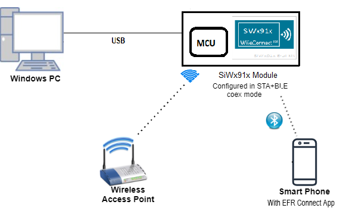
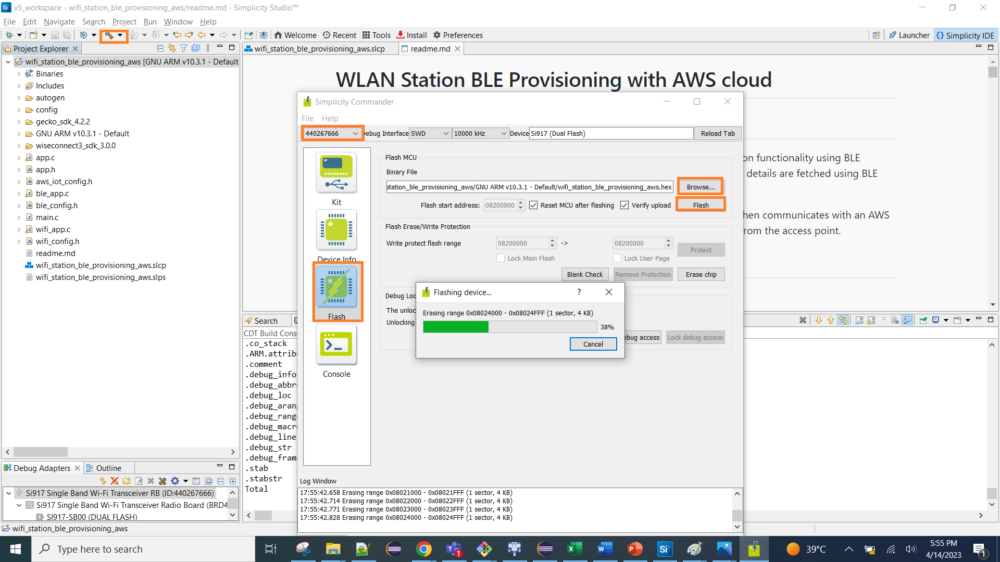

# WLAN Station BLE Provisioning with AWS cloud

## 1. Purpose / Scope

This example demonstrates how to configure/connects SiWx91x to get the WiFi connection functionality using BLE provisioning. In this application, SiWx91x starts advertising in BLE mode and Access Point details are fetched using BLE Provisioning.

The SiWx91x module is configured  as a station, which associates to an access point and then communicates with an AWS server using MQTT. Si917 connected to LM75 Temperature Sensor via I2C interface, collects real time temperature data publishes to the cloud until the device is disconnected from the access point.  

## 2. Prerequisites / Setup Requirements

Before running the application, the user will need the following things to setup.

### 2.1 Hardware Requirements

- Windows PC.
- SiWx91x Wi-Fi Evaluation Kit. The SiWx91x supports multiple operating modes. See [Operating Modes]() for details.
  - **SoC Mode**:
    - Silicon Labs [BRD4325A, BRD4325B, BRD4325C, BRD4325G, BRD4338A](https://www.silabs.com/)
  - **NCP Mode**:
    - Silicon Labs [BRD4180B](https://www.silabs.com/); **AND**
    - Host MCU Eval Kit. This example has been tested with:
      - Silicon Labs [WSTK + EFR32MG21](https://www.silabs.com/development-tools/wireless/efr32xg21-bluetooth-starter-kit)

- Wireless Access point
- Android Phone or iPhone with **EFR Connect** App, which is available in Play Store and App Store (or) Windows PC with windows Silicon labs connect application.
- Windows/Linux/Mac PC with AWS Smart Lock GUI
- LM75 Temperature Sensor
  


## Base Board Pin Configuration- A0 Board

#### I2C0

| PIN | ULP GPIO PIN               | Description                 |
| --- | -------------------------- | --------------------------- |
| SCL | ULP_GPIO_11 [EXP_HEADER-5] | Connect to Follower SCL pin |
| SDA | ULP_GPIO_10 [EXP_HEADER-3] | Connect to Follower SDA pin |

#### I2C1

| PIN | GPIO PIN                 | Description                 |
| --- | -------------------------| --------------------------- |
| SCL | GPIO_50 [EXP_HEADER-P19] | Connect to Follower SCL pin |
| SDA | GPIO_51 [EXP_HEADER-P20] | Connect to Follower SDA pin |

#### I2C2

| PIN | ULP GPIO PIN               | Description                 |
| --- | -------------------------- | --------------------------- |
| SCL | ULP_GPIO_5 [EXP_HEADER-13] | Connect to Follower SCL pin |
| SDA | ULP_GPIO_4 [EXP_HEADER-11] | Connect to Follower SDA pin |

## Base Board Pin Configuration- B0 Board

#### I2C2

| PIN | ULP GPIO PIN               | Description                 |
| --- | -------------------------- | --------------------------- |
| SCL | ULP_GPIO_7 [EXP_HEADER-15] | Connect to Follower SCL pin |
| SDA | ULP_GPIO_6 [EXP_HEADER-16] | Connect to Follower SDA pin |

### 2.2 Software Requirements

- Embedded Development Environment

  - For Silicon Labs EFx32, use the latest version of [Simplicity Studio](https://www.silabs.com/developers/simplicity-studio)
  - Download and install the Silicon Labs [EFR Connect App](https://www.silabs.com/developers/efr-connect-mobile-app) in the android smart phones for testing BLE applications. Users can also use their choice of BLE apps available in Android/iOS smart phones.

### **SoC Mode**

- WLAN Station BLE Provisioning with Android EFR Connect App

   
  
- WLAN Station BLE Provisioning with windows based Silicon Labs Connect App

   
  
### **NCP Mode**

- WLAN Station BLE Provisioning with Android EFR Connect App

   

- WLAN Station BLE Provisioning with windows based Silicon Labs Connect App

   

Follow the [Getting Started with Wiseconnect3 SDK](https://docs.silabs.com/wiseconnect/latest/wiseconnect-getting-started/) guide to set up the hardware connections and Simplicity Studio IDE.

## 3 Project Environment

- Ensure the SiWx91x loaded with the latest firmware following the [Upgrade Si91x firmware](https://docs.silabs.com/wiseconnect/latest/wiseconnect-getting-started/getting-started-with-soc-mode#upgrade-si-wx91x-connectivity-firmware)

- Ensure the latest Gecko SDK along with the extension WiSeConnect3 is added to Simplicity Studio.

### 3.1 Creating the project

#### 3.1.1 SoC mode

- Ensure the SiWx91x set up is connected to your PC.

- In the Simplicity Studio IDE, the SiWx91x SoC board will be detected under **Debug Adapters** pane as shown below.

  ****

#### 3.1.2 NCP mode

- Ensure the EFx32 and SiWx91x set up is connected to your PC.

- In the Simplicity Studio IDE, the EFR32 board will be detected under **Debug Adapters** pane as shown below.

  ****

### 3.2 Importing the project

- Studio should detect your board. Your board will be shown here. Click on the board detected and go to **EXAMPLE PROJECTS & DEMOS** section 

#### SOC Mode

- Select **Wi-Fi Coex - Wi-Fi Client BLE Provisioning with AWS** test application

  ****

- Click 'Create'. The "New Project Wizard" window appears. Click 'Finish'

  ****

### 3.3 Set up for application prints

#### 3.3.1 Teraterm set up - for BRD4325A, BRD4325B, BRD4325C, BRD4325G

You can use either of the below USB to UART converters for application prints.

1. Set up using USB to UART converter board.

   - Connect Tx (Pin-6) to P27 on WSTK
   - Connect GND (Pin 8 or 10) to GND on WSTK

   ****

2. Set up using USB to UART converter cable.

   - Connect RX (Pin 5) of TTL convertor to P27 on WSTK
   - Connect GND (Pin1) of TTL convertor to GND on WSTK

   ****

3. Open the Teraterm tool.

   - For SoC mode, choose the serial port to which USB to UART converter is connected and click on **OK**.

     ****

**Note:** For Other 917 SoC boards please refer section #3.3.2

#### 3.3.2 **Teraterm set up - for NCP and SoC modes**

1. Open the Teraterm tool.

- choose the J-Link port and click on **OK**.
    
    ****

2. Navigate to the Setup → Serial port and update the baud rate to **115200** and click on **OK**.

    ****

    ****

### 4. Application Configuration Parameters

The application can be configured to suit your requirements and development environment. Read through the following sections and make any changes needed.

**4.1** Open `<wiseconnect3/components/siwx917_soc/drivers/cmsis_driver/config/RTE_Device_917.h>` and set the following parameters

```c
#define RTE_I2C2_SCL_PORT_ID 2
```

```c
#define RTE_I2C2_SDA_PORT_ID 2
```

**4.2** Open `wlan_app.c` file and update/modify following macros

   Modify the MQTT topics and give different names for both topics SiWx91x is subscribed to MQTT_TOPIC1 and publishing to MQTT_TOPIC2. 
   MQTT web application is subscribed to `MQTT_TOPIC2` and publishing on `MQTT_TOPIC1`.

```c
#define MQTT_TOPIC1           "$aws/things/SmartLockWebApp-v01/shadow/update/device_status"
#define MQTT_TOPIC2           "$aws/things/SmartLockWebAppv01/shadow/update/delta/temperature_reading"
```

   **NOTE:** If you would like to change the topic names, then you can modify only the last keyword of the topic, which are `device_status` and `temperature_reading`.

**To configure the IP address**

   Memory length for driver
  
   Memory length for the send buffer

```c
#define BUF_SIZE                                 1400
```

**4.2.2** Open `wlan_config.h` file and update/modify the following macros

```c
#define CONCURRENT_MODE                          RSI_DISABLE
#define RSI_FEATURE_BIT_MAP                      (FEAT_SECURITY_OPEN  | FEAT_AGGREGATION | FEAT_ULP_GPIO_BASED_HANDSHAKE)
#define RSI_TCP_IP_BYPASS                        RSI_DISABLE 
#define RSI_TCP_IP_FEATURE_BIT_MAP               (TCP_IP_FEAT_DHCPV4_CLIENT | TCP_IP_FEAT_SSL | TCP_IP_FEAT_DNS_CLIENT | TCP_IP_TOTAL_SOCKETS_1 | TCP_IP_FEAT_EXTENSION_VALID)
#define RSI_CUSTOM_FEATURE_BIT_MAP               FEAT_CUSTOM_FEAT_EXTENTION_VALID
#define RSI_EXT_CUSTOM_FEATURE_BIT_MAP           (EXT_FEAT_384K_MODE | EXT_FEAT_LOW_POWER_MODE | EXT_FEAT_RSA_KEY_WITH_4096_SUPPORT | EXT_FEAT_SSL_CERT_WITH_4096_KEY_SUPPORT)  
define RSI_EXT_TCPIP_FEATURE_BIT_MAP             ( EXT_DYNAMIC_COEX_MEMORY | EXT_TCP_IP_FEAT_SSL_MEMORY_CLOUD | CONFIG_FEAT_EXTENTION_VALID)    
define RSI_CONFIG_FEATURE_BITMAP                 RSI_FEAT_SLEEP_GPIO_SEL_BITMAP 
define RSI_BT_FEATURE_BITMAP                     (BT_RF_TYPE | ENABLE_BLE_PROTOCOL)
define RSI_BAND                                  RSI_BAND_2P4GHZ 
```

   **Note:**
   `wlan_config.h` file is already set with the desired configuration in respective example folders, user need not change for each example.

**4.3** Open `ble_app.c` file and update/modify following macros

   **Configuring the BLE Application**

   `RSI_BLE_CHAR_SERV_UUID` refers to the attribute type of the characteristics to be added in a service.

```c
#define  RSI_BLE_CHAR_SERV_UUID                         0x2803
```

   `RSI_BLE_CLIENT_CHAR_UUID` refers to the attribute type of the client characteristics descriptor to be added in a service.

```c
#define RSI_BLE_CLIENT_CHAR_UUID                        0x2902
```

   `RSI_BLE_NEW_SERVICE_UUID` refers to the attribute value of the newly created service.

```c
#define  RSI_BLE_NEW_SERVICE_UUID                       0xAABB
```

   `RSI_BLE_ATTRIBUTE_1_UUID` refers to the attribute type of the first attribute under this service (RSI_BLE_NEW_SERVICE_UUID).

```c
#define  RSI_BLE_ATTRIBUTE_1_UUID                        0x1AA1
```
  
   `RSI_BLE_ATTRIBUTE_2_UUID` refers to the attribute type of the second attribute under this service (RSI_BLE_NEW_SERVICE_UUID).

```c
#define RSI_BLE_ATTRIBUTE_2_UUID                         0x1BB1
```

   `RSI_BLE_ATTRIBUTE_3_UUID` refers to the attribute type of the third attribute under this service (RSI_BLE_NEW_SERVICE_UUID).

```c
#define RSI_BLE_ATTRIBUTE_3_UUID                         0x1CC1
```

   `RSI_BLE_MAX_DATA_LEN` refers to the Maximum length of the attribute data.

```c
#define RSI_BLE_MAX_DATA_LEN                               20
```

   `RSI_BLE_APP_DEVICE_NAME` refers to the name of the Silicon Labs device to appear during scanning by remote devices.

```c
#define  RSI_BLE_APP_DEVICE_NAME               "BLE_CONFIGURATOR"
```

   The following are the **non-configurable** macros in the application.

   RSI_BLE_ATT_PROPERTY_READ is used to set the READ property to an attribute value.

```c
#define  RSI_BLE_ATT_PROPERTY_READ                    0x02
```

   `RSI_BLE_ATT_PROPERTY_WRITE` is used to set the WRITE property to an attribute value.

```c
#define RSI_BLE_ATT_PROPERTY_WRITE                       0x08
```

   `RSI_BLE_ATT_PROPERTY_NOTIFY` is used to set the NOTIFY property to an attribute value.

```c
#define  RSI_BLE_ATT_PROPERTY_NOTIFY                      0x10
```

   `BT_GLOBAL_BUFF_LEN` refers to the number of bytes required by the application and the driver.

```c
#define  BT_GLOBAL_BUFF_LEN                              15000
```

**4.4** Open `aws_iot_config.h` file and change the AWS_IOT_MQTT_CLIENT_ID to your choice (Make sure this is unique, if more than one user use has same client id it might get conflict at server side). 

 ```c
   //AWS Host name 
   #define AWS_IOT_MQTT_HOST          "a25jwtlmds8eip-ats.iot.us-east-2.amazonaws.com"  

   //default port for MQTT
   #define AWS_IOT_MQTT_PORT          "8883"
   
   #define AWS_IOT_MQTT_CLIENT_ID     "Redp"
   
   // Thing Name of the Shadow this device is associated with 
   #define AWS_IOT_MY_THING_NAME      "AWS-IoT-C-SDK"    
```

**4.5 To Load Certificate**

Place the certificate files in `<SDK>/resources/certificates/` path and include the certificate files in wifi_app.c

   ```c
   Replace the default Device certificate and Private key certificate include in the application with the converted pem file name.

   // Certificate includes
   #include "aws_client_certificate.pem.crt.h"
   #include "aws_client_private_key.pem.key.h"

   Replace the default Device certificate and Private key certificate given in `rsi_wlan_set_certificate()` API in the application with the converted pem array.

   // Load Security Certificates
   status = rsi_wlan_set_certificate(RSI_SSL_CLIENT, aws_client_certificate, (sizeof(aws_client_certificate) - 1));
  
   status =
   rsi_wlan_set_certificate(RSI_SSL_CLIENT_PRIVATE_KEY, aws_client_private_key, (sizeof(aws_client_private_key) - 1));
   ```

> NOTE :
> For AWS connectivity, StarField Root CA Class 2 certificate has the highest authority being at the top of the signing hierarchy.
>
> The StarField Root CA Class 2 certificate is an expected/required certificate which usually comes pre-installed in the operating systems and it plays a key part in certificate chain verification when a device is performing TLS authentication with the IoT endpoint.
>
> On SiWx91x device, we do not maintain root CA trust repository due to memory constraints, so it is mandatory to load StarField Root CA Class 2 certificate for successful mutual authentication to AWS server.
>
> The certificate chain sent by AWS server is as below:
> id-at-commonName=Amazon,id-at-organizationalUnitName=Server CA 1B,id-at-organizationName=Amazon,id-at-countryName=US
> id-at-commonName=Amazon Root CA 1,id-at-organizationName=Amazon,id-at-countryName=US
> id-at-commonName=Starfield Services Root Certificate Authority ,id-at-organizationName=Starfield Technologies, Inc.,id-at-localityName=Scottsdale,id-at-  stateOrProvinceName=Arizona,id-at-countryName=US)
>
> On SiWx91x to authenticate the AWS server, firstly Root CA is validated (validate the Root CA received with the Root CA loaded on the device). Once the Root CA is validation is successful , other certificates sent from the AWS server are validated.
> SiWx91x don't authenticate to AWS server if intermediate CA certificates are loaded instead of StarField Root CA Class 2 certificate and would result in Handshake error.
> StarField Root CA Class 2 certificate is at <https://certs.secureserver.net/repository/sf-class2-root.crt>
>
> Reference links :
> <https://aws.amazon.com/blogs/security/how-to-prepare-for-aws-move-to-its-own-certificate-authority/>

## 5. Testing the Application

- Follow the below steps for the successful execution of the application.

### 5.1 Build the Application

- Follow the below steps for the successful execution of the application.

#### SoC Mode

- Once the project is created, click on the build icon (hammer) to build the project (or) right click on project and click on Build Project.

   

- Successful build output will show as below.

#### NCP Mode

   

- Successful build output will show as below.

### 5.2 Loading the Application Image

1. Click on Tools and Simplicity Commander as shown below.

   

2. Load the application image
   - Select the board.
   - Browse the application image (.hex) and click on Flash button.

      

### 5.2 Execution of AWS IoT with BLE Provisioning

### 5.2.2 BLE Provisioning with Android Application

1. Configure the Access point in OPEN/WPA-PSK/WPA2-PSK mode to connect the SiWx91x in STA mode.

2. Connect any serial console for prints.

3. When SiWx91x EVK enters BLE advertising mode, launch the **EFR Connect** App.

4. Click on Demo and select Wifi-Commissioning tile.

   

5. It will scan for the module, and it appears in the list. For example, “SILABS_BLE_Configurator� on the UI, select this.
  
6. Now, SiWx91x module will start as a station and scan for the access points (AP) nearby.

7. Once the list of AP scan results is displayed on the screen, you can select the SSID of the AP to which you want to connect.

   

8. Click on the SSID of the AP, enter “password� if the AP is in security mode. Click on “Connect� to associate with the access point.

   

9. Once Silicon labs module is connected to the access point, you can notice on the GUI as below.

   

10. This completes the BLE provisioning using Android application, next step is the MQTT communication.
   Refer *Section 5.2.3*

11. To disconnect from Access Point, click on connected AP and click on YES


### 5.2.3 MQTT Connection

1. Once MQTT connection completed , device subscribed to specific Topic and waits for data from the Cloud.
   if any data received through AWS cloud from subscribed clients, then module publishes temperature sensor reading to MQTT client in case of EFR32.

   

2. You can use any MQTT client and connect to the AWS cloud, for subscribe and publishing messages.

## 5.3 Observing the output prints on serial terminal  


