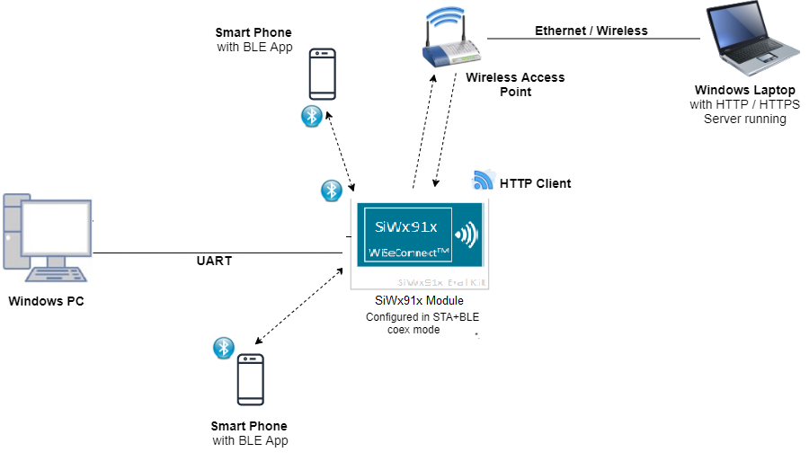
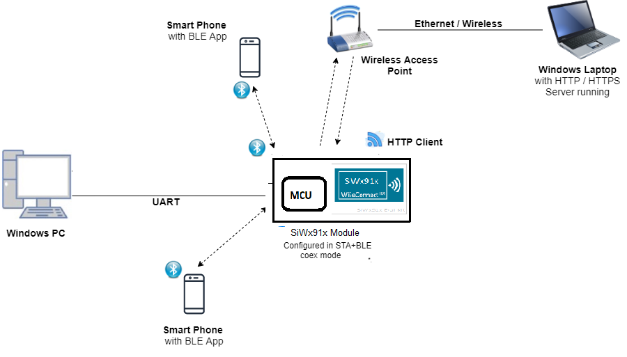
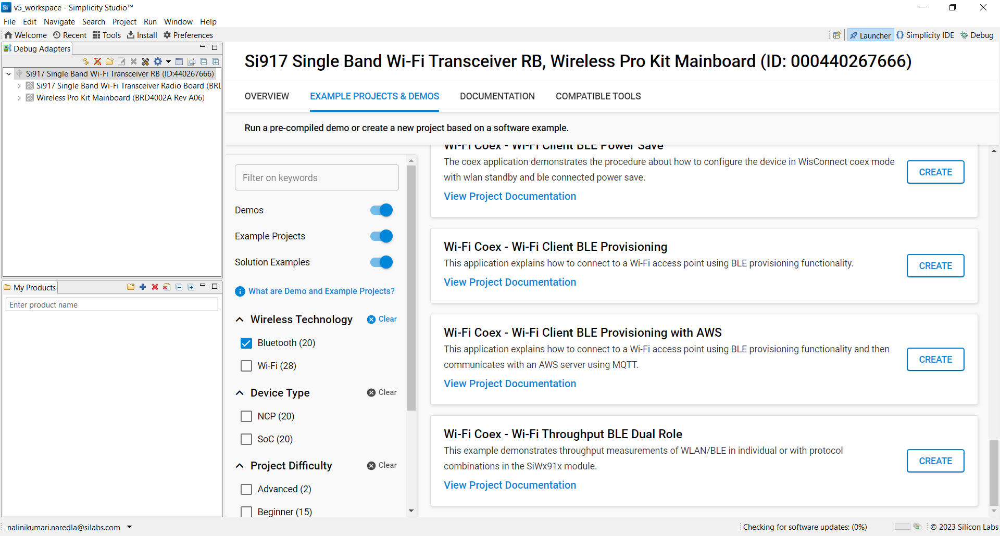
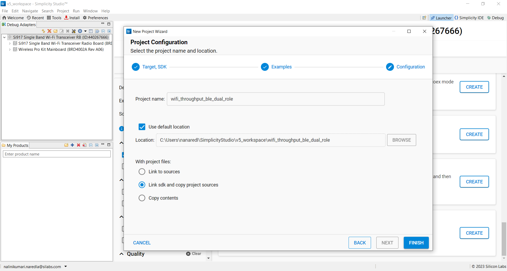
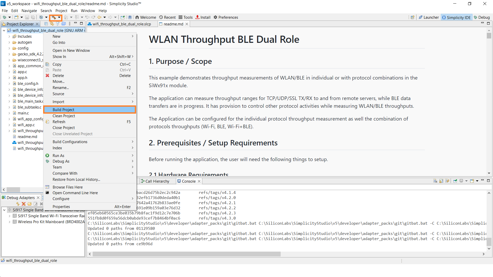
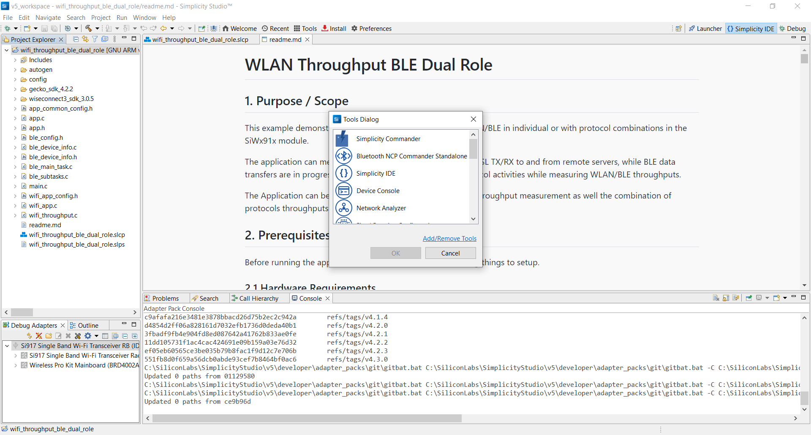
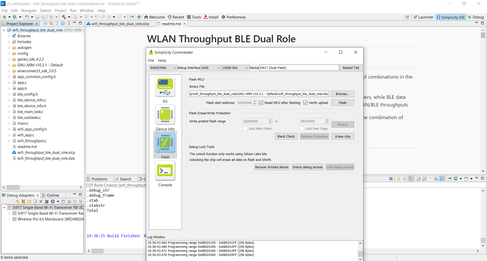

# WLAN Station BLE Throughput Application

## 1 Purpose/Scope
The coex application demonstrates throughput measurement of Wi-Fi while BLE is in connection.

The coex application has WLAN and BLE tasks and acts as an interface between Smartphone and PC. Smartphone interacts with BLE task, while Both PC and Silicon Labs device would be connected to a Wireless Access Point, thus both are connected together wirelessly. When Smartphone connects to Silicon Labs device. And data transfer will happen between Station and AP.

## 2. Prerequisites / Setup Requirements

Before running the application, the user will need the following things to setup.

### 2.1 Hardware Requirements

- Windows PC with Host interface (UART / SPI).
- SiWx91x Wi-Fi Evaluation Kit. The SiWx91x supports multiple operating modes. See [Operating Modes]() for details.
  - **SoC Mode**:
    - Silicon Labs [BRD4325A, BRD4325B, BRD4325C, BRD4325G, BRD4338A, BRD4340A](https://www.silabs.com/)
  - **NCP Mode**:
    - Silicon Labs [BRD4180B](https://www.silabs.com/); **AND**
    - Host MCU Eval Kit. This example has been tested with:
      - Silicon Labs [WSTK + EFR32MG21](https://www.silabs.com/development-tools/wireless/efr32xg21-bluetooth-starter-kit)
        
- Wireless Access Point
- Smart phone/tablet with BLE Application (Ex: Light Blue / BLE Connect App)
- Windows PC with iperf and openssl applications.






### 2.2 Software Requirements

- WiSeConnect SDK 3

- Embedded Development Environment

  - For Silicon Labs EFx32, use the latest version of [Simplicity Studio](https://www.silabs.com/developers/simplicity-studio)

  - Download and install iperf from this link [Iperf Application](https://iperf.fr/iperf-download.php).

  - Download and install OpenSSL from this link [OpenSSL](http://ufpr.dl.sourceforge.net/project/gnuwin32/openssl/0.9.8h-1/openssl-0.9.8h-1-bin.zip) to download openssl in remote PC.

- Download and install the Silicon Labs [EFR Connect App](https://www.silabs.com/developers/efr-connect-mobile-app) in the android smart phones for testing the BLE applications.  


Follow the [Getting Started with Wiseconnect3 SDK](https://docs.silabs.com/wiseconnect/latest/wiseconnect-getting-started/) guide to set up the hardware connections and Simplicity Studio IDE.

**NOTE**:

- The Host MCU platform (EFR32MG21) and the SiWx91x interact with each other through the SPI interface.

## 3 Project Environment

- Ensure the SiWx91x loaded with the latest firmware following the [Upgrade Si91x firmware](https://docs.silabs.com/wiseconnect/latest/wiseconnect-getting-started/getting-started-with-soc-mode#upgrade-si-wx91x-connectivity-firmware)

- Ensure the latest Gecko SDK along with the extension WiSeConnect3 is added to Simplicity Studio.

### 3.1 Creating the project

#### 3.1.1 SoC mode

- Ensure the SiWx91x set up is connected to your PC.

- In the Simplicity Studio IDE, the SiWx91x SoC board will be detected under **Debug Adapters** pane as shown below.

  ****

#### 3.1.2 NCP mode

- Ensure the EFx32 and SiWx91x set up is connected to your PC.

- In the Simplicity Studio IDE, the EFR32 board will be detected under **Debug Adapters** pane as shown below.

  ****

### 3.2 Importing the project

- Studio should detect your board. Your board will be shown here. Click on the board detected and go to **EXAMPLE PROJECTS & DEMOS** section 

#### SOC Mode

- Select **Wi-Fi Coex - Wi-Fi Client BLE Throughput App** test application

  ****

- Click 'Create'. The "New Project Wizard" window appears. Click 'Finish'

  ****

### 3.3 Set up for application prints

#### 3.3.1 Teraterm set up - for BRD4325A, BRD4325B, BRD4325C, BRD4325G, BRD4340A

You can use either of the below USB to UART converters for application prints.

1. Set up using USB to UART converter board.

   - Connect Tx (Pin-6) to P27 on WSTK
   - Connect GND (Pin 8 or 10) to GND on WSTK

   ****

2. Set up using USB to UART converter cable.

   - Connect RX (Pin 5) of TTL convertor to P27 on WSTK
   - Connect GND (Pin1) of TTL convertor to GND on WSTK

   ****

3. Open the Teraterm tool.

   - For SoC mode, choose the serial port to which USB to UART converter is connected and click on **OK**.

     ****

**Note:** For Other 917 SoC boards please refer section #3.3.2

#### 3.3.2 **Teraterm set up - for NCP and SoC modes**

1. Open the Teraterm tool.

- choose the J-Link port and click on **OK**.
    
    ****

2. Navigate to the Setup → Serial port and update the baud rate to **115200** and click on **OK**.

    ****

    ****

## 4 Application Build Environment

The application can be configured to suit your requirements and development environment. Read through the following sections and make any changes needed.

Open `wifi_app_config.h` file

**Wi-Fi Configuration**

Configure the following parameters to enable your Silicon Labs Wi-Fi device to connect to your Wi-Fi network.

```
#define SSID           "SILABS_AP"      // Wi-Fi Network Name
#define PSK            "1234567890"     // Wi-Fi Password
#define SECURITY_TYPE  SL_WIFI_WPA2     // Wi-Fi Security Type: SL_WIFI_OPEN / SL_WIFI_WPA / RSI_WPA2
```

**Client/Server IP Settings**

```c
#define DEVICE_PORT        <local_port>   // Local port to use
#define SERVER_PORT        <remote_port>  // Remote server port
#define SERVER_IP_ADDRESS  "192.168.0.100"     // Remote server IP address
#define BUF_SIZE 		   1400			  //! Memory length for send buffer
```

**Throughput Measurement Types**

The application may be configured to measure throughput using UDP, TCP, SSL packets. Choose the measurement type using the `THROUGHPUT_TYPE` macro.

```
#define THROUGHPUT_TYPE  TCP_TX     // Selects the throughput option; see the following diagrams. 
#define TCP_TX           0			// SiWx91x transmits packets to remote TCP client
#define TCP_RX           1			// SiWx91x receives packets from remote TCP server
#define UDP_TX           2			// SiWx91x transmits packets to remote UDP client
#define UDP_RX           3			// SiWx91x receives packets from remote UDP server
#define SSL_TX 			 4          // SiWx91x transmits packets to remote SSL client
#define SSL_RX           5          // SiWx91x receives packets from remote SSL server
```

To Load certificate to device flash.(Certificate could be loaded once and need not be loaded for every boot up)
   
```
#define  LOAD_CERTIFICATE                         0x01
```

Open `ble_app.c` file and update/modify following macros

RSI_BLE_CHAR_SERV_UUID refers to the attribute type of the characteristics to be added in a service.
   
```
#define  RSI_BLE_CHAR_SERV_UUID                         0x2803
```

RSI_BLE_CLIENT_CHAR_UUID refers to the attribute type of the client characteristics descriptor to be added in a service.
    
```
#define RSI_BLE_CLIENT_CHAR_UUID                        0x2902
```

RSI_BLE_NEW_SERVICE_UUID refers to the attribute value of the newly created service.

```
#define  RSI_BLE_NEW_SERVICE_UUID                       0xAABB
```

RSI_BLE_ATTRIBUTE_1_UUID refers to the attribute type of the first attribute under this service (RSI_BLE_NEW_SERVICE_UUID).

```
#define  RSI_BLE_ATTRIBUTE_1_UUID                        0x1AA1
```

RSI_BLE_ATTRIBUTE_2_UUID refers to the attribute type of the second attribute under this service (RSI_BLE_NEW_SERVICE_UUID).

```
#define RSI_BLE_ATTRIBUTE_2_UUID                         0x1BB1
```
RSI_BLE_MAX_DATA_LEN refers to the Maximum length of the attribute data.

```c
#define RSI_BLE_MAX_DATA_LEN                             20
```

RSI_BLE_APP_DEVICE_NAME refers to the name of the SiWx91x EVK to appear during scanning by remote devices.

```c
#define  RSI_BLE_APP_DEVICE_NAME                         "WLAN_BLE_APP"
```

The following are the **non-configurable** macros in the application.

RSI_BLE_ATT_PROPERTY_READ is used to set the READ property to an attribute value.

```
#define  RSI_BLE_ATT_PROPERTY_READ                       0x02
```

RSI_BLE_ATT_PROPERTY_WRITE is used to set the WRITE property to an attribute value.

```c
#define RSI_BLE_ATT_PROPERTY_WRITE                       0x08
```

RSI_BLE_ATT_PROPERTY_NOTIFY is used to set the NOTIFY property to an attribute value.

```c
#define  RSI_BLE_ATT_PROPERTY_NOTIFY                     0x10
```

## 5 Build and Test the Application

Follow the below steps for the successful execution of the application.

** SoC Mode **

- Once the project is created, click on the build icon (hammer) to build the project (or) right click on project and click on Build Project.

   
   
- Successful build output will show as below.
   
** NCP Mode **

   
   
- Successful build output will show as below.

### 5.2 Loading the Application Image

1. Click on Tools and Simplicity Commander as shown below.

   
   
2. Load the firmware image
 - Select the board. 
 - Browse the application image (.hex) and click on Flash button.

   

### 5.3 Steps to verify the WLAN Station BLE Throughput Example

1. Configure the Access point with internet connection in OPEN/WPA-PSK/WPA2-PSK mode to connect the SiWx91x EVK in STA mode.

2. Connect any serial console for prints.

3. When SiWx91x EVK enters BLE advertising mode, launch the BLE scanner App.

4. In the App, Silicon Labs module device will appear with the name configured in the macro RSI_BLE_APP_DEVICE_NAME (Ex: "WLAN_BLE_APP"),Initiate BLE connection from the App

5. After BT connection is established, verify on the App.

6. Once the BLE got the connected, The device which is configured as UDP/TCP/SSL server/client will connect to iperf server/client and sends/receives data continuously. It will print the throughput per second.

#### Testing Throughput

There are two 'ends' involved when measuring throughput, data is sent between the client end and the server end. By default, the Iperf protocol sends data from the Client to the Server to measure throughput. Depending on the configuration selected, the SiWx91x may be the client or the server. In general, it is advisable to start the server before the client since the client will immediately begin to try to connect to the server to send data. 

The following sections describe how to run the SiWx91x throughput application together with examples for various Iperf configurations that run on the PC.   

##### UDP Tx Throughput
To measure UDP Tx throughput, configure the SiWx91x as a UDP client and start a UDP server on the remote PC.
The Iperf command to start the UDP server on the PC is: 

> `C:\> iperf.exe -s -u -p <SERVER_PORT> -i 1`
> 
> For example ...
>
> `C:\> iperf.exe -s -u -p 5000 -i 1`


##### UDP Rx Throughput
To measure UDP Rx throughput, configure the SiWx91x as a UDP server and start a UDP client on the remote PC.
The Iperf command to start the UDP client is: 
	
> `C:\> iperf.exe -c <Module_IP> -u -p <Module_Port> -i 1 -b <Bandwidth> -t <time interval in seconds>`
>
> For example ...
>
> `C:\> iperf.exe -c 192.168.0.100 -u -p 5001 -i 1 -b 50M -t 30`  

**Note**: Increase the value of -t parameter, if it appears as if the application is hanging at data transmission stage, it is usually because application is waiting to receive more data. 


##### TCP Tx Throuhgput
To measure TCP Tx throughput, configure the SiWx91x as a TCP client and start a TCP server on the remote PC.
The Iperf command to start the TCP server is: 
		
> `C:\> iperf.exe -s -p <SERVER_PORT> -i 1`
>
> For example ...
>
> `C:\> iperf.exe -s -p 5001 -i 1`

##### TCP Rx Throughput
To measure TCP Rx throughput, configure the SiWx91x as TCP server and start a TCP client on the remote PC.
The Iperf command to start the TCP client is: 

> `C:\> iperf.exe -c <Module_IP> -p <module_PORT> -i 1 -t <time interval in sec>`
>
> For example ...
>
> `C:\> iperf.exe -c 192.168.0.100 -p 5001 -i 1 -t 30`  

##### SSL Tx Throughput
To measure SSL Tx throughput, configure the SiWx91x as a SSL client and start a SSL server on the remote PC as described in the following bullets:
- Copy the `SSL_Server_throughput_d.py` script from the release `/resources/scripts/` directory to the `/resources/certificates/` directory
- Open a command prompt and cd to the folder `/resources/certificates/`, then run the following command:
  - `C:\> python SSL_Server_throughput_d.py`


##### SSL Rx Throughput
To measure SSL RX throughput, configure the SiWx91x as a SSL client and open a SSL server on the remote PC as described in the following bullets:
- Copy the `SSL_tx_throughput.py` script from the release `/resources/scripts/` directory to the `/resources/certificates/`
- Open a command prompt and cd to the folder `/resources/certificates/`, then run the following command:
  - `C:\> python SSL_tx_throughput.py`


The SiWx91x, which is configured as a UDP/TCP/SSL server/client, connects to the iperf server/client and sends/receives data for configured intervals. While module is transmitting/receiving the data, application prints the throughput numbers in serial console.
> Note:
> Verify that all connections are stable and throughput is as expected.

## 5.4 Observing the output prints on serial terminal  

