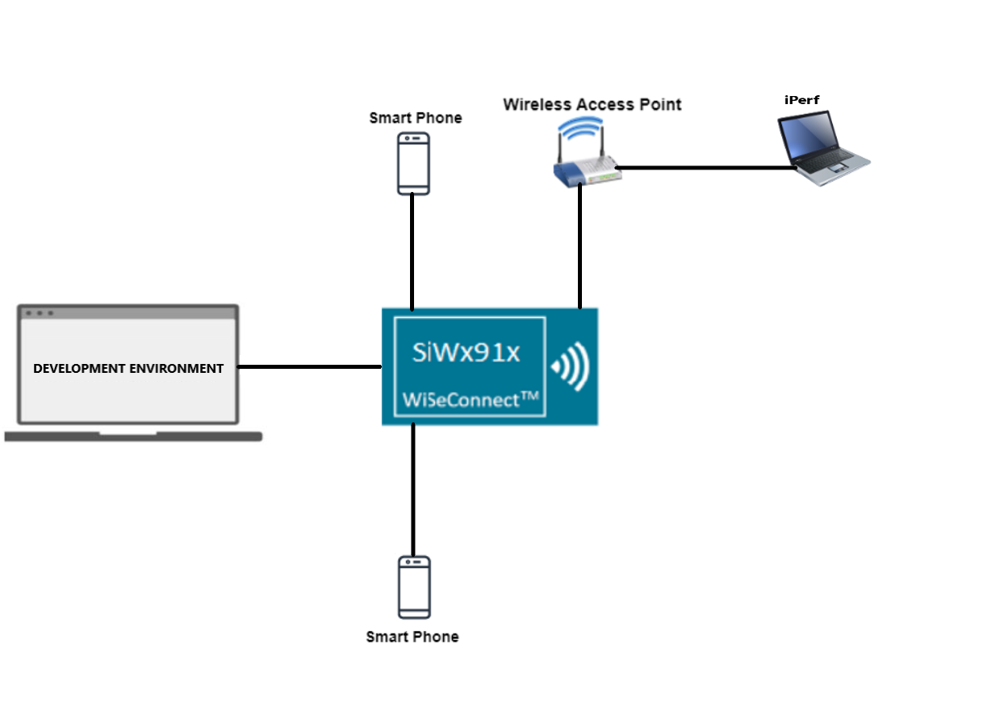
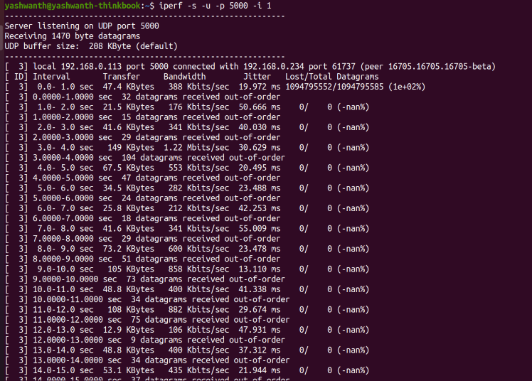
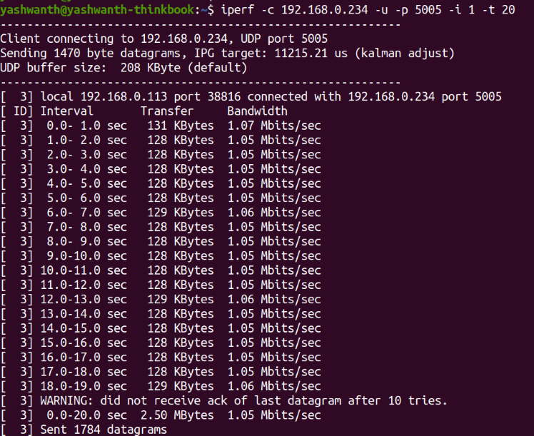
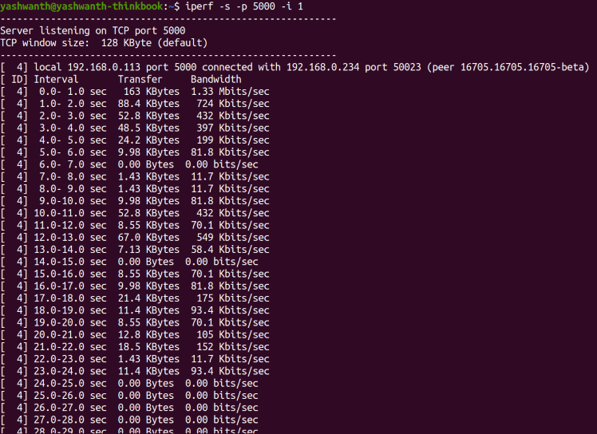
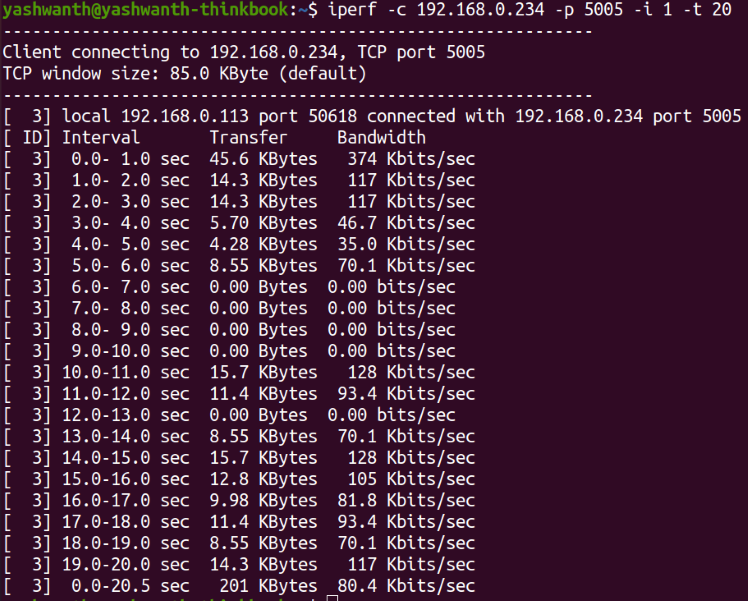
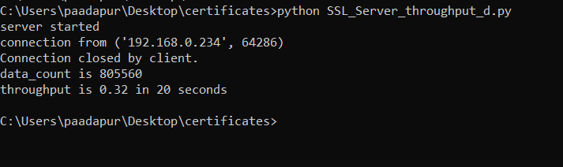
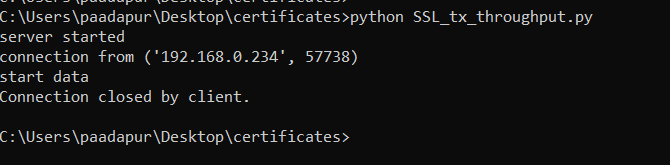
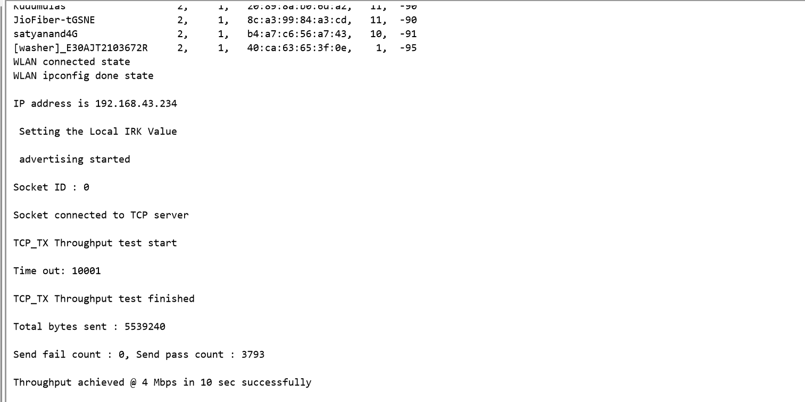

# Wi-Fi Coex - Wi-Fi Client BLE Throughput App

## Table of Contents

- [Wi-Fi Coex - Wi-Fi Client BLE Throughput App](#wi-fi-coex---wi-fi-client-ble-throughput-app)
  - [Table of Contents](#table-of-contents)
  - [Purpose/Scope](#purposescope)
  - [Prerequisites / Setup Requirements](#prerequisites--setup-requirements)
    - [Hardware Requirements](#hardware-requirements)
    - [Software Requirements](#software-requirements)
    - [Setup Diagram](#setup-diagram)
  - [Getting Started](#getting-started)
  - [Application Build Environment](#application-build-environment)
    - [Common Steps](#common-steps)
      - [WLAN throughputs: UDP/TCP/TLS unidirectional](#wlan-throughputs-udptcptls-unidirectional)
  - [Test the Application](#test-the-application)
  - [Optional: Dynamic BLE disable for WLAN throughput](#optional-dynamic-ble-disable-for-wlan-throughput)
    - [Runtime sequence when enabled](#runtime-sequence-when-enabled)
    - [Example serial output](#example-serial-output)

## Purpose/Scope

The coexistence application demonstrates Wi-Fi throughput measurement while a BLE central device is connected.

When **`SL_BLE_DYNAMIC_DISABLE_THROUGHPUT_DEMO`** is set to **1**, the application runs a second **WLAN throughput** measurement after BLE is disabled and then reconnects Wi‑Fi. See [Optional: Dynamic BLE disable for WLAN throughput](#optional-dynamic-ble-disable-for-wlan-throughput).

The coex application has WLAN and BLE tasks and acts as an interface between a smartphone and a PC. A smartphone interacts with the BLE task, while both PC and Silicon Labs device would be connected to a Wireless Access Point, thus both are connected together wirelessly when a smartphone connects to Silicon Labs device. Data transfer will happen between the Station and AP.

## Prerequisites / Setup Requirements

### Hardware Requirements

- Windows PC with Host interface (UART / SPI).
- SiWx91x Wi-Fi Evaluation Kit. The SiWx91x supports multiple operating modes. See [Operating Modes](https://docs.silabs.com/wiseconnect/latest/wiseconnect-api-reference-guide-wi-fi/sl-wifi-types#sl-wifi-operation-mode-t) for details.
- **SoC Mode**:
  - Standalone
    - BRD4002A Wireless pro kit mainboard [SI-MB4002A]
    - Radio Boards
      - BRD4338A [SiWx917-RB4338A]
      - BRD4339B [SiWx917-RB4339B]
      - BRD4340A [SiWx917-RB4340A]
      - BRD4343A [SiWx917-RB4343A]
  - Kits
    - SiWx917 Pro Kit [Si917-PK6031A](https://www.silabs.com/development-tools/wireless/wi-fi/siwx917-pro-kit?tab=overview)
    - SiWx917 Pro Kit [Si917-PK6032A]
    - SiWx917 AC1 Module Explorer Kit (BRD2708A)
  	
- **NCP Mode**:
  - Standalone
    - BRD4002A Wireless pro kit mainboard [SI-MB4002A]
    - EFR32xG24 Wireless 2.4 GHz +10 dBm Radio Board [xG24-RB4186C](https://www.silabs.com/development-tools/wireless/xg24-rb4186c-efr32xg24-wireless-gecko-radio-board?tab=overview)
    - NCP Expansion Kit with NCP Radio boards
      - (BRD4346A + BRD8045A) [SiWx917-EB4346A]
      - (BRD4357A + BRD8045A) [SiWx917-EB4357A]
  - Kits
    - EFR32xG24 Pro Kit +10 dBm [xG24-PK6009A](https://www.silabs.com/development-tools/wireless/efr32xg24-pro-kit-10-dbm?tab=overview)
  - Interface and Host MCU Supported
    - SPI - EFR32

- Wireless Access Point
- Smart phone/tablet with BLE Application (Ex: Light Blue / BLE Connect App)
- Windows PC with iPerf and openssl applications.

### Software Requirements

- Simplicity Studio
- Download and install iPerf from this link: [iPerf Application](https://sourceforge.net/projects/iperf2/files/iperf-2.0.8-win.zip/download). iPerf is a tool for active measurements of the maximum achievable bandwidth on IP networks. It supports tuning of various parameters related to timing, buffers and protocols (TCP and UDP with IPv4 and IPv6).
- Download and install OpenSSL from this link: [OpenSSL](http://ufpr.dl.sourceforge.net/project/gnuwin32/openssl/0.9.8h-1/openssl-0.9.8h-1-bin.zip) to download openssl in remote PC.
- Download and install the Silicon Labs [Simplicity Connect App(formerly EFR Connect App) or other BLE Central/Peripheral app.](https://www.silabs.com/developers/simplicity-connect-mobile-app ) in the android smart phones for testing BLE applications. Users can also use their choice of BLE apps available in Android/iOS smart phones.

### Setup Diagram



## Getting Started

Refer to the instructions [here](https://docs.silabs.com/wiseconnect/latest/wiseconnect-getting-started/) to:

- [Install Simplicity Studio](https://docs.silabs.com/wiseconnect/latest/wiseconnect-developers-guide-developing-for-silabs-hosts/#install-simplicity-studio)
- [Install WiSeConnect extension](https://docs.silabs.com/wiseconnect/latest/wiseconnect-developers-guide-developing-for-silabs-hosts/#install-the-wi-se-connect-extension)
- [Connect your device to the computer](https://docs.silabs.com/wiseconnect/latest/wiseconnect-developers-guide-developing-for-silabs-hosts/#connect-si-wx91x-to-computer)
- [Upgrade your connectivity firmware ](https://docs.silabs.com/wiseconnect/latest/wiseconnect-developers-guide-developing-for-silabs-hosts/#update-si-wx91x-connectivity-firmware)
- [Create a Studio project ](https://docs.silabs.com/wiseconnect/latest/wiseconnect-developers-guide-developing-for-silabs-hosts/#create-a-project)

For details on the project folder structure, see the [WiSeConnect Examples](https://docs.silabs.com/wiseconnect/latest/wiseconnect-examples/#example-folder-structure) page.

## Application Build Environment

The application can be configured to suit your requirements and development environment. Read through the following sections and make any changes needed.

1. Open `wifi_config.h` and edit the following parameters:

    - **Optional: Dynamic BLE disable for WLAN throughput**

      Set **`SL_BLE_DYNAMIC_DISABLE_THROUGHPUT_DEMO`** in **`wifi_config.h`**:

      | Value | WLAN throughput behavior |
      |-------|--------------------------|
      | **0** | One **WLAN throughput** run with BLE connected for the entire test (**`wlan_throughput_task()`** only). |
      | **1** | Two **WLAN throughput** runs: first with BLE connected, then after BLE disable with BLE off, followed by station disconnect, BLE re-enable, and Wi‑Fi reconnect to the same AP. |

      Full flow and expected serial output: [Optional: Dynamic BLE disable for WLAN throughput](#optional-dynamic-ble-disable-for-wlan-throughput).

      ```c
      #define SL_BLE_DYNAMIC_DISABLE_THROUGHPUT_DEMO 0   /* 0 = WLAN throughput with BLE; 1 = add second WLAN run after BLE off */
      ```

      **`CONTINUOUS_THROUGHPUT`** and **`SL_BLE_DYNAMIC_DISABLE_THROUGHPUT_DEMO`** are mutually exclusive: set **`CONTINUOUS_THROUGHPUT`** to **`0`** when using the dynamic BLE disable path.

    - **Runtime BLE enable/disable return codes (SDK)**

      Runtime **`rsi_ble_enable()`** and **`rsi_ble_disable()`** check internal BLE state before sending a firmware command; you do not need to call **`rsi_ble_state_is_enabled()`** in application code for a redundant call to be skipped.

      - **`rsi_ble_enable()`** — On success, BLE will be enabled. Otherwise, the API might return **`RSI_ERROR_COMMAND_GIVEN_IN_WRONG_STATE`** (BLE **already enabled**, no command sent) or **`SL_STATUS_NOT_INITIALIZED`** if the device is not initialized.
      - **`rsi_ble_disable()`** — On success, BLE will be disabled. Otherwise, the API might return **`RSI_ERROR_COMMAND_GIVEN_IN_WRONG_STATE`** (BLE **already disabled**, no command sent) or **`SL_STATUS_NOT_INITIALIZED`**.

      The BLE task posts the **`int32_t`** status from those APIs to **`ble_enable_done_queue`** / **`ble_disable_done_queue`**, so **`RSI_ERROR_COMMAND_GIVEN_IN_WRONG_STATE`** can appear there when the stack was already in the target state. This example treats non-success on those queues as failure; your product code may treat that specific code as a benign no-op if you only need idempotent enable/disable. Other BLE APIs may return **`RSI_ERROR_COMMAND_GIVEN_IN_WRONG_STATE`** if called while the stack is disabled.

    - **Wi-Fi Configuration**

      Configure the following parameters to enable your Silicon Labs Wi-Fi device to connect to your Wi-Fi network.

      ```c
      #define SSID           "SILABS_AP"      // Wi-Fi Network Name
      #define PSK            "1234567890"     // Wi-Fi Password
      #define SECURITY_TYPE  SL_WIFI_WPA2     // Wi-Fi Security Type: SL_WIFI_OPEN / SL_WIFI_WPA / RSI_WPA2
      ```

    - **Client/Server IP Settings**

      ```c
      #define DEVICE_PORT        <local_port>   // Local port to use
      #define SERVER_PORT        <remote_port>  // Remote server port
      #define SERVER_IP_ADDRESS  "192.168.0.100"    // Remote server IP address
      // BUFFER_SIZE is selected in wifi_config.h from TCP_BUFFER_SIZE / UDP_BUFFER_SIZE / TLS_BUFFER_SIZE based on THROUGHPUT_TYPE
      #define SOCKET_ASYNC_FEATURE 1                // Type of Socket used. Synchronous = 0, Asynchronous = 1
      ```

    - **Throughput Measurement Types**

      The application may be configured to measure throughput using UDP, TCP, or TLS. Set `THROUGHPUT_TYPE` to one of `UDP_RX`, `UDP_TX`, `TCP_TX`, `TCP_RX`, `TLS_TX`, or `TLS_RX` in `wifi_config.h`.

      ```c
      #define UDP_RX 1   // SiWx91x UDP server — receives from a remote UDP client (iPerf `-c` to module)
      #define UDP_TX 2   // SiWx91x UDP client — transmits to a remote UDP server (iPerf `-s` on PC)
      #define TCP_TX 4   // SiWx91x TCP client — transmits to a remote TCP server (iPerf `-s` on PC)
      #define TCP_RX 8   // SiWx91x TCP server — receives from a remote TCP client (iPerf `-c` to module)
      #define TLS_TX 16  // SiWx91x TLS client — transmits to a remote TLS server
      #define TLS_RX 32  // SiWx91x TLS client — receives from a remote TLS server (Python TLS server on PC)

      #define THROUGHPUT_TYPE TCP_RX   // Example selection (change to match your test)
      ```

2. To Load certificate to device flash. (The Certificate could be loaded once and need not be loaded for every boot up.)

   ```c
   #define  LOAD_CERTIFICATE                         0x01
   ```

3. Open `ble_app.c` file and update/modify following macros:

   - `RSI_BLE_CHAR_SERV_UUID` refers to the attribute type of the characteristics to be added in a service.

      ```c
      #define  RSI_BLE_CHAR_SERV_UUID                         0x2803
      ```

   - `RSI_BLE_CLIENT_CHAR_UUID` refers to the attribute type of the client characteristics descriptor to be added in a service.

     ```c
     #define RSI_BLE_CLIENT_CHAR_UUID                        0x2902
     ```

   - `RSI_BLE_NEW_SERVICE_UUID` refers to the attribute value of the newly created service.

      ```c
      #define  RSI_BLE_NEW_SERVICE_UUID                       0xAABB
      ```

   - `RSI_BLE_ATTRIBUTE_1_UUID` refers to the attribute type of the first attribute under this service (RSI_BLE_NEW_SERVICE_UUID).

      ```c
      #define  RSI_BLE_ATTRIBUTE_1_UUID                        0x1AA1
      ```

   - `RSI_BLE_ATTRIBUTE_2_UUID` refers to the attribute type of the second attribute under this service (RSI_BLE_NEW_SERVICE_UUID).

      ```c
      #define RSI_BLE_ATTRIBUTE_2_UUID                         0x1BB1
      ```

   - `RSI_BLE_MAX_DATA_LEN` refers to the Maximum length of the attribute data.

      ```c
      #define RSI_BLE_MAX_DATA_LEN                             20
      ```

   - `RSI_BLE_DEVICE_NAME` refers to the name of the SiWx91x EVK to appear during scanning by remote devices.

      ```c
      #define  RSI_BLE_DEVICE_NAME                         "BLE_THROUGHPUT_APP"
      ```

   The following are the **non-configurable** macros in the application.

   - `RSI_BLE_ATT_PROPERTY_READ` is used to set the READ property to an attribute value.

      ```c
      #define  RSI_BLE_ATT_PROPERTY_READ                       0x02
      ```

   - `RSI_BLE_ATT_PROPERTY_WRITE` is used to set the WRITE property to an attribute value.

      ```c
      #define RSI_BLE_ATT_PROPERTY_WRITE                       0x08
      ```

   - `RSI_BLE_ATT_PROPERTY_NOTIFY` is used to set the NOTIFY property to an attribute value.

      ```c
      #define  RSI_BLE_ATT_PROPERTY_NOTIFY                     0x10
      ```

### Common Steps

#### WLAN throughputs: UDP/TCP/TLS unidirectional

1. Build and flash the project in Simplicity Studio (SoC: flash the SiWx917 EVK; NCP: flash the host project per your board — see [Getting Started](#getting-started)).

2. To measure **WLAN throughput**, run the iPerf commands or TLS scripts below on the remote PC.

   > **Note (RX timing):** For asynchronous RX modes (`UDP_RX` / `TCP_RX`) the throughput timer starts when the **first RX packet** is received (not when the receive function is entered). This avoids counting “idle wait” time before traffic starts and is the intended throughput measurement behavior.

3. To measure **UDP Tx** throughput, configure module as UDP client and open UDP server in remote port using following command. To establish UDP Server on remote PC, open [iPerf Application](https://sourceforge.net/projects/iperf2/files/iperf-2.0.8-win.zip/download) and run the below command from the installed folder's path in the command prompt.

    ```sh
    iperf.exe -s -u -p <SERVER_PORT> -i 1
    ```

   Example: iperf.exe -s -u -p 5001 -i 1 
    

4. To measure **UDP Rx** througput, configure module as UDP server and open UDP client in remote port using below command

    ```sh
    iperf.exe -c <Module_IP> -u -p <DEVICE_PORT> -i 1 -b<Bandwidth> -t <duration in sec>
    ```

    > **Note:** In async `UDP_RX` single-shot mode, the module waits indefinitely until the first packet is received (there is no timeout if the client never starts). The throughput measurement window starts when the first packet arrives.
  
    Example: iperf.exe -c 192.168.0.1 -u -p 5001 -i 1 -b50M -t 100
  
    

5. To measure **TCP Tx** throughput, configure module as TCP client and open TCP server in remote port using below command. To establish TCP Server on remote PC, open [iPerf Application](https://sourceforge.net/projects/iperf2/files/iperf-2.0.8-win.zip/download) and run the below command from the installed folder's path in the command prompt.

    ```sh
    iperf.exe -s -p <SERVER_PORT> -i 1
    ```
  
   Example: iperf.exe -s -p 5001 -i 1

   

6. To measure **TCP Rx** througput, configure module as TCP server and open TCP client in remote port using the following command:

    ```sh
            iperf.exe -c <Module_IP> -p <DEVICE_PORT> -i 1 -t <duration in sec>
    ```

    > **Note:** In async `TCP_RX` single-shot mode, the module waits indefinitely until the first packet is received (there is no timeout if the client never starts). The throughput measurement window starts when the first packet arrives.

   Example: iperf.exe -c 192.168.0.1 -p 5001 -i 1 -t 100

    

> **Note:** The client must set the SNI extension when connecting to an AWS server using TLS 1.3 version.

7. To measure **TLS Tx** throughput, configure module in TLS client and follow below steps to run TLS server in windows

   - Copy SSL_Server_throughput_d.py from release/resources/scripts/ to release/resources/certificates/

   - Open command prompt in folder release/resources/certificates/ and run below command

      ```sh
              python SSL_Server_throughput_d.py
      ```

    

8. To measure **TLS Rx** throughput, configure the module for `TLS_RX` in `wifi_config.h` and follow the steps below to run the TLS server on Windows.

   - Copy `SSL_tx_throughput.py` from **release/resources/scripts/** to **release/resources/certificates/**.

   - Change the port number from `5001` to the value configured as **`TLS_SERVER_PORT`** in `wifi_config.h`.

   - Open the command prompt in folder release/resources/certificates/ and run the following command:

      > **Note:**
      > Python version: 3.9.0

      ```sh
          python SSL_tx_throughput.py
      ```

      

> **Note**: For recommended settings, please refer the [recommendations guide](https://docs.silabs.com/wiseconnect/latest/wiseconnect-developers-guide-prog-recommended-settings/).

## Test the Application

Refer to the instructions [here](https://docs.silabs.com/wiseconnect/latest/wiseconnect-getting-started/) to build, flash, run, and debug the application.

1. Configure **`SSID`**, **`PSK`**, and **`THROUGHPUT_TYPE`** in **`wifi_config.h`**.
2. Start the iPerf or TLS server on the PC (see [WLAN throughputs](#wlan-throughputs-udptcptls-unidirectional)).
3. Connect a BLE central (Simplicity Connect or similar) to **`BLE_THROUGHPUT_APP`** before WLAN connects — the Wi‑Fi task waits on **`ble_conn_sem`** until BLE is connected.
4. Observe **WLAN throughput** results on the serial terminal and on the PC (iPerf / TLS server).

   

When **`SL_BLE_DYNAMIC_DISABLE_THROUGHPUT_DEMO`** is **1**, expect two **WLAN throughput** measurement passes and additional BLE disable/enable logs. See [Example serial output](#example-serial-output).

## Optional: Dynamic BLE disable for WLAN throughput

Compiled when **`SL_BLE_DYNAMIC_DISABLE_THROUGHPUT_DEMO`** is **1** in **`wifi_config.h`**.

### Overview

| `SL_BLE_DYNAMIC_DISABLE_THROUGHPUT_DEMO` | Behavior |
|------------------------------------------|----------|
| **0** | Single **WLAN throughput** measurement with BLE connected. |
| **1** | **WLAN throughput** with BLE on → BLE disable → **WLAN throughput** with BLE off → **`sl_wifi_disconnect()`** → BLE re-enable → reconnect to the **same AP** (**`SSID`** / **`PSK`** from **`wifi_config.h`**). |

This example does **not** use BLE Wi‑Fi provisioning. WLAN credentials are fixed at build time; reconnect uses the same **`SSID`** and **`PSK`**, not a new AP.

### Runtime sequence when enabled

1. BLE central connects; device advertises until connected (advertising stops on connection).
2. WLAN connects and obtains DHCP.
3. **First WLAN throughput** — **`wlan_throughput_task()`** runs while BLE is connected.
4. **`rsi_ble_app_request_disable()`** — called from the Wi‑Fi task **immediately after** the first **`wlan_throughput_task()`** returns (not before WLAN connect, not during the throughput transfer).
5. BLE task: **`rsi_ble_disconnect()`** → **`rsi_ble_disable()`**. On **`rsi_ble_disconnect()`** failure, status is posted to **`ble_disable_done_queue`** immediately.
6. **Second WLAN throughput** — **`wlan_throughput_task()`** runs again with BLE disabled.
7. **`sl_wifi_disconnect()`** — called **after** the second **`wlan_throughput_task()`** completes (not during either throughput run).
8. **`rsi_ble_app_request_enable()`** — BLE stack re-enabled only; **`rsi_ble_start_advertising()`** is **not** called. No new phone connection is required.
9. **`wifi_app_init_and_reconnect()`** — **`sl_wifi_connect()`** to the **same AP** configured in **`wifi_config.h`**, then DHCP.

### Example serial output

**Macro = 0** — one **`in wlan_throughput_task`** pass, then throughput stats for the selected **`THROUGHPUT_TYPE`**.

**Macro = 1** — expect this order on UART:

1. First pass: **`in wlan_throughput_task`** → WLAN throughput result (BLE connected).
2. Second pass: **`in wlan_throughput_task`** → WLAN throughput result (BLE disabled).
3. **`Dynamic demo: sl_wifi_disconnect`** (on success, no error line).
4. After BLE re-enable and reconnect: **`WLAN connected`** and DHCP IP print from **`wifi_app_init_and_reconnect()`**.

See below for reference.

   

   
