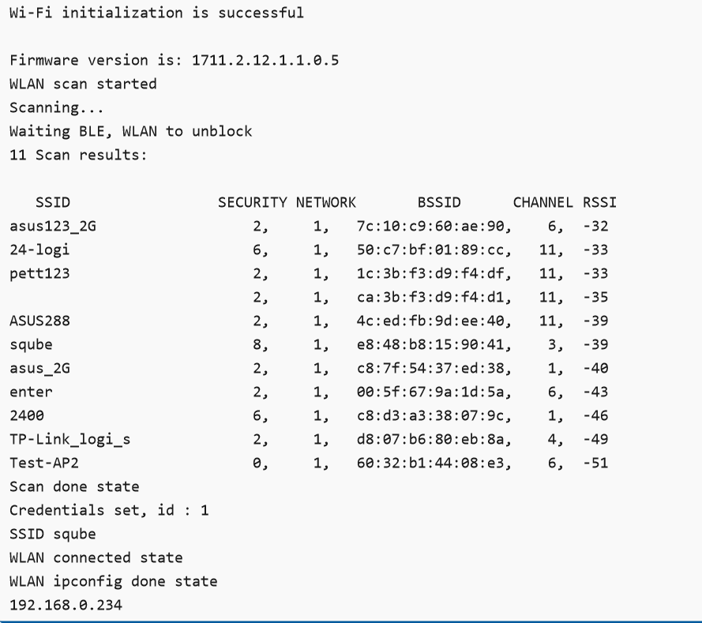

# WLAN Throughput BLE Dual Role 

## 1. Purpose / Scope

This example demonstrates throughput measurements of WLAN/BLE in individual or with protocol combinations in the SiWx91x module.

The application can measure throughput ranges for TCP/UDP/SSL TX/RX to and from remote servers, while BLE data transfers are in progress. It has provision to control other protocol activities while measuring WLAN/BLE throughputs.

The Application can be configured for the individual protocol throughput measurement as well the combination of protocols throughputs (Wi-Fi, BLE, Wi-Fi+BLE).

## 2. Prerequisites / Setup Requirements

Before running the application, the user will need the following things to setup.

### 2.1 Hardware Requirements

- Windows PC with Host interface (UART / SPI).
- SiWx91x Wi-Fi Evaluation Kit. The SiWx91x supports multiple operating modes. See [Operating Modes]() for details.
  - **SoC Mode**:
    - Silicon Labs [BRD4325A, BRD4325B, BRD4325C, BRD4325G, BRD4338A](https://www.silabs.com/)
  - **NCP Mode**:
    - Silicon Labs [BRD4180B](https://www.silabs.com/); **AND**
    - Host MCU Eval Kit. This example has been tested with:
      - Silicon Labs [WSTK + EFR32MG21](https://www.silabs.com/development-tools/wireless/efr32xg21-bluetooth-starter-kit)
- Wireless Access Point
- Smart phone/tablet with BLE Application (Ex: Light Blue / BLE Connect App)
- Windows PC with iperf and openssl applications.


Follow the [Getting Started with Wiseconnect3 SDK](https://docs.silabs.com/wiseconnect/latest/wiseconnect-getting-started/) guide to set up the hardware connections and Simplicity Studio IDE.

### 2.2 Software Requirements

- WiSeConnect SDK 3

- Embedded Development Environment

  - For Silicon Labs EFx32, use the latest version of [Simplicity Studio](https://www.silabs.com/developers/simplicity-studio)

  - Download and install iperf from this link [Iperf Application](https://iperf.fr/iperf-download.php).

  - Download and install OpenSSL from this link [OpenSSL](http://ufpr.dl.sourceforge.net/project/gnuwin32/openssl/0.9.8h-1/openssl-0.9.8h-1-bin.zip) to download openssl in remote PC.

- Download and install the Silicon Labs [EFR Connect App](https://www.silabs.com/developers/efr-connect-mobile-app) in the android smart phones for testing the BLE applications.  

## 3 Project Environment

- Ensure the SiWx91x loaded with the latest firmware following the [Upgrade Si91x firmware](https://docs.silabs.com/wiseconnect/latest/wiseconnect-getting-started/getting-started-with-soc-mode#upgrade-si-wx91x-connectivity-firmware)

- Ensure the latest Gecko SDK along with the extension WiSeConnect3 is added to Simplicity Studio.

### 3.1 Creating the project

#### 3.1.1 SoC mode

- Ensure the SiWx91x set up is connected to your PC.

- In the Simplicity Studio IDE, the SiWx91x SoC board will be detected under **Debug Adapters** pane as shown below.

  ****

#### 3.1.2 NCP mode

- Ensure the EFx32 and SiWx91x set up is connected to your PC.

- In the Simplicity Studio IDE, the EFR32 board will be detected under **Debug Adapters** pane as shown below.

  ****

### 3.2 Importing the project

- Studio should detect your board. Your board will be shown here. Click on the board detected and go to **EXAMPLE PROJECTS & DEMOS** section 

#### SOC Mode

- Select **Wi-Fi Coex - Wi-Fi Throughput BLE Dual Role** test application

  ****

- Click 'Create'. The "New Project Wizard" window appears. Click 'Finish'

  ****

### 3.3 Set up for application prints

#### 3.3.1 Teraterm set up - for BRD4325A, BRD4325B, BRD4325C, BRD4325G

You can use either of the below USB to UART converters for application prints.

1. Set up using USB to UART converter board.

   - Connect Tx (Pin-6) to P27 on WSTK
   - Connect GND (Pin 8 or 10) to GND on WSTK

   ****

2. Set up using USB to UART converter cable.

   - Connect RX (Pin 5) of TTL convertor to P27 on WSTK
   - Connect GND (Pin1) of TTL convertor to GND on WSTK

   ****

3. Open the Teraterm tool.

   - For SoC mode, choose the serial port to which USB to UART converter is connected and click on **OK**.

     ****

**Note:** For Other 917 SoC boards please refer section #3.3.2

#### 3.3.2 **Teraterm set up - for NCP and SoC modes**

1. Open the Teraterm tool.

- choose the J-Link port and click on **OK**.
    
    ****

2. Navigate to the Setup → Serial port and update the baud rate to **115200** and click on **OK**.

    ****

    ****

## 4. Application Configuration Parameters

The application can be configured to suit your requirements and development environment. Read through the following sections and make any changes needed.

### 4.1 WLAN Throughput

**4.1.1** Open `rsi_common_config.h` file and configure below macros.

This section explains how to configure the application to measure TCP/UDP/SSL unidirectional throughput in alone or with combination of BT/BLE activities.

Set below macros to 1 to measure **WLAN** alone throughput

```c
#define RSI_ENABLE_WLAN_TEST    1 //Set this to 0 to disable WLAN
#define WLAN_THROUGHPUT_TEST    1 //Set this to 0 while measuring BLE throughput
```

Set below macros to 1 to measure **WLAN** throughput along with specific **BLE** activity.

```c
#define RSI_ENABLE_WLAN_TEST    1 //Set this to 0 to disable WLAN
#define WLAN_THROUGHPUT_TEST    1 //Set this to 0 while measuring BLE throughput
#define RSI_ENABLE_BLE_TEST     1 //Set this to 0 to disable BLE
```

> Note:
>
> While measuring WLAN throughput along with BLE activities, ensure 'BLE_THROUGHPUT_TEST' is set to '0'

Set below macros to 1 to measure **WLAN** throughput along with specific **BT** activity.

```c
#define RSI_ENABLE_WLAN_TEST    1 //Set this to 0 to disable WLAN
#define WLAN_THROUGHPUT_TEST    1 //Set this to 0 while measuring BLE throughput
#define RSI_ENABLE_BT_TEST      1 //Set this to 0 to disable BT
```

Set below macros to 1 to measure **WLAN** throughput along with **BT and BLE** activities.

```c
#define RSI_ENABLE_WLAN_TEST    1 //Set this to 0 to disable WLAN
#define WLAN_THROUGHPUT_TEST    1 //Set this to 0 while measuring BLE throughput
#define RSI_ENABLE_BLE_TEST     1 //Set this to 0 to disable BLE
#define RSI_ENABLE_BT_TEST      1 //Set this to 0 to disable BT
```

> Note:
>
> While measuring WLAN throughput with BLE activities ensure 'BLE_THROUGHPUT_TEST' is set to '0'

If BLE is enabled, configure specific activity of BLE using below macros.

- **BLE operations**: Set any one of below macros to choose desired BLE activity

```c
#define BLE_INIT_DONE                       0           //! make it 1 for BLE init only
#define BLE_CONNECTED                       0           //! make it 1 for BLE connection only
#define BLE_DATA_TRANSFER_START             1           //! make it 1 for BLE data transfer
```

By default, BLE_DATA_TRANSFER_START is set to '1', that means WLAN measurement will start after BLE GATT data transfers choose the required **operational mode** of SiWx91x module.

Valid Configurations are:

- 0  - WLAN alone mode
- 13 - WLAN + BLE mode

> Note:
>
> By default, opermode is set to WLAN+BLE

**4.1.2** Select WLAN configurations in `wifi_app_config.h` file

Enter the AP Connectivity essentials configs as the value to SSID, SECURITY_TYPE and PSK

```c
#define     SSID                       "SILABS_AP"
#define     SECURITY_TYPE              RSI_WPA2
#define     PSK                        "12345678"
```

Channel no in which device should scan choose

```c
#define     CHANNEL_NO                 0       //! 0 - scan all channels
```

Port number of remote server

```c
#define     SERVER_PORT                5001
```

While verifying SSL RX throughput, port number of remote server should be configured below

```c
#define     SSL_SERVER_PORT         5002
```

IP address of remote server

```c
#define     SERVER_IP_ADDRESS          "192.168.0.102"
```

Port number of module

```c
#define     DEVICE_PORT                5001
```

To select the ip, configure below macros

```c
#define     DHCP_MODE                  1           // 0 enable or disable
```

Choose the throughput type by configuring below macro

```c
#define     THROUGHPUT_TYPE            TCP_TX 
```

   Valid Configurations of THROUGHPUT_TYPE:

- UDP_TX → UDP transmit
- UDP_RX → UDP receive
- TCP_TX → TCP transmit
- TCP_RX → TCP receive
- SSL_TX → SSL transmit
- SSL_RX → SSL receive

Average time required to measure UDP_TX/TCP_TX throughput

```c
#define     THROUGHPUT_AVG_TIME        60000    //60sec of throughput numbers average
```

Maximum no. of packets required to measure UDP_RX

```c
#define     MAX_TX_PKTS                10000
```

Configure below macro to choose throughput measurement type . This option is valid while measuring WLAN alone throughput

```c
#define     CONTINUOUS_THROUGHPUT      0
```

If **CONTINUOUS_THROUGHPUT** is set to '1', then application measures throughput for every interval of 'THROUGHPUT_AVG_TIME' independent of throughput type. If **CONTINUOUS_THROUGHPUT** is set to '0', then throughput is calculated only once for interval of 'THROUGHPUT_AVG_TIME' in case of UDP/TCP TX , for MAX_TX_PKTS in case of UDP RX/ SSL TX and for default interval provided by server in case of TCP RX/SSL RX.

> Note:
>
> 1. By default, 'CONTINUOUS_THROUGHPUT' is set to '0' 
> 2. If CONTINUOUS_THROUGHPUT is set to '1', then ensure that client/server should run with interval at least greater than THROUGHPUT_AVG_TIME

**4.1.3** Open `ble_config.h` file

BLE Advertise name

```c
#define     RSI_BLE_APP_GATT_TEST       (void *)"SI_COEX_MAX_DEMO" 
```

Configure BLE advertising interval

```c
#define     RSI_BLE_ADV_INT_MIN         0x06a8 //! 1065ms
#define     RSI_BLE_ADV_INT_MAX         0x06a8 //! 1065ms
```

Configure below macros to set connection interval, connection latency and connection supervision timeout

```c
#define     CONN_INTERVAL_C1            1600    // connection interval:2s
#define     CONN_LATENCY_C1             0       // latency : 0
#define     CONN_SUPERVISION_TIMEOUT_C1 1600   
```

### 4.2 BLE throughput

This section explains user how to configure the application for measuring BLE Tx/Rx throughput using sniffer in alone or with combination of WLAN/BT.

**4.2.1** Open `rsi_common_config.h` file

Set below macro to 1 to measure **BLE** alone throughput

```c
#define     RSI_ENABLE_BLE_TEST        1 //Set this to 0 to disable BLE
#define     BLE_THROUGHPUT_TEST        1 //Set this to 0 for normal BLE operation
```

Set below macros to 1 to measure **BLE** throughput along with specific **WLAN** activity.

```c
#define     RSI_ENABLE_BLE_TEST        1 //Set this to 0 to disable BLE
#define     BLE_THROUGHPUT_TEST        1 //Set this to 0 for normal BLE operation
#define     RSI_ENABLE_WLAN_TEST       1 //Set this to 0 to disable WLAN
```

> Note:
> While measuring BLE throughput with WLAN activities, ensure 'WLAN_THROUGHPUT_TEST' is set to '0'

Set below macros to 1 to measure **BLE** throughput.

```c
#define     RSI_ENABLE_BLE_TEST        1 //Set this to 0 to disable BLE
#define     BLE_THROUGHPUT_TEST        1 //Set this to 0 for normal BLE operation
```

Set below macros to 1 to measure **BLE** throughput and **WLAN** activities.

```c
#define     RSI_ENABLE_BLE_TEST        1 //Set this to 0 to disable BLE
#define     BLE_THROUGHPUT_TEST        1 //Set this to 0 for normal BLE operation
#define     RSI_ENABLE_WLAN_TEST       1 //Set this to 0 to disable WLAN
```

> Note:
> While measuring BLE throughput with WLAN activities ensure 'WLAN_THROUGHPUT_TEST' is set to '0'.

If WLAN is enabled, configure specific activity of WLAN using below macros.

**WLAN operations:** set any one of below macros to choose desired **BLE** activity

```c
#define     WLAN_SCAN_ONLY             0           //! make it 1 for WLAN scan only
#define     WLAN_CONNECT_ONLY          0           //! make it 1 for WLAN connection only
#define     WLAN_DATATRANSFER          1           //! make it 1 for WLAN TCP TX
```

**4.2.2** Open `ble_config.h` file

BLE Advertise name

```c
#define     RSI_BLE_APP_GATT_TEST       (void *)"SI_COEX_MAX_DEMO"
```

Configure BLE advertising interval

```c
#define     RSI_BLE_ADV_INT_MIN         0x06a8 //! 1065ms
#define     RSI_BLE_ADV_INT_MAX         0x06a8 //! 1065ms
```

Configure below macros to set connection interval, connection latency and connection supervision timeout

```c
#define     CONN_INTERVAL_C1            9   // connection interval:1.125ms
#define     CONN_LATENCY_C1             0   // latency : 0
#define     CONN_SUPERVISION_TIMEOUT_C1 1600   
```

Configure below macros to enable/disable data length extension mode

```c
#define     DLE_ON_C1                   1   // 1- DLE ON, 0- DLE OFF 
```

Configure BLE data transfer type

```c
#define     RX_NOTIFICATIONS_FROM_C1    0  //! set below macro to receive 'gatt notifications' from remote device
#define     RX_INDICATIONS_FROM_C1      0  //! set below macro to receive 'gatt indications' from remote device
#define     TX_NOTIFICATIONS_TO_C1      1  //! set below macro to Transmit 'gatt notifications' to remote device
#define     TX_WRITES_TO_C1             0  //! set below macro to Transmit 'gatt write with response' to remote device
#define     TX_WRITES_NO_RESP_TO_C1     0  //! set below macro to Transmit 'gatt write without response' to remote device
#define     TX_INDICATIONS_TO_C1        0  //! set below macro to Transmit 'gatt indications' to remote device
```

> Note:
> By default, all BLE configurations are chosen to get high BLE throughput.

**4.2.3** Select WLAN configurations in `wifi_app_config.h`

Enter the AP Connectivity essentials configs as the value to SSID, SECURITY_TYPE and PSK

```c
#define     SSID                        "SILABS_AP"
#define     SECURITY_TYPE               RSI_WPA2
#define     PSK                         "12345678"
```

Channel no in which device should scan choose

```c
#define     CHANNEL_NO                  0       //! 0 - scan all channels
```

Configure throughput type as TCP_TX

```c
#define     THROUGHPUT_TYPE          TCP_TX 
```

## 5. Build and Test the Application

- Follow the below steps for the successful execution of the application.

- Follow the below steps for the successful execution of the application.

### 5.1 Build the Application

- Follow the below steps for the successful execution of the application.

#### SoC Mode

- Once the project is created, click on the build icon (hammer) to build the project (or) right click on project and click on Build Project.

   

- Successful build output will show as below.

#### NCP Mode

   

- Successful build output will show as below.

### 5.2 Loading the Application Image

1. Click on Tools and Simplicity Commander as shown below.

   

2. Load the firmware image

- Select the board.
- Browse the application image (.hex) and click on Flash button.

   

### 5.3 Common Steps

### 5.3.1 WLAN throughputs: UDP/TCP/SSL unidirectional

1. Compile the project and flash the binary onto STM32

2. To measure **WLAN throughput** , run the below iperf commands or ssl scripts

- To measure **UDP Tx** throughput, configure module as UDP client and open UDP server in remote port using below command

  ```sh
           iperf.exe -s -u -p <SERVER_PORT> -i 1
  ```

  ex: iperf.exe -s -u -p 5001 -i 1

- To measure **UDP Rx** througput, configure module as UDP server and open UDP client in remote port using below command

  ```sh
           iperf.exe -c <Module_IP> -u -p <DEVICE_PORT> -i 1 -b<Bandwidth> -t <duration in sec>
  ```
  
  ex: iperf.exe -c 192.168.0.1 -u -p 5001 -i 1 -b50M -t 100

- To measure **TCP Tx** throughput, configure module as TCP client and open TCP server in remote port using below command

  ```sh
           iperf.exe -s -p <SERVER_PORT> -i 1
  ```
  
  ex: iperf.exe -s -p 5001 -i 1

- To measure **TCP Rx** througput, configure module as TCP server and open TCP client in remote port using below command

  ```sh
           iperf.exe -c <Module_IP> -p <DEVICE_PORT> -i 1 -t <duration in sec>
  ```

  ex: iperf.exe -c 192.168.0.1 -p 5001 -i 1 -t 100

- To measure **SSL Tx** throughput, configure module in SSL client and follow below steps to run SSL server in windows

  - Copy SSL_Server_throughput_d.py from release/resources/scripts/ to release/resources/certificates/

  - Open command prompt in folder release/resources/certificates/ and run below command

  ```sh
           python SSL_Server_throughput_d.py
  ```

- To measure **SSL Rx** throughput, configure module in SSL client and follow below steps to run SSL server in windows

  - Copy SSL_tx_throughput.py from release/resources/scripts/ to release/resources/certificate

  - Change port no. from "5001" to the value configured in "SSL_RX_SERVER_PORT"

  - Open command prompt in folder release/resources/certificates/ and run below command

  ```sh
           python SSL_tx_throughput.py
   ```

3. After the program gets executed, Module scans for the configured Access point, connects to it.

4. Acquires the ip address and waits for ble activities to complete if configured.

6. Scan for BLE advertise name (RSI_BLE_APP_GATT_TEST) using nRF connect (Android app)/ BLE dongles and initiate ble connection if found.

7. For BLE data transfer, enable GATT notifications of Module on service characteristic RSI_BLE_ATTRIBUTE_1_UUID (0x1AA1) using nRF connect. 

8. If Gatt Notification are enabled, module continuously transmits notifications per connection interval of size 20/232 bytes.

11. Once above activities are completed, Module transmits/receives packets based on the configuration selected and measures the WLAN throughput

> Note:
> Verify that all connections are stable and throughput is as expected.

**Note:** In this release, due to low SPI frequency in EFR, wlan throughput are less compared to STM. Work is in progress to support the high frequency.

### 5.3.2 BLE throughput

1. Compile the project and flash the binary onto STM32

2. If WLAN is configured, run the below iperf command (Note: Ensure module is configured as TCP client)

   ```sh
     iperf.exe -s -p <SERVER_PORT> -i 1
   ```

   ex: iperf.exe -s -p 5001 -i 1

3. After the program gets executed, Module scans for the configured Access point, connects to it and acquires the ip address

4. After acquiring ip address, connects to remote server and starts tcp download

5. After successful connection, transmit the data using same android app to module.

6. Module receives the data transmitted by app and retransmits the same to BT SPP manager app.

7. After completion of WLAN, scan for BLE advertise name (RSI_BLE_APP_GATT_TEST) using nRF connect (Android app)/ BLE dongles and initiate ble connection if found.

8. After successful connection, enable Gatt notifications of Module on service characteristic RSI_BLE_ATTRIBUTE_1_UUID (0x1AA1) using nRF connect.

9. If GATT NotificationS are enabled, module continuously transmits notifications per connection interval of size 232 bytes.

10. While transmitting, measure the throughput using BLE sniffer

> Note:
> Verify that all connections are stable and throughput is as expected.

## 5.4 Observing the output prints on serial terminal  




