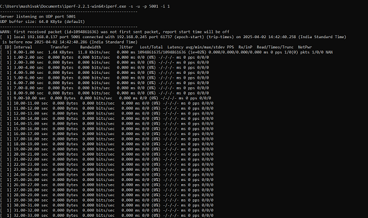
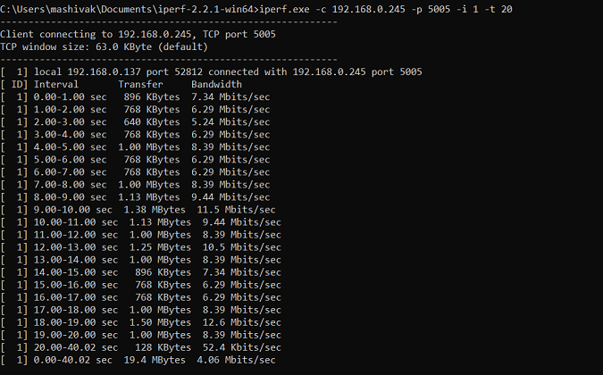
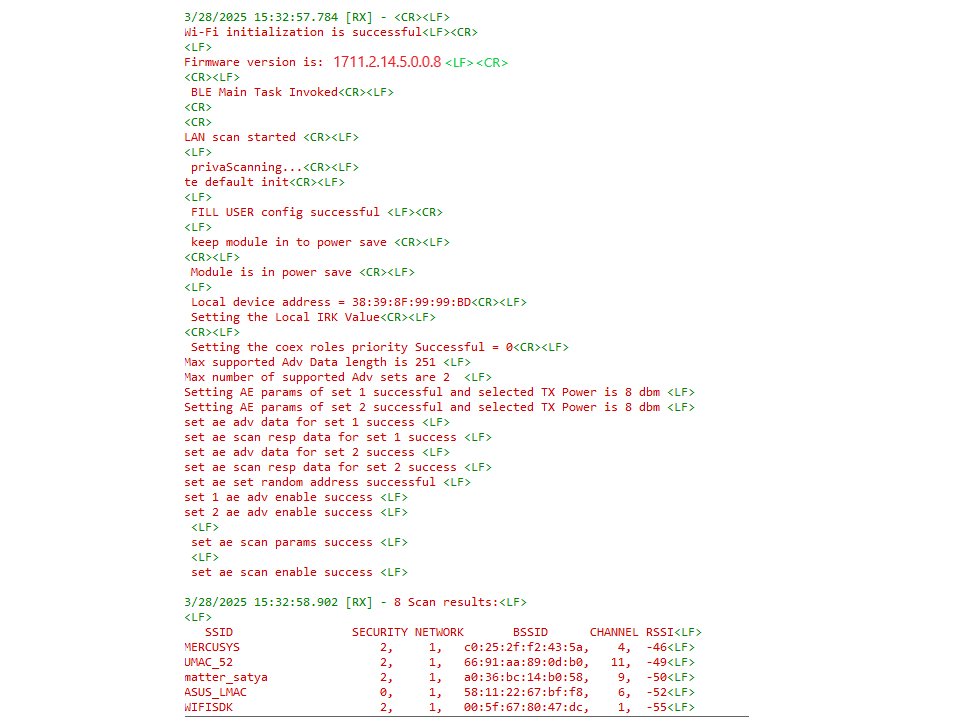
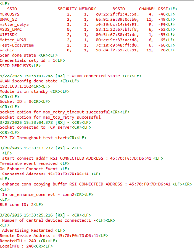

# WLAN - BLE Unified AE Coex App

## Table of Contents

- [Purpose/Scope](#purposescope) 
- [Prerequisites/Setup Requirements](#prerequisitessetup-requirements)
  - [Hardware Requirements](#hardware-requirements)
  - [Software Requirements](#software-requirements)
  - [Setup Diagram](#setup-diagram)
- [Getting Started](#getting-started)
- [Application Build Environment](#application-build-environment)
- [WLAN throughputs: UDP/TCP/TLS unidirectional](#wlan-throughputs-udptcptls-unidirectional)
- [Test the Application](#test-the-application)

## Purpose/Scope

This application demonstrates how to configure SiWx91x in Extended Advertising mode (Central/Peripheral) along with WLAN TCP data transfer.

## Prerequisites/Setup Requirements

### Hardware Requirements

- Windows PC
- SoC Mode:
  - Silicon Labs [BRD4325A, BRD4325B, BRD4325C, BRD4325G, BRD4338A, BRD4339B, BRD4343A](https://www.silabs.com/)
  - Kits
    - SiWx917 AC1 Module Explorer Kit (BRD2708A)
- PSRAM Mode:  
  - Silicon Labs [BRD4340A, BRD4342A, BRD4325G](https://www.silabs.com/)
- NCP Mode:
  - Silicon Labs [BRD4180B](https://www.silabs.com/);
  - Host MCU Eval Kit. This example has been tested with:
    - Silicon Labs [WSTK + EFR32MG21](https://www.silabs.com/development-tools/wireless/efr32xg21-bluetooth-starter-kit)
    - NCP Expansion Kit with NCP Radio boards
      - (BRD4346A + BRD8045A) [SiWx917-EB4346A]
      - (BRD4357A + BRD8045A) [SiWx917-EB4357A]
  - Interface and Host MCU Supported 
    - SPI - EFR32 
- Smartphone configured as BLE peripheral/central which supports extended advertising.
- Access point

### Software Requirements

- Simplicity Studio IDE
- Download and install the Silicon Labs [Simplicity Connect App(formerly EFR Connect App) or other BLE Central/Peripheral app.](https://www.silabs.com/developers/simplicity-connect-mobile-app ) in the android smart phones for testing BLE applications. Users can also use their choice of BLE apps available in Android/iOS smart phones.
- [iPerf Application](https://sourceforge.net/projects/iperf2/files/iperf-2.0.8-win.zip/download). iPerf is a tool for active measurements of the maximum achievable bandwidth on IP networks. It supports tuning of various parameters related to timing, buffers, and protocols (TCP and UDP with IPv4 and IPv6).
- [Python Environment](https://www.python.org/downloads/)
- Serial Terminal - [Docklight](https://docklight.de/)/[Tera Term](https://ttssh2.osdn.jp/index.html.en) (to be used with Keil IDE)

### Setup Diagram

  	
   		
## Getting Started

Refer to the instructions [here](https://docs.silabs.com/wiseconnect/latest/wiseconnect-getting-started/) to:

- [Install Simplicity Studio](https://docs.silabs.com/wiseconnect/latest/wiseconnect-developers-guide-developing-for-silabs-hosts/#install-simplicity-studio)
- [Install WiSeConnect 3 extension](https://docs.silabs.com/wiseconnect/latest/wiseconnect-developers-guide-developing-for-silabs-hosts/#install-the-wi-se-connect-3-extension)
- [Connect your device to the computer](https://docs.silabs.com/wiseconnect/latest/wiseconnect-developers-guide-developing-for-silabs-hosts/#connect-si-wx91x-to-computer)
- [Upgrade your connectivity firmware ](https://docs.silabs.com/wiseconnect/latest/wiseconnect-developers-guide-developing-for-silabs-hosts/#update-si-wx91x-connectivity-firmware)
- [Create a Studio project ](https://docs.silabs.com/wiseconnect/latest/wiseconnect-developers-guide-developing-for-silabs-hosts/#create-a-project)

For details on the project folder structure, see the [WiSeConnect Examples](https://docs.silabs.com/wiseconnect/latest/wiseconnect-examples/#example-folder-structure) page.

## Application Build Environment

The application can be configured to suit your requirements and development environment. Read through the following sections and make any changes needed.

**Configure the WLAN parameters**

- Enable the macro to start the WLAN task defined in  `rsi_common_app.h` file.
    ```c
    #define WLAN_TASK_ENABLE 0
    ```
- In the Project Explorer pane, expand the **wifi** folder and open the `wifi_app_config.h` file and update/modify following macros:

  - Enter the AP Connectivity essentials configurations as the value to SSID, SECURITY_TYPE, CHANNEL_NO and PSK
      ```c
      #define SSID          "YOUR_AP_SSID"
      #define SECURITY_TYPE SL_WIFI_WPA2
      #define CHANNEL_NO    0
      #define PSK           "YOUR_AP_PASSPHRASE"
      ```
  - Choose the throughput type by configuring below macro:
      ```c
      #define     THROUGHPUT_TYPE            TCP_TX
      ```
      - Valid Configurations of THROUGHPUT_TYPE:

      - UDP_TX → UDP transmit
      - UDP_RX → UDP receive
      - TCP_TX → TCP transmit
      - TCP_RX → TCP receive
      - SSL_TX → SSL transmit
      - SSL_RX → SSL receive

  - IP address of remote server:
      ```c
      #define     SERVER_IP          "192.168.0.234"
      ```
  - Port number of module:
      ```c
      #define     DEVICE_PORT                5005
      ```
  - Port number of remote server
      ```c
      #define     SERVER_PORT                5000
      ```
  - To select the ip, configure below macros:
      ```c
      #define     DHCP_MODE                  1
      ```
  - Enable the following macro only if the user wants to ensure that the WiFi thread continuously scans for APs and prints the scan results
      ```c
      #define WIFI_CONTINUOUS_SCAN_MODE_ONLY 0
      ```
  - Enable this macro only if the user wants to connect WiFi to the AP, print the IP address, and then suspend the connection
      ```c
      #define WIFI_CONNECTION_ONLY 0

**Configure the BLE parameters**

- Open `ble_config.h` file and update/modify following macros:

  - Configure the following macros to enable extended advertsing and scanning by default respectively
       ```c
       #define ADV_ENABLED_DEFAULT    1
       #define SCAN_ENABLED_DEFAULT   1
       ```
  - Set the following macro to enable second advertising set
       ```c
       #define ADV_SET2    1
       ```
  - Configure the following macros to set the number of peripheral and central connections that can be made
       ```c
       #define RSI_BLE_MAX_NBR_SLAVES    1
       #define RSI_BLE_MAX_NBR_MASTERS   1
       ```
  - Fill the name of the peripheral to be connected to in the following macro
       ```c
       #define RSI_REMOTE_DEVICE_NAME1   AEdevice1
       ```
  - Configure following macro to enable secure connection for central and peripheral respectively :
       ```c
       #define SMP_ENABLE_C1    1
       #define SMP_ENABLE_P1    1
       ```
  - Set following macro to receive 'gatt notifications' from remote device
       ```c
       #define RX_NOTIFICATIONS_FROM_C1    1
       #define RX_NOTIFICATIONS_FROM_P1    1
       ```
    > **Note**: Max limit for number of peripheral connections is 1 and central connections is 1

  - Power save configuration:

    - By default, The application is configured without power save.
       ```c
       #define ENABLE_NWP_POWER_SAVE 0
       ```

    - If user wants to run the application in power save, modify the following configuration.
       ```c
       #define ENABLE_NWP_POWER_SAVE 1
       ```

  - The desired parameters are provided following. User can also modify the parameters as per their needs and requirements.

    - The length of the advertising data needs to be filled in the following macro
       ```c
       #define BLE_AE_ADV_DATA_LEN    0x19
       ```
    - Follow mentioned macro needs to be populated with data
       ```c
       #define BLE_AE_ADV_DATA    "AE_PERIPHERAL_DATA_1"
       ```
  - The Extended advertising handle for set 1 and 2 can be enabled with the following macros respectively
       ```c
       #define BLE_AE_ADV_HNDL_SET_1          0x00
       #define BLE_AE_ADV_HNDL_SET_2          0x01
       ```
  - The minimum advertising interval for set 1 and 2 can be enabled with the following macros respectively
       ```c
       #define BLE_AE_ADV_INT_MIN_SET_1       0x20
       #define BLE_AE_ADV_INT_MIN_SET_2       0x30
       ```
  - The maximum advertising interval for set 1 and 2 can be enabled with the following macros respectively
       ```c
       #define BLE_AE_ADV_INT_MAX_SET_1       0x20
       #define BLE_AE_ADV_INT_MAX_SET_2       0x30
       ```
  - The Extended advertising channel map for set 1 and 2 can be enabled with the following macros respectively
       ```c
       #define BLE_AE_ADV_CHANNEL_MAP_SET_1   0x07
       #define BLE_AE_ADV_CHANNEL_MAP_SET_2   0x07
       ```
  - The Extended advertising filter policy for set 1 and 2 can be enabled with the following macros respectively
       ```c
       #define BLE_AE_ADV_FILTER_POLICY_SET_1 0x00
       #define BLE_AE_ADV_FILTER_POLICY_SET_2 0x00
       ```
  - The Extended advertising TX Power for set 1 and 2 can be enabled with the following macros respectively
       ```c
       #define BLE_AE_ADV_TX_PWR_SET_1        0x7f
       #define BLE_AE_ADV_TX_PWR_SET_2        0x7f
       ```
  - The primary advertising phy for set 1 and 2 can be enabled with the following macros respectively
       ```c
       #define BLE_AE_PRIMARY_ADV_PHY_SET_1   0x01
       #define BLE_AE_PRIMARY_ADV_PHY_SET_2   0x01
       ```
  - The Extended advertising max skip for set 1 and 2 can be enabled with the following macros respectively
       ```c
       #define BLE_AE_SEC_ADV_MAX_SKIP_SET_1  0x00
       #define BLE_AE_SEC_ADV_MAX_SKIP_SET_2  0x00
       ```
  - The secondary advertising phy for set 1 and 2 can be enabled with the following macros respectively
       ```c
       #define BLE_AE_SECONDARY_ADV_PHY_SET_1 0x01
       #define BLE_AE_SECONDARY_ADV_PHY_SET_2 0x01
       ```
  - The Extended advertising SID for set 1 and 2 can be enabled with the following macros respectively
       ```c
       #define BLE_AE_ADV_SID_SET_1           0x00
       #define BLE_AE_ADV_SID_SET_2           0x01
       ```
  - The Extended advertising scan request notification enable for set 1 and 2 can be enabled with the following macros respectively
       ```c
       #define BLE_AE_SCAN_REQ_NOTIF_EN_SET_1 0x01
       #define BLE_AE_SCAN_REQ_NOTIF_EN_SET_2 0x01
       ```
  - The Extended advertising event properties for set 1 and 2 can be enabled with the following macros respectively
       ```c
       #define BLE_AE_ADV_EVNT_PROP_SET_1     (BLE_CONNECTABLE_ADV)
       #define BLE_AE_ADV_EVNT_PROP_SET_2     0x00
       ```
  - The Extended advertising duration for set 1 and 2 can be enabled with the following macros respectively
       ```c
       #define BLE_AE_ADV_DUR_SET_1           0x00
       #define BLE_AE_ADV_DUR_SET_2           0x00
       ```
  - The maximum extended advertising events for set 1 and 2 can be enabled with the following macros respectively
       ```c
       #define BLE_AE_ADV_MAX_AE_EVENTS_SET_1 0x00
       #define BLE_AE_ADV_MAX_AE_EVENTS_SET_2 0x00
       ```
  - Extended scanning filter type can be set with the following macro
       ```c
       #define BLE_AE_SCAN_FILTER_TYPE       SCAN_FILTER_TYPE_ALL
       ```
  - The scan type for primary phy can be set using following macro
       ```c
       #define PRI_PHY_BLE_AE_SCAN_TYPE      SCAN_TYPE_ACTIVE
       ```
  - The scan type for secondary phy can be set using following macro
       ```c
       #define SEC_PHY_BLE_AE_SCAN_TYPE      SCAN_TYPE_ACTIVE
       ```
  - The primary phy extended scan interval can be set using following macro
       ```c
       #define PRI_PHY_LE_AE_SCAN_INTERVAL   0x100
       ```
  - The primary phy extended scan window can be set using following macro
       ```c
       #define PRI_PHY_LE_AE_SCAN_WINDOW     0x50
       ```
  - The secondary phy extended scan interval can be set using following macro
       ```c
       #define SEC_PHY_LE_AE_SCAN_INTERVAL   0x100
       ```
  - The secondary phy extended scan window can be set using following macro
       ```c
       #define SEC_PHY_LE_AE_SCAN_WINDOW     0x50
       ```
  - Extended scanning filter duplicates can be set using following macro
       ```c
       #define BLE_AE_SCAN_ENABLE_FILTER_DUP 0x00
       ```
  - Extended scan duration can be set using following macro
       ```c
       #define BLE_AE_SCAN_DUR               0x00
       ```
  - Extended scan period can be set using following macro
       ```c
       #define BLE_AE_SCAN_PERIOD            0x00
       ```
  - Following are the non-configurable macros in the application.

  - The event properties bits:
       ```c
       #define BLE_CONNECTABLE_ADV        (1 << 0)
       #define BLE_SCANNABLE_ADV          (1 << 1)
       #define BLE_LOW_DUTY_DIR_CONN_ADV  (1 << 2)
       #define BLE_HIGH_DUTY_DIR_CONN_ADV (1 << 3)
       #define BLE_LEGACY_ADV             (1 << 4)
       #define BLE_ANONYMOUS_ADV          (1 << 5)
       #define BLE_TX_WR_ADV              (1 << 6)
       ```
  - Global buffer length: 
       ```c
       #define BT_GLOBAL_BUFF_LEN 15000
       ```

  - Phy rate bits:
       ```c
       #define PHY_1M       BIT(0)
       #define PHY_2M       BIT(1)
       #define PHY_LE_CODED BIT(2)
       #define RSI_BLE_PWR_INX          30
       #define RSI_BLE_PWR_SAVE_OPTIONS 0    
       #define BLE_DISABLE_DUTY_CYCLING 0
       #define BLE_DUTY_CYCLING         1
       #define BLR_DUTY_CYCLING         2
       #define BLE_4X_PWR_SAVE_MODE     4
       ```

 >**Note:** `ble_config.h` files are already set with desired configuration in respective example folders user need not change for each example.

> **Note:** 
> User can configure default region specific regulatory information using `sl_wifi_region_db_config.h` 
   
## WLAN throughputs: UDP/TCP/TLS unidirectional

To measure **WLAN throughput**, run the following commands.

1. To measure **UDP Tx** throughput, configure the SiWx917 device as a UDP client and open the UDP server on the remote PC using the following iPerf command. To establish UDP Server on remote PC, open [iPerf Application](https://sourceforge.net/projects/iperf2/files/iperf-2.0.8-win.zip/download) and run the below command from the installed folder's path in the command prompt.

    ```sh
    iperf.exe -s -u -p <SERVER_PORT> -i 1
    ```

   Example: iperf.exe -s -u -p 5001 -i 1
    

2. To measure **UDP Rx** throughput, configure the SiWx917 device as a UDP server and open the UDP client on the remote PC using below iPerf command

    ```sh
    iperf.exe -c <Module_IP> -u -p <DEVICE_PORT> -i 1 -b<Bandwidth> -t <duration in sec>
    ```

    Example: iperf.exe -c 192.168.0.245 -u -p 5005 -i 1 -b50M -t 20

    

3. To measure **TCP Tx** throughput, configure the SiWx917 device as a TCP client and open the TCP server on the remote PC using below iPerf command. To establish TCP Server on remote PC, open [iPerf Application](https://sourceforge.net/projects/iperf2/files/iperf-2.0.8-win.zip/download) and run the below command from the installed folder's path in the command prompt.

    ```sh
    iperf.exe -s -p <SERVER_PORT> -i 1
    ```

   Example: iperf.exe -s -p 5001 -i 1

   

4. To measure **TCP Rx** throughput, configure the SiWx917 device as a TCP server and open TCP client on remote PC using the following iPerf command:

    ```sh
            iperf.exe -c <Module_IP> -p <DEVICE_PORT> -i 1 -t <duration in sec>
    ```

   Example: iperf.exe -c 192.168.0.245 -p 5005 -i 1 -t 20

    

5. To measure **TLS Tx** throughput, configure the SiWx917 device as a TLS client and follow the steps below to run a TLS server on Windows machine.

   - Copy SSL_Server_throughput_d.py from **release/resources/scripts/** to **release/resources/certificates/**.

   - Open the command prompt in the release/resources/certificates/ folder and run the following command:
     > **Note:**
     > Python version: 3.9.0

      ```sh
              python SSL_Server_throughput_d.py
      ```

    

6. To measure **TLS Rx** throughput, configure the SiWx917 device as a TLS client and follow the steps below to run a TLS server on Windows machine.

   - Copy SSL_tx_throughput.py from **release/resources/scripts/** to **release/resources/certificate**.

   - Change the port number from "5001" to the value configured in "TLS_RX_SERVER_PORT".

   - Open the command prompt in the release/resources/certificates/ folder and run the following command.:

      ```sh
          python SSL_tx_throughput.py
      ```

      

## Test the Application

Refer to the instructions [here](https://docs.silabs.com/wiseconnect/latest/wiseconnect-getting-started/) to:

- Build the application.
- Flash, run and debug the application.

Follow the steps as mentioned for the successful execution of the application:

   1. Set all the configurations necessary refering to section 4.
   2. The Si91x device, with its default configuration parameters, is set up for 2 extended advertising sets and extended scanning. Its advertising functionality will be validated with any remote device supporting the AE feature. The image below illustrates the Si91x device's extended advertising sets in the Si Connect app.
     


   3. To make remote central connection , scan from any BLE scanner search for the device(if no random address is set it will advertise with the public address).
   4. As shown in step 2, to establish the connection, click on the "CONNECT" option of the device for the required advertising set.
   5. Once the physical level connection is established, and if SMP is enabled, the application will initiate the SMP process, as shown in the images below.
   6. The pairing procedure using the app is as follows: Select the "Pair and Connect" option.

   click on the "Pair and connect" option

        


 Enter the passkey displayed in the serial terminal, as shown in the following images.
      


 Once the SMP pairing process is successful, the connection status is displayed as follows :


   7. If extended scanning is enabled, the Si91x device will scan for the advertising devices using the configured scan parameters
   8. To make a remote peripheral connection, advertise the remote device with the specific name defined in the RSI_REMOTE_DEVICE_NAME1 macro. If SMP is enabled for this connection, the bonding process is initiated. Here in the example heartrate service and advertise the device clicking on create new button and configuring required parameters in the advertiser.

   **Note:**  Refer to " Create a New Advertisement Set " for creating the advertising set in the Simplicity Connect mobile App(formerly EFR Connect App).

   Refer [Create a New Advertisement Set](https://docs.silabs.com/mobile-apps/latest/mobile-apps-explore/03-ble-configure-view) .
   Add required services say for example heartrate service and advertise the device clicking on create new button and configuring required parameters in the advertiser.


   9. Select the "Notify" property to enable notifications for continuous data transfer from the Si91x device.
    Following image shows how to enable TX notifications from DUT after connection.


   10. To enable Wi-Fi TCP data transfer, user needs to set the macro TCP_DATA_TEST_CODE = 1 in rsi_wlan_tcp_server_app.c
   11. On the WiFi side, the SiWx91x device is configured as a UDP/TCP/TLS server or client. It connects to the iPerf server or client and transmits or receives data for configured intervals. During the data transmission and reception, the application outputs the throughput numbers to the serial console.



 


**Limitations for this app**
- PSRAM is not supported for this feature.
- This feature is supported only with TA_480K_M4SS_192K and TA_416K_M4SS_256K RAM configurations.
- This feature is supported only with power save enabled.
- A maximum of 2 BLE connections are supported when the AE+CoEx feature is enabled.
- The scan interval and window are recommended to be in a 3:1 ratio.
- Maximum of 2 advertising sets are supported by this app. 
