# Wifi Coex - WLAN BLE Unified Coex App

## Table of Contents

- [Purpose/Scope](#purposescope) 
- [Prerequisites/Setup Requirements](#prerequisitessetup-requirements)
  - [Hardware Requirements](#hardware-requirements)
  - [Software Requirements](#software-requirements)
  - [Setup Diagram](#setup-diagram)
- [Getting Started](#getting-started)
- [Application Build Environment](#application-build-environment)
- [Test the Application](#test-the-application)

## Purpose/Scope

This application demonstrates how to configure SiWx91x in Coex Mode with WLAN(AWS MQTT) and BLE multiple connections (2 - Central, 8 - Peripheral) with data transfer.

## Prerequisites/Setup Requirements

### Hardware Requirements

- Windows PC
- SoC Mode:
  - Silicon Labs [BRD4325A, BRD4325B, BRD4325C, BRD4325G, BRD4338A, BRD4339B, BRD4343A](https://www.silabs.com/)
  - Kits
    - SiWx91x AC1 Module Explorer Kit (BRD2708A)
- NCP Mode:
  - Silicon Labs [BRD4180B](https://www.silabs.com/);
  - Host MCU Eval Kit. This example has been tested with:
    - Silicon Labs [WSTK + EFR32MG21](https://www.silabs.com/development-tools/wireless/efr32xg21-bluetooth-starter-kit)
    - NCP Expansion Kit with NCP Radio boards
      - (BRD4346A + BRD8045A) [SiWx917-EB4346A]
      - (BRD4357A + BRD8045A) [SiWx917-EB4357A]
  - Interface and Host MCU Supported 
    - SPI - EFR32 
- Smartphone configured as BLE peripheral

### Software Requirements

- Simplicity Studio IDE

- Download and install the Silicon Labs [Simplicity Connect App(formerly EFR Connect App) or other BLE Central/Peripheral app.](https://www.silabs.com/developers/simplicity-connect-mobile-app ) in the android smart phones for testing BLE applications. Users can also use their choice of BLE apps available in Android/iOS smart phones.

### Setup Diagram

  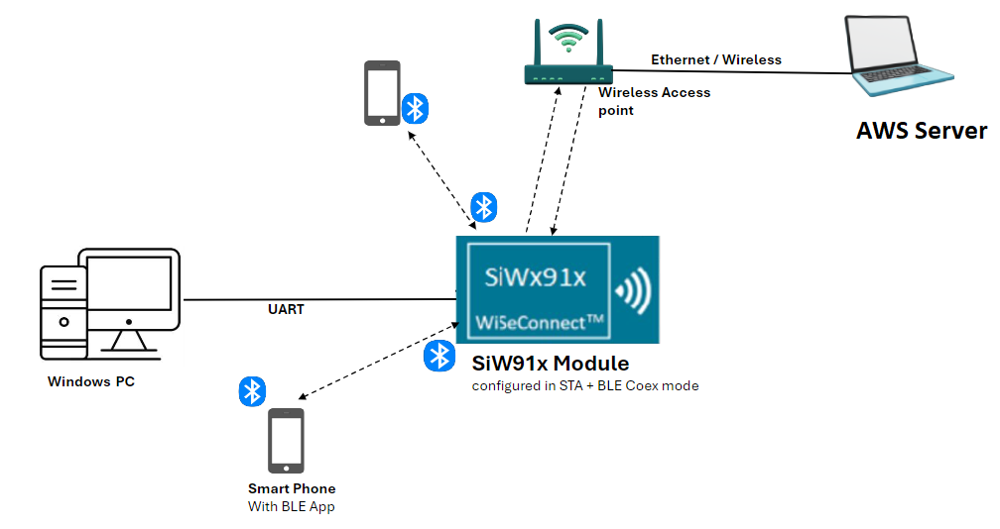	
   		
## Getting Started

Refer to the instructions [here](https://docs.silabs.com/wiseconnect/latest/wiseconnect-getting-started/) to:

- [Install Simplicity Studio](https://docs.silabs.com/wiseconnect/latest/wiseconnect-developers-guide-developing-for-silabs-hosts/#install-simplicity-studio)
- [Install WiSeConnect 3 extension](https://docs.silabs.com/wiseconnect/latest/wiseconnect-developers-guide-developing-for-silabs-hosts/#install-the-wi-se-connect-3-extension)
- [Connect your device to the computer](https://docs.silabs.com/wiseconnect/latest/wiseconnect-developers-guide-developing-for-silabs-hosts/#connect-si-wx91x-to-computer)
- [Upgrade your connectivity firmware ](https://docs.silabs.com/wiseconnect/latest/wiseconnect-developers-guide-developing-for-silabs-hosts/#update-si-wx91x-connectivity-firmware)
- [Create a Studio project ](https://docs.silabs.com/wiseconnect/latest/wiseconnect-developers-guide-developing-for-silabs-hosts/#create-a-project)

For details on the project folder structure, see the [WiSeConnect Examples](https://docs.silabs.com/wiseconnect/latest/wiseconnect-examples/#example-folder-structure) page.

## Application Build Environment

The application can be configured to suit your requirements and development environment. Read through the following sections and make any changes needed.

- The WLAN_TASK_ENABLE macro is a configuration option that controls whether the WLAN (Wi-Fi) task is enabled in the application.
- When WLAN_TASK_ENABLE is set to 1, the application will start and run the WLAN task, allowing the device to scan for Wi-Fi networks, connect to an access point, and perform Wi-Fi-related operations.
- If it is set to 0, the WLAN task will be disabled, and Wi-Fi functionality will not be configured in the application.

**Configure the WLAN parameters**

- Enable the macro to start the WLAN task defined in  `rsi_common_app.h` file.
    ```c
    #define WLAN_TASK_ENABLE 1
    ```
- In the Project Explorer pane, expand the **wifi** folder and open the `wifi_app_config.h` file and update/modify following macros:

  - Enter the AP Connectivity essentials configurations as the value to SSID, PSK and SECURITY_TYPE
      ```c
      #define SSID          "YOUR_AP_SSID"
      #define PSK           "YOUR_AP_PASSPHRASE"
      #define SECURITY_TYPE SL_WIFI_WPA2
      ```
  - The SiWx91x device is subscribed to `SUBSCRIBE_TO_TOPIC` and publishes on `PUBLISH_ON_TOPIC`.
      ```c
      #define SUBSCRIBE_TO_TOPIC   "aws_status"      //! Subscribe Topic to receive the message from cloud
      #define PUBLISH_ON_TOPIC     "siwx91x_status"  //! Publish Topic to send the status from application to cloud
      #define MQTT_PUBLISH_PAYLOAD "Hi from SiWx91x" //! Publish message
      #define SUBSCRIBE_QOS         QOS1              //! Quality of Service for subscribed topic "SUBSCRIBE_TO_TOPIC"
      #define PUBLISH_QOS           QOS1              //! Quality of Service for publish topic "PUBLISH_ON_TOPIC"
      #define PUBLISH_PERIODICITY   30000         //! Publish periodicity in milliseconds
      ```
    **Note:** You can change the topic names, which are `aws_status` and `siwx91x_status`.

  - Enable the following macro only if the user wants to ensure that the WiFi thread continuously scans for APs and prints the scan results
      ```c
      #define WIFI_CONTINUOUS_SCAN_MODE_ONLY 0
      ```
  - Enable this macro only if the user wants to connect WiFi to the AP, print the IP address, and then suspend the connection
      ```c
      #define WIFI_CONNECTION_ONLY 0
      ```

### Configure the following parameters in `aws_iot_config.h` file present at `<project>/config`:

> - Configure AWS_IOT_MQTT_HOST macro with the device data endpoint to connect to AWS. To get the device data endpoint in the AWS IoT Console, navigate to Settings, copy the Endpoint, and define the AWS_IOT_MQTT_HOST macro with this value.

  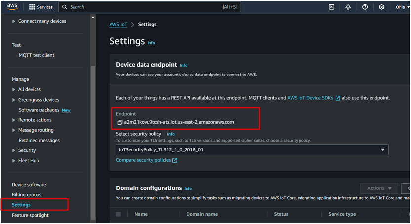

```c
#define AWS_IOT_MQTT_HOST \
  "a2m21kovu9tcsh-ats.iot.us-east-2.amazonaws.com"  ///< Customer-specific MQTT HOST. The same will be used for Thing Shadow
#define AWS_IOT_MQTT_PORT      8883                 ///< Default port for MQTT/S
#define AWS_IOT_MQTT_CLIENT_ID "silicon_labs_thing" ///< MQTT client ID should be unique for every device
#define AWS_IOT_MY_THING_NAME  "silicon_labs_thing"
```

> - To authenticate and securely connect with AWS, the SiWx91x device requires a unique x.509 security certificate and private key, as well as a CA certificate. At this point, you must have a device certificate, private key, and CA certificate, which are downloaded during the creation/registration of AWS Thing.

> - By default, the certificate and private key that are downloaded from the AWS are in [.pem format](https://en.wikipedia.org/wiki/Privacy-Enhanced_Mail). To load the certificate and private key to the SiWx91x, the certificate and private key should be converted into a C-array. For converting the certificates and private key into C-array, refer to [Setting up Security Certificates](#setting-up-security-certificates).

> - By default, the WiSeConnect 3 SDK contains the Starfield Root CA Certificate in C-array format.

> **Note** :
 The included Cloud connectivity certificates are for reference only. If using default certificates in the release, the cloud connection will not work. You must replace the default certificates with valid certificates while connecting to the appropriate Cloud/OpenSSL Server.

**Configure the BLE parameters**

- Open `ble_config.h` file and update/modify following macros:

  - Configure the following macros to enable extended advertsing and scanning by default respectively
       ```c
       #define ADV_ENABLED_DEFAULT    1
       #define SCAN_ENABLED_DEFAULT   1
       ```

  - Configure the following macros to set the number of peripheral and central connections that can be made
       ```c
       #define RSI_BLE_MAX_NBR_PERIPHERALS    8
       #define RSI_BLE_MAX_NBR_CENTRALS       2
       ```
  - Fill the name of the peripheral to be connected to in the following macro
       ```c
       #define RSI_REMOTE_DEVICE_NAME1   "dev1"
       #define RSI_REMOTE_DEVICE_NAME2   "dev2"
       #define RSI_REMOTE_DEVICE_NAME3   "dev3"
       #define RSI_REMOTE_DEVICE_NAME4   "dev4"
       #define RSI_REMOTE_DEVICE_NAME5   "dev5"
       #define RSI_REMOTE_DEVICE_NAME6   "dev6"
       #define RSI_REMOTE_DEVICE_NAME7   "dev7"
       #define RSI_REMOTE_DEVICE_NAME8   "dev8"
       ```
  - Fill the address of the peripheral to be connected to in the following macro
       ```c
      #define RSI_BLE_DEV_1_ADDR "D0:DC:AD:8F:4A:B3"
      #define RSI_BLE_DEV_2_ADDR "FC:5D:44:9D:78:D9"
      #define RSI_BLE_DEV_3_ADDR "D2:24:F1:E6:F1:2B"
      #define RSI_BLE_DEV_4_ADDR "DB:DE:BA:13:35:ED"
      #define RSI_BLE_DEV_5_ADDR "D2:65:66:D4:8D:88"
      #define RSI_BLE_DEV_6_ADDR "E6:D2:90:DA:A4:38"
      #define RSI_BLE_DEV_7_ADDR "CC:F0:A6:28:C1:1B"
      #define RSI_BLE_DEV_8_ADDR "D4:64:29:7B:20:B2"
       ```
  - Fill the connect option (name/address) of the peripheral to be connected to in the following macro
       ```c
	  #define CONNECT_OPTION CONN_BY_NAME
       ```
    > **Note**:	Default option set is by name, can be configured by address using the following macro **CONN_BY_ADDR**
	
   - Specific Remote Periperal device configuration paramters

      > **Note:** Where XX refers to C1 (or) C2

      - Set below macro to enable secure connection
         ```c
         #define SMP_ENABLE_XX 0
         ```

      - Set below macro to add remote device to acceptlist
         ```c
         #define ADD_TO_ACCEPTLIST_XX 0
         ```
   
      - Set below macro to discover remote profiles
         ```c
         #define PROFILE_QUERY_XX 1
         ```
 
      - Set below macro to perform data transfer
         ```c
         #define DATA_TRANSFER_XX 1
         ```
 
      - Configure below macros to select type of data transfer

      - Set below macro to receive 'gatt notifications' from remote device
         ```c
         #define RX_NOTIFICATIONS_FROM_XX 0
         ```
 
      - Set below macro to receive 'gatt indications' from remote device
         ```c
         #define RX_INDICATIONS_FROM_XX 0
         ```
 
      - Set below macro to Transmit 'gatt notifications' to remote device
         ```c
         #define TX_NOTIFICATIONS_TO_XX 1
         ```
 
      - Set below macro to Transmit 'gatt write with response' to remote device
         ```c
         #define TX_WRITES_TO_XX 0
         ```
 
      - Set below macro to Transmit 'gatt write without response' to remote device
         ```c
         #define TX_WRITES_NO_RESP_TO_XX 0
         ```
 
      - Set below macro to Transmit 'gatt indications' to remote device
         ```c
         #define TX_INDICATIONS_TO_XX 0
         ```
 
      - Configure below macro to select data length extension ON/OFF
         ```c
         #define DLE_ON_XX 0
         ```

      - Configure below macros to select connection parameters while data transfer
         ```c
         #define CONN_INTERVAL_XX            36 //! for conn interval of 45ms
         #define CONN_LATENCY_XX             0
         #define CONN_SUPERVISION_TIMEOUT_XX 400
         ```

   - Specific Remote Central device configuration parameters

      > **Note:** Where YY refers to P1 (or) P2 (or) P3 (or) P4 (or) P5 (or) P6 (or) P7 (or) P8 

      - Configure below macro to enable secure connection
         ```c
         #define SMP_ENABLE_YY 0
         ```

      - Add remote device to acceptlist
         ```c
         #define ADD_TO_ACCEPTLIST_YY 0
         ```

      - Configure below macro to discover remote profiles
         ```c
         #define PROFILE_QUERY_YY 1
         ```

      - Configure below macro to perform data transfer
         ```c
         #define DATA_TRANSFER_YY 1
         ```

      - Configure below macros to select type of data transfer
      - Set below macro to receive 'gatt notifications' from remote device
         ```c
         #define RX_NOTIFICATIONS_FROM_YY 1
         ```

      - Set below macro to receive 'gatt indications' from remote device
         ```c
         #define RX_INDICATIONS_FROM_YY 0
         ```

      - Set below macro to Transmit 'gatt notifications' to remote device
         ```c
         #define TX_NOTIFICATIONS_TO_YY 0
         ```

      - Set below macro to Transmit 'gatt write with response' to remote device
         ```c
         #define TX_WRITES_TO_YY 0
         ```

      - Set below macro to Transmit 'gatt write without response' to remote device
         ```c
         #define TX_WRITES_NO_RESP_TO_YY 0
         ```

      - Set below macro to Transmit 'gatt indications' to remote device
         ```c
         #define TX_INDICATIONS_TO_YY 0
         ```

      - Configure below macros to select connection parameters while data transfer such as connection interval, latency and supervision timeout
         ```c
         #define CONN_INTERVAL_YY            240 // for conn interval of 300ms
         #define CONN_LATENCY_YY             0
         #define CONN_SUPERVISION_TIMEOUT_YY 400
         ```


  - The event properties bits:
       ```c
       #define BLE_CONNECTABLE_ADV        (1 << 0)
       #define BLE_SCANNABLE_ADV          (1 << 1)
       #define BLE_LOW_DUTY_DIR_CONN_ADV  (1 << 2)
       #define BLE_HIGH_DUTY_DIR_CONN_ADV (1 << 3)
       #define BLE_LEGACY_ADV             (1 << 4)
       #define BLE_ANONYMOUS_ADV          (1 << 5)
       #define BLE_TX_WR_ADV              (1 << 6)
       ```
  - Global buffer length: 
       ```c
       #define BT_GLOBAL_BUFF_LEN 15000
       ```

  - Phy rate bits:
       ```c
       #define PHY_1M       BIT(0)
       #define PHY_2M       BIT(1)
       #define PHY_LE_CODED BIT(2)
       #define RSI_BLE_PWR_INX          30
       #define RSI_BLE_PWR_SAVE_OPTIONS 0    
       #define BLE_DISABLE_DUTY_CYCLING 0
       #define BLE_DUTY_CYCLING         1
       #define BLR_DUTY_CYCLING         2
       #define BLE_4X_PWR_SAVE_MODE     4
       ```

 >**Note:** `ble_config.h` files are already set with desired configuration in respective example folders user need not change for each example.

> **Note:** 
> User can configure default region specific regulatory information using `sl_wifi_region_db_config.h` 
   

## Test the Application

efer to the instructions [here](https://docs.silabs.com/wiseconnect/latest/wiseconnect-getting-started/) to:

- Build the application in Studio.
- Flash, run and debug the application.

Follow the steps below for the successful execution of the program:

1. Configure the remote ble devices in peripheral and put it in advertising mode and/or in central and put in scanning mode.

2. Connect any serial console for prints.

3. Silicon Labs device is configured as GATT server with the below user-defined services.

   | S.No |UUID size |main service UUID | Characteristic service UUID | Property|
   |------|---|------|------|-----|
   |1|16-bit|0xAABB | 0x1AA1 | Read, Write & Notify|
   |2|128-bit|0x6A4E3304-667B-11E3-949A-0800200C9A66 | 0x6A4E3304-667B-11E3-949A-0800200C9A66 | Write with no response|
   |3|16-bit| 0x1AA1|0x1BB1 | Read & indicate|

4. Silicon Labs device is in scanning and advertising mode.

5. After the program gets executed, Silicon Labs device tries to connect with the remote device name specified in
   the macro **RSI_REMOTE_DEVICE_NAMEX** or **RSI_BLE_DEV_X_ADDR**. X could be 1,2 or 3.

6. Observe that the connection is established between the desired device and Silicon Labs device.

7. When the connection is established with the remote device, the Silicon Labs device fetch the GATT profiles and characteristics and also prints the same on the serial terminal.

8. If user configures SMP pairing in the specified macro **SMP_ENABLE_XX**, after successful connection between Silicon Labs device and remote device flow of commands are as below:

   a. Central device will initiate SMP pairing.
  
   b. Peripheral device gives SMP response.

   c. Based on the configured IO capability, the Silicon Labs device tries to establish the SMP connection.

9. When the SMP connection is established successfully, the host receives an SMP encrypt enabled event. If not, Silicon Labs Device sends an SMP failure event to the host.

10. When the Silicon Labs device as a central device, it initiates the scanning and tries to connects to a **remote BLE peripheral device**, which are specified in the `RSI_BLE_DEV_X_ADDR` or `RSI_REMOTE_DEVICE_NAMEX` macros. After the successful connection, the Silicon Labs device initiates the SMP connection too.

11. When the Silicon Labs device as a Peripheral device, it initiates the advertising. The **remote BLE peripheral device** requires to do a scan and initiates the connection. Once the connection is successful, the Silicon Labs device initiates the SMP pairing.

12. To check data transfer, enable Gatt notifications of Silicon Labs device on service characteristic having UUID 0x1AA1, where the Silicon Lab device as a peripheral device.

13. If enabled, Silicon Labs device continuously transmits notifications which can be seen on remote device.

   - ### Peripheral Role

      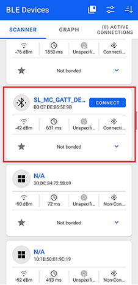
 
      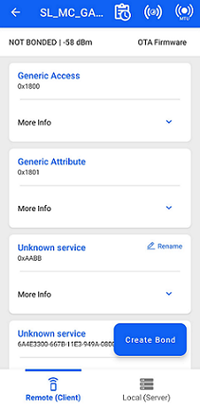

      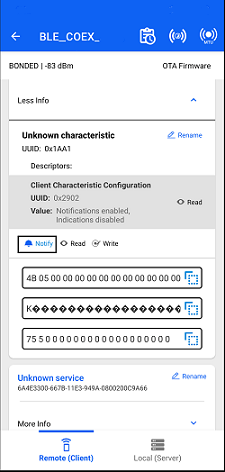

   - ### Central Role
   
      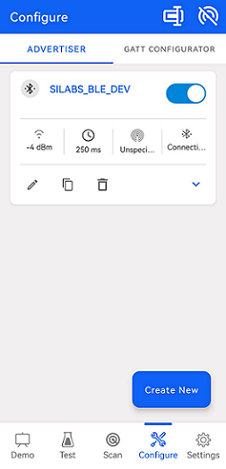

      

       	  


**To Set up the WLAN connection**

1. If `WLAN_TASK_ENABLE` is set to 1, the device initializes the Wi-Fi module using the configuration parameters defined in the application (such as SSID and security type).
2. It then scans for available Wi-Fi networks, connects to the designated access point, and performs Wi-Fi-related operations as specified in the application.
      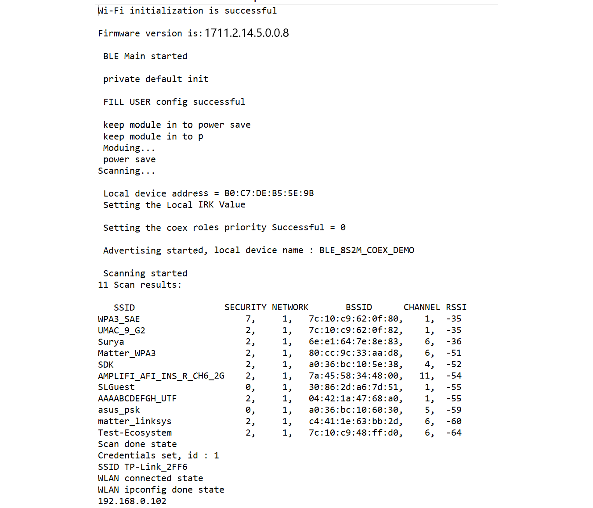

3. Once the SiWx917 device receives the IP address, it initiates an MQTT connection to the AWS cloud. Upon successfully establishing the MQTT connection, the device subscribes and publishes to the cloud.
      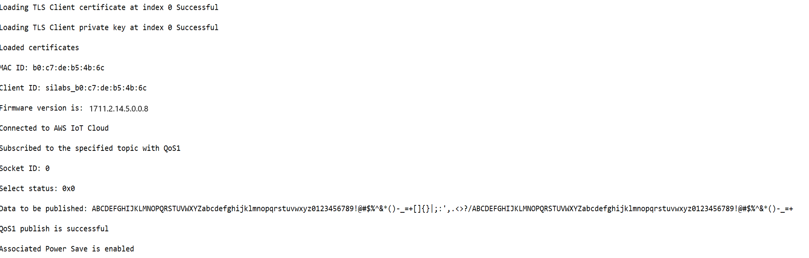

4. On the Wi-Fi side, the SiWx917 device subscribes to the topic defined by `SUBSCRIBE_TO_TOPIC` ("aws_status") to receive messages from the cloud and publishes to the topic defined by `PUBLISH_ON_TOPIC` ("siwx91x_status") to send messages to the cloud.
5. According to the configuration, the SiWx917 device sends and receives data based on the defined topics, with a message payload of "Hi from SiWx91x" with a publishing interval of 30 seconds.
6. After successful program execution, the prints looks as shown in following images.
     
    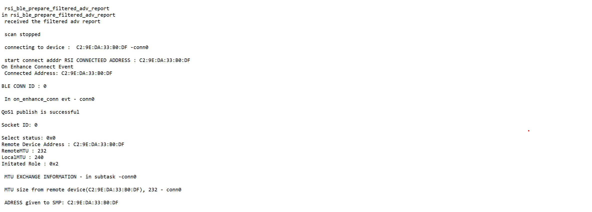
    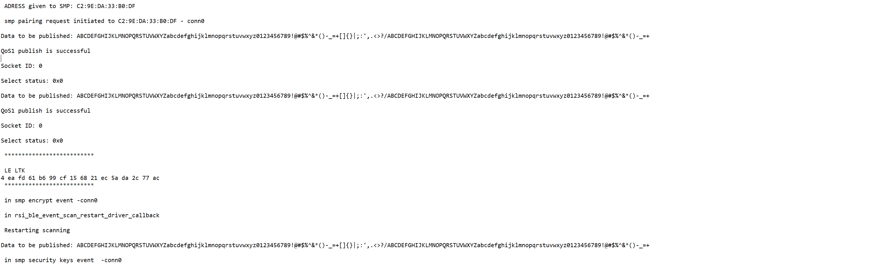
	 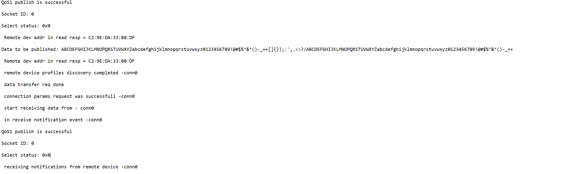

## Additional Information

### Setting up Security Certificates

- The WiSeConnect 3 SDK provides a conversion script (written in Python 3) to make the conversion straightforward. The script is provided in the SDK `<SDK>/resources/scripts` directory and is called [certificate_to_array.py](https://github.com/SiliconLabs/wiseconnect/tree/master/resources/certificates/).

- Copy the downloaded device certificate, private key from AWS, and also the certificate_to_array.py to the `<SDK>/resources/certificates`.

- To convert the device certificate and private key to C arrays, open a system command prompt in the same path and give the following commands.

  ```sh
  $> python3 certificate_to_array.py <input filename> <output arrayname>

  For example:
  $> python3 certificate_to_array.py d8f3a44d3f.pem.crt aws_device_certificate
  $> python3 certificate_to_array.py d8f3a44d3f.pem.key aws_private_key
  ```

- After running the above commands, two new files shall be created as below:

  ```sh
  aws_device_certificate.crt.h
  aws_private_key.key.h
  ```

- After converting the certificate and private key to C - array, it is essential to include the device certificate: aws_device_certificate.crt.h and private key: aws_private_key.key.h in the app.c.

- Ensure to load the certificate and private key to SiWx91x using [sl_net_set_credential()](https://docs.silabs.com/wiseconnect/latest/wiseconnect-api-reference-guide-nwk-mgmt/net-credential-functions#sl-net-set-credential) API.

- Ensure to update the certificate names in the **IoT_Client_Init_Params** structure before calling the **aws_iot_mqtt_init()** API.

- The Starfield Root CA certificate used by your Wi-Fi device to verify the AWS server is already included in the WiSeConnect 3 SDK at `<SDK>/resources/certificates`; no additional setup is required.

> **NOTE :**
> Support for the SNI extension has been added to the AWS SDK, ensuring it is set by the client when connecting to an AWS server using TLS 1.3. This is handled internally by the AWS SDK and does not affect compatibility with other TLS versions.

> **NOTE :**
> Amazon uses [Starfield Technologies](https://www.starfieldtech.com/) certificates to secure the AWS website. The WiSeConnect SDK includes the [Starfield CA Certificate](https://github.com/SiliconLabs/wiseconnect/tree/master/resources/certificates/aws_starfield_ca.pem.h).
>
> AWS has announced that there will be changes in their root CA chain. More details can be found in the reference link: (https://aws.amazon.com/blogs/security/acm-will-no-longer-cross-sign-certificates-with-starfield-class-2-starting-august-2024/)
>
> We are providing both root CAs (Starfield class-2 and Starfield G2) in aws_starfield_ca.pem.h, which is located in the WiSeConnect directory `<SDK>/resources/certificates/aws_starfield_ca.pem.h`.
>
> For AWS connectivity, Starfield Root CA certificate has the highest authority being at the top of the signing hierarchy.
>
> The Starfield Root CA certificate is an expected/required certificate which usually comes pre-installed in the operating systems and plays a key part in certificate chain verification when a device is performing TLS authentication with the IoT endpoint.
>
> On SiWx91x device, we do not maintain the root CA trust repository due to memory constraints, so it is mandatory to load Starfield Root CA certificate for successful mutual authentication to the AWS server.
>
> The certificate chain sent by AWS server is as below:
> Starfield Class 2 :
>
>id-at-commonName=Amazon,RSA 2048 M01,id-at-organizationName=Amazon,id-at-countryName=US
>
> id-at-commonName=Amazon Root CA 1,id-at-organizationName=Amazon,id-at-countryName=US
>
> id-at-commonName=Starfield Services Root Certificate Authority - G2,id-at-organizationName=Starfield Technologies, Inc.,id-at-localityName=Scottsdale,id-at- stateOrProvinceName=Arizona,id-at-countryName=US
>
>id-at-organizationalUnitName=Starfield Class 2 Certification Authority,id-at-organizationName=Starfield Technologies, Inc.,id-at-countryName=US
>
> Starfield G2:
>
> id-at-commonName=Amazon RSA 2048 M01,id-at-organizationName=Amazon,id-at-countryName=US
>
> id-at-commonName=Amazon Root CA 1,id-at-organizationName=Amazon,id-at-countryName=US
>
> id-at-commonName=Starfield Services Root Certificate Authority - G2,id-at-organizationName=Starfield Technologies, Inc.,id-at-localityName=Scottsdale,id-at-stateOrProvinceName=Arizona,id-at-countryName=US
>
> To authenticate the AWS server on SiWx91x, first validate the Root CA (validate the Root CA received with the Root CA loaded on the device). Once the Root CA validation is successful, other certificates sent from the AWS server are validated.
> Alternate certification chains support is added. With this, as opposed to requiring full chain validation, only the peer certificate must validate to a trusted certificate. This allows loading intermediate root CAs as trusted.
> The default CA certificate is the Starfield Combined CA certificate. To use the Intermediate Amazon Root CA 1 certificate, define the `SL_SI91X_AWS_IOT_ROOT_CA1` macro in the application.


**Limitations for this application**
- This feature is only supported with SL_SI91X_EXT_FEAT_480K_M4SS_192K memory configuration.
- The minimum connection interval for all the 8 BLE peripheral connections (DUT as central) should be 200 ms.
- The first BLE central connection (DUT as peripheral) interval should be at least 45 ms.
- The second BLE central connection (DUT as peripheral) interval should be at least 500 ms.
- A minimum supervision timeout of 8 seconds is mandatory for all BLE connections.
- This feature is supported only with power save enabled.
- TWT(Target Wake Times) based wakeup is not supported.
- This feature is not supported on PSRAM board.
- SMP pairing is limited to IOCapabilities 0x01 and 0x03.
- DUT does not save bonding information.
- Bonding information needs to be removed from remote device before issuing reconnection.
- The BLE advertising interval should be configured to 211.25msec.
- The BLE scan window and scan interval should be in 1:3 ratio.
- Supports only MQTT profile.
- IPv6 is not supported.
