# **SiWx917 TCP/IP Feature Selection - Feasibility Tool**

## Table of Contents

- [About](#1-about)
- [Prerequisites](#2-prerequisites)
- [Description of the SiWx917 NCP and SoC Capabilities](#3-description-of-the-siwx917-ncp-and-soc-capabilities)
   * [SiWx917 NCP and SoC Capabilities](#31-siwx917-ncp-and-soc-capabilities)
   * [Operating Modes in SiWx917 NCP and SoC](#32-operating-modes-in-siwx917-ncp-and-soc)
- [Points to Remember While Selecting Features in the Application](#4-points-to-remember-while-selecting-the-features-in-the-application)
- [Application Execution](#5-siwx917-tcpip-feature-selection-feasibility-application-execution)
   * [Selecting Features for Feasibility Check](#51-selecting-features-for-feasibility-check)
- [Examples of SiWx917_TCP_IP_Feature_Selection Feasibility Tool Usage](#6-examples-of-siwx917_tcp_ip_feature_selection-feasibility-tool-usage)
   * [Example 1: Wi-Fi Station with HTTP Client Support](#example-1-wi-fi-station-with-http-client-support)
   * [Example 2: Wi-Fi Station + Bluetooth LE Main with 2 Secondary and FTP Client Support](#example-2-wi-fi-station--bluetooth-le-main-with-2-secondary-and-ftp-client-support)

## 1. About

This document provides a comprehensive description of the SiWx917 TCP/IP Feature Selection Feasibility application.

## Overview

This document explains the application's usage to determine the static memory footprint in an SiWx917 module to establish applications using either Wi-Fi only or Wi-Fi plus Bluetooth/BLE capabilities and determine whether the desired Wi-Fi, Bluetooth Classic, Bluetooth LE and TCP/IP capabilities for a customer application can be fit within the static memory available in the SiWx917 system of choice.

**Note:** This application only works for **2.12.0** build version and checks for static memory allocation (Dynamic memory is not profiled by this application).

## 2. Prerequisites

To follow the guidance provided by this document you will need the following:

A windows PC installed with **SiWx917_TCP_IP_Feature_Feasibility_abc_image_vX.Y.Z.exe**
where abc is Full or Lite image and vX.Y.Z is the version of the above executable included in the WiseConnect software release of interest.

## 3. Description of the SiWx917 NCP and SoC Capabilities

### 3.1 SiWx917 NCP and SoC Capabilities

SiWx917 NCP provides the following capabilities:

#### Wi-Fi Capabilities

* The SiWx917 NCP & SoC can act as a Wi-Fi Station (Client)
* The SiWx917 NCP & SoC can act as a Wi-Fi Access Point (AP)
* The SiWx917 NCP & SoC can act in Wi-Fi Station+AP mode (Concurrent Mode)
* The SiWx917 NCP & SoC can act in Wi-Fi Station+ BLE mode (Coex Mode)

**Note:** The application **SiWx917_TCP_IP_Feature_Feasibility_lite_image_vX.Y.Z.exe** only supports Wi-Fi Station and Wi-Fi Station+ BLE mode.

#### Bluetooth LE Capabilities

* The SiWx917 NCP & SoC can act as a Bluetooth LE main.
* The SiWx917 NCP & SoC can act as a Bluetooth LE secondary.

#### TCP/IP Stack:

The following capabilities are available within the TCP/IP stack implementation of the SiWx917 NCP & SoC:

* ICMP capabilities
* DHCPv4 client and server capabilities
* DNS client and server capabilities
* FTP client and server capabilities
* SSL capabilities
* HTTP and HTTPS client capabilities
* HTTP and HTTPS server capabilities
* IPv4 and IPv6 support
* IPv4 DHCP client and server capabilities
* IPv6 DHCP client and server capabilities
* SNTP client support
* OTAFU (Over the air firmware update) client support
* MQTT support
* JSON support
* Multicast DNS and DNS-Service Discovery Protocol support

SiWx917 NCP & SoC has the following memory configurations:

* 352 kilobytes
* 416 kilobytes
* 480 kilobytes
* 672 kilobytes 

### 3.2 Operating Modes in SiWx917 NCP and SoC

#### Wi-Fi Alone Mode

These operating modes have the SiWx917 NCP & SoC operating as a Wi-Fi only device with no Bluetooth support. Hence all the features related to Bluetooth and BLE are disabled in the application when this mode is selected. The available operating mode options under this category are as follows:

* **WPA/WPA2 Station Mode**

   This operating mode has the SiWx917 system act as a Wi-Fi client (Station) operating with home security (either open, WPA or WPA2 home security). The following features are disabled in this mode:

   * EAP/LEAP in Wi-Fi+BT Coex Mode (Feature Bitmap window)
   * DHCPv4/DHCv6 Server (TCP IP Feature Bit Map Window)
   * Number of Stations (Custom Feature Bitmap window)
   * Support 16 Stations in AP mode (Extended Custom Feature Bitmap window)

* **WPA/WPA2-Enterprise Client Mode**

   This operating mode has the SiWx917 system act as a Wi-Fi client (Station) operating with enterprise security (either WPA or WPA2 enterprise security). The following features are disabled in this mode:

   * EAP/LEAP in Wi-Fi+BT Coex Mode (Feature Bitmap window)
   * Enable Open Mode (Feature Bitmap window)
   * Enable PSK Security (Feature Bitmap window)
   * DHCPv4/DHCv6 Server (TCP IP Feature Bit Map Window)
   * HTTPS Server (TCP IP Feature Bit Map Window)
   * Support 16 Stations in AP mode (Extended Custom Feature Bitmap window)
   * Number of Stations (Custom Feature Bitmap window)

* **Access Point Mode**

   This operating mode has the SiWx917 system act as a Wi-Fi access point. The following features are disabled in this mode:

   * EAP/LEAP in Wi-Fi+BT Coex Mode (Feature Bitmap window)
   * Enable Open Mode (Feature Bitmap window)
   * Enable PSK Security (Feature Bitmap window)
   * DHCPv4/DHCv6 Client (TCP IP Feature Bit Map Window)
   * DNS Client (TCP IP Feature Bit Map Window)
   * HTTPS Server (TCP IP Feature Bit Map Window)
   * SNTP Client (TCP IP Feature Bit Map Window)
   * MDNS and DNS-SD Feature (TCP IP Feature Bit Map Window)
   * OTAF Upgradation Support (TCP IP Feature Bit Map Window)
   * Pre Authentication Support (Extended Custom Feature Bitmap window)
   * 802.11R Over the Air Roaming Support (Extended Custom Feature Bitmap window)
   * 802.11R Over the Distributed System Roaming Support (Extended Custom Feature Bitmap window)
   * Low Power Mode (Extended Custom Feature Bitmap window)

* **Test Mode**

   This operating mode is meant for performing PER (Packet Error Rate) Test on the SiWx917 system. No features are selected in this mode except the host interface.

* **STA+AP Concurrent Mode**

   This operating mode has the SiWx917 system act as a Wi-Fi access point and station concurrently. The following features are disabled in this mode:

   * EAP/LEAP in Wi-Fi+BT Coex Mode (Feature Bitmap window)
   * Enable Open Mode (Feature Bitmap window)
   * Enable PSK Security (Feature Bitmap window)
   * HTTPS Server (TCP IP Feature Bit Map Window)
   * Number of Stations (Custom Feature Bitmap window)
   * Low Power Mode (Extended Custom Feature Bitmap window)
   * Support 16 Stations in AP mode (Extended Custom Feature Bitmap window)

#### CoEx Modes (Wi-Fi STA +BLE)

These operating modes have the SiWx917 system operating in a coexistence mode, supporting both Wi-Fi as well as Bluetooth Low Energy (BLE) Mode. In this mode, the fields under BLE Feature Bitmap windows will be enabled for selection.

## 4. Points to Remember While Selecting the Features in the Application

* **Number of Stations**

   This field (under Custom Feature Bitmap window) specifies the maximum number of 802.11 clients/stations that the SiWx917 will support when acting as an AP. A maximum value of 16 can be entered in this field. However, greater than 4 stations are not supported if the feature, **'Support 16 Stations in AP Mode'** is not selected in the Extended Custom Feature Bitmap window.

   * If nothing is entered in this field, 4 stations will be supported by default in AP mode.
   * A maximum of 4 stations can be supported in STA+AP Concurrent mode by default.

* **WPS Support**

   WPS (under Feature Bit Map Window) is only supported when using open or home WPA or WPA2 security, but not when using enterprise security. 

* **PSK Security**

   If this feature (under Feature Bit Map Window) is not selected, then Open security will be enabled by default.

#### Bluetooth LE Features

* **Number of BLE secondary**

   The available range is from 1 to 8. If nothing is entered in this field (under BLE Feature Bit Map Window), a default of 3 secondaries will be supported.

* **Number of the Attributes Records**

   The possible values for this field (under BLE Feature Bit Map Window) are 10 to 80. A minimum of 20 attribute records will be maintained in any case.

* **Number of the Attributes Services**

   The possible value range for this field (under BLE Feature Bit Map Window) is 4 to 10. If nothing is entered in this field, the firmware will maintain 10 attribute services by default.

#### Bluetooth Classic Features

* **Number of BT secondary**

   The available range for this field (under BT Feature Bit Map Window) is from 1 to 2.

#### TCP/IP Features

* **ICMP**

   To have ping capabilities, this feature (under TCP IP Feature Bitmap Window) needs to be enabled.

* **FTP**

   This field (under TCP IP Feature Bitmap Window) selects whether File Transfer Protocol (File Transfer Protocol) Client and Server functionality will be available or not.

* **SSL/TLS**

   This field (under TCP IP Feature Bitmap Window) selects whether Secure Socket Layer (SSL)/Transport Layer Security (TLS) functionality will be available in the SiWx917 system. In addition to that, it allows for the selection of the number of SSL sockets that will be available for use and whether such sockets will be used for local (local LAN) or cloud-based connections, as additional memory is needed to support SSL connections to the cloud. The following features will be valid 'only' when this option is selected by the user:

   * **Single SSL Socket**

      This (under TCP IP Feature Bitmap Window) assumes that only a single local LAN SSL connection will be supported by it.

   * **Enable three SSL/TLS Sockets**

       This (under Extended TCP IP Feature Bitmap Window) assumes that three local LAN SSL connections will be supported by it.

   * **Two SSL Sockets**

      If none of the above options are selected, two local LAN SSL connections will be supported by it.

   * **SSL Cloud Sockets**

      This feature (under Extended TCP IP Feature Bit Map Window) will enable the SiWx917 system to establish SSL cloud connections to cloud-based devices. The number of cloud connections will be determined by the options mentioned above.

   * **Load Private and Public Certificate**

      An SSL session can be established with or without private and public certificates. This field (under TCP IP Feature Bitmap Window) specifies whether memory allocation will need to be made to support storage of private and public certificates.

* **HTTPS Client**

   To enable HTTPS Client functionality, both 'HTTP Client' and 'SSL/TLS' options have to be selected.

* **DHCPv4 Client**

   This functionality is ONLY available in operating modes where the SiWx917 is acting as a Wi-Fi client and NOT in operating modes where it is acting as a Wi-Fi access point.

* **DHCPv4 Server**

   This functionality is ONLY available in operating modes where the SiWx917 is acting as a Wi-Fi Access Point and NOT in operating modes where it is acting as a Wi-Fi client.

* **IPv6**

   Selecting 'DHCPv6 Client' or 'DHCPv6 Server' options will also enable IPv6.

* **DHCPv6 Client**

   This functionality is ONLY available in operating modes where the SiWx917 is acting as a Wi-Fi client and NOT in operating modes where it is acting as a Wi-Fi access point.

* **DHCPv6 Server**

   This functionality is ONLY available in operating modes where the SiWx917 is acting as a Wi-Fi access point and NOT in operating modes where it is acting as a Wi-Fi client.

* **JSON Objects**

   This field (under TCP/IP Feature Bit Map Window) selects whether JSON (JavaScript Object Notation) objects will be available to allow the SiWx917 system’s webserver to serve dynamic webpages. Please note that this option is valid only when HTTP/s server is enabled.

* **PUF**

   Please note that PUF functionality is not currently present in WiseConnect firmware, and this field is only provided in the application for future reference. 

* **Low Power Mode**

   This sole field (under Extended Custom Feature Bit Map Window) will let the user specify whether he wants his system to be capable to go into low power mode (deep-sleep/standby) or if the user wants the system to remain solely in always on mode. This has memory usage implications, as sending the system into low power modes will require the system to store into memory configuration parameters such as association ID, SSID, password, IP address, status of TCP connections, etc. that will require memory allocation to be reserved for them.

* **4096-bit RSA Key Support**

   If key size is 4096 bit, device will use software routine for exponentiation, so connection time will increase.

* **802.11R Over the Air Roaming Support and 802.11R Over the Distributed System Roaming Support**

   These features (under Extended Custom Feature Bit Map Window) can be selected to support 802.11R Fast BSS (Basic Service Set) Transition from one AP to another in the same network to authenticate more quickly.

   * *Over the Air:* The client communicates directly with the target AP using IEEE 802 11 authentication with the FT authentication algorithm.

   * *Over the Distributed System:* The client communicates with the target AP through the current AP. The communication between the client and the target AP is carried in FT action frames between the client and the current AP and is then sent through the controller.

   If both the above features are selected, then Over-the-Air Roaming Support will be selected by the Firmware.

## 5. SiWx917 TCP/IP Feature Selection Feasibility Application Execution

The main window consists of 2 sections:

1. Select Features for Feasibility Check

2. Enter the Opermode Command for Feasibility Check

Select any of the above two sections based on the requirement.

## 5.1 Selecting Features for Feasibility Check

This section describes how to select features using the GUI for feasibility check.

1. Click on the **'Select Features for Feasibility Check'** on the GUI home screen.

   

2. Select the mode of operation. The “*Opermode Command*” at the top of the screen will get updated as features are selected.

   

3. Next, select the features under each bitmap. For example, in *Feature Bitmap*, select the relevant features and click on *NEXT.*

   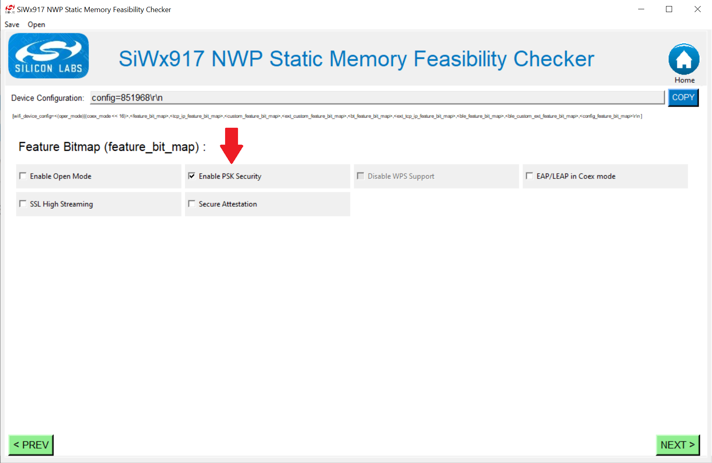

   **Note:** View a feature description by placing cursor over it.

4. The Opermode Command gets updated with the *Feature Bitmap* features. Now, select the required *TCP IP Feature Bitmap* features.

   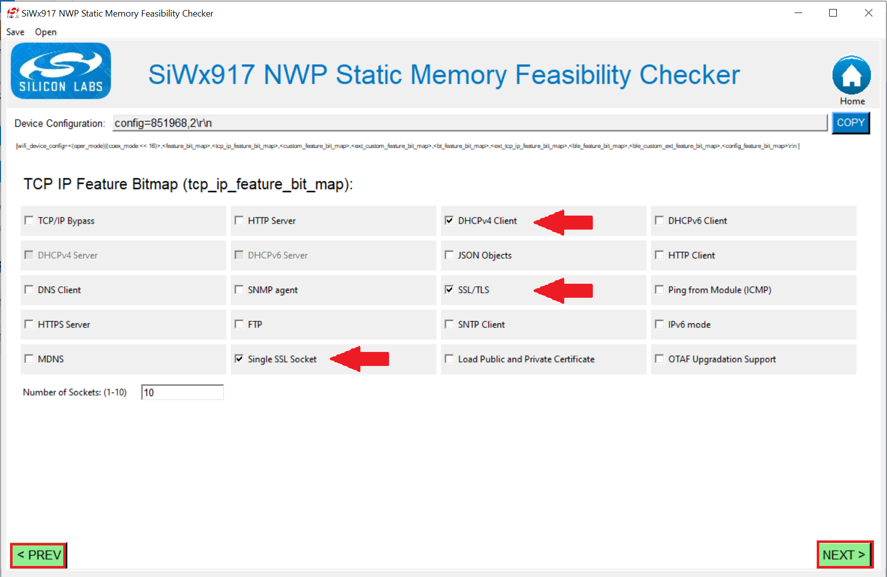

5. Similarly, select features related to different bitmaps.

6. Click on *'PREV'* to go to the previous page and re-select the features or click on the *'Home'* button present at the top-right corner to go back to home page and start over.

7. Once all the features are selected, the below screen appears.

   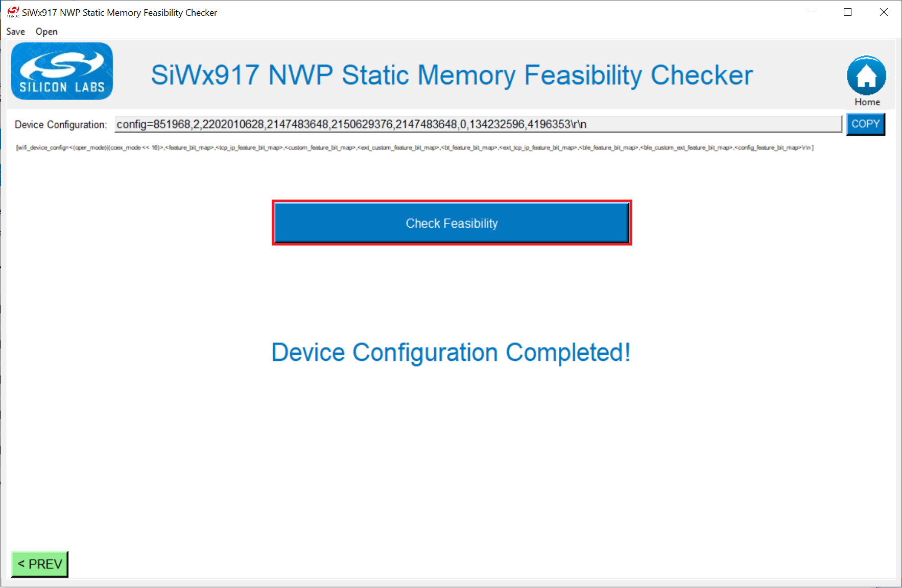

8. Click on **'Check Feasibility'** to check the feasibility of the selected features with the selected memory configuration on the host interface.

9. To save the created opermode command in a computer folder, Click on *Save* and enter the file name to save with.

   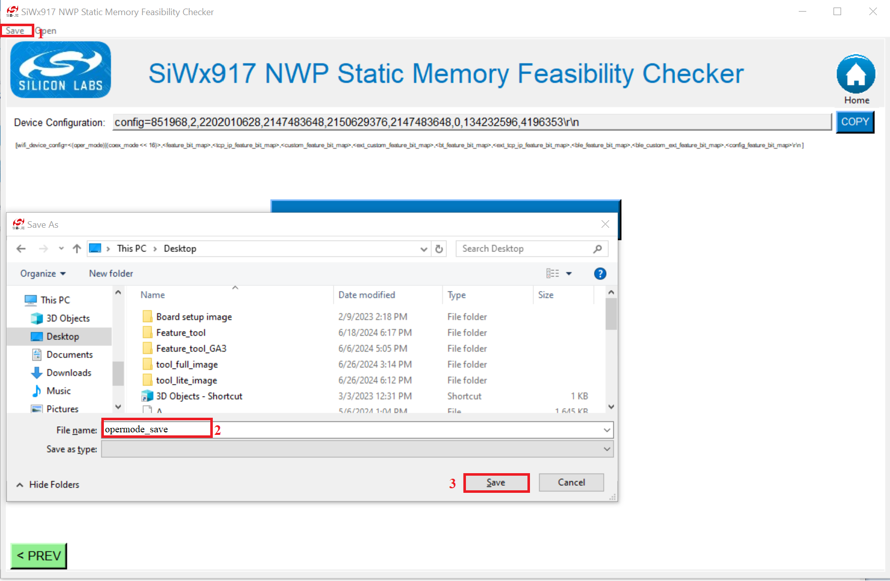

10. One can open the saved opermode command by clicking on *Open* to view the command.

    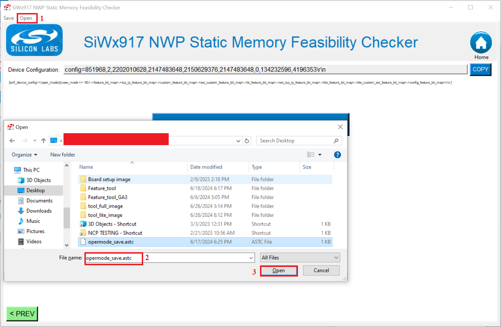

## 6. Examples of SiWx917_TCP_IP_Feature_Selection Feasibility Tool Usage

The following section will provide you with several examples of using the SiWx917_TCP_IP_Feature_Selection Feasibility application to determine the memory footprint to be expected for some typical real world IoT applications.

### Example 1: Wi-Fi Station with HTTP Client Support

In the following example, the SiWx917 system will be configured to act as a Wi-Fi client supporting WPA2 home security. The following will be the list of services to be supported:

* USB-CDC host interface
* IPv4 stack
* DNS (to provide DNS client functionality to allow resolution of online webserver IP addresses)
* ICMP support will be enabled in this system to allow for pings to be available in this system.
* HTTP client
* HTTPS client (In order to allow SiWx917 to obtain webpages from HTTPS encrypted webservers online)
* DHCP client (In order to allow SiWx917 system to obtain an IP address dynamically from the AP it associates to).
* Low power mode operation will be allowed on this system.

We will assume that an SiWx917 system with 672 kilobytes of memory will be used for this configuration.

The following are the features selected under various bit maps in the application:

   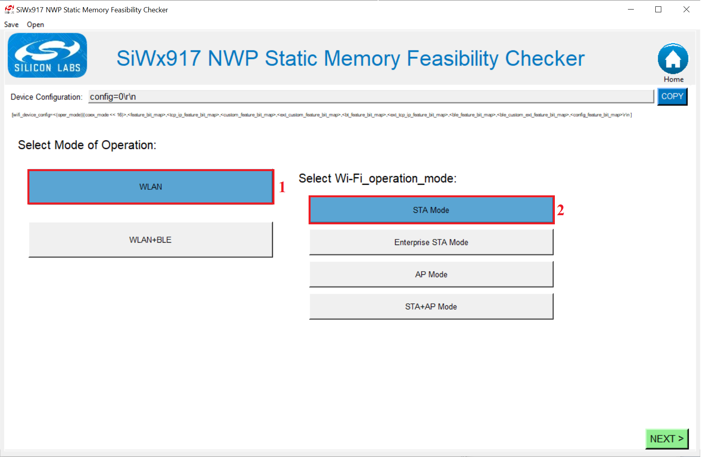
   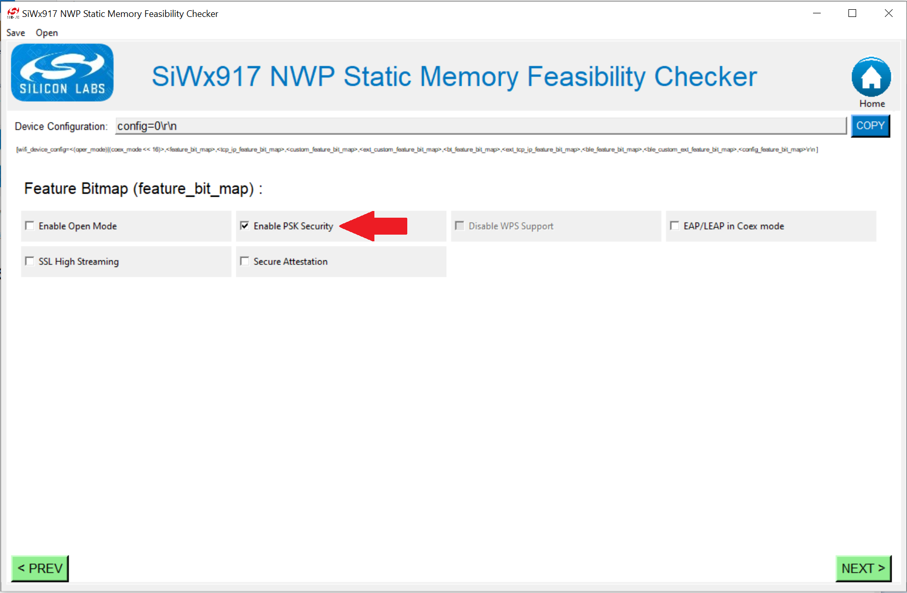
   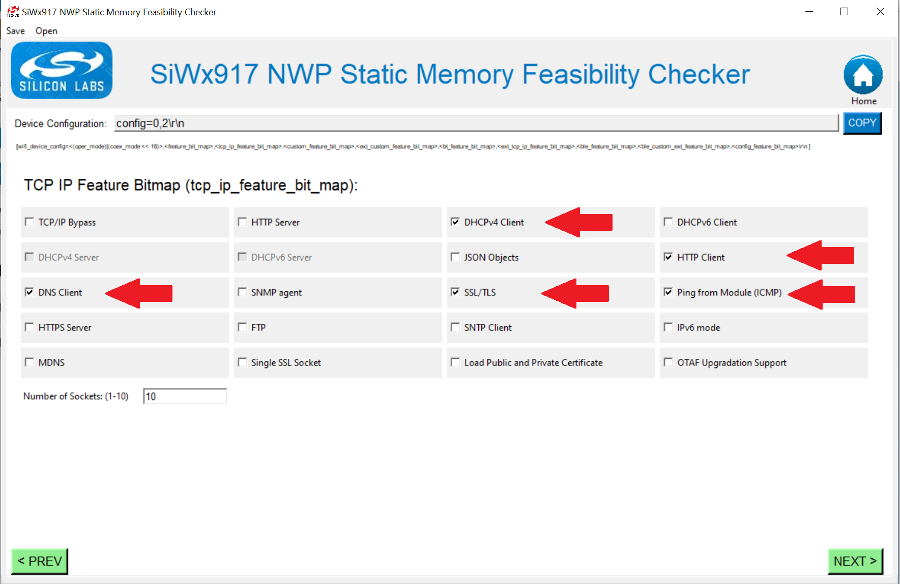
   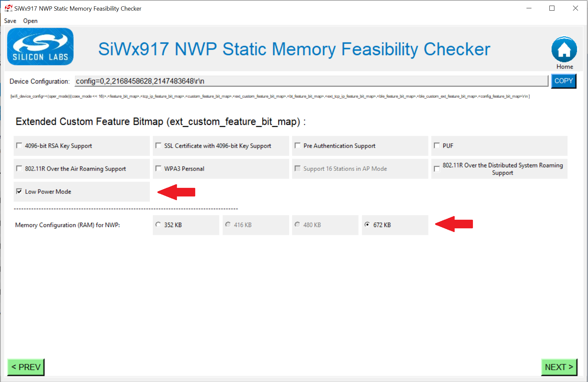
   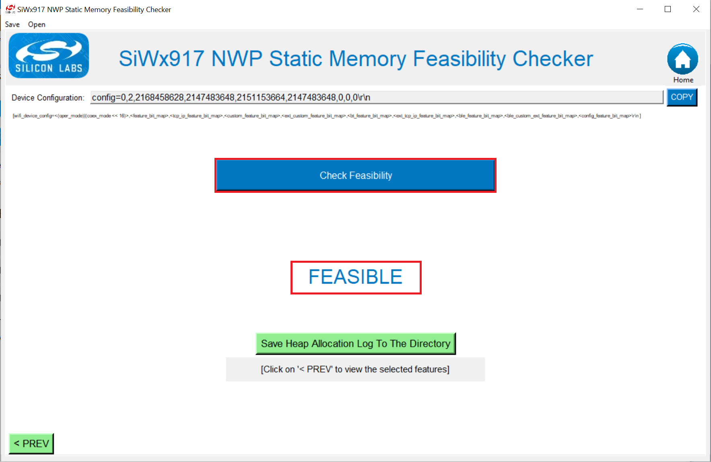

### Example 2: Wi-Fi Station + Bluetooth LE Main with 2 Secondary and FTP Client Support

In the following example, the SiWx917 system will be configured to act as a Wi-Fi client supporting WPA2 home security in coexistence mode acting as well as a Bluetooth LE main supporting 2 secondary. The following will be the list of services to be supported:

* UART host interface
* IPv4 stack
* WPA2 security
* Bluetooth LE Main with support for 2 secondary
* ICMP support will be enabled in this system to allow for pings to be available in this system.
* DHCP client (In order to allow SiWx917 system to obtain an IP address dynamically from the AP it associates to).
* OTAF client capabilities to support firmware upgrading.
* Low power mode operation will be allowed on this system.

We will assume that an SiWx917 system with 672 kilobytes of memory will be used for this configuration.

The following are the features selected under various bit maps in the application:

   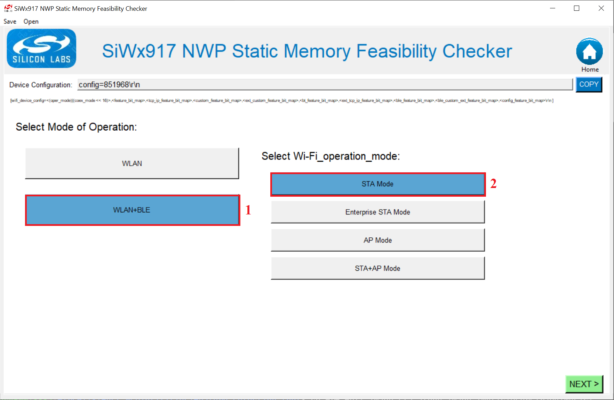
   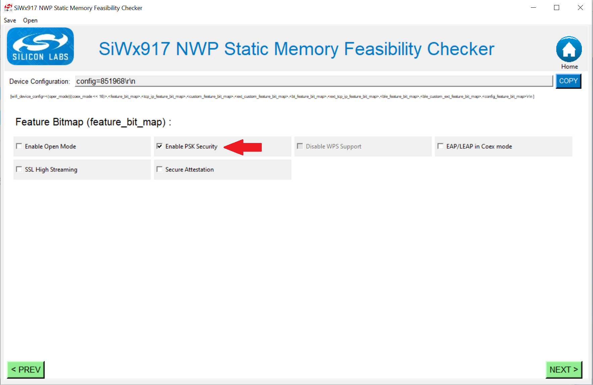
   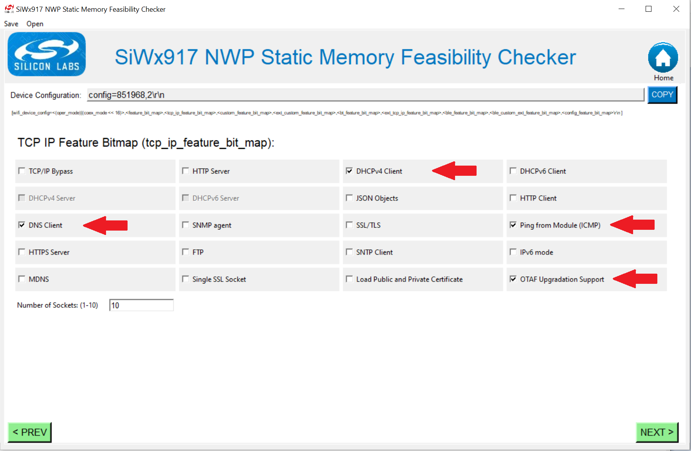
   
   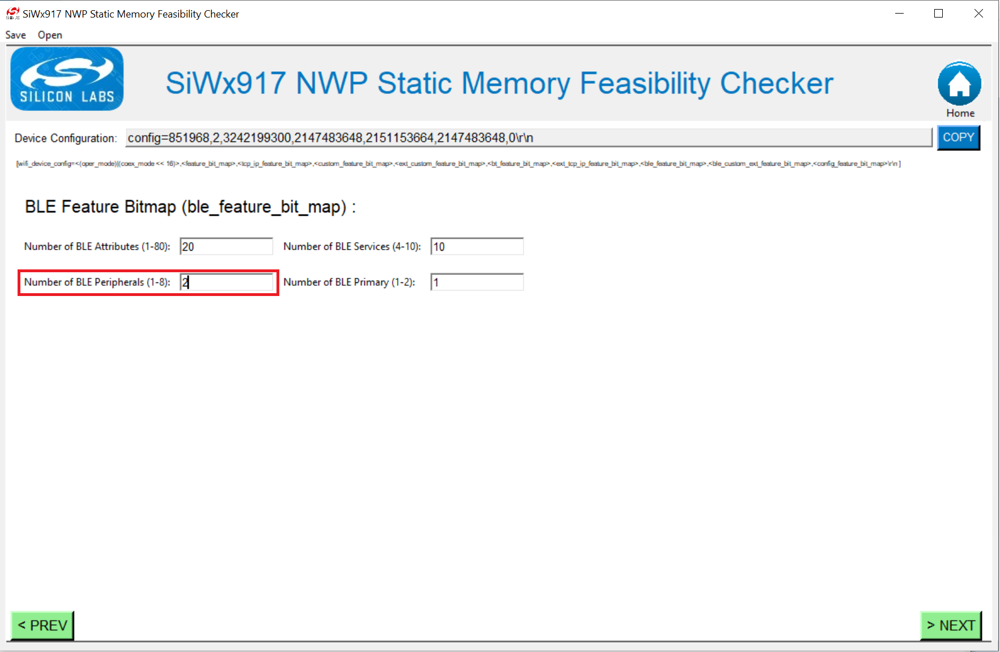
   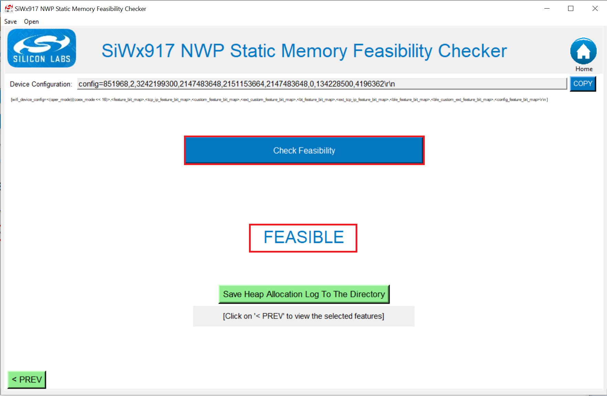
